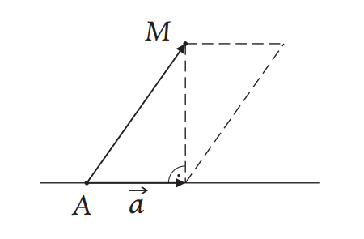

# Analitička Geometrija

## 🎓 Autori

- [Marko Gordić](https://github.com/MarkoGordic) - IN 37/2023
- [Nađa Jakšić](https://github.com/nadjaaaj) - IN 33/2023
- [Igor Maljik](https://github.com/IgorMaljik) - SV 37/2023

## 📜 Teorija

## Osnovna pravila za rešavanje zadataka iz analitičke geometrije

1. Jedinični vektor bilo koga pravca (ili prave $p$) dobija se kada $bilo koji$ nenula vektor $\vec{p}$ paralelan s pravom (pravcem) $p$ podelimo njegovim sopstvenim intenzitetom, tj. jedinični vektor je $\frac{\vec{p}}{|\vec{p}|}$

## Deoba duži u datoj razmeri

Ako tačka $M$ deli duž $AB$ u razmeri $\lambda : 1$, tj. $\vec{AM} = \lambda\vec{MB}$, tada:

$\vec{r_M} = \frac{\vec{r_A} + \lambda\vec{r_B}}{1 + \lambda}$

## Jednačina prave

$\vec{p} = \vec{r_C}-\vec{r_B}$ - prava određena tačkama $B$ i $C$

$A(x_A, y_A, z_A) \in p, \vec{p} = (p_1,p_2,p_3)||p$  

$M(x,y,z)$ - promenljiva tačka  
$\vec{r} = x\vec{i} + y\vec{j} + z\vec{k}$ - promenljivi vektor  

$M \in p \leftrightarrow \vec{AM}||p \leftrightarrow \vec{AM} = t \cdot \vec{p} \leftrightarrow \vec{r_M}-\vec{r_A} = t \cdot p$

#### Vektorski oblik jednačine prave  
$\vec{r} = \vec{r}_A + t \cdot \vec{p}$  

$\vec{r_A}$ - vektor pomeraja tačke koja pripada traženoj pravoj  
$\vec{p}$ - vektor pravca koji je paralelan sa traženom pravom

#### Parametarski oblik jednačine prave  
$x = x_A + tp_1 \Rightarrow t = \frac{x - x_A}{p_1}$  
$y = y_A + tp_1 \Rightarrow t = \frac{y - y_A}{p_1}$  
$z = z_A + tp_1 \Rightarrow t = \frac{z - z_A}{p_1}$

#### Kanonički oblik jednačine prave
$\frac{x-x_A}{p_1} = \frac{y-y_A}{p_2} = \frac{z-z_A}{p_3}$

- **Bar jedan od vektora iz skupa $\{(1,\lambda,\delta),(0,1,\epsilon),(0,0,1)\}$ jeste vektor proizvoljne prave, za neke realne brojeve $\lambda, \delta$ i $\epsilon$.**

- Vektor prave u jednačini prave zavisi **samo od DVA parametra!**

## Jednačina ravni

$\vec{n}$ - vektor normalan na ravan $\alpha$

$Q$ - proizvoljna fiksna tačka ravni $\alpha$

$D$ - utiče na to koliko je ravan "udaljena" od koordinatnog početka $(0, 0, 0)$. Ako je $D = 0$, to znači da ravan prolazi kroz koordinatni početak.

#### Vektorski oblik jednačine ravni
$\vec{r} \cdot \vec{n} = \vec{r_Q} \cdot \vec{n}$

#### Opšti oblik jednačine ravni
Koeficijenti A, B, C obrazuju pravu normalnu na ravan $\alpha$.

- Ako su dve ravni paralelne onda **možemo smatrati da im je i vektor normale takođe jednak**

$\vec{n} = (A,B,C), \vec{r} = (x,y,z)$  
$(x,y,z) \cdot (A,B,C) = \vec{r_Q} \cdot \vec{n} = -D$  
$Ax + By + Cz + D = 0$

$Ax + By + Cz + D = 0 \leftrightarrow \frac{x}{-\frac{D}{A}} + \frac{y}{-\frac{D}{B}} + \frac{z}{-\frac{D}{C}} = A$

#### Jednačina ravni kroz tačku
$A(x - x_1) + B(y - y_1) + C(z - z_1) = 0$

## Rastojanje tačke $M$ od prave

$|\vec{AM} \times \vec{a}| = d \times |\vec{a}| \Rightarrow d=\frac{|\vec{AM} \times \vec{a}|}{|\vec{a}|}$

## Prodor prave kroz ravan

$a : \vec{r} = \vec{r_A} + t \cdot \vec{a}$ - sve tačke prave

$\alpha : (\vec{r} - \vec{r_Q}) \cdot \vec{n} = 0$ - sve tačke ravni

$(\vec{r_A} + t\vec{a} - \vec{r_Q}) \cdot \vec{n} = 0 \Rightarrow t = \frac{\vec{n} \cdot (\vec{r_Q} - \vec{r_A})}{\vec{a} \cdot \vec{n}}$ - uvrstimo $\vec{r}$ iz prve u drugu

$\vec{r_P} = \vec{r_A} + \frac{(\vec{r_Q} - \vec{r_A}) \cdot \vec{n}}{\vec{a} \cdot \vec{n}} \cdot \vec{a}$

## Projekcija tačke na pravu

$a : \vec{r} = \vec{r_A} + t \cdot \vec{a}$

$M \in \alpha$ $\wedge$ $\vec{n_\alpha} = \vec{n} \Rightarrow n : \vec{r} = \vec{r_M} + t \cdot \vec{n_\alpha}$

$n \cap \alpha = \{M'\}$

$\vec{r_{M'}} = \vec{r_M} + \frac{(\vec{r_A} - \vec{r_M}) \cdot \vec{n_\alpha}}{\vec{n_\alpha} \cdot \vec{n_\alpha}} \cdot \vec{n_\alpha}$

## Projekcija tačke na ravan

$\alpha : (\vec{r} - \vec{r_A}) \cdot \vec{n_\alpha} = 0$

$M \in n$ $\wedge$ $\vec{n_\alpha} = \vec{n} \Rightarrow n : \vec{r} = \vec{r_M} + t \cdot \vec{n_\alpha}$

$n$ $\cap$ $\alpha = \{M'\}$

$\vec{r_{M'}} = \vec{r_M} + \frac{(\vec{r_A} - \vec{r_M}) \cdot \vec{n_\alpha}}{\vec{n_\alpha} \cdot \vec{n_\alpha}} \cdot \vec{n_\alpha}$

## Odnos između pravih $a$ i $b$

$a : \frac{x-x_A}{a_1} = \frac{y-y_A}{a_2} = \frac{z-z_A}{a_3} = t_1$

$b : \frac{x-x_B}{b_1} = \frac{y-y_B}{b_2} = \frac{z-z_B}{b_3} = t_2$

1.$\vec{a} = \lambda \cdot \vec{b} \Rightarrow a||b$ ili se $a$ i $b$ poklapaju

- Ako $A \in b \Rightarrow a \equiv b$, a inače $a||b$.

2.$\vec{a} \neq \lambda \cdot b \Rightarrow a$ i $b$ se seku ili se mimoilaze

- Ako je $\vec{AB} \cdot (\vec{a} \times \vec{b}) = 0 \Rightarrow a$ i $b$ se seku

- Ako je $\vec{AB} \cdot (\vec{a} \times \vec{b}) \neq 0 \Rightarrow a$ i $b$ se mimoilaze

## Međusobni položaj prave i ravni

$\alpha : \vec{r} \cdot \vec{n_\alpha} = \vec{r_Q} \cdot \vec{n_\alpha}$ - sve tačke ravni

$a : \vec{r} = \vec{r_P} + t \cdot \vec{p}$ - sve tačke prave

1.$\vec{n_\alpha} \cdot \vec{p} = 0 \Rightarrow p||\alpha$ ili $p \subset \alpha$

- Tačku $P$ uvrstimo u $\alpha$ i ako jednakost važi, tada $p \subset \alpha$

- Ako je jednakost netačna onda je $p||\alpha$ i $p \not\subset \alpha$

2.$\vec{n_\alpha} \cdot \vec{p} \neq 0 \Rightarrow p$ i $\alpha$ se seku