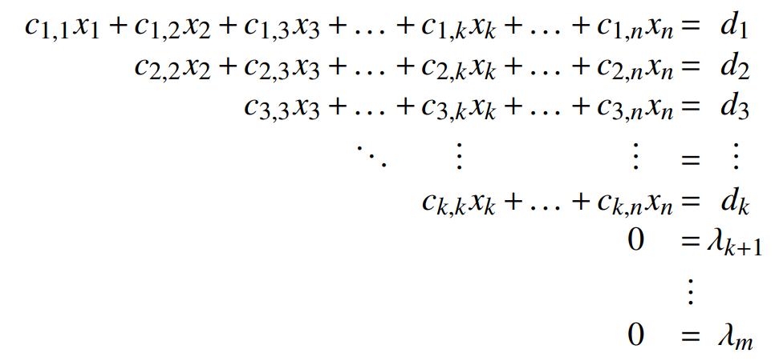

# Sistemi Linearnih Jednačina 🧮

## 🎓 Autori

- [Marko Gordić](https://github.com/MarkoGordic) - IN 37/2023
- [Nađa Jakšić](https://github.com/nadjaaaj) - IN 33/2023
- [Igor Maljik](https://github.com/IgorMaljik) - SV 37/2023

## 📜 Teorija

- Sa $\mathcal{R}_S$ ćemo označavati skup rešenja sistema linearnih jednačina S

Na osnovu trougaonog oblika donosimo zaključke o prirodi sistema i izračunavamo rešenja „zamenom unatrag” na sledeci način:

</a>

1. Ako je $\lambda_l \neq 0$ za neko $l \in \{k+1, k+2,...,m\}$, tada je sistem **kontradiktoran** (protivrečan), odnosno nema rešenja, tj. $\mathcal{R}_S = \emptyset$;
- Sistem je kontradiktoran kada nam se pojavi jednačina tipa $-1 = 0$
- **Kvadratni sistem** je određen ako je njegova determinanta $\neq 0$

2. Ako je $\lambda_l = 0$ za sve $l \in \{k+1, k+2,...,m\}$ i $k = n$ n (sve promenljive od $x_1$ do $x_n$ se pojavljuju na glavnoj dijagonali), tada je sistem **određen**, odnosno ima tačno jedno rešenje, tj. $\mathcal{R}_S = (x_1^{'}, x_2^{'},...,x_n^{'})$;
- Sistem je određen kada dobijemo sva rešenja bez kontradikcija

3. Ako je $\lambda_l = 0$ za sve $l \in \{k+1, k+2,...,m\}$ i $k < n$, tj. osim promenljivih $x_1,...,x_k$ koje se pojavljuju na glavnoj dijagonali, u sistemu figuriše još $n - k$ promenljivih, tada je sistem **neodređen** $n - k$ puta, odnosno pri izboru rešenja imamo $n - k$ stepeni slobode, tj. promenljive $x_{k+1},...,x_n \in R$ mogu uzimati proizvoljne vrednosti, dok $x_1,...,x_k$ izračunavamo (tj. izražavamo preko $x_{k+1},...,x_n \in R$) metodom "zamene unatrag"
- Sistem je neodređen ukoliko postoji bar jedna promenljiva $x$ za koju je nemoguće odrediti jednoznačnu vrednost. Ukoliko je ovakvih promenljivih više, tada je sistem neodređen onoliko puta koliko je tih promenljivih.

- **Homogen** sistem je onaj kome su rešenja svih jednačina jednaka 0. On uvek ima bar jedno rešenje $(0,0,...,0)$