# 📘 Kolokvijum 1

### Predmet: Logičko programiranje računarskih sistema  
### Program: Informacioni inženjering 2024/2025  

---

# ✍️ Copyright - Marko Gordić, IN 37-2023 

> [!CAUTION]
> Skripta je napravljena na osnovu zvaničnih materijala sa predavanja i vežbi. Podložna je greškama. Preporučuje se da se koristi kao dodatak uz zvanične materijale.

# 📑 Sadržaj

1. 🧩 **Osnovni koncept električnog izvora informacija**  
2. 🪛 **Poluprovodnici i prekidačke komponente**  
3. 💡 **Realne logičke familije**  
4. 🔢 **Bulova algebra**  
   - BDD  
   - Karnoove mape  
   - Indeksi sloga  
   - KNF  
   - DNF  
5. 🔗 **VHDL Implementacije Komponenti**  
   - Koder
   - Dekoder
   - Multiplekser
   - Demultiplekser
   - Sabirač
   - Komplementer
   - Komparator
   - Pomerač
   - Registar
   - Brojač
   - Pomerački registar
6. ➕ **Aritmetika, Sabirač i Carry Lookahead Adder u VHDL-u**  
7. **Moguće vrednosti std_logic tipa promenljive u VHDL-u**
8. ⚠️ **Tipične greške prilikom pisanja VHDL-a**  
   - Incomplete sensitivity list  
   - Latch  
   - Multiple driver  
   - Comb loop   
9. 🔍 **Osnovni koncept LECA i evolucija ka DFF-u**  
10. 🔄 **DFF (D Flip-Flop), MSFF (Master-Slave Flip-Flop)**  
11. 📈 **Brojači**  
12. **Napomene za praktični deo kolokvijuma**

---

# 1. Osnovni koncept električnog izvora informacija

Da bismo razumeli digitalne sisteme, potrebno je krenuti od osnova – električnog izvora informacija. Osnovni električni izvori, poput napona i struje, koriste se za predstavljanje i obradu binarnih podataka (**0** i **1**). Ovaj koncept se zasniva na tri ključna elementa: **naponu**, **otporniku** i **prekidaču** (*switch*).

## Napon (Voltage)

Napon predstavlja **razliku električnog potencijala** između dve tačke u kolu.  
- Označava se kao **V** i meri se u voltima (**V**).  
- U digitalnim kolima, visok napon (npr. 5V ili 3.3V) obično predstavlja **1**, dok nizak napon (npr. 0V) predstavlja **0**.  
- Električni izvori, poput baterija ili napajanja, generišu napon koji omogućava rad kola.

## Otpor (Resistance)

Otpor je veličina koja se suprotstavlja protoku električne struje kroz materijal.  
- Označava se kao **R** i meri se u omima (**Ω**).  
- U digitalnim sistemima, otpornici se koriste za kontrolu količine struje ili za deljenje napona.  
- Ključno je pravilno dimenzionisanje otpora kako bi kolo funkcionisalo bez pregrevanja ili oštećenja.

## Prekidač (*Switch*)

Prekidač je osnovni element koji omogućava ili sprečava protok struje kroz kolo:  
- **Uključeno stanje (ON)**: Prekidač povezuje kontakte, omogućavajući protok struje – simulira logičku **1**.  
- **Isključeno stanje (OFF)**: Prekidač prekida strujni tok – simulira logičku **0**.  

U modernim digitalnim sistemima, prekidači su implementirani kao tranzistori, ali osnovni koncept ostaje isti.

## Kombinacija elemenata: Osnovno prekidačko kolo

Jednostavno prekidačko kolo sastoji se od izvora napona (**Vdc**), otpornika (**R**) i prekidača (**SW**).  
- Kada je prekidač zatvoren, struja teče kroz otpornik, a izlazni napon (**Vout**) je nizak – predstavlja logičku **0**.  
- Kada je prekidač otvoren, nema protoka struje i **Vout** je visok – predstavlja logičku **1**.


# 2. Poluprovodnici i prekidačke komponente

Pre nego što su digitalni sistemi postali ono što danas poznajemo, osnovni gradivni elementi logike bili su **prekidači**. Koncept je jednostavan – prekidač ima dva stanja: **uključeno** i **isključeno**, što se savršeno uklapa u binarni sistem (0 i 1). Ipak, kada se mehanički prekidači posmatraju iz perspektive inženjerske prakse, ubrzo postaje jasno da nisu praktični za digitalnu logiku zbog svojih ograničenja.

### Oznake koje se mogu pojaviti u nastavku:

> [!NOTE]
> Oznake su ključne reči koje se koriste u elektrotehnici i elektronici za označavanje komponenti i termina. Mogu se pojaviti u šemama, dijagramima i tehničkim dokumentima. Moguće je da nisu pokrivene sve oznake, ali su navedene najčešće.

- **Vdc (DC/Direct Current voltage)** - Oznaka za jednosmerni napon
- **Vout (Output voltage)** - Oznaka za izlazni napon
- **R (Resistance)** - Oznaka za otpor/otpornik
- **SW (Switch)** - Oznaka za prekidač
- **A (Anoda)** - Pozitivni terminal diode
- **K (Katoda)** - Negativni terminal diode
- **Vth (Threshold voltage)** - Prag napona
- **B (Baza)** - Kontrolni terminal tranzistora
- **C (Kolektor)** - Terminal kroz koji struja izlazi iz tranzistora
- **E (Emiter)** - Terminal kroz koji struja ulazi u tranzistor
- **D (Drain)** - Odvodni terminal MOS FET-a
- **G (Gate)** - Kontrolni terminal MOS FET-a
- **S (Source)** - Izvorni terminal MOS FET-a
- **Vgs (Gate-Source voltage)** - Napon između Gate-a i Source-a

## Mehanički prekidač: Početak digitalne logike

Zamislite običan prekidač za svetlo. Uključivanjem povezujete kontakte, omogućavate protok struje i simulirate logičku jedinicu (**1**). Isključivanjem prekidate tok struje i predstavljate logičku nulu (**0**). Na papiru, ovo deluje kao idealno rešenje. Ali, u praksi, mehanički prekidači imaju ozbiljne nedostatke:

1. **Niska brzina promene stanja**  
   Mehanički prekidači funkcionišu sporo, menjajući stanje samo nekoliko desetina ili stotina puta u sekundi, što ih čini neupotrebljivim za brze digitalne sisteme.

2. **Oscilovanje kontakta**  
   Kada prebacujete prekidač, kontakti često osciluju pre nego što dostignu stabilno stanje, što može izazvati greške i nestabilnost u digitalnim kolima.

3. **Nedostatak električne kontrole**  
   Mehanički prekidači zahtevaju fizički akt, poput pomeranja poluge, što ih čini nepraktičnim za sisteme koji zahtevaju automatizaciju i brzinu.

### Ključno pitanje:
Kako osmisliti jednostavno električno kolo koje može **električno upravljati** i generisati **1 bit informacije** na svom izlazu?

## Dioda: Prvi poluprovodnički prekidač

Otkriće **PN spoja** sredinom 20. veka označilo je prekretnicu u razvoju digitalne tehnike. **Dioda**, zasnovana na PN spoju, omogućila je kontrolu protoka struje bez mehaničkog kontakta. Njene ključne karakteristike:

- **Jednosmerni protok struje**: Dioda propušta struju samo kada je napon na njenoj anodi veći od napona na katodi.  
- **Prag napona (Vth)**: Kada napon prelazi prag od oko **0,6V**, dioda prelazi u "uključeno" stanje, omogućavajući protok struje. U suprotnom, ostaje "isključena".

Modelovanje diode:  
- **Uključena dioda**: Ponaša se kao idealan naponski izvor (**Vak = Vth**).  
- **Isključena dioda**: Ponaša se kao otvoren prekidač, sprečavajući protok struje.  

Dioda je otvorila vrata za razvoj kompleksnijih prekidačkih kola, eliminisavši ograničenja mehaničkih prekidača.

### Šematska oznaka diode

- Na **Slika 3** prikazana je šematska oznaka diode, gde su markirani terminali:
  - **Anoda (A)** - pozitivni terminal, gde struja ulazi u diodu.
  - **Katoda (K)** - negativni terminal, gde struja izlazi iz diode.
  
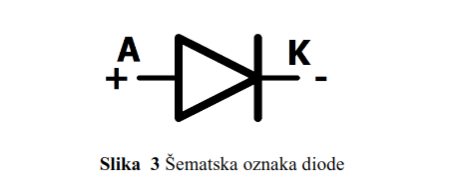

- Dioda omogućava protok struje samo u jednom smeru - od anode prema katodi, kada je napon preko nje pozitivan. Kada je napon obrnut, dioda blokira struju.


## Bipolarni tranzistori: Kontrolisani prekidači

Dok je dioda omogućila jednosmernu kontrolu struje, razvoj **bipolarnih tranzistora** uneo je mogućnost upravljanja strujom pomoću napona. Tranzistori, poput NPN i PNP modela, postali su osnovni gradivni elementi digitalne logike.

### Kako funkcioniše bipolarni tranzistor?
- Bipolarni tranzistor ima tri terminala:
  - **Baza (B)**: Kontrolni terminal koji upravlja tranzistorom.
  - **Kolektor (C)**: Terminal kroz koji struja ulazi/izlazi.
  - **Emitter (E)**: Terminal kroz koji struja izlazi/ulazi.
- Kada se na **bazu** primeni napon, tranzistor prelazi u uključeno stanje i omogućava protok struje između kolektora i emitera. Kada je napon na bazi manji od praga, tranzistor ostaje u isključenom stanju, sprečavajući protok struje.

## NPN tranzistor

- Na **Slika 6** prikazana je šematska oznaka **NPN tranzistora**. Ovaj tip tranzistora omogućava protok struje od **kolektora (C)** ka **emiteru (E)** kada postoji dovoljan napon na **bazi (B)**.

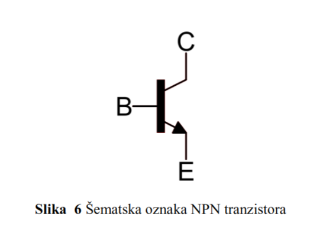

### Isključeno stanje NPN tranzistora
- Kada je **Vbe < Vth** (napon između baze i emitera manji od praga), tranzistor je u **isključenom stanju**.
- U ovom stanju, tranzistor deluje kao isključen prekidač, ne dozvoljavajući struji da teče između kolektora i emitera. Ovo je ekvivalentno stanju kada je prekidač otvoren. Prikazano na **Slika 7**.

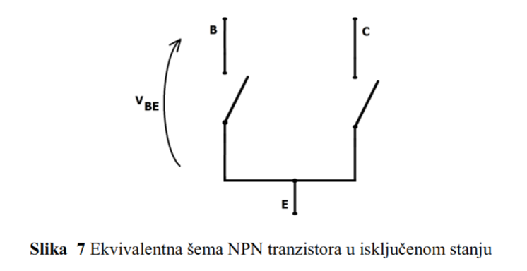

### Uključeno stanje NPN tranzistora
- Kada je **Vbe >= Vth** (napon između baze i emitera veći ili jednak pragu napona), tranzistor prelazi u **uključeno stanje**.
- Uključeni tranzistor omogućava protok struje između kolektora i emitera. Ovaj protok je kontrolisan baznim naponom, i tranzistor se ponaša kao zatvoren prekidač. Prikazano na **Slika 8**.

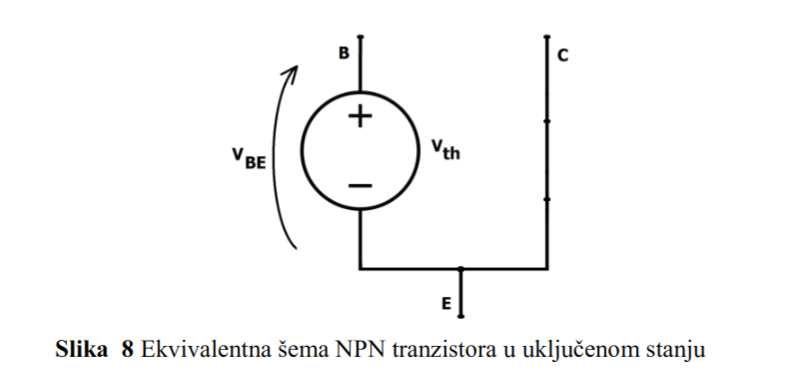

## PNP tranzistor

- Na **Slika 9** prikazana je šematska oznaka **PNP tranzistora**. Kao i kod NPN tranzistora, PNP tranzistor ima tri terminala: **baza (B)**, **kolektor (C)** i **emiter (E)**. Razlika je u tome što u PNP tranzistoru struja teče od **emitera** ka **kolektoru** kada je baza negativna u odnosu na emiter.

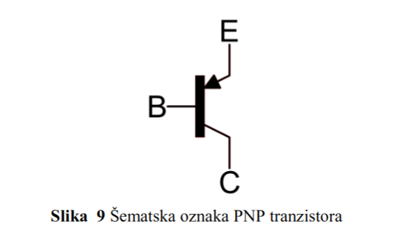

### Uključeno stanje PNP tranzistora
- Kada je **Vbe <= -|Vth|** (napon između baze i emitera manji ili jednak negativnom pragu), tranzistor prelazi u **uključeno stanje**.
- U ovom stanju, spojevi između kolektora i emitera su povezani, i struja može teći kroz tranzistor. PNP tranzistor u ovom slučaju omogućava protok struje kao zatvoren prekidač. Prikazano na **Slika 10**.


### Isključeno stanje PNP tranzistora
- Kada je **Vbe > -|Vth|** (napon između baze i emitera veći od negativnog praga), tranzistor je u **isključenom stanju**.
- U ovom stanju, tranzistor deluje kao otvoren prekidač, ne dozvoljavajući struji da teče između kolektora i emitera. Prikazano na **Slika 11**.

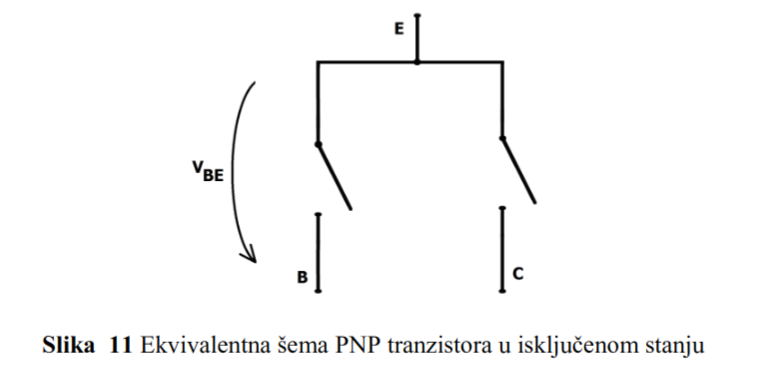

## MOS FET tranzistori: Efikasnost i kontrola

Dalji razvoj poluprovodničkih prekidača doveo je do stvaranja **MOS FET tranzistora**. Oni su rešili ključne probleme ranijih tehnologija:

- **Naponom kontrolisani prekidač**: MOS FET se uključuje ili isključuje u zavisnosti od napona između Gate-a i Source-a (**Vgs**).  
- **Kapacitivna sprega**: Za razliku od bipolarnog tranzistora, MOS FET ne zahteva tok struje na kontrolnom terminalu, već samo napon, što značajno smanjuje potrošnju energije.

## N-kanalni MOS FET tranzistor

- Na **Slika 12** prikazana je šematska oznaka **N-kanalnog MOS FET tranzistora**.
  - **D (Drain)**: Odvodni terminal, gde struja izlazi.
  - **G (Gate)**: Kontrolni terminal. Napon na ovom terminalu određuje da li će tranzistor biti uključen ili isključen.
  - **S (Source)**: Izvorni terminal, gde struja ulazi.

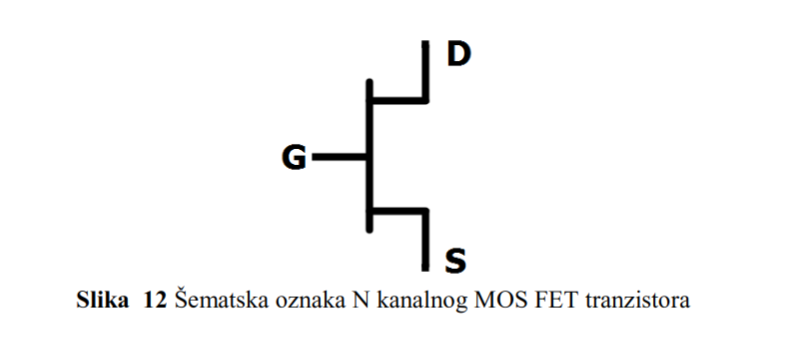

### Kako funkcioniše N-kanalni MOS FET?
U N-kanalnom MOS FET-u, struja teče od **Source-a** ka **Drain-u** kada je tranzistor uključen. Tranzistor prelazi iz isključenog u uključeno stanje zavisno od napona između **Gate** i **Source** terminala (**Vgs**).

### Isključeno stanje N-kanalnog MOS FET-a
- Kada je **Vgs < Vthmos** (napon između Gate-a i Source-a manji od praga napona), tranzistor je u **isključenom stanju**.
- U ovom stanju, spojevi između Drain-a i Source-a su prekinuti i nema protoka struje između njih. Ovaj prekidački odnos prikazan je na **Slika 13**.

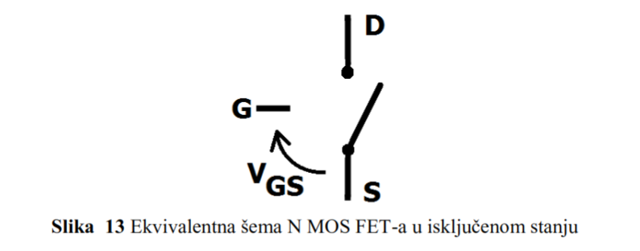

- **Prag napona (Vthmos)** je napon koji mora biti dostignut između **Gate** i **Source** kako bi tranzistor prešao iz isključenog u uključeno stanje. Za diskretne komponente prag napona je oko **1,5V**, dok za CMOS kola iznosi oko **1V**.

### Uključeno stanje N-kanalnog MOS FET-a
- Kada je **Vgs >= Vthmos** (napon između Gate-a i Source-a veći ili jednak pragu napona), tranzistor prelazi u **uključeno stanje**.
- U ovom stanju, postoji put između Drain-a i Source-a, i struja može teći kroz tranzistor. To je kao da je prekidač zatvoren. Ova situacija prikazana je na **Slika 14**.

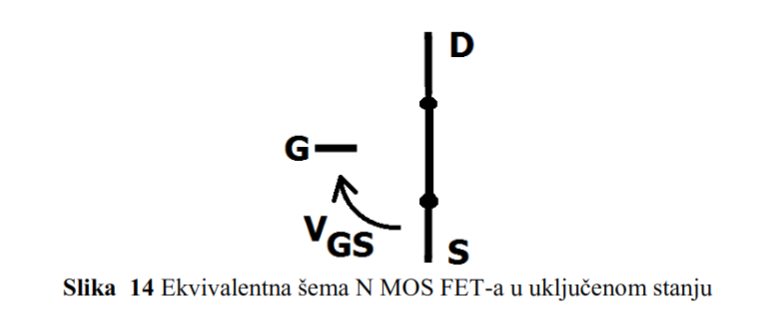

### Specifičnost MOS FET-a
Za razliku od bipolarnih tranzistora, MOS FET tranzistori na kontrolnom priključku **Gate** imaju kapacitivnu spregu prema **Source** terminalu. To znači da ne postoji protok jednosmerne struje između Gate-a i Source-a, već se samo koristi električno polje (napon) da bi se kontrolisao protok struje kroz tranzistor. Ova kapacitivna sprega uvodi specifične probleme, ali to nije tema ovog osnovnog pregleda.

## P-kanalni MOS FET tranzistor

- Na **Slika 15** prikazana je šematska oznaka **P-kanalnog MOS FET tranzistora**.
  - **D (Drain)**: Odvodni terminal.
  - **G (Gate)**: Kontrolni terminal.
  - **S (Source)**: Izvorni terminal.


### Kako funkcioniše P-kanalni MOS FET?
Za P-kanalni MOS FET, struja teče od **Source-a** ka **Drain-u**, ali su polariteti napona obrnuti u odnosu na N-kanalni MOS FET. Uključenje i isključenje se kontroliše naponom **Vgs**, ali sa suprotnim pragovima u odnosu na N-kanalni tranzistor.

### Isključeno stanje P-kanalnog MOS FET-a
- Kada je **Vgs > -|Vthmos|** (napon između Gate-a i Source-a veći od apsolutne vrednosti praga), tranzistor je u **isključenom stanju**.
- U ovom stanju, struja ne može teći između Drain-a i Source-a jer su spojevi prekinuti. To je kao da je prekidač otvoren, što je prikazano na **Slika 16**.

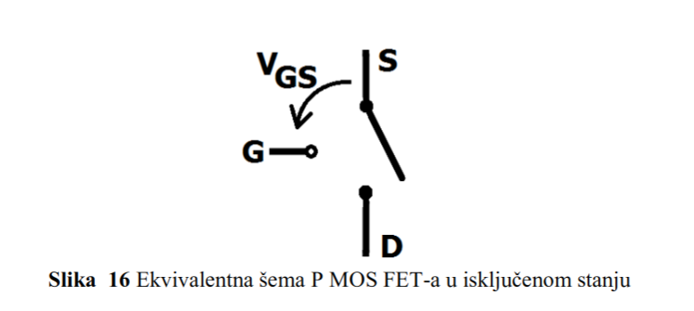

### Uključeno stanje P-kanalnog MOS FET-a
- Kada je **Vgs <= -|Vthmos|** (napon između Gate-a i Source-a manji ili jednak apsolutnoj vrednosti praga), tranzistor prelazi u **uključeno stanje**.
- U ovom stanju, spojevi između Drain-a i Source-a su povezani, i struja može teći kroz tranzistor. Ovo stanje je prikazano na **Slika 17**.

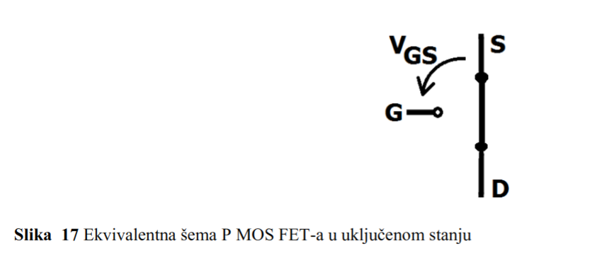

# 3. Realne logičke familije

## Uvod u logička kola

- **Bulova algebra**, koju je razvio George Boole 1850. godine, čini osnovu za rad logičkih kola.  
- **Logička kola** koriste elektronske komponente za realizaciju osnovnih **logičkih funkcija**, kao što su AND, OR, NOT, NAND i NOR, prema pravilima Bulove algebre.
- Logička kola deluju poput **prekidača** i koriste se za obradu signala i podataka u digitalnim sistemima.

## Vrste logičkih kola

Logička kola se dele na:

1. **Kombinaciona logička kola**  
   - Izlaz zavisi **isključivo od trenutnog stanja ulaza**.  
   - Primeri: AND, OR, NOT, NAND, NOR, XOR.  
   - Koriste se kada je potrebno trenutno obraditi signale bez pamćenja prethodnih stanja.

2. **Sekvencijalna logička kola**  
   - Izlaz zavisi od **trenutnog ulaza** i **prethodnog stanja** kola.  
   - Imaju memorijske elemente (flip-flopove) za pamćenje prethodnog stanja.  
   - Koriste se u uređajima kao što su registri i brojači.

## Logičke familije

Logička kola se dele u različite **familije**, prema tehnologiji njihove izrade:

| **Familija** | **Osnovne komponente**       | **Karakteristike**                                        | **Funkcija**          |
|--------------|------------------------------|----------------------------------------------------------|-----------------------|
| **DRL**      | Dioda + otpornik             | Prva tehnologija, koristi diode i otpornike za logiku.   | NI (NOT-AND)          |
| **RTL**      | Tranzistor + otpornik        | Poboljšana verzija DRL-a, omogućava **NILI funkcije**.   | NILI (NOT-OR)         |
| **DTL**      | Dioda + tranzistor           | Efikasnija od RTL-a, koristi se za **NI funkcije**.      | NI (NOT-AND)          |
| **TTL**      | Tranzistor + tranzistor      | Popularna zbog brzine i pouzdanosti, koristi **NI funkciju**. | NI (NOT-AND)          |
| **ECL**      | Tranzistor (emitorska sprega)| Brza logika, koristi se za **ILI** i **NILI funkcije**.  | ILI (OR), NILI (NOR)  |
| **MOS**      | Metal-oksid-poluprovodnik    | Osnova za nisku potrošnju energije i veliku integraciju. | NI (NOT-AND), I (AND) |
| **CMOS**     | P-MOS + N-MOS tranzistori    | Najefikasnija tehnologija, koristi se za **NE funkcije**.| NE (NOT)              |

> [!NOTE]  
> CMOS tehnologija je danas dominantna u digitalnim sistemima zbog svoje **niske potrošnje energije** i mogućnosti **velike integracije komponenti**. Njena široka primena uključuje procesore, memorije i druga digitalna kola.

# 4. Bulova algebra

Bulova algebra je temelj digitalne logike i predstavlja matematički sistem za rad sa logičkim izrazima. Omogućava pojednostavljivanje i analizu logičkih funkcija koje se zatim koriste u dizajnu digitalnih kola.

## Binarne odluke (Binary Decision Diagrams - BDD)

Binary Decision Diagrams (BDD) predstavljaju grafički prikaz logičkih funkcija koji pomažu u boljoj reprezentaciji i analizi složenih funkcija. Kroz binarno stablo odluke, svaka logička funkcija se deli na jednostavnije delove, omogućavajući efikasnije izvođenje operacija poput AND, OR i NOT. Svaka logička funkcija sa `n` promenljivih može se predstaviti kao binarno stablo odluke koje se grana prema vrednostima promenljivih. Svaki čor u stablu predstavlja binarnu promenljivu, dok grane pokazuju odluke - `0` za jednu granu i `1` za drugu. Lišće stabla sadrži vrednosti funkcije, koje mogu biti `0` ili `1`.

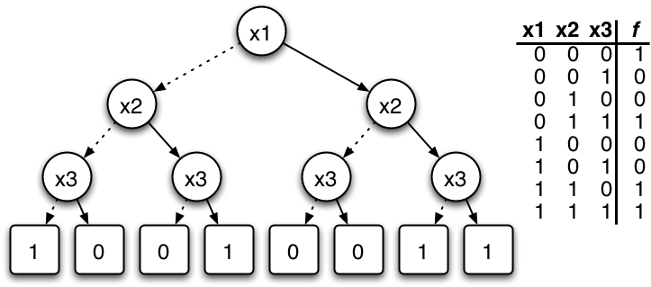

### Redukovani BDD (Reduced Ordered BDD - ROBDD)

Da bi se BDD efikasnije koristio, primenjuje se optimizacija poznata kao Redukovani BDD (ROBDD). Ova optimizacija uklanja suvišne čorove i grane iz stabla, orove i grane iz stabla, \u010ime se postiže kompaktnija i jednostavnija struktura. Postoje dva osnovna pravila koja se koriste pri optimizaciji:

- **Spajanje identičnih podgrafova**: Ako dva čora imaju identične podgrafove, oni se spajaju u jedan kako bi se izbeglo dupliranje.
- **Uklanjanje redundantnih čorova**: Ako oba izlaza iz čora vode ka istom podgrafu, taj čor se uklanja jer ne doprinosi različitim odlukama.

### Prednosti korišćenja BDD

Korišćenje BDD-a donosi nekoliko značajnih prednosti u radu sa logičkim funkcijama. Prva prednost je kompaktna reprezentacija logičkih funkcija, jer se kroz optimizaciju postiže manji broj čorova i grana, što čini funkciju lakšom za analizu i primenu. Druga prednost je efikasna minimizacija logičkih funkcija, jer se kroz redukciju mogu brzo prepoznati i ukloniti suvišne komponente. Konačno, BDD omogućava lako izvođenje osnovnih logičkih operacija poput AND, OR, NOT i XOR, što ga čini veoma korisnim alatom u dizajnu digitalnih kola.

### Primer BDD-a

Razmotrimo jednostavan primer logičke funkcije sa dve promenljive `x` i `y`. Funkcija je definisana kao:

`f(x, y) = (NOT x) AND (NOT y)`

Ova funkcija vraća **1** samo kada su obe promenljive `x` i `y` jednake **0**. U suprotnom, funkcija vraća **0**.

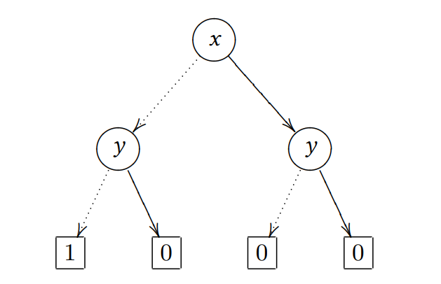

Ovaj BDD se može optimizovati. Ako pogledamo, ukoliko je `x = 0`, rezultat je sigurno 0, pa znamo da je ceo desni deo redundantan.

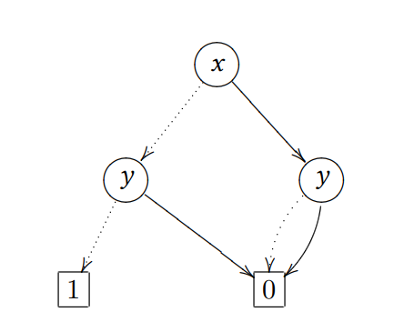

Prvo primetimo šta treba da izbacimo, a zatim isečemo i dobijemo optimizovan BDD.

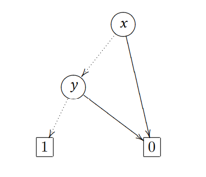

### 2. **Karnoove mape**  
Karnoove mape su vizuelni alat za pojednostavljivanje logičkih izraza. Predstavljaju mrežu ćelija koje odgovaraju kombinacijama ulaza i njihovim logičkim vrednostima. Cilj ovih mapa je da grupisanjem ćelija sa vrednostima "1" kreiramo jednostavnije logičke izraze, čime se smanjuje složenost digitalnog kola.

#### Primer pojednostavljivanja logičkog izraza pomoću Karnoovih mapa:
Početna tablica vrednosti može izgledati ovako:

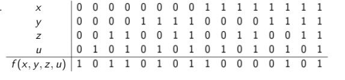

Na osnovu vrednosti u tablici zapisujemo logički izraz gledajući samo ćelije gde je vrednost funkcije \( f(x,z,y,u) = 1 \). Za svaku takvu ćeliju, koristimo sabirke. Na primer:
- Gde je vrednost ulaza `X` jednaka `0`, zapisujemo \( X' \).
- Gde je vrednost ulaza `X` jednaka `1`, zapisujemo \( X \).

Logički izraz dalje razrađujemo u Karnoovoj mapi gde označavamo sve sabirke. Na primer:

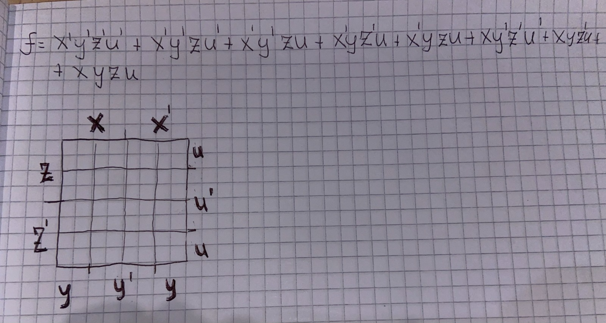

Popunjavamo mapu za svaku sabirku, poput \( X'Y'Z'U' \), tako što postavljamo zvezdice u odgovarajuće ćelije:

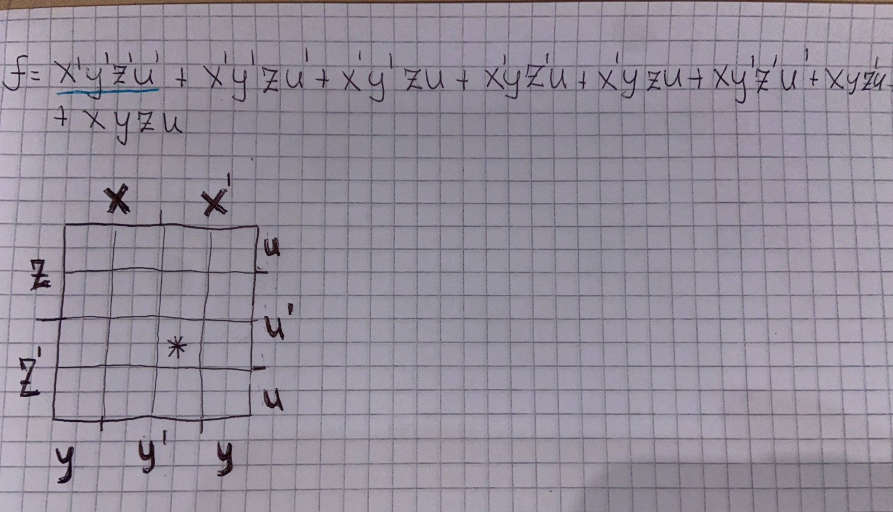

Ovaj proces ponavljamo za sve sabirke dok ne popunimo celu mapu:

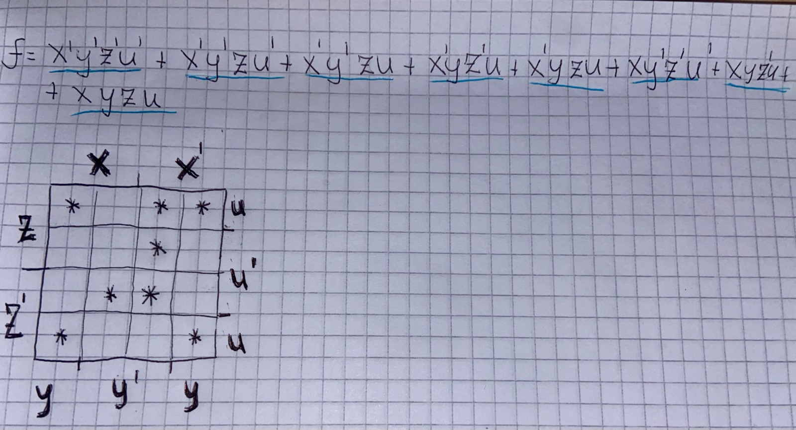

Nakon popunjavanja, grupišemo zvezdice u blokove različitih veličina, i to: 1x1, 1x2, 1x4, 2x1, 2x2, 2x4, 4x1, 4x2. Blokove zapisujemo koristeći sabirke:

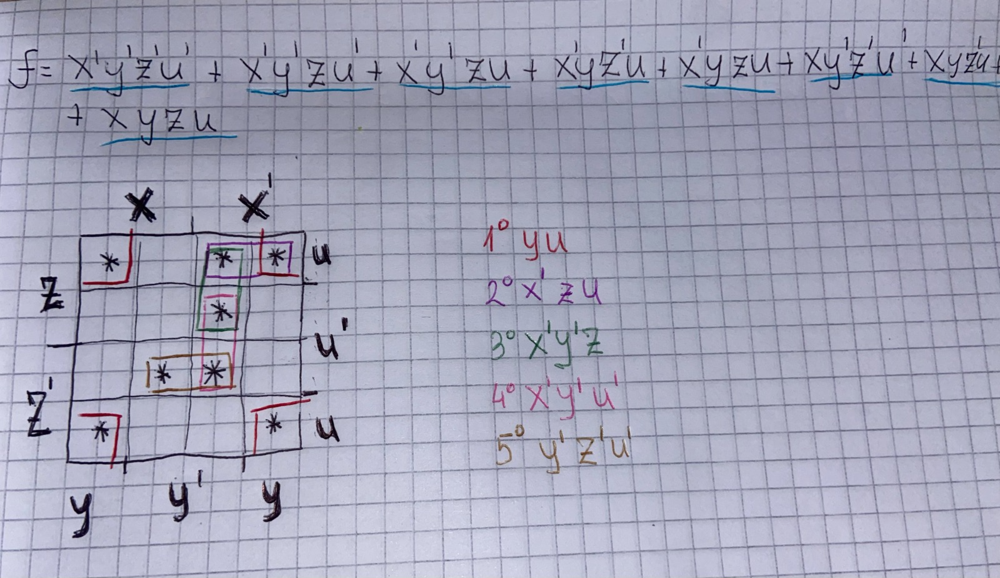

Na kraju zapisujemo konačni izraz u MDNF (Minimalna Disjunktivna Normalna Forma). MDNF koristi minimalan broj sabiraka za pokrivanje svih ćelija sa zvezdicama:

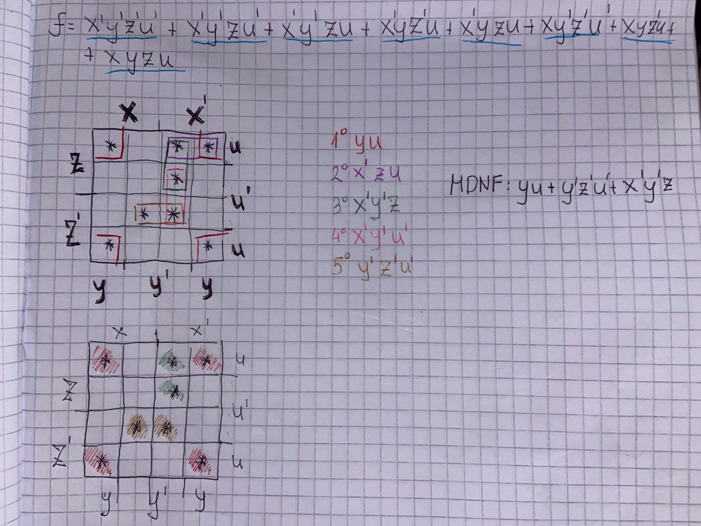

> [!CAUTION]
> MDNF se može zapisati na više načina. Međutim, cilj je minimizacija kola, tako da biramo izraz sa najmanjim brojem sabiraka.

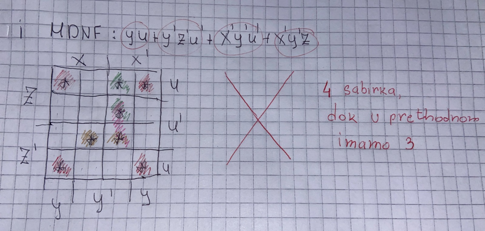

### 3. Indeksi sloga
Indeksi sloga predstavljaju brojčanu meru složenosti logičkih funkcija. Svaki logički izraz ima svoj nivo složenosti, a indeks sloga koristi se za evaluaciju efikasnosti i optimizacije logičkog dizajna.

#### Karakteristike:
- Indeksi sloga pomažu u proceni koliko je logički izraz kompleksan pre i nakon optimizacije.
- Dizajneri digitalnih kola koriste ih za analizu troškova implementacije logike (u smislu broja logičkih kola, tranzistora itd.).

Na primer, izraz sa više sabiraka ima viši indeks sloga, dok minimizovani izraz (korišćenjem Karnoovih mapa) ima niži indeks, što ga čini efikasnijim.

### 4. KNF (Konjunktivna Normalna Forma)

**Konjunktivna Normalna Forma** (KNF) je način zapisivanja logičkog izraza u obliku grupe disjunkcija (*OR* operacija), koje su međusobno povezane konjunkcijama (*AND* operacijama). Ovaj oblik predstavlja jedan od standardnih formata za izražavanje logičkih funkcija i često se koristi u različitim oblastima, poput analize logike, optimizacije logičkih kola i automatizovanog dokazivanja.

#### **Karakteristike KNF-a**:
1. KNF zapis uvek sadrži **AND** između grupa izraza spojenih sa **OR**.
2. Svaka disjunkcija (*OR grupa*) predstavlja kombinaciju varijabli (ili njihovih negacija) koje određuju tačne vrednosti funkcije.
3. Koristi se za rešavanje problema u teoriji logike, kao i u dizajnu složenih digitalnih kola.

#### Kako se KNF formira?

Da bismo funkciju preveli u KNF, koristimo sledeći postupak:

1. **Identifikacija redova gde je funkcija 0 (F = 0)**:
   - Za svaki redak u tablici istinitosti gde funkcija ima vrednost 0, formira se disjunkcija ulaza.
   - Ukoliko je vrednost ulaza `1`, koristimo njegovu negaciju (`A'`); ako je vrednost ulaza `0`, koristimo sam ulaz (`A`).

2. **Formiranje disjunkcija**:
   - Elementarne disjunkcije se formiraju za svaki redak gde je funkcija 0.

3. **Povezivanje disjunkcija sa konjunkcijom**:
   - Sve dobijene disjunkcije povezujemo **AND** operacijom.

#### Primer formiranja KNF-a

Pretpostavimo tablicu istinitosti funkcije sa tri promenljive (A, B, C):

| **A** | **B** | **C** | **F(A,B,C)** |
|-------|-------|-------|--------------|
|   0   |   0   |   0   |      0       |
|   0   |   0   |   1   |      1       |
|   0   |   1   |   0   |      0       |
|   0   |   1   |   1   |      1       |
|   1   |   0   |   0   |      0       |
|   1   |   0   |   1   |      1       |
|   1   |   1   |   0   |      0       |
|   1   |   1   |   1   |      1       |

1. Za redove gde je **F(A,B,C) = 0**, zapisujemo disjunkcije:  
   - Za (A = 0, B = 0, C = 0): \( A + B + C \)  
   - Za (A = 0, B = 1, C = 0): \( A + B' + C \)  
   - Za (A = 1, B = 0, C = 0): \( A' + B + C \)  
   - Za (A = 1, B = 1, C = 0): \( A' + B' + C \)

2. Konačni KNF zapis je:  
   \[
   (A + B + C) * (A + B' + C) * (A' + B + C) * (A' + B' + C)
   \]

### 5. DNF (Disjunktivna Normalna Forma)

**Disjunktivna Normalna Forma** (DNF) predstavlja logički izraz kao disjunkciju (**OR**) više konjunkcija (**AND** izraza). DNF je često korišćen način zapisa u logičkim funkcijama zbog svoje intuitivnosti i korisnosti u dizajnu digitalnih kola.

#### **Karakteristike DNF-a**:
1. DNF zapis sadrži disjunkcije (**OR**) između grupa izraza spojenih sa konjunkcijama (**AND**).
2. Svaka konjunkcija predstavlja kombinaciju varijabli (ili njihovih negacija) koje rezultuju vrednošću funkcije **1**.
3. Ovaj oblik zapisa je koristan za dizajn digitalnih kola i optimizaciju složenih logičkih funkcija.

#### Kako se DNF formira?

Da bismo funkciju preveli u DNF, koristimo sledeći postupak:

1. **Identifikacija redova gde je funkcija 1 (F = 1)**:
   - Za svaki redak u tablici istinitosti gde funkcija ima vrednost 1, formira se konjunkcija ulaza.
   - Ukoliko je vrednost ulaza `0`, koristimo njegovu negaciju (`A'`); ako je vrednost ulaza `1`, koristimo sam ulaz (`A`).

2. **Formiranje konjunkcija**:
   - Elementarne konjunkcije se formiraju za svaki redak gde je funkcija 1.

3. **Povezivanje konjunkcija sa disjunkcijom**:
   - Sve dobijene konjunkcije povezujemo **OR** operacijom.

#### Primer formiranja DNF-a

Pretpostavimo tablicu istinitosti funkcije sa tri promenljive (A, B, C):

| **A** | **B** | **C** | **F(A,B,C)** |
|-------|-------|-------|--------------|
|   0   |   0   |   0   |      0       |
|   0   |   0   |   1   |      1       |
|   0   |   1   |   0   |      0       |
|   0   |   1   |   1   |      1       |
|   1   |   0   |   0   |      0       |
|   1   |   0   |   1   |      1       |
|   1   |   1   |   0   |      0       |
|   1   |   1   |   1   |      1       |

1. Za redove gde je **F(A,B,C) = 1**, zapisujemo konjunkcije:  
   - Za (A = 0, B = 0, C = 1): \( A' * B' * C \)  
   - Za (A = 0, B = 1, C = 1): \( A' * B * C \)  
   - Za (A = 1, B = 0, C = 1): \( A * B' * C \)  
   - Za (A = 1, B = 1, C = 1): \( A * B * C \)

2. Konačni DNF zapis je:  
   \[
   A' * B' * C + A' * B * C + A * B' * C + A * B * C
   \]

# 5. VHDL Implementacije Komponenti

U nastavku su objašnjene osnovne digitalne komponente i njihova implementacija korišćenjem VHDL jezika. Svaka komponenta ima specifičnu primenu u dizajnu digitalnih sistema.

> [!NOTE]
> Kodovi koji su prikazani u nastavku su samo delovi koda i služe za ilustraciju implementacije pomenutih komponenti. Prilikom realne implementacije na kolokvijumu, potrebno je obratiti pažnju na kompletnost i tačnost koda.

### Komponente koje će biti prikazane u nastavku:

1. **Koder**: Pretvara aktivni ulaz u binarnu reprezentaciju na izlazu.  
2. **Dekoder**: Dekoduje binarni ulaz i aktivira odgovarajući izlaz.  
3. **Multiplekser**: Prosleđuje jedan od više ulaza na zajednički izlaz na osnovu selekcionih signala.  
4. **Demultiplekser**: Distribuira ulazni signal na jedan od više izlaza prema selekcionim signalima.  
5. **Sabirač**: Izračunava zbir dva binarna broja, uključujući prenosni bit.  
6. **Komplementer**: Generiše I ili II komplement binarnog broja.  
7. **Komparator**: Upoređuje dva broja i generiše rezultate veće, manje ili jednako.  
8. **Pomerač**: Pomeranje binarnih brojeva udesno ili ulevo, logički ili aritmetički.  
9. **Registar**: Privremeno skladišti binarne podatke.  
10. **Brojač**: Broji unapred ili unazad prema ulaznim impulsima.  
11. **Pomerački registar**: Kombinuje skladištenje podataka i serijsko pomeranje binarnih brojeva.

## Koder

Koder je kombinaciona mreža sa 2ⁿ ulaza i n izlaza, koja na osnovu aktivnog ulaza daje binarnu reprezentaciju na izlazu. U nastavku je prikazan koder 4x2, istinitosna tablica i VHDL opis pomoću IF-ELSE strukture. 

**Primena**: numeričke tastature, kompresija podataka, enkodovanje instrukcija.

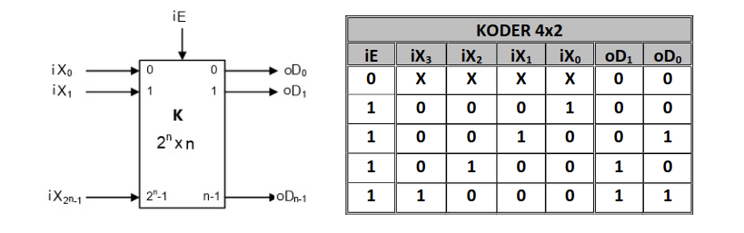

```vhdl
library IEEE;
use IEEE.STD_LOGIC_1164.ALL;

entity Koder4x2 is
    Port (
        iX : in STD_LOGIC_VECTOR(3 downto 0); -- Ulazni signali
        iE : in STD_LOGIC;                    -- Dozvola
        oD : out STD_LOGIC_VECTOR(1 downto 0) -- Izlazni kod
    );
end Koder4x2;

architecture Behavioral of Koder4x2 is
begin
    process (iX, iE)
    begin
        if iE = '1' then
            case iX is
                when "0001" => oD <= "00";
                when "0010" => oD <= "01";
                when "0100" => oD <= "10";
                when "1000" => oD <= "11";
                when others => oD <= "XX";
            end case;
        else
            oD <= "XX";
        end if;
    end process;
end Behavioral;
```

## Dekoder

Dekoder je kombinaciona mreža sa n ulaza i 2ⁿ izlaza, koja dekoduje binarni signal na ulazu i aktivira tačno jedan od svojih izlaza na osnovu vrednosti binarnog ulaza. U nastavku je prikazana istinitosna tablica dekodera 2x4, kao i primer VHDL opisa uslovnom dodelom.

**Primena**: adresiranje u memorijskim uređajima, 7-segmentni displej, dekodiranje instrukcija u CPU.

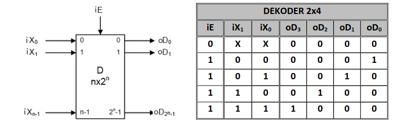

```vhdl
library IEEE;
use IEEE.STD_LOGIC_1164.ALL;

entity Dekoder2x4 is
    Port (
        iX : in STD_LOGIC_VECTOR(1 downto 0); -- Ulazni kod
        iE : in STD_LOGIC;                    -- Dozvola
        oD : out STD_LOGIC_VECTOR(3 downto 0) -- Izlazni signali
    );
end Dekoder2x4;

architecture Behavioral of Dekoder2x4 is
begin
    process (iX, iE)
    begin
        if iE = '1' then
            case iX is
                when "00" => oD <= "0001";
                when "01" => oD <= "0010";
                when "10" => oD <= "0100";
                when "11" => oD <= "1000";
                when others => oD <= "0000";
            end case;
        else
            oD <= "0000";
        end if;
    end process;
end Behavioral;
```

## Multiplekser

Multiplekser je kombinaciona mreža sa 2ⁿ ulaza, n upravljačkih (selekcionih) signala i jednim izlazom, gde upravljački signali određuju koji od ulaza će biti prosleđen na izlaz u datom trenutku. U nastavku je prikazan multiplekser 4x1, istinitosna tablica i primer VHDL opisa pomoću kombinacionog procesa sa if-else strukturom.

**Primena**: Prenos podataka sa više izvora preko jedne linije (npr. telekomunikacioni sistemi).

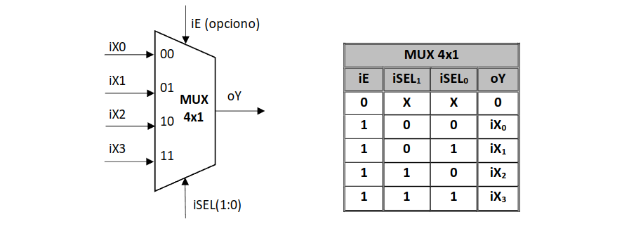

```vhdl
library IEEE;
use IEEE.STD_LOGIC_1164.ALL;

entity MUX4x1 is
    Port (
        iX : in STD_LOGIC_VECTOR(3 downto 0);   -- Ulazni signali
        iSEL : in STD_LOGIC_VECTOR(1 downto 0); -- Selekcioni signali
        iE : in STD_LOGIC;                      -- Omogućenje
        oY : out STD_LOGIC                      -- Izlazni signal
    );
end MUX4x1;

architecture Behavioral of MUX4x1 is
begin
    process (iX, iSEL, iE)
    begin
        if iE = '1' then
            case iSEL is
                when "00" => oY <= iX(0);
                when "01" => oY <= iX(1);
                when "10" => oY <= iX(2);
                when "11" => oY <= iX(3);
                when others => oY <= '0';
            end case;
        else
            oY <= '0';
        end if;
    end process;
end Behavioral;
```

## Demultiplekser

Demultiplekser je kombinaciona mreža sa jednim ulazom, n upravljačkih (selekcionih) signala i 2ⁿ izlaza, gde selekcioni signali određuju koji od izlaza će primiti signal sa ulaza. U nastavku je prikazan demultiplekser 1x4, istinitosna tablica i primer VHDL opisa.

**Primena**: Distribucija podataka, adresiranje u memorijama.

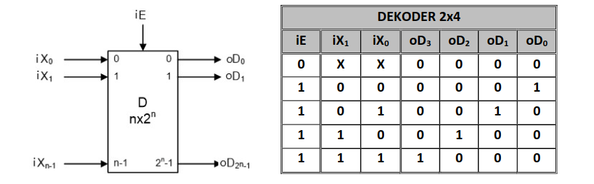

```vhdl
library IEEE;
use IEEE.STD_LOGIC_1164.ALL;

entity DEMUX1x4 is
    Port (
        iX : in STD_LOGIC;                      -- Ulazni signal
        iSEL : in STD_LOGIC_VECTOR(1 downto 0); -- Selekcioni signali
        iE : in STD_LOGIC;                      -- Omogućenje
        oD : out STD_LOGIC_VECTOR(3 downto 0)   -- Izlazni signali
    );
end DEMUX1x4;

architecture Behavioral of DEMUX1x4 is
begin
    process (iX, iSEL, iE)
    begin
        if iE = '1' then
            oD <= "0000"; -- Reset svih izlaza
            case iSEL is
                when "00" => oD(0) <= iX;
                when "01" => oD(1) <= iX;
                when "10" => oD(2) <= iX;
                when "11" => oD(3) <= iX;
                when others => oD <= "0000";
            end case;
        else
            oD <= "0000";
        end if;
    end process;
end Behavioral;
```

## Sabirač

Sabirač je kombinaciona mreža koja vrši aritmetičko sabiranje brojeva. Sabiranjem dva n-bitna broja dobija se rezultat koji ima n+1 bit. Kako bi dobili ispravan rezultat, neoznačeni sabirci se proširuju NULOM, dok se označeni sabirci proširuju ZNAKOM.

**Primena**: aritmetičke operacije, procesori, ALU jedinice.

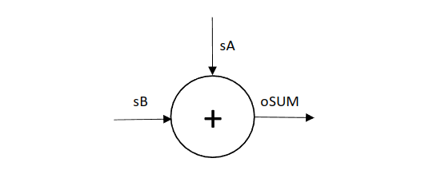

```vhdl
library IEEE;
use IEEE.STD_LOGIC_1164.ALL;

entity Adder is
    Port (
        sA : in STD_LOGIC;                 -- Prvi sabirak
        sB : in STD_LOGIC;                 -- Drugi sabirak
        oSUM : out STD_LOGIC               -- Rezultat sabiranja
    );
end Adder;

architecture Behavioral of Adder is
begin
    oSUM <= sA XOR sB; -- Sabiranje bez prenosa
end Behavioral;
```

## Komplementer

Komplement je dopuna datog broja do neke unapred definisane vrednosti. Najčešće se koristi za prikazivanje negativnih brojeva ili za realizaciju oduzimanja pomoću sabiranja. 

### Vrste komplementa:
- **Komplement jedinice (I komplement)** – Dobija se negiranjem svakog bita polaznog binarnog broja.
- **Komplement dvojke (II komplement)** – Dobija se dodavanjem jedinice na I komplement zadatog broja.

**Primena**: Predstavljanje negativnih brojeva, obrada binarnih aritmetičkih operacija.

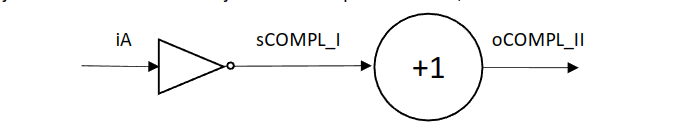

```vhdl
library IEEE;
use IEEE.STD_LOGIC_1164.ALL;
use IEEE.NUMERIC_STD.ALL; -- Potrebno za aritmetičke operacije

entity Complementer is
    Port (
        iA : in STD_LOGIC_VECTOR(7 downto 0);        -- Ulazni binarni broj
        oCOMPL_I : out STD_LOGIC_VECTOR(7 downto 0); -- I komplement
        oCOMPL_II : out STD_LOGIC_VECTOR(7 downto 0) -- II komplement
    );
end Complementer;

architecture Behavioral of Complementer is
begin
    -- Generisanje I komplementa negiranjem svakog bita
    oCOMPL_I <= NOT iA;

    -- Generisanje II komplementa dodavanjem '1' na I komplement
    oCOMPL_II <= std_logic_vector(unsigned(NOT iA) + 1);
end Behavioral;
```

## Komparator

Komparator je kombinaciona mreža koja vrši poređenje vrednosti ulaznih signala. Rezultati poređenja mogu biti: veće, manje ili jednako. Ova mreža je ključna za kontrolne jedinice i sekvencijalne procese.

**Primena**: Kontrolne jedinice, sortiranje podataka, upravljanje procesima.

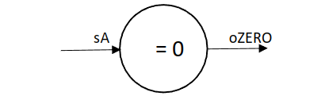

```vhdl
library IEEE;
use IEEE.STD_LOGIC_1164.ALL;
use IEEE.NUMERIC_STD.ALL; -- Potrebno za upoređivanje brojeva

entity Comparator is
    Port (
        sA : in STD_LOGIC_VECTOR(7 downto 0); -- Ulazni binarni broj
        oZERO : out STD_LOGIC -- Izlaz: '1' ako je broj jednak 0, inače '0'
    );
end Comparator;

architecture Behavioral of Comparator is
begin
    -- Provera da li je ulazni broj jednak 0
    process(sA)
    begin
        if unsigned(sA) = 0 then
            oZERO <= '1'; -- Broj je jednak 0
        else
            oZERO <= '0'; -- Broj nije jednak 0
        end if;
    end process;
end Behavioral;
```

## Pomerač

Pomerač je kombinaciona mreža koja vrši logičko ili aritmetičko pomeranje vrednosti ulaznih signala.  
- Kod **logičkog pomeranja** uvek se dodaju nule sa leve ili desne strane.  
- Kod **aritmetičkog pomeranja udesno**, zadržava se znak za negativne brojeve.

> [!WARNING]
> Obratiti pažnju na tip pomeranja (logičko ili aritmetičko), direktno utiče na rezultat operacije. Nepravilno pomeranje može dovesti do grešaka u rezultatima.

**Primena**: Efikasno množenje ili deljenje binarnih brojeva sa 2.

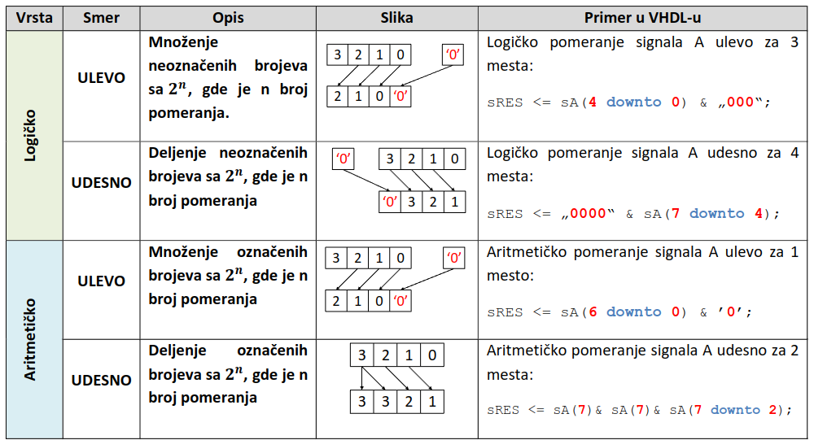

### Logičko pomeranje

```vhdl
library IEEE;
use IEEE.STD_LOGIC_1164.ALL;

entity Shifter is
    Port (
        sA : in STD_LOGIC_VECTOR(7 downto 0); -- Ulazni signal
        oLEFT : out STD_LOGIC_VECTOR(7 downto 0); -- Pomeranje ulevo
        oRIGHT : out STD_LOGIC_VECTOR(7 downto 0) -- Pomeranje udesno
    );
end Shifter;

architecture Behavioral of Shifter is
begin
    oLEFT <= sA(6 downto 0) & '0'; -- Pomeranje ulevo
    oRIGHT <= '0' & sA(7 downto 1); -- Pomeranje udesno
end Behavioral;
```

### Aritmetičko pomeranje

```vhdl
library IEEE;
use IEEE.STD_LOGIC_1164.ALL;
use IEEE.NUMERIC_STD.ALL;

entity ArithmeticShifter is
    Port (
        iA : in STD_LOGIC_VECTOR(7 downto 0);  -- Ulazni binarni broj
        oLEFT : out STD_LOGIC_VECTOR(7 downto 0); -- Izlaz pomeren ulevo
        oRIGHT : out STD_LOGIC_VECTOR(7 downto 0) -- Izlaz pomeren udesno
    );
end ArithmeticShifter;

architecture Behavioral of ArithmeticShifter is
begin
    -- Aritmetičko pomeranje ulevo (dodavanje '0' na krajnju desnu poziciju)
    oLEFT <= iA(6 downto 0) & '0';

    -- Aritmetičko pomeranje udesno (zadržavanje MSB za znak)
    oRIGHT <= iA(7) & iA(7 downto 1); -- Zadržava najznačajniji bit na krajnjoj levoj poziciji
end Behavioral;
```

## Registar

Registar je sekvencijalna logička komponenta koja privremeno skladišti binarne podatke. Koristi se za čuvanje informacija na kratko vreme i često je sinhronizovan sa taktom (clock signalom). Registar može biti implementiran sa različitim kapacitetima (n-bitni registri) u zavisnosti od potrebe sistema.

**Primena**: Čuvanje podataka u procesorima, prenos podataka između komponenti, implementacija stanja u sekvencijalnim sistemima.

```vhdl
library IEEE;
use IEEE.STD_LOGIC_1164.ALL;

entity Register is
    Port (
        CLK : in STD_LOGIC;                      -- Taktni signal
        RESET : in STD_LOGIC;                   -- Reset signal
        iDATA : in STD_LOGIC_VECTOR(7 downto 0); -- Ulazni podaci
        oDATA : out STD_LOGIC_VECTOR(7 downto 0) -- Izlazni podaci
    );
end Register;

architecture Behavioral of Register is
    signal REG : STD_LOGIC_VECTOR(7 downto 0); -- Interni registar
begin
    process(CLK, RESET)
    begin
        if RESET = '1' then
            REG <= (others => '0');             -- Reset podataka
        elsif rising_edge(CLK) then
            REG <= iDATA;                      -- Upis podataka u registar
        end if;
    end process;
    oDATA <= REG;                              -- Izlaz iz registra
end Behavioral;
```

## Brojač

Brojač je sekvencijalno logičko kolo koje broji ulazne impulse. Može se koristiti za brojanje unapred (inkrementalno) ili unazad (dekrementalno), a može biti sinhron ili asinhron, u zavisnosti od dizajna. Brojači se često implementiraju kao binarni brojači, ali postoje i brojači u drugim bazama.

**Primena**: Tajmeri, brojanje događaja u digitalnim sistemima, generisanje sekvenci u kontrolerima.

```vhdl
library IEEE;
use IEEE.STD_LOGIC_1164.ALL;
use IEEE.NUMERIC_STD.ALL;

entity Counter is
    Port (
        CLK : in STD_LOGIC;      -- Taktni signal
        RESET : in STD_LOGIC;    -- Reset signal
        ENABLE : in STD_LOGIC;   -- Signal za omogućavanje brojenja
        oCOUNT : out STD_LOGIC_VECTOR(7 downto 0) -- Trenutna vrednost brojača
    );
end Counter;

architecture Behavioral of Counter is
    signal COUNT : UNSIGNED(7 downto 0) := (others => '0'); -- Interna vrednost brojača
begin
    process(CLK, RESET)
    begin
        if RESET = '1' then
            COUNT <= (others => '0');          -- Reset brojača
        elsif rising_edge(CLK) then
            if ENABLE = '1' then
                COUNT <= COUNT + 1;           -- Inkrement brojača
            end if;
        end if;
    end process;
    oCOUNT <= STD_LOGIC_VECTOR(COUNT);        -- Konverzija u STD_LOGIC_VECTOR za izlaz
end Behavioral;
```

## Pomerački registar

Pomerački registar je kombinacija registra i funkcionalnosti pomeranja. Služi za skladištenje binarnih podataka, ali omogućava i serijsko pomeranje ulaznih podataka ulevo ili udesno. Pomerački registri mogu biti unidirekcioni (pomeranje u jednom smeru) ili bidirekcioni (pomeranje u oba smera).

**Primena**: Serijska komunikacija, enkodovanje i dekodovanje podataka, implementacija pomeranja u digitalnim sistemima.

```vhdl
library IEEE;
use IEEE.STD_LOGIC_1164.ALL;

entity ShiftRegister is
    Port (
        CLK : in STD_LOGIC;                      -- Taktni signal
        RESET : in STD_LOGIC;                    -- Reset signal
        SHIFT_LEFT : in STD_LOGIC;               -- Signal za pomeranje ulevo
        SHIFT_RIGHT : in STD_LOGIC;              -- Signal za pomeranje udesno
        iDATA : in STD_LOGIC_VECTOR(7 downto 0); -- Ulazni podaci
        oDATA : out STD_LOGIC_VECTOR(7 downto 0) -- Izlazni podaci
    );
end ShiftRegister;

architecture Behavioral of ShiftRegister is
    signal REG : STD_LOGIC_VECTOR(7 downto 0); -- Interni registar
begin
    process(CLK, RESET)
    begin
        if RESET = '1' then
            REG <= (others => '0');             -- Reset registra
        elsif rising_edge(CLK) then
            if SHIFT_LEFT = '1' then
                REG <= REG(6 downto 0) & '0';  -- Pomeranje ulevo
            elsif SHIFT_RIGHT = '1' then
                REG <= '0' & REG(7 downto 1);  -- Pomeranje udesno
            else
                REG <= iDATA;                  -- Upis ulaznih podataka
            end if;
        end if;
    end process;
    oDATA <= REG;                              -- Izlaz iz registra
end Behavioral;
```

# 6. Aritmetika, Sabirač i Carry Lookahead Adder u VHDL-u

U digitalnoj logici, aritmetičke operacije kao što su sabiranje i oduzimanje čine osnovu za mnoge digitalne sisteme, uključujući procesore i kalkulatore. Sabirači su osnovni elementi za implementaciju ovih operacija. Jedan od najvažnijih tipova sabirača je **Carry Lookahead Adder (CLA)**, koji rešava problem kašnjenja prenosa (carry delay) u standardnim sabiračima.

## Sabirač u digitalnim sistemima

### Osnovni sabirač
Sabirač je logičko kolo koje vrši sabiranje dva binarna broja. Postoje dve vrste sabirača:

1. **Pola sabirač (Half Adder)**:
   - Sabira dva bita.
   - Ima dva izlaza:
     - **SUM (zbir)**: Rezultat sabiranja bez prenosa.
     - **CARRY (prenos)**: Prenos ka sledećem bitu.

2. **Celi sabirač (Full Adder)**:
   - Sabira tri bita: dva ulazna bita i prenos iz prethodne faze.
   - Ima dva izlaza:
     - **SUM (zbir)**.
     - **CARRY (prenos)**.

## Carry Lookahead Adder (CLA)

**Carry Lookahead Adder** (CLA) rešava problem kašnjenja u sabiranju binarnih brojeva, koji se javlja u standardnim ripple-carry sabiračima. CLA to postiže predviđanjem prenosa (*carry lookahead*), čime se drastično smanjuje vreme potrebno za sabiranje.

## Kako CLA funkcioniše?

CLA koristi dva ključna signala za svaki bit ulaznih brojeva:

1. **Carry Generate (G):**  
   - Ovaj signal označava da se prenos generiše na trenutnom bitu, nezavisno od ulaznih prenosa.  
   - Generiše se kada su oba ulaza trenutnog bita `1`.  
   - Matematički izraz:  
     \[
     G_i = A_i \cdot B_i
     \]  
     Ovde su \( A_i \) i \( B_i \) ulazi trenutnog bita.

2. **Carry Propagate (P):**  
   - Ovaj signal označava da trenutni bit može propagirati prenos sa prethodnog bita na sledeći.  
   - Propagacija se dešava kada je bar jedan od ulaza trenutnog bita `1`.  
   - Matematički izraz:  
     \[
     P_i = A_i + B_i
     \]  
     Ovde \( + \) predstavlja logičku operaciju OR.

Nakon što se za svaki bit izračunaju \( G \) i \( P \), CLA koristi sledeće formule za određivanje prenosa (*carry*) za svaki bit:

\[
C_{i+1} = G_i + (P_i \cdot C_i)
\]

Gde je:  
- \( C_i \): Prenos sa prethodnog bita.  
- \( C_{i+1} \): Prenos na sledeći bit.  

Za prvi bit (\( C_0 \)), prenos je obično unapred definisan (npr. \( C_0 = 0 \) za standardno sabiranje).

## Prednosti CLA-a

- **Brzina:** CLA značajno smanjuje ukupno kašnjenje sabiranja jer prenosi ne moraju da se serijski propagiraju kroz sve bitove. Umesto toga, svi proračuni prenosa se obavljaju paralelno.  
- **Efikasnost za velike brojeve:** CLA je posebno koristan kod sabiranja velikih binarnih brojeva jer kašnjenje raste logaritamski umesto linearno.

```vhdl
-- Carry Lookahead Adder: Sabira četiri bita sa predviđanjem prenosa
library IEEE;
use IEEE.STD_LOGIC_1164.ALL;

entity CLA_Adder is
    Port (
        A : in STD_LOGIC_VECTOR(3 downto 0);  -- Prvi ulaz (4 bita)
        B : in STD_LOGIC_VECTOR(3 downto 0);  -- Drugi ulaz (4 bita)
        Cin : in STD_LOGIC;  -- Ulazni prenos
        SUM : out STD_LOGIC_VECTOR(3 downto 0);  -- Zbir
        Cout : out STD_LOGIC  -- Izlazni prenos
    );
end CLA_Adder;

architecture Behavioral of CLA_Adder is
    signal G, P, C : STD_LOGIC_VECTOR(3 downto 0);  -- Generisanje, propagacija, prenosi
begin
    -- Generisanje i propagacija prenosa
    G <= A AND B;  -- Prenos generisan
    P <= A XOR B;  -- Prenos propagiran

    -- Prenosi za svaki bit
    C(0) <= Cin;
    C(1) <= G(0) OR (P(0) AND Cin);
    C(2) <= G(1) OR (P(1) AND C(1));
    C(3) <= G(2) OR (P(2) AND C(2));
    Cout <= G(3) OR (P(3) AND C(3));  -- Izlazni prenos

    -- Izračunavanje zbira
    SUM <= P XOR C;
end Behavioral;
```

# 7. Moguće vrednosti std_logic tipa promenljive u VHDL-u

U jeziku VHDL, `std_logic` je osnovni tip podataka koji se koristi za predstavljanje digitalnih signala. Ovaj tip podržava različite vrednosti koje omogućavaju simulaciju stvarnih uslova u digitalnim sistemima, kao što su visoka impedansa, neodređeno stanje, ili neinicijalizovan signal. U nastavku su objašnjene sve vrednosti koje `std_logic` može da ima.

> [!WARNING]
> Iako postoji 9 mogućih vrednosti `std_logic` tipa, fizički hardver može podržati samo osnovne logičke vrednosti `0` i `1`. Ostale vrednosti su korisne samo za simulaciju i testiranje digitalnih sistema.

## Lista vrednosti `std_logic` tipa

| **Vrednost** | **Opis (na srpskom)**               | **Interpretacija (na engleskom)**      |
|--------------|-------------------------------------|-----------------------------------------|
| `U`          | Neinicijalizovano                  | *Uninitialized*                        |
| `X`          | Nepoznato                          | *Forcing Unknown*                      |
| `0`          | Nula                               | *Forcing 0*                            |
| `1`          | Jedinica                           | *Forcing 1*                            |
| `Z`          | Visoka impedansa (tri-stanje)      | *High Impedance*                       |
| `W`          | Slabo nepoznato                   | *Weak Unknown*                         |
| `L`          | Slaba nula                        | *Weak 0*                               |
| `H`          | Slaba jedinica                    | *Weak 1*                               |
| `-`          | Nedefinisano                      | *Don't Care*                           |

## Detaljna objašnjenja vrednosti

1. **`U` (Neinicijalizovano)**  
   Ova vrednost označava da signal nije inicijalizovan u toku simulacije. Obično se koristi za identifikaciju grešaka u dizajnu.

2. **`X` (Nepoznato)**  
   Predstavlja stanje kada je vrednost signala nepoznata zbog sukoba ili greške, npr. kada su signali u konfliktu.

3. **`0` (Logička nula)**  
   Predstavlja nisku logičku vrednost. Ovo je standardna "laž" vrednost u digitalnoj logici.

4. **`1` (Logička jedinica)**  
   Predstavlja visoku logičku vrednost. Ovo je standardna "istina" vrednost u digitalnoj logici.

5. **`Z` (Visoka impedansa)**  
   Vrednost `Z` označava stanje visoke impedanse, poznato i kao tri-stanje (high impedance). Ovo stanje se koristi u magistralnim (bus) sistemima i višekanalnim dizajnima kako bi se omogućilo da samo jedan uređaj upravlja magistralom u određenom trenutku, dok su svi ostali uređaji isključeni. Kada signal ima vrednost `Z`, on ne utiče na stanje linije, čime se izbegavaju sukobi između uređaja. Na primer, u sistemima sa više uređaja povezanih na istu magistralu, uređaj koji trenutno ne šalje podatke postavlja svoj izlaz na `Z`.

6. **`W` (Slabo nepoznato)**  
   Vrednost `W` označava slabo nepoznato stanje. To znači da signal ima slab nivo, ali nije jasno definisano da li je bliži logičkoj nuli (`0`) ili logičkoj jedinici (`1`). Ovo stanje se može javiti kada postoji sukob između dva slaba izvora signala, ili kada linija ima slab pull-up ili pull-down otpornik koji ne može u potpunosti odrediti signal. Ovo je posebno korisno u simulacijama za prikazivanje potencijalnih sukoba signala.

7. **`L` (Slaba nula)**  
   `L` predstavlja slabu logičku nulu. Ova vrednost se javlja kada signal ima tendenciju ka logičkoj nuli zahvaljujući slabom pull-down otporniku. Na primer, ako linija nije aktivno upravljana, ali ima pasivni otpornik koji je povezuje sa zemljom, simulator može postaviti stanje signala na `L`.

8. **`H` (Slaba jedinica)**  
   Slično tome, `H` označava slabu logičku jedinicu. Ovo stanje se koristi za predstavljanje signala koji teži ka logičkoj jedinici zbog slabog pull-up otpornika. Kao i kod `L`, `H` je koristan za simulaciju situacija kada signal nije aktivno upravljan, ali postoji pasivni element koji ga postavlja na visoki nivo.

9. **`-` (Nedefinisano)**  
   Konačno, vrednost `-` se koristi za predstavljanje neodređenog stanja. Ova vrednost označava situacije kada nije važno da li je signal `0` ili `1`. Na primer, prilikom optimizacije dizajna ili generisanja testnih obrazaca, `-` se koristi kao oznaka da je signal "nevažan" za određeni deo kola.

# 8. Tipične greške prilikom pisanja VHDL-a

Pisanje VHDL koda za digitalne sisteme nije jednostavan zadatak, jer čak i najmanje greške mogu dovesti do nepredviđenog ponašanja kola. Postoje određene greške koje se često javljaju i koje mogu uzrokovati ozbiljne probleme tokom simulacije ili sinteze. U nastavku se detaljno razmatraju najčešće greške prilikom pisanja VHDL-a.

## 1. Incomplete Sensitivity List

Jedna od čestih grešaka je **nepotpuna lista osetljivosti** u procesu. Kada definišete proces u VHDL-u, **lista osetljivosti** treba da obuhvati sve signale koji mogu izazvati promenu unutar tog procesa. Ako neki signal nedostaje u listi, simulator neće prepoznati promenu tog signala kao okidač za ponovno pokretanje procesa.

```vhdl
-- Incomplete Sensitivity List
-- Primer sa nepotpunom listom osetljivosti
PROCESS (a)  -- Nedostaje signal `b` u listi osetljivosti
BEGIN
    result <= a + b;  -- Promena `b` neće izazvati ažuriranje promeljive`result`
END PROCESS;

-- Ispravan primer sa kompletnom listom osetljivosti
PROCESS (a, b)
BEGIN
    result <= a + b;
END PROCESS;
```

### Primer greške:
Ako imate proces koji računa zbir dva signala, ali u listi osetljivosti zaboravite da navedete jedan od njih, promena tog signala neće izazvati ažuriranje rezultata. Ovo može dovesti do lažnog ponašanja tokom simulacije, iako sinteza može ignorisati ovu grešku.

### Kako izbeći:
- Uvek osigurajte da su svi signali koji utiču na proces navedeni u listi osetljivosti.
- Koristite ključnu reč `all` u modernijim verzijama VHDL-a, koja automatski uključuje sve signale u listu.

## 2. Latch

**Latch-ovi** su neželjeni memorijski elementi koji se često nehotice generišu zbog **nepotpunog definisanja izlaza** u svim granama procesa. Ovo se dešava kada koristite uslovne strukture poput `if-else`, ali ne definišete izlaz za svaki mogući uslov.

```vhdl
-- Latch (neželjen)
-- Primer: Nedostatak definicije izlaza za sve uslove
PROCESS (clk)
BEGIN
    IF clk = '1' THEN
        IF enable = '1' THEN
            output <= data;  -- Šta se dešava ako `enable` nije `1`?
        END IF;
    END IF;
END PROCESS;

-- Ispravan primer sa podrazumevanom vrednošću
PROCESS (clk)
BEGIN
    IF clk = '1' THEN
        IF enable = '1' THEN
            output <= data;
        ELSIF enable = '0' THEN
            output <= '0';  -- Definisanje izlaza za sve uslove
        END IF;
    END IF;
END PROCESS;
```

### Primer greške:
Ako koristite `if` strukturu i ne definišete šta se dešava kada nijedan uslov nije ispunjen, sintetizator će automatski dodati latch kako bi zadržao prethodnu vrednost signala. Ovo može dovesti do kašnjenja i nepredvidivih rezultata.

### Kako izbeći:
- Definišite vrednost izlaza za **svaki mogući slučaj** unutar procesa.
- Postavite podrazumevanu vrednost izlaza na početku procesa kako biste izbegli stvaranje latch-ova.

## 3. Multiple Driver

**Višestruko upravljanje jednim signalom** je greška koja nastaje kada više procesa pokušava da dodeli različite vrednosti istom signalu. Ova situacija uzrokuje konflikt jer signal `std_logic` može imati samo jednu vrednost u svakom trenutku.

```vhdl
-- Multiple Driver
-- Primer: Dva procesa pokušavaju da upravljaju istim signalom
PROCESS_1: PROCESS
BEGIN
    output_signal <= '1';  -- Prvi upravljač
    WAIT;
END PROCESS PROCESS_1;

PROCESS_2: PROCESS
BEGIN
    output_signal <= '0';  -- Drugi upravljač
    WAIT;
END PROCESS PROCESS_2;

-- Ispravan primer: Organizacija dizajna da svaki signal ima jedan izvor
PROCESS (clk)
BEGIN
    IF clk = '1' THEN
        IF condition = '1' THEN
            output_signal <= '1';
        ELSE
            output_signal <= '0';
        END IF;
    END IF;
END PROCESS;
```

### Primer greške:
Ako dva odvojena procesa pokušavaju da dodele vrednosti istom izlazu, simulator će prijaviti grešku o višestrukom upravljaču (`multiple driver`).

### Kako izbeći:
- Organizujte dizajn tako da svaki signal ima **samo jedan izvor** koji ga kontroliše.
- Ako je potrebno koristiti višestruke izvore, koristite rezolucione funkcije ili implementirajte logiku upravljanja.

## 4. Combinational Loop

**Kombinaciona petlja** je greška koja nastaje kada izlaz kombinacionog kola direktno ili indirektno utiče na sopstveni ulaz. Ovo dovodi do beskonačne petlje, zbog čega simulator ne može da izračuna tačne vrednosti signala.

```vhdl
-- Combinational Loop
-- Primer: Povratna veza unutar kombinacione logike
PROCESS (a, b)
BEGIN
    a <= b AND c;
    c <= a OR b;  -- `a` zavisi od `c`, a `c` od `a`, što stvara petlju
END PROCESS;

-- Ispravan primer: Razbijanje petlje korišćenjem registracije signala
PROCESS (clk)
BEGIN
    IF rising_edge(clk) THEN
        temp <= b AND c;  -- Registracija vrednosti
        c <= temp OR b;   -- Koristi registrovanu vrednost `temp`
    END IF;
END PROCESS;
```

### Primer greške:
Ako signal `A` zavisi od signala `B`, koji zauzvrat zavisi od signala `A`, stvoriće se petlja koju simulator neće moći da reši.

### Kako izbeći:
- Proverite zavisnosti između signala i osigurajte da nema povratnih veza unutar kombinacione logike.
- Koristite sekvencijalnu logiku (flip-flopove) za prekidanje povratne petlje ako je potrebno.

> [!TIP]  
> Uvek koristite alate za simulaciju pre nego što pređete na sintezu kako biste identifikovali potencijalne probleme u ranim fazama dizajna.

# 9. Osnovni koncept LECA i evolucija ka DFF-u

## Šta su latch kola?

Latch kola predstavljaju osnovne sekvencijalne logičke elemente koji omogućavaju skladištenje jednog bita informacija. Za razliku od kombinacionih kola, koja u svakom trenutku zavise samo od trenutnih ulaza, latch kola pamte svoje prethodno stanje i mogu se koristiti za formiranje jednostavnih memorijskih uređaja. 

Osnovna ideja latch kola jeste zadržavanje binarne vrednosti (`0` ili `1`) dok god je to potrebno. To omogućava implementaciju funkcionalnosti poput privremenog čuvanja podataka, formiranja registara i sinhronizacije u digitalnim sistemima.

Latch kola se aktiviraju promenom ulaza ili kontrolnog signala (npr. `Enable`). Njihova struktura i ponašanje zavise od tipa latch kola.

## LECA kola - Vrste i karakteristike

### 1. SR-latch (Set-Reset latch)

SR-latch je osnovni oblik latch kola i sastoji se od dve unakrsno povezana NAND ili NOR logička kola. Ova struktura omogućava čuvanje binarne vrednosti i njeno menjanje pomoću ulaza `S` i `R`.

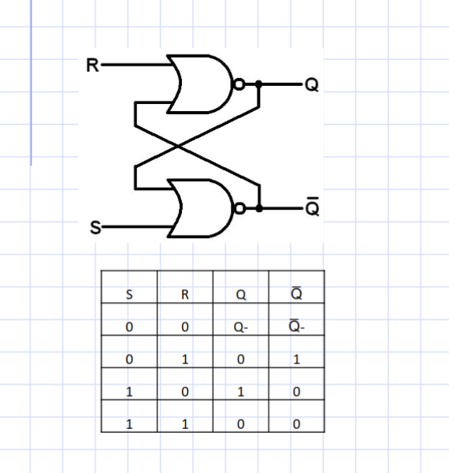

- **Ulazi**:
  - `S` (Set) - Postavlja izlaz `Q` na 1.
  - `R` (Reset) - Postavlja izlaz `Q` na 0.
  
- **Izlazi**:
  - `Q` - Trenutno stanje.
  - `Q̅` - Inverzno stanje.

- **Princip rada**:
  - Kada je `S=1` i `R=0`, izlaz `Q` se postavlja na 1 (stanje je "postavljeno").
  - Kada je `S=0` i `R=1`, izlaz `Q` se postavlja na 0 (stanje je "resetovano").
  - Kada su oba ulaza `S=0` i `R=0`, izlaz zadržava prethodno stanje.
  - Kada su oba ulaza `S=1` i `R=1`, stanje postaje neodređeno (što je nepoželjno i treba izbegavati).

**Primena**: SR-latch se koristi u jednostavnim aplikacijama gde je potrebno skladištenje stanja sa osnovnim kontrolnim signalima.

### 2. D-latch (Data latch)

D-latch je unapređena verzija SR-latch-a, dizajnirana da prevaziđe problem neodređenog stanja (`S=1, R=1`). Umesto dva ulaza (`S` i `R`), D-latch koristi jedan ulaz `D` (Data) za upravljanje.


- **Ulazi**:
  - `D` (Data) - Vrednost koju želimo da sačuvamo.
  - `Enable` - Kontrolni signal koji omogućava zapisivanje u latch.

- **Izlazi**:
  - `Q` - Trenutna vrednost.
  - `Q̅` - Inverzna vrednost.

- **Princip rada**:
  - Kada je `Enable=1`, vrednost ulaza `D` se prepisuje na izlaz `Q`.
  - Kada je `Enable=0`, izlaz `Q` zadržava prethodno stanje.

**Karakteristika**: D-latch omogućava jednostavno i predvidljivo ponašanje bez neodređenih stanja. Zbog svoje jednostavnosti često se koristi kao osnovni građevinski blok za složenija kola, poput registara i flip-flopova.

### 3. Latch sa Enable signalom

Ovo je varijanta D-latch-a sa dodatnim kontrolnim signalom `Enable`. Omogućava veću kontrolu nad zapisivanjem i zadržavanjem podataka.

- **Ulazi**:
  - `D` (Data) - Vrednost za skladištenje.
  - `Enable` - Kontrolni signal koji omogućava aktivaciju.

- **Izlazi**:
  - `Q` - Trenutna vrednost.
  - `Q̅` - Inverzna vrednost.

- **Princip rada**:
  - Kada je `Enable=1`, ulaz `D` se prepisuje na izlaz `Q`.
  - Kada je `Enable=0`, izlaz `Q` ostaje nepromenjen, bez obzira na ulaz `D`.

**Prednosti**:
  - Precizna kontrola nad čuvanjem podataka.
  - Smanjuje mogućnost grešaka zbog neželjenih promena ulaza.

## Problemi i ograničenja LECA kola

Iako LECA kola imaju značajnu ulogu u sekvencijalnoj logici, ona dolaze sa određenim ograničenjima:

1. **Asinhronost**: Promene izlaza zavise od ulaznih signala u realnom vremenu. To može dovesti do problema u složenijim sistemima gde je sinhronizacija ključna.

2. **Neodređena stanja**: SR-latch može ući u neodređeno stanje (`S=1, R=1`), što ga čini nepouzdanim za neke primene.

3. **Glitches (prolazna stanja)**: Zbog brzih promena ulaza ili nesinhronih signala, mogu se javiti prolazna neželjena stanja na izlazu.

4. **Nedostatak sinhronizacije**: Bez upotrebe taktnog (clock) signala, LECA kola nisu pogodna za kompleksne digitalne sisteme.

# 10. DFF (D Flip-Flop), MSFF (Master-Slave Flip-Flop)  

## DFF (D Flip-Flop)

DFF, ili *Data Flip-Flop*, je sekvencijalna logička komponenta dizajnirana za čuvanje jednog bita podataka. Njegova glavna uloga je da prepisuje i skladišti ulaznu vrednost `D` na izlazu `Q` tokom određenog trenutka - obično na pozitivnom ili negativnom prelazu taktnog signala (*clock*). Na taj način DFF osigurava sinhronizovano ponašanje u digitalnim sistemima.

Za razliku od osnovnih **latch** kola, koja su asinhrona i reaguju na ulaze u realnom vremenu, DFF je potpuno sinhron. Ova sinhronizacija eliminiše probleme poput nepoželjnih prelaznih stanja (*glitches*) i asinhronih promena izlaza. DFF reaguje isključivo na promene taktnog signala (`CLK`), omogućavajući bolju kontrolu u dizajnu digitalnih kola.

### Karakteristike DFF-a
- **Ulazi**:
  - `D` (*Data*): Predstavlja vrednost koju želimo sačuvati u flip-flopu.
  - `CLK` (*Clock*): Taktički signal koji upravlja kada će flip-flop sačuvati ulaznu vrednost.
  - `RESET` (opciono): Koristi se za vraćanje izlaza na nulu (`Q = 0`).
  - `ENABLE` (opciono): Omogućava ili blokira prepisivanje vrednosti sa ulaza na izlaz.
- **Izlazi**:
  - `Q`: Trenutna sačuvana vrednost.
  - `Q̅`: Inverzna vrednost od `Q`.

### **Funkcija DFF-a**
DFF funkcioniše na sledeći način:
1. Kada taktički signal (`CLK`) detektuje pozitivan prelaz (0 → 1), vrednost sa ulaza `D` se prepisuje na izlaz `Q`.
2. Dok se ne dogodi sledeći prelaz takta, izlaz `Q` ostaje konstantan, bez obzira na promene ulaza `D`.
3. Opciono, aktiviranjem `RESET` signala izlaz se postavlja na nulu, dok `ENABLE` signal može omogućiti ili blokirati zapisivanje vrednosti.

DFF se koristi kao osnovna komponenta za izgradnju registara, brojača i memorijskih elemenata. Njegova sposobnost da čuva stabilnu vrednost između taktičkih impulsa omogućava pouzdan rad u složenim digitalnim sistemima.

## MSFF (Master-Slave Flip-Flop)

Master-Slave Flip-Flop (MSFF) predstavlja unapređenje DFF-a, dizajnirano za rešavanje problema vezanih za tranzijentna stanja i nesinhronizovane promene ulaza i izlaza. MSFF kombinuje dva međusobno povezana **latch-a** (poznata kao *Master latch* i *Slave latch*), čime omogućava dublju sinhronizaciju u odnosu na običan DFF.

### Struktura i rad MSFF-a
1. **Master latch**: Aktivira se na **pozitivni prelaz takta** (`CLK = 1`). U ovom stanju, vrednost sa ulaza `D` se prepisuje u *Master latch*, dok izlaz ostaje nepromenjen.
2. **Slave latch**: Aktivira se na **negativni prelaz takta** (`CLK = 0`). Kada *Slave latch* preuzme vrednost iz *Master latch-a*, ta vrednost postaje dostupna na izlazu `Q`.

Na ovaj način MSFF osigurava da ulazna promena bude potpuno završena pre nego što se prenese na izlaz. Ovaj pristup značajno smanjuje mogućnost pojave grešaka izazvanih prolaznim stanjima.

### Karakteristike MSFF-a
- **Precizna sinhronizacija**: Koristeći dva prelaza takta (pozitivni i negativni), MSFF omogućava stabilniju i pouzdaniju obradu podataka.
- **Izbegavanje glitches efekata**: Promene na izlazu se dešavaju tek nakon što su ulazi potpuno obrađeni, čime se eliminišu privremene nepoželjne promene.
- **Viša složenost**: Zbog dvostruke strukture (*Master-Slave*), MSFF zahteva više logike i resursa u poređenju sa DFF-om.

### Primer rada MSFF-a
1. Kada je `CLK = 1`, *Master latch* preuzima vrednost `D`, dok *Slave latch* zadržava prethodnu vrednost na izlazu.
2. Kada `CLK` pređe u `0`, *Slave latch* preuzima vrednost iz *Master latch-a*, koja se zatim pojavljuje na izlazu `Q`.

## **Razlike između DFF-a i MSFF-a**

DFF i MSFF se razlikuju u nekoliko ključnih aspekata:

| **Karakteristika**           | **DFF**                       | **MSFF**                         |
|------------------------------|-------------------------------|-----------------------------------|
| **Kompleksnost**             | Jednostavna struktura         | Dvostruka struktura (*Master-Slave*) |
| **Reakcija na takt**         | Samo na jedan prelaz          | Na oba prelaza (*Master i Slave*) |
| **Preciznost sinhronizacije**| Manje precizna                | Visoko precizna                  |

## Primena DFF-a i MSFF-a

1. **DFF**:
   - Koristi se u implementaciji registara, u kojima je potrebno sačuvati trenutnu vrednost za kasniju obradu.
   - Osnovni blok za skladištenje podataka u digitalnim sistemima.

2. **MSFF**:
   - Stabilnije skladištenje podataka u situacijama gde je preciznost ključna, poput kontrolnih jedinica.
   - Pogodan za dizajn sekvencijalnih kola u procesorima i memorijskim sistemima.

MSFF pruža stabilniju i pouzdaniju osnovu za kompleksne digitalne sisteme, dok je DFF idealan za jednostavnije primene sa manjim zahtevima za preciznošću.

# 11. Brojači  

Brojači su sekvencijalne mreže sa jednim binarnim ulazom, poznatim kao **brojački impuls (X)**, čiji dijagram stanja opisuje repetitivni ciklus. Ovi uređaji se koriste za brojanje događaja, sinhronizaciju procesa i generisanje sekvenci u digitalnim sistemima.

## Osnovni koncept brojača

- **Broj stanja**: Brojač ima niz stanja koja se ciklično menjaju. Broj stanja se definiše kao **modul brojača** ili osnovna veličina brojača.  
  Na primer, **brojač modula N** ima N različitih stanja (0, 1, ..., N-1).  
- **Funkcija prelaza stanja**: Matematički izraz koji opisuje prelazak iz jednog stanja u drugo je:  

> S(t + 1) = (S(t) + X) mod N

gde je:
- `S(t)` trenutno stanje,
- `X` vrednost ulaza (0 ili 1),
- `N` modul brojača.

- **Potrebni elementi**:  
Broj elementarnih automata (flip-flopova) potrebnih za realizaciju brojača sa N stanja je:  

> m >= log<sub>2</sub>(N)

## Vrste brojača

1. **Dekadni (decimalni) brojač**  
 - Na izlazu daje vrednosti u decimalnom brojnom sistemu.  
 - Često se koristi u brojilima i digitalnim satovima.

2. **Redni (kružni) brojač**  
 - Poseduje onoliko memorijskih elemenata koliko ima stanja.  
 - Modul brojača = Broj flip-flopova.  
 - Primer primene: generatori sekvenci.

3. **Džonsonov brojač**  
 - Modifikacija kružnog brojača.  
 - Modul brojača = 2 × broj flip-flopova.  
 - Koristi se za smanjenje broja grešaka i implementaciju specifičnih sekvenci.

## Primer realizacije u VHDL-u

Sledeći primer prikazuje implementaciju univerzalnog brojača koji može brojati unapred i unazad. Brojač ima sledeće portove:

- **iCLK**: Ulaz za takt (clock signal).  
- **inRESET**: Ulaz za resetovanje brojača na nulu.  
- **iDIRECTION**: Ulaz koji definiše smer brojanja (`1` za unapred, `0` za unazad).  
- **oCNT**: Izlazni signal koji predstavlja trenutnu vrednost brojača.

```vhdl
library IEEE;
use IEEE.STD_LOGIC_1164.ALL;
use IEEE.STD_LOGIC_UNSIGNED.ALL;

entity BROJAC is
  port (
      iCLK       : in  STD_LOGIC;
      inRESET    : in  STD_LOGIC;
      iDIRECTION : in  STD_LOGIC;
      oCNT       : out STD_LOGIC_VECTOR (3 downto 0)
  );
end BROJAC;

architecture BROJAC_ARH of BROJAC is
  signal sCOUNTER : STD_LOGIC_VECTOR (3 downto 0) := "0000";
begin
  PROCESS (iCLK, inRESET)
  begin
      -- Provera signala za reset
      if inRESET = '0' then
          sCOUNTER <= "0000";
      -- Brojanje na svaki pozitivan front takta
      elsif rising_edge(iCLK) then
          if iDIRECTION = '1' then
              sCOUNTER <= sCOUNTER + 1;
          else
              sCOUNTER <= sCOUNTER - 1;
          end if;
      end if;
  end PROCESS;

  -- Dodela vrednosti izlazu
  oCNT <= sCOUNTER;
end BROJAC_ARH;
```

## Ključne tačke u kodu

1. **Resetovanje (`inRESET`)**  
   - Kada je signal za resetovanje aktivan (`inRESET = '0'`), brojač se vraća na početnu vrednost `0000`.

2. **Smer brojanja (`iDIRECTION`)**  
   - Definiše smer brojanja:
     - `1`: Brojanje unapred (*inkrementacija*).
     - `0`: Brojanje unazad (*dekrementacija*).

3. **Pozitivan front takta (`rising_edge`)**  
   - Brojanje se vrši samo na pozitivan prelaz takta, što omogućava sinhronizaciju sa sistemskim taktom.

4. **Signal `sCOUNTER`**  
   - Interni signal koji čuva trenutnu vrednost brojača i ažurira se prema ulaznim signalima (`iDIRECTION` i `inRESET`).

5. **Izlazni signal (`oCNT`)**  
   - Trenutna vrednost brojača (`sCOUNTER`) se dodeljuje izlaznom portu `oCNT`, čime se omogućava praćenje trenutnog stanja brojača.

# 12. Napomene za praktični deo kolokvijuma

> [!TIP]
> Unutar foldera u kom se nalazi ova skripta, moguće je pronaći i primere kolokvijuma iz prethodnih godina. Uz tekstove, moguće je pronaći i Quartus projekte koji sadrže rešenja zadataka.

### 1. Razlika prilikom implementacije reseta
   
- **Asinhroni reset**: Reset koji se aktivira odmah nakon što se detektuje signal.
```vhdl
process (CLK, RESET)
begin
    if RESET = '1' then
        -- Resetovanje podataka
    elsif rising_edge(CLK) then
        -- Logika kola
    end if;
end process;
```

- **Sinhroni reset**: Reset koji se aktivira na ivici takta.
```vhdl
process (CLK)
begin
    if rising_edge(CLK) then
        if RESET = '1' then
            -- Resetovanje podataka
        else
            -- Logika kola
        end if;
    end if;
end process;
```

### 2. Razlikovanje kombinacionih i sekvencijalnih komponenti

> [!TIP]
> Na kolokvijumu će svako dobiti šemu zadatka, gde će sa malim trouglom biti označene sekvencijalne komponente.

- **Kombinacione komponente**: Kola koja ne zavise od prethodnih stanja i daju izlaz odmah nakon promene ulaza.
- **Sekvencijalne komponente**: Kola koja zavise od prethodnih stanja i daju izlaz nakon promene ulaza i takt signala.

### 3. Liste osetljivosti

Ukoliko radimo sa **kombinacionim komponentama**, moramo navesti **sve signale koji utiču na izračunavanje izlaza** iz te komponente. Dok ukoliko radimo sa **sekvencijalnim komponentama**, moramo navesti **signale takta i resetovanja**.

### 4. Definisanje svih slučajeva u strukturama grananja (if-else, case)

- Kod kombinacionih komponenti, **obavezno je definisati sve moguće slučajeve**.
- Kod sekvencijalnih komponenti, **nije potrebno definisati sve slučajeve**. Ukoliko se neki slučaj ne definiše, vrednost će ostati nepromenjena.

### 5. Reset na početku Test Bench-a

Ukoliko na početku instrukcija piše da je potrebno resetovati sistem određen broj taktova, to možemo postići na sledeći način:

```vhdl
sRST <= '1';
wait for 5.25 * iCLK_period;
sRST <= '0';
```

> [!IMPORTANT]
> Pre rada sa sekvencijalnim komponentama, uvek želimo da resetujemo sistem na početku za NE CEO BROJ taktova. Cilj ovoga je da izbegnemo situacije u kojima se događa takt zajedno sa svim ostalim dešavanjima u sistemu, tj. izbećićemo potencijalna neočekivana ponašanja.

