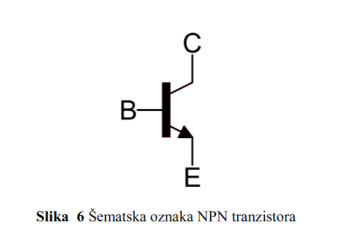

# Elementarna kola

## Oznake

- **Vdc (DC/Direct Current voltage)** - Oznaka za jednosmerni napon
- **Vout (Output voltage)** - Oznaka za izlazni napon
- **R (Resistance)** - Oznaka za otpor/otpornik
- **SW (Switch)** - Oznaka za prekidač
- **A (Anoda)** - Pozitivni terminal diode
- **K (Katoda)** - Negativni terminal diode
- **Vth (Threshold voltage)** - Prag napona
- **B (Baza)** - Kontrolni terminal tranzistora
- **C (Kolektor)** - Terminal kroz koji struja izlazi iz tranzistora
- **E (Emiter)** - Terminal kroz koji struja ulazi u tranzistor
- **D (Drain)** - Odvodni terminal MOS FET-a
- **G (Gate)** - Kontrolni terminal MOS FET-a
- **S (Source)** - Izvorni terminal MOS FET-a
- **Vgs (Gate-Source voltage)** - Napon između Gate-a i Source-a

# Elementarno prekidačko kolo

## Elementarno prekidačko kolo (Slika 1)

**Disipacija energije** se odnosi na gubitak energije u obliku toplote ili drugih oblika koji se ne mogu povratiti.

- Kada je **prekidač zatvoren**, struja teče kroz otpornik R.
- Električna energija iz izvora (**Vdc**) se troši u obliku toplote na otporniku R, zbog prisustva otpora.
- Čak i kada kolo daje izlaznu informaciju "isključeno" (nizak napon), dolazi do potrošnje energije.
- Kada je **prekidač otvoren**, struja ne teče kroz otpornik, pa nema disipacije energije, što znači da kolo u tom stanju troši minimalno energije.
- **Nedostatak** ovog kola je što, u slučaju zatvorenog prekidača, kolo stalno troši energiju, što može biti neefikasno u nekim primenama.

Dakle, potrošnja energije ovog kola zavisi od stanja prekidača.

## Redno vezano prekidačko kolo (Slika 2)

Uvođenjem redno postavljenih prekidača (S1 i S2), kao što je prikazano na slici 2, postiže se rešenje koje smanjuje potrošnju energije.

- Po broju komponenti, ovo kolo je iste složenosti kao i prethodno (slika 1), ali je energetski efikasnije.
- U oba binarna stanja na izlazu (1 i 0), strujno kolo je prekinuto, što znači da **nema stacionarne potrošnje energije**.
- Ključno je da, pri promeni stanja, **isključivanje ima prednost**. Ako se oba prekidača zatvore (uključe) u isto vreme, dolazi do velike disipacije energije iz naponskog izvora, što može dovesti do pregorevanja kola.

# Dioda kao osnovni elektronski prekidački element

Otkriće **PN spoja** i diode sredinom dvadesetog veka označilo je prekretnicu u svetu digitalne tehnike. Pojava poluprovodničkih prekidačkih elemenata stvorila je uslove za razvoj brojnih prekidačkih konfiguracija koje implementiraju kola **Bulove algebre**.

### Šta je PN spoj?

**PN spoj** se sastoji od dve vrste poluprovodničkih materijala:
- **P-tipa** (pozitivno dopiran) koji ima višak **rupa** (nedostatak elektrona),
- **N-tipa** (negativno dopiran) koji ima višak slobodnih **elektrona**.

Na spoju ovih materijala formira se **zona prostornog naelektrisanja (depletion region)**, koja sprečava slobodno kretanje nosioca naelektrisanja. Kada se napon primeni u odgovarajućem smeru, ovaj spoj se otvara i dozvoljava protok struje, što je osnovni princip rada diode.

## Šematska oznaka diode

- Na **Slika 3** prikazana je šematska oznaka diode, gde su markirani terminali:
  - **Anoda (A)** - pozitivni terminal, gde struja ulazi u diodu.
  - **Katoda (K)** - negativni terminal, gde struja izlazi iz diode.
  

- Dioda omogućava protok struje samo u jednom smeru - od anode prema katodi, kada je napon preko nje pozitivan. Kada je napon obrnut, dioda blokira struju.

## Naponsko-strujna karakteristika diode

- Na **Slika 4** prikazana je **naponsko-strujna karakteristika** diode. Ova karakteristika pokazuje kako struja raste nakon što napon dostigne određeni prag, poznat kao **prag napona (Vth)**.
- **Koleno** na krivoj karakteristici označava prag napona od oko **0,6V** (za silicijumske diode).
  - Kada je **Vak < Vth** (npr. napon manji od 0,6V), dioda se ponaša kao **isključena**, i ne dopušta prolazak struje.
  - Kada je **Vak >= Vth**, dioda prelazi u **uključeno stanje**, omogućavajući protok struje kroz kolo.
  

## Ekvivalentni modeli diode

- Na **Slika 5** prikazani su ekvivalentni modeli diode u dva stanja:
  - **Leva slika** prikazuje uključenu diodu, koja se modeluje kao idealan naponski izvor intenziteta **Vak = Vth**. U ovom stanju, dioda propušta struju.
  - **Desna slika** prikazuje isključenu diodu, koja se modeluje kao **isključen prekidač**. U ovom stanju, dioda ne dozvoljava protok struje.

# Bipolarni tranzistor kao prekidač

**Bipolarni tranzistori** (NPN i PNP tipa) koriste se kao naponom kontrolisani prekidači u električnim kolima. Ovi tranzistori su zasnovani na **PN spojevima** i mogu raditi u dva osnovna stanja: **uključenom** i **isključenom**. Njihova osnovna funkcija je da kontrolišu protok struje između dva terminala, dok se taj protok reguliše trećim terminalom (baza).

### Kako funkcioniše bipolarni tranzistor?
- Bipolarni tranzistor ima tri terminala:
  - **Baza (B)**: Kontrolni terminal koji upravlja tranzistorom.
  - **Kolektor (C)**: Terminal kroz koji struja izlazi.
  - **Emitter (E)**: Terminal kroz koji struja ulazi.
- Kada se na **bazu** primeni napon, tranzistor prelazi u uključeno stanje i omogućava protok struje između kolektora i emitera. Kada je napon na bazi manji od praga, tranzistor ostaje u isključenom stanju, sprečavajući protok struje.

## NPN tranzistor

- Na **Slika 6** prikazana je šematska oznaka **NPN tranzistora**. Ovaj tip tranzistora omogućava protok struje od **kolektora (C)** ka **emiteru (E)** kada postoji dovoljan napon na **bazi (B)**.

### Isključeno stanje NPN tranzistora
- Kada je **Vbe < Vth** (napon između baze i emitera manji od praga), tranzistor je u **isključenom stanju**.
- U ovom stanju, tranzistor deluje kao isključen prekidač, ne dozvoljavajući struji da teče između kolektora i emitera. Ovo je ekvivalentno stanju kada je prekidač otvoren. Prikazano na **Slika 7**.

### Uključeno stanje NPN tranzistora
- Kada je **Vbe >= Vth** (napon između baze i emitera veći ili jednak pragu napona), tranzistor prelazi u **uključeno stanje**.
- Uključeni tranzistor omogućava protok struje između kolektora i emitera. Ovaj protok je kontrolisan baznim naponom, i tranzistor se ponaša kao zatvoren prekidač. Prikazano na **Slika 8**.

## PNP tranzistor

- Na **Slika 9** prikazana je šematska oznaka **PNP tranzistora**. Kao i kod NPN tranzistora, PNP tranzistor ima tri terminala: **baza (B)**, **kolektor (C)** i **emiter (E)**. Razlika je u tome što u PNP tranzistoru struja teče od **emitera** ka **kolektoru** kada je baza negativna u odnosu na emiter.

### Uključeno stanje PNP tranzistora
- Kada je **Vbe <= -|Vth|** (napon između baze i emitera manji ili jednak negativnom pragu), tranzistor prelazi u **uključeno stanje**.
- U ovom stanju, spojevi između kolektora i emitera su povezani, i struja može teći kroz tranzistor. PNP tranzistor u ovom slučaju omogućava protok struje kao zatvoren prekidač. Prikazano na **Slika 10**.

### Isključeno stanje PNP tranzistora
- Kada je **Vbe > -|Vth|** (napon između baze i emitera veći od negativnog praga), tranzistor je u **isključenom stanju**.
- U ovom stanju, tranzistor deluje kao otvoren prekidač, ne dozvoljavajući struji da teče između kolektora i emitera. Prikazano na **Slika 11**.

# MOS FET tranzistor kao prekidač

**MOS FET tranzistor** (Metal-Oxide-Semiconductor Field-Effect Transistor) je tip tranzistora koji koristi električno polje da kontroliše protok struje između dva terminala - **Drain (D)** i **Source (S)**. Za razliku od bipolarnih tranzistora, MOS FET ne zahteva struju za rad, već napon na **Gate (G)** terminalu, što ga čini efikasnijim u mnogim elektronskim primenama.

MOS FET se najčešće koristi kao **prekidač** u elektronskim kolima, jer može biti kontrolisan naponom, omogućavajući uključivanje ili isključivanje strujnog kola.

## N-kanalni MOS FET tranzistor

- Na **Slika 12** prikazana je šematska oznaka **N-kanalnog MOS FET tranzistora**.
  - **D (Drain)**: Odvodni terminal, gde struja izlazi.
  - **G (Gate)**: Kontrolni terminal. Napon na ovom terminalu određuje da li će tranzistor biti uključen ili isključen.
  - **S (Source)**: Izvorni terminal, gde struja ulazi.

### Kako funkcioniše N-kanalni MOS FET?
U N-kanalnom MOS FET-u, struja teče od **Source-a** ka **Drain-u** kada je tranzistor uključen. Tranzistor prelazi iz isključenog u uključeno stanje zavisno od napona između **Gate** i **Source** terminala (**Vgs**).

### Isključeno stanje N-kanalnog MOS FET-a
- Kada je **Vgs < Vthmos** (napon između Gate-a i Source-a manji od praga napona), tranzistor je u **isključenom stanju**.
- U ovom stanju, spojevi između Drain-a i Source-a su prekinuti i nema protoka struje između njih. Ovaj prekidački odnos prikazan je na **Slika 13**.

- **Prag napona (Vthmos)** je napon koji mora biti dostignut između **Gate** i **Source** kako bi tranzistor prešao iz isključenog u uključeno stanje. Za diskretne komponente prag napona je oko **1,5V**, dok za CMOS kola iznosi oko **1V**.

### Uključeno stanje N-kanalnog MOS FET-a
- Kada je **Vgs >= Vthmos** (napon između Gate-a i Source-a veći ili jednak pragu napona), tranzistor prelazi u **uključeno stanje**.
- U ovom stanju, postoji put između Drain-a i Source-a, i struja može teći kroz tranzistor. To je kao da je prekidač zatvoren. Ova situacija prikazana je na **Slika 14**.

### Specifičnost MOS FET-a
Za razliku od bipolarnih tranzistora, MOS FET tranzistori na kontrolnom priključku **Gate** imaju kapacitivnu spregu prema **Source** terminalu. To znači da ne postoji protok jednosmerne struje između Gate-a i Source-a, već se samo koristi električno polje (napon) da bi se kontrolisao protok struje kroz tranzistor. Ova kapacitivna sprega uvodi specifične probleme, ali to nije tema ovog osnovnog pregleda.

## P-kanalni MOS FET tranzistor

- Na **Slika 15** prikazana je šematska oznaka **P-kanalnog MOS FET tranzistora**.
  - **D (Drain)**: Odvodni terminal.
  - **G (Gate)**: Kontrolni terminal.
  - **S (Source)**: Izvorni terminal.

### Kako funkcioniše P-kanalni MOS FET?
Za P-kanalni MOS FET, struja teče od **Source-a** ka **Drain-u**, ali su polariteti napona obrnuti u odnosu na N-kanalni MOS FET. Uključenje i isključenje se kontroliše naponom **Vgs**, ali sa suprotnim pragovima u odnosu na N-kanalni tranzistor.

### Isključeno stanje P-kanalnog MOS FET-a
- Kada je **Vgs > -|Vthmos|** (napon između Gate-a i Source-a veći od apsolutne vrednosti praga), tranzistor je u **isključenom stanju**.
- U ovom stanju, struja ne može teći između Drain-a i Source-a jer su spojevi prekinuti. To je kao da je prekidač otvoren, što je prikazano na **Slika 16**.

### Uključeno stanje P-kanalnog MOS FET-a
- Kada je **Vgs <= -|Vthmos|** (napon između Gate-a i Source-a manji ili jednak apsolutnoj vrednosti praga), tranzistor prelazi u **uključeno stanje**.
- U ovom stanju, spojevi između Drain-a i Source-a su povezani, i struja može teći kroz tranzistor. Ovo stanje je prikazano na **Slika 17**.

