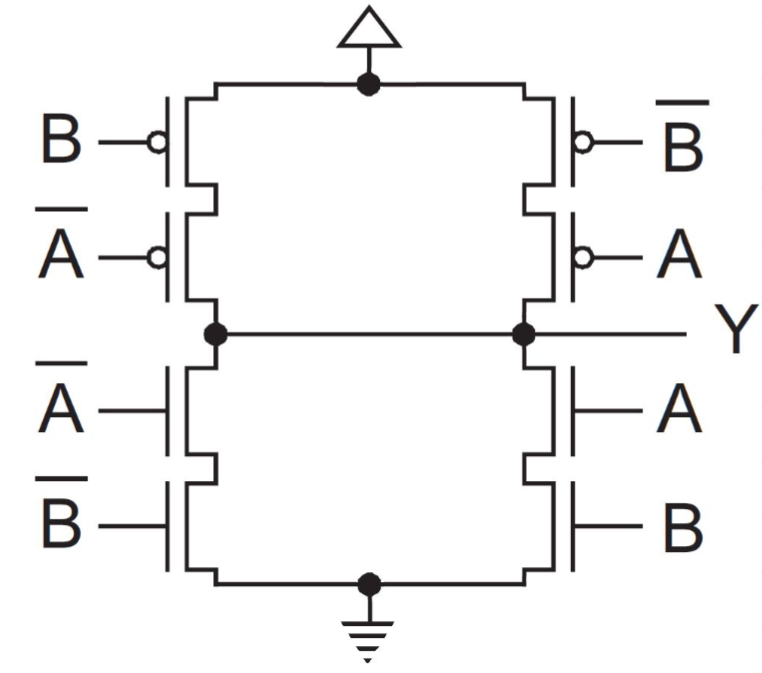
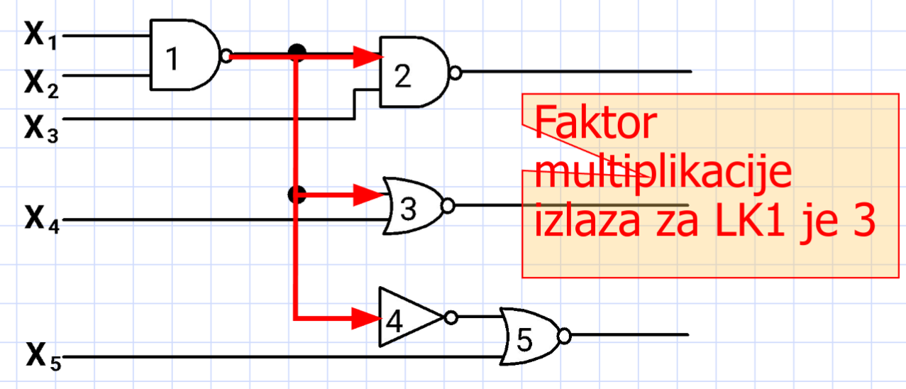
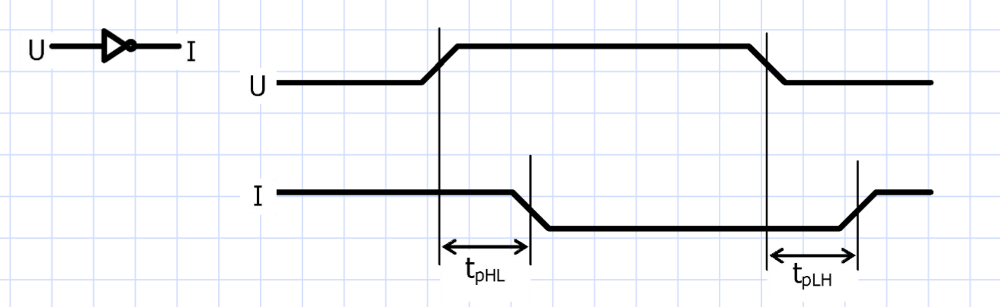
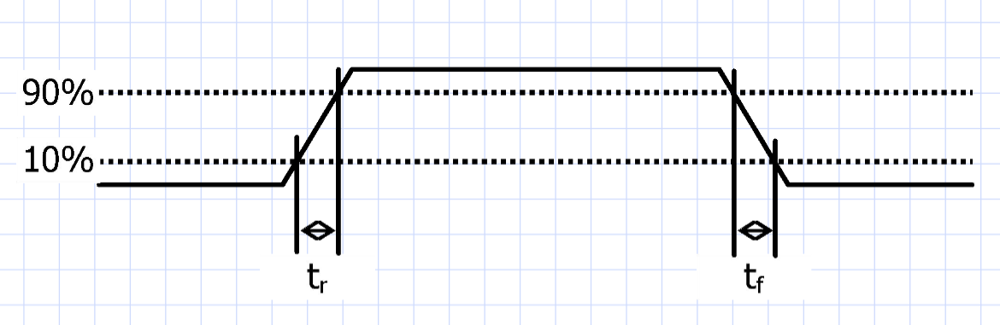
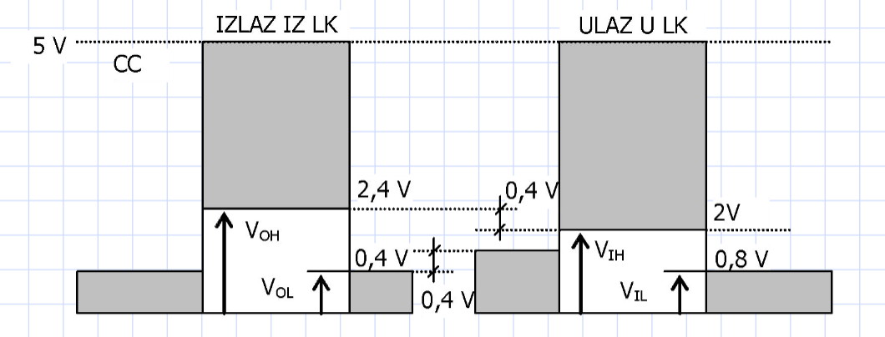
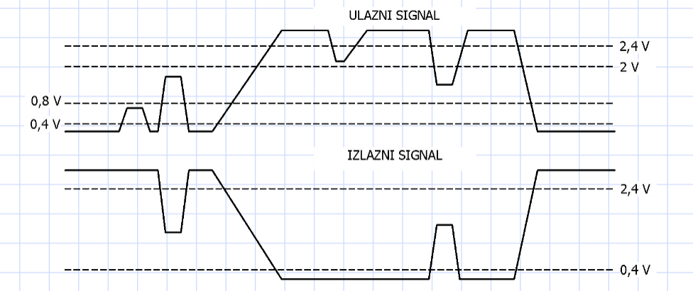

# Realna logička kola

## Uvod u logička kola

- **Bulova algebra** (razvijena od strane Georgea Boole-a 1850. godine) je temelj za rad sa logičkim kolima. Ona pruža osnovu za digitalnu logiku.
- **Realna logička kola** omogućavaju da se pomoću elektronskih komponenti realizuju osnovne **logičke funkcije**, zasnovane na pravilima Bulove algebre.
- Logička kola su elektronski sklopovi koji funkcionišu poput **prekidača** i koriste se u digitalnim sistemima za obradu signala i podataka.

## Vrste logičkih kola

Logička kola se mogu podeliti u dve glavne grupe:

1. **Kombinaciona logička kola**: 
   - Kod ovih kola, izlaz direktno zavisi samo od trenutnog stanja ulaza.
   - Primeri su jednostavne funkcije kao što su AND, OR, NOT, NAND, NOR, XOR.
   - Korišćenje: kada je potrebno odmah obraditi ulazne signale bez pamćenja prethodnih stanja.

2. **Sekvencijalna logička kola**:
   - Kod ovih kola, izlaz zavisi i od trenutnog ulaza i od **prethodnog stanja** kola.
   - Ova kola imaju memorijske elemente (kao flip-flopovi) koji im omogućavaju pamćenje prethodnog stanja.
   - Korišćenje: u uređajima gde se stanje kola mora pamtiti, poput registara ili brojača.

## Logičke familije

Logička kola se dalje grupišu u različite **logičke familije**, u zavisnosti od tehnologije koja je korišćena za njihovu izradu:

- **DRL (Diodno-otpornička logika)**: Koristi diode i otpornike za realizaciju logičkih funkcija.
- **RTL (Otporno-tranzistorska logika)**: Prva tehnologija koja je koristila tranzistore sa otpornicima za realizaciju logičkih funkcija.
- **DTL (Diodno-tranzistorska logika)**: Kombinuje diode i tranzistore, čime se poboljšavaju performanse u odnosu na prethodne logike.
- **TTL (Tranzistor-tranzistorska logika)**: Poboljšava brzinu i pouzdanost tranzistorskih kola, široko korišćena u digitalnim sistemima.
- **ECL (Logika sa emitorskom spregom)**: Koristi posebnu vezu između tranzistora za još veću brzinu rada, koristi se tamo gde su potrebne vrlo brze operacije.
- **MOS (Metal-oksid-poluprovodnik)**: Osnova za digitalne kola sa visokom integracijom, niske potrošnje energije.
- **CMOS (Komplementarni metal-oksid-poluprovodnik)**: Najčešće korišćena logika danas, vrlo efikasna, koristi i P i N MOSFET tranzistore za minimizaciju potrošnje energije.

## Osnovne funkcije logičkih kola

Svaka od ovih logičkih familija realizuje određene osnovne logičke funkcije:

- **RTL**: Realizuje **NILI funkciju** (NOT-AND) koja je korišćena u kompjuteru **Apollo Guidance Computer** iz 1966. godine.
- **DTL**: Realizuje **NI funkciju** (NOT-AND) koja je korišćena u računaru **IBM 1401** iz 1959. godine.
- **TTL**: Realizuje **NI funkciju**, popularna u digitalnim sistemima kompanije **Texas Instruments** iz 1964. godine.
- **ECL**: Realizuje **ILI** i **NILI funkcije** (OR i NOT-AND), korišćene u ranijim IBM sistemima iz 1956. godine.
- **NMOS**: Realizuje **NI** i **I funkcije** (AND), razvijena u **Bell Labs** 1959. godine.
- **CMOS**: Realizuje **NE funkciju** (NOT), razvijena od strane **Fairchild-a** 1963. godine.

## **Koliko tranzistora troši dvoulazno XOR kolo?**

- Na slici se vidi CMOS kolo koje implementira XOR funkciju. Ova realizacija koristi tranzistore za svaki logički uslov (tj. kombinaciju ulaza A i B).
- Gore i dole imamo simetričan raspored P-MOS (gore) i N-MOS (dole) tranzistora.
- Ova vrsta kola koristi 4 P-MOS i 4 N-MOS tranzistora, što znači da za ovu realizaciju dvoulaznog XOR kola u CMOS tehnologiji ukupno troši 8 tranzistora.

## Multiplikacija priključka ulaza i izlaza (Fan-in i Fan-out)

- **Fan-in**: Predstavlja **broj ulaza** logičkog kola. To je broj signala koji mogu istovremeno biti povezani na ulaze logičkog kola, a da kolo i dalje pravilno funkcioniše.
  - Na primer, ako logičko kolo ima fan-in od 3, to znači da može imati 3 ulaza (X₁, X₂, X₃).

- **Fan-out**: Predstavlja **broj izlaza** na koje jedno logičko kolo može biti povezano, a da ne izgubi funkcionalnost. To znači da jedan izlaz logičkog kola može upravljati sa određenim brojem drugih kola bez gubitka signala ili uticaja na performanse.
  - Na slici, fan-out je označen brojem kola koja su povezana na izlaz (X₄, X₅).

- **Faktor multiplikacije izlaza** je broj standardnih opterećenja koja se mogu priključiti na izlaz logičkog kola bez narušavanja njegovog normalnog rada. 
  - U slučaju **TTL kola**, tipičan faktor multiplikacije izlaza (fan-out) je 3, što znači da jedno logičko kolo može kontrolisati do 3 druga kola.

Na slici možemo videti:
- **Kolo LK1** upravlja izlazima sa više kola (X₂, X₃, X₄), što nam daje faktor multiplikacije izlaza 3.

## Kašnjenje signala po logičkom kolu

- **Kašnjenje signala** (engl. **Propagation Delay**) je vreme koje protekne od trenutka kada ulazni signal dostigne određenu vrednost napona do trenutka kada izlazni signal dostigne odgovarajuću vrednost. Drugim rečima, to je vreme potrebno da se signal "proširi" od ulaza do izlaza.

- **tpHL** (High to Low) i **tpLH** (Low to High) su ključni parametri koji definišu kašnjenje signala.
  - **tpHL** je vreme kašnjenja kada signal prelazi sa višeg nivoa (H - High) na niži nivo (L - Low). To znači da ulaz menja svoj signal sa visoke na nisku vrednost, a nakon kašnjenja, izlaz reaguje na tu promenu.
  - **tpLH** je vreme kašnjenja kada signal prelazi sa nižeg nivoa (L - Low) na viši nivo (H - High). To je obrnuta situacija, kada ulazni signal raste, a izlaz kasni za njim.

- Na grafičkom prikazu:
  - **U** je ulazni signal.
  - **I** je izlazni signal.
  - Vremenski intervali **tpHL** i **tpLH** su označeni na dijagramu kao razlike između trenutaka kada ulaz promeni vrednost i kada izlazni signal odgovori na tu promenu.

- Kašnjenje signala može uticati na brzinu rada digitalnih kola. U sistemima gde je potrebna brza obrada signala, ovo kašnjenje mora biti minimizovano da bi sistem bio efikasniji.

## Vreme uspona i opadanja signala

- **Vreme uspona (tr)** i **vreme opadanja (tf)** se odnose na brzinu kojom signal prelazi sa niskog nivoa na visoki nivo, i obrnuto.
  - **Vreme uspona (tr)**: Vreme potrebno da signal poraste od 10% do 90% svoje maksimalne amplitude.
  - **Vreme opadanja (tf)**: Vreme potrebno da signal opadne od 90% do 10% svoje maksimalne amplitude.
  

- Na grafikonu se može videti kako signal raste i opada u odnosu na ove procente. Vreme između ta dva prelaza se meri i označava kao **tr** i **tf**.
  - Ovaj parametar je ključan za dizajniranje brzih digitalnih sistema, jer utiče na brzinu i efikasnost prenosa signala.

## Naponski nivoi

- **Naponski nivoi** definišu maksimalne i minimalne vrednosti koje predstavljaju logičke "1" i "0" u digitalnim kolima, kako na ulazu, tako i na izlazu kola.
- **Ulazni naponi**:
  - **Vih** (Voltage Input High): Minimalna vrednost napona koja se računa kao visoki ulaz.
  - **Vil** (Voltage Input Low): Maksimalna vrednost napona koja se računa kao niski ulaz.
  
- **Izlazni naponi**:
  - **Voh** (Voltage Output High): Minimalna vrednost izlaznog napona koja se računa kao visoki izlaz.
  - **Vol** (Voltage Output Low): Maksimalna vrednost izlaznog napona koja se računa kao niski izlaz.

- Na grafikonu možemo videti kako su naponski nivoi postavljeni za različite ulazne i izlazne napone. Na primer, ulazno kolo može primiti signale od 0,8V do 2,4V, a izlazno kolo može raditi između 0,4V i 5V.

## Imunost na smetnje (Noise Margin)

- **Imunost na smetnje** predstavlja sposobnost logičkog kola da izdrži smetnje u signalu bez promene izlazne vrednosti.
  - Ova karakteristika je važna jer određuje koliko je logičko kolo otporno na smetnje i nepreciznosti u naponskim nivoima koje mogu uzrokovati greške.

- Imunost na smetnje se meri razlikom između minimalnih i maksimalnih vrednosti ulaznog i izlaznog signala.
  - Za nivo "1": Imunost se definiše razlikom između izlaznog visokog nivoa (**Voh**) i minimalnog visokog ulaznog nivoa (**Vih**).
  - Za nivo "0": Imunost se definiše razlikom između minimalnog niskog izlaznog nivoa (**Vol**) i maksimalnog niskog ulaznog nivoa (**Vil**).

- Na grafikonu možemo videti oscilacije ulaznog signala koje su karakterisane smetnjama, i kako ih izlazno kolo filtrira održavajući stabilan signal.
  - **Imunost na smetnje** je ključna za stabilan rad logičkog kola u prisustvu neidealnih uslova, kao što su elektronske smetnje ili fluktuacije napona.

## Druge karakteristike realnih logičkih kola

1. **Brzina rada**:
   - Brzina rada digitalnog kola ili maksimalna radna frekvencija zavisi od vremena uspona i opadanja signala, poznatih kao **tr** (vreme uspona) i **tf** (vreme opadanja), kao i od kašnjenja signala.
   - Što je manje vreme uspona i opadanja, to je kolo brže, što omogućava rad na većim frekvencijama.

2. **Prihvatljiva varijacija napona napajanja**:
   - TTL kola (Transistor-Transistor Logic) tolerišu varijacije napona napajanja do 5%.
   - CMOS kola (Complementary Metal-Oxide Semiconductor) mogu tolerisati veće varijacije napona, i do 300%, što ih čini robusnijim u odnosu na promene u napajanju.

3. **Potrošnja**:
   - Uopšteno, potrošnja kola je proporcionalna vremenu uspona i opadanja signala. Kola koja brže prelaze između logičkih stanja (brže tr i tf) obično troše više energije.

## Podela integrisanih kola na osnovu kompleksnosti

1. **SSI (Small Scale Integration)**:
   - Kola sa malom skalom integracije.
   - Sadrže manje od 10 logičkih kola, obično jednostavne funkcije.

2. **MSI (Medium Scale Integration)**:
   - Kola sa srednjom skalom integracije.
   - Sadrže od 10 do 100 logičkih kola. Omogućavaju realizaciju funkcija poput registara, brojača i dekodera.

3. **LSI (Large Scale Integration)**:
   - Kola sa velikom skalom integracije.
   - Sadrže preko 100 logičkih kola, i koriste se za kompleksne funkcije poput memorija, mikroprocesora i kalkulatora.

4. **VLSI (Very Large Scale Integration)**:
   - Kola sa vrlo velikom skalom integracije.
   - Ova kola sadrže nekoliko hiljada logičkih kola i omogućavaju realizaciju složenih digitalnih sistema, poput računara i složenih čipova.

## Kućišta integrisanih kola

1. **DIL (Dual In Line)**:
   - Dvostrano kućište sa spoljnim izvodima duž obe strane. Maksimalan broj izvoda može biti do 68.

2. **PGA (Pin Grade Array)**:
   - Mreža nizova izvoda (obično oko 120) uređena u kolonama i izdvojena iz kućišta. Ovaj tip kućišta se koristi za povećanje broja konekcija.

3. **LCC (Leadless Chip Carrier)** i **JLCC (J-Leaded Chip Carrier)**:
   - Nosioci kućišta bez izvoda ili sa izvodima duž svih strana kućišta. Ova kućišta su kvadratna i imaju spojeve duž svake strane, pri čemu su spojevi kod JLCC kućišta okrenuti ispod osnove kućišta.

4. **BGA (Ball Grid Array)**:
   - Površinsko kućište sa izvodima izdvojenim u oblik pogodan za površinsku štampu, što omogućava manju veličinu i bolju raspodelu izvoda.

## Vremenske karakteristike u sekvencijalnim mrežama

1. **Vremenski odnosi između signala u sekvencijalnim mrežama**:
   - Grafički se prikazuju preko **vremenskih dijagrama**. Dijagrami pokazuju kako se signali razvijaju tokom vremena, sa leve na desnu stranu.
   - Kod sinhronih sistema, **signali takta** predstavljaju referentne tačke.

2. **Osnovne karakteristike signala takta**:
   - **Perioda takta (T)**: Odnosi se na vreme između dva uzastopna impulsa takta. Frekvencija takta je obrnuto proporcionalna periodi: **f = 1/T**.
   - **Širina impulsa takta (ts)**: Vreme trajanja jednog impulsa takta.

## Vremenske karakteristike u sekvencijalnim mrežama (nastavak)

1. **Kašnjenje memorijskog elementa (tk)**:
   - Predstavlja vremenski interval između promene signala na ulazu i odgovarajuće promene signala na izlazu memorijskog elementa.

2. **Vreme uspostavljanja (tvu)**:
   - Poznato kao **Setup Time**. Ovo je vremenski interval između stabilizacije ulaznog signala i ivice signala takta, koja dovodi do upisa stanja u flip-flop (FF).
   - **Flip-flop** je memorijski element koji skladišti binarne podatke.

3. **Vreme važenja signala takta (tvs)**:
   - Poznato kao **Hold Time**. Vremenski interval između ivice signala takta koja omogućava upis stanja u FF i trenutka kada je ulaz stabilizovan za sledeću promenu.

4. **Vreme kašnjenja prelaza sekvencijalne mreže (ts)**:
   - To je vreme koje protekne između ivice signala takta i stabilizacije novog stanja na izlazu FF.

# Dodatni kataloški parametri sekvencijalnih mreža

1. **Vreme propagacije (tpd)**:
   - Vreme potrebno da kombinacioni izlaz postane ispravan nakon što se na ulaze kola primene ulazni signali.

2. **Vreme takt-izlaz (tco)**:
   - Deo vremena koji protekne nakon ulaska takta na ulaz kola, dok se izlaz ne stabilizuje.

3. **Vreme takt-izlaz kroz logičku matricu (tco2)**:
   - Vreme potrebno da signal prođe kroz logičku matricu i pojavi se na izlazu.

4. **Sistemski takt (tscs)**:
   - Vreme koje se koristi za određivanje maksimalne radne frekvencije sekvencijalnog sistema: **fmax = 1/tscs**.

5. **Vreme uspostavljanja (ts)**:
   - Vreme potrebno da ulazni signal postane stabilan pre dolaska takta.

6. **Vreme zadržavanja (th)**:
   - Vreme u kojem se ulazni signal mora održavati stabilnim nakon što je signal takta prošao.

## Osnovne karakteristike programabilnih mreža

- **Gustina i kapacitet**: Zahtev za povećanjem stepena integracije kako bi se smestio veći broj logičkih kola na jedno integrisano kolo (IK).
  - Gustina se meri brojem logičkih kapija, flip-flopova, i memorijskih lokacija.
  
- **Broj programabilnih izvoda**: Obezbeđuje dovoljan broj izvoda na kućištu kako bi sistem mogao da funkcioniše.

- **Mogućnost programiranja/reprogramiranja u sistemu**: Mreža se može programirati i reprogramirati nakon ugradnje u sistem.

- **Lako korišćenje**: Programabilna mreža omogućava brzo projektovanje i modifikacije, čime se ubrzava razvoj proizvoda i smanjuje potreba za usmeravanjem resursa.

- **Performanse**: Programabilna mreža omogućava rad na visokim frekvencijama, što je ključno za moderne sisteme.