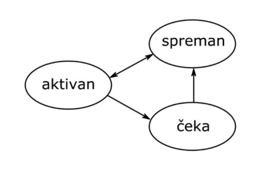
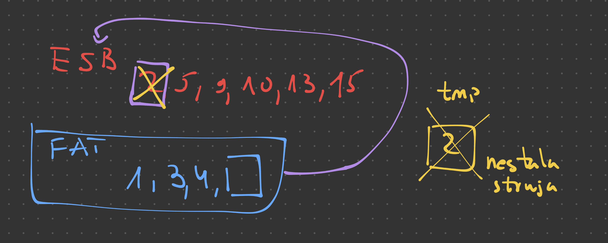
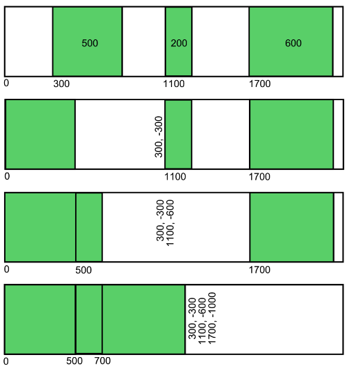

# Operativni Sistemi - Skripta Ispit 2025

## 1. Koje poslove obavlja operativni sistem?

- Glumi prevodioca i omogućuje nam da se isti program pokrene na svim kombinacijama hardvera u računaru
- Raspoređuje resurse između procesa koji se oko njih mogu takmičiti i omogućava sinhronizaciju
- Omogućava bezbednost

1. OS govori procesoru, memoriji i drugim delovima računara kada i šta da rade, da se ne guraju svi odjednom.
2. On čuva i organizuje tvoje fajlove po folderima, zapisuje gde je šta na disku i donosi ti ih kad zatražiš.
3. Raspoređuje memoriju, procesorsko vreme i ulazno-izlazne uređaje tako da sve radi glatko i bez zastoja.

## 2. Šta obuhvata pojam datoteke?

- Sadržaj i deskriptor datoteke

---

- Unutar datoteke je sadržaj – tekst koji pišete, fotografija s mora, vaše beleške (u kojima nikad ne treba da pišete svoje lozinke)
- Oko tog sadržaja stoji kartica s podacima o fajlu, tzv. atributi: koliko bajtova ima, kada je napravljen, ko ga sme pipnuti.
- Operativni sistem čuva te etikete u posebnoj fijoci koju zovemo **deskriptor fajla**.

## 3. Šta se nalazi u deskriptoru datoteke?

- Atributi - koliko bajtova ima, kada je napravljen, ko ga sme pipnuti

## 4. Šta omogućuju datoteke?

1. Trajno čuvanje podataka
2. Pristup podacima

- Glavna uloga fajla je trajno čuvanje podataka: čuva podatke i kad isključite računar. Da biste ih videli, fajl prvo otvorite, zatim iz njega čitate ili u njega pišete, i na kraju ga zatvorite.
- Pristup podacima je čitanje i pisanje (kojima predstoji ot-
  varanje i nakon kojih sledi zatvaranje datoteke).

## 5. Šta obavezno prethodi čitanju i pisanju datoteke?

- Otvaranje datoteke

## 6. Šta sledi iza čitanja i pisanja datoteke?

- Zatvaranje datoteke

- Kad kažete „zatvori fajl“, poručujete OS-u da ste završili sa radom. On tada uredno zapisuje sve promene na disk i oslobađa zauzete resurse
- Ako to preskočite, rizikujete da vam se poslednje izmene izgube ili da drugi programi upadnu i naprave rusvaj.

## 7. Šta obuhvata pojam procesa?

1. Aktivnost procesa
2. Slika procesa
3. Atributi

- Zamisli proces kao lika u video-igri: kada ga “pokreneš”, CPU ga diže iz mrtvih izvršava tvoj program.
- Njegova “slika” su sve instrukcije (seti se tvog omiljenog predmeta - arhitektura računara) i podaci u memoriji plus mali privatni ranac (stek) za trenutne zadatke.
- U deskriptoru procesa OS čuva osnovne podatke o tom liku – da li je budan (njegovo stanje), koliko je važan (prioritet) i koja je to sledeća naredba u redu.

## 8. Šta se nalazi u deskriptoru procesa?

- Stanje i prioritet (i drugi atributi)

## 9. Koja stanja procesa postoje?

- Aktivan, čeka i spreman

## 10. Kada je proces aktivan?

- Svaki proces dobija prioritet – koliko je “važan”.
- Onaj s najvećim brojem se gotovo uvek pokreće prvi. Ako više procesa dele isti prioritet, OS im deli mikro-porcije CPU vremena (kvantume) ili ih prebacuje između sistemskih niti tako da svako dobije “svojih 5 minuta“
- Možemo reći da je proces aktivan dok mu je dodeljeno procesorsko vreme

## 11. Šta je kvantum?

- Zamisli da svi hoće da koriste isti računar, ali može samo jedan po jedan.
- Kvantum je kao mali vremenski interval — svaki proces dobije neki mali deo sekunde da radi svoj deo posla.
- Kad mu istekne vreme, računar kaže: „Stop, sledeći je na redu!“ i pređe na drugi proces.
- To se dešava toliko brzo da izgleda kao da svi rade u isto vreme, iako se zapravo smenjuju.

---

- Kvantum (time slice) je fiksni mali interval procesorskog vremena koji planer dodeli niti/procesu pre nego što ga prekine tajmerski prekid i, po potrebi, prepusti CPU sledećem.
- Kraći kvantum smanjuje latenciju interaktivnih zadataka, ali povećava overhead preključivanja; dug kvantum obrnuto.

## 12. Šta je sistemska nit?

- Koliko jedan računar može da radi stvari u paraleli se zove broj sistemskih niti

---

- Sistemska nit je osnovna jedinica rada procesora odnosno deo koji stvarno izvršava instrukcije.
- Zamisli da procesor ima više „ruku“: svaka ruka je jedna sistemska nit i može nezavisno da radi svoj posao.
- Ako računar ima više takvih niti, može istovremeno da radi više stvari (na primer da pušta muziku i otvara browser).
- Kod nekih jednostavnijih uređaja, kao što su mikrokontroleri, postoji samo jedna takva „ruka“, pa oni mogu raditi samo jednu stvar u datom trenutku.

## 13. Šta se dešava nakon isticanja kvantuma?ž

- Kada istekne kvantum, proces koji je trenutno koristio procesor gubi pravo na dalji rad i planer operativnog sistema ga privremeno zaustavlja.
- Zatim tajmerski prekid obaveštava OS da dodeli procesorsko vreme sledećem spremnom procesu u redu.
- Taj prvi proces prelazi iz stanja „aktivan” u „spreman”, čeka novi red na izvršavanje, a drugi proces dobija svoj kvant i počinje da se izvršava.
- Ovo se ponavlja neprestano, pa izgleda kao da svi programi rade istovremeno.

## 14. Po kom kriteriju se uvek bira aktivan proces?

- Aktivan proces se uvek bira prema prioritetu koji mu dodeli operativni sistem.
- Proces sa najvišim prioritetom dobija procesorsko vreme prvi.
- Ako više procesa ima isti prioritet, planer koristi red čekanja i bira onaj koji najduže čeka (npr. po principu round-robin).

## 15. Koji prelazi su mogući između stanja procesa?

Mogući prelazi između stanja procesa su:

- Iz stanja „spreman” u „aktivan” – kada planer odabere taj proces za izvršavanje.
- Iz stanja „aktivan” u „spreman” – kada istekne kvantum ili proces bude prekinut od strane OS-a.
- Iz stanja „aktivan” u „čeka” – kada proces ne može da nastavi (npr. čeka unos s tastature ili podatke sa diska).
- Iz stanja „čeka” u „spreman” – kada se događaj na koji je čekao dogodi (npr. podaci stignu).

## 16. Koji prelazi nisu mogući između stanja procesa?

- Direktan prelaz iz „čeka” u „aktivan” – proces mora prvo preći u stanje „spreman” pa tek onda može postati aktivan.
- Direktan prelaz iz „spreman” u „čeka” – proces ne može da čeka ako se nije ni pokrenuo.
- Ovi prelazi bi narušili kontrolu planera i doveli do grešaka u radu operativnog sistema.

## 17. Šta omogućuju procesi?

- Procesi omogućuju da računar bolje iskoristi procesor i brže reaguje na događaje iz spoljašnjeg sveta (npr. unos teksta).
- Zahvaljujući procesima, operativni sistem može da privremeno zaustavi aktivan proces koji trenutno ne može da nastavi rad (npr. čeka unos s tastature) i odmah prebaci procesor na neki drugi spreman proces.

## 18. Šta karakteriše sekvencijalni proces?

- Sekvencijalni proces je proces čiji je redosled izvršavanja naredbi tačno određen i poznat još u vreme programiranja.
- On izvršava jednu po jednu naredbu, bez preklapanja ili reagovanja na spoljne događaje dok ne završi trenutni zadatak.
- Zbog toga se ponaša predvidljivo, ali i nefleksibilno odnosno ne može istovremeno da obavlja više poslova (npr. da prima unos i čuva podatke u pozadini).

Spoljni događaji su sve akcije ili signali koji dolaze izvan procesora i mogu da utiču na tok izvršavanja programa.
To su, na primer:

- Pritisak tastera na tastaturi (unos teksta)
- Pomeranje ili klik miša
- Dolazak podataka sa mreže
- Zahtev sa diska (npr. čitanje ili upis fajla)

## 19. Šta karakteriše konkurentni proces?

- Konkurentni proces je proces koji ima više niti koje se mogu izvršavati preklapajući u vremenu.
- To znači da različiti delovi programa rade „istovremeno“ odnosno dok jedna nit čeka (npr. unos korisnika), druga može da obavlja drugi posao (npr. čuvanje podataka).
- Redosled njihovog izvršavanja nije unapred određen, već zavisi od trenutnih uslova u sistemu i događaja koji se dešavaju.
- Takvi procesi omogućavaju brži odziv, efikasnije korišćenje procesora i brži rad programa, jer se više zadataka obavlja gotovo paralelno.

## 20. Šta ima svaka nit konkurentnog procesa?

Svaka nit konkurentnog procesa ima:

- Svoj prioritet – određuje koliko je važna u odnosu na druge niti i koliko često dobija procesorsko vreme.
- Svoje stanje – može biti aktivna, spremna ili u čekanju, nezavisno od ostalih niti u istom procesu.
- Svoj stek – prostor u memoriji u kojem se čuvaju lokalne promenljive i podaci tokom izvršavanja funkcija.
- Svoj deskriptor – strukturu podataka koju koristi operativni sistem za praćenje niti.

Međutim, nit nema svoju sliku (adresni prostor). Sve niti jednog procesa dele zajedničku sliku procesa, što znači da koriste istu memoriju, promenljive i otvorene fajlove.

## 21. Koje su razlike između procesa i niti?

Razlike između procesa i niti:

### Adresni prostor:

- Proces ima svoju sliku (adresni prostor) – potpuno odvojenu memoriju od drugih procesa.
- Niti nemaju svoju sliku – sve niti jednog procesa dele zajedničku memoriju i resurse tog procesa.

### Izolacija:

- Procesi su međusobno izolovani – jedan ne može direktno pristupiti memoriji drugog.
- Niti nisu izolovane – mogu međusobno deliti i menjati iste podatke.

### Performanse:

- Preključivanje između procesa je sporije, jer operativni sistem mora da promeni adresni prostor.
- Preključivanje između niti je brže, jer sve niti dele isti prostor memorije.

### Bezbednost:

- Procesi nude veću bezbednost, jer kvar u jednom ne utiče direktno na druge (npr. svaki Chrome tab je poseban proces).
- Niti nude manju bezbednost, jer greška u jednoj niti može oštetiti ceo proces.

## 22. Koju operaciju uvodi modul za rukovanje procesorom?

Modul za rukovanje procesorom uvodi operaciju preključivanja (context switch).

- Njegov zadatak je da prebaci procesor sa jedne niti na drugu, bilo da se one nalaze u istom procesu ili u različitim procesima.
- Preključivanje između niti istog procesa je brže, jer one dele isti adresni prostor, dok je preključivanje između različitih procesa sporije, pošto operativni sistem mora da promeni i kontekst memorije.

## 23. Po čemu se razlikuju preključivanja između niti istog procesa i preključivanja između niti raznih procesa?

Preključivanje između niti istog procesa i preključivanje između niti različitih procesa razlikuju se po složenosti i brzini:

- Kod niti istog procesa, preključivanje je brže i jednostavnije, jer sve niti dele isti adresni prostor i resurse (memoriju, fajlove, promenljive). Operativni sistem samo menja stek i registre da bi nastavio rad druge niti.
- Kod niti različitih procesa, preključivanje je sporije, zato što OS mora da promeni kontekst celog procesa — uključujući adresni prostor, sistemske tabele i dozvole pristupa.

## 24. Koje operacije uvodi modul za rukovanje kontrolerima?

Modul za rukovanje kontrolerima uvodi operacije ulaza i izlaza (I/O operacije).

Njegov zadatak je da upravlja uređajima povezanima na kontrolere kao što su tastatura, miš, disk, mrežna kartica i drugi.

Kada neki uređaj zatraži operaciju (npr. čitanje sa diska), modul:

- Zaustavlja nit koja je zatražila tu operaciju dok se ona ne završi,
- Rukuje prekidima koji nastaju kada uređaj javi da je operacija gotova,
- Koristi drajvere (posebne programe) koji predstavljaju uređaje na ujednačen i razumljiv način za ostatak sistema.

## 25. Šta je cilj drajvera?

Cilj drajvera je da omogući operativnom sistemu i programima da koriste hardverske uređaje (poput diska, tastature, štampača ili mrežne kartice) na jednostavan i ujednačen način.

- Drajver prevodi opšte komande operativnog sistema u posebne instrukcije koje konkretan uređaj razume.
- Na primer, kada OS zatraži da se nešto upiše na disk, drajver to pretvori u signale koje sam disk može da izvrši.

## 26. Koje operacije uvodi modul za rukovanje radnom memorijom?

Modul za rukovanje radnom memorijom uvodi operacije zauzimanja i oslobađanja memorije.

Njegov zadatak je da:

- Vodi evidenciju o tome koji delovi radne memorije su slobodni, a koji zauzeti,
- Dodeljuje memoriju procesima i nitima kada im je potrebna,
- Oslobađa memoriju kada proces završi rad ili kada mu više nije potrebna,
- Ako sistem koristi virtuelnu memoriju, ovaj modul se brine i o prebacivanju podataka između radne i masovne memorije (npr. RAM ↔ disk).

## 27. Koje operacije poziva modul za rukovanje radnom memorijom kada podržava virtuelnu memoriju?

Kada modul za rukovanje radnom memorijom podržava virtuelnu memoriju, on poziva dodatne operacije koje omogućavaju premeštanje sadržaja između radne (RAM) i masovne memorije (npr. diska).

Konkretno, tada se koriste operacije:

- Učitavanja stranice (page in) – kada se deo programa ili podataka koji trenutno nije u RAM-u mora dovesti iz diska u radnu memoriju.
- Izbacivanja stranice (page out) – kada sistem mora da oslobodi RAM i prebaci manje korišćene delove memorije nazad na disk.

## 28. Koje operacije uvodi modul za rukovanje datotekama?

Modul za rukovanje datotekama uvodi operacije otvaranja i zatvaranja datoteka, kao i operacije čitanja i pisanja njihovog sadržaja.

Njegove glavne uloge su:

- Otvaranje datoteke – uspostavljanje veze između programa i konkretne datoteke na disku.
- Zatvaranje datoteke – pravilno završavanje rada sa datotekom, upisivanje svih promena i oslobađanje resursa.
- Čitanje – učitavanje podataka iz datoteke u radnu memoriju.
- Pisanje – upisivanje podataka iz memorije u datoteku.

## 29. Koje operacije poziva modul za rukovanje datotekama?

Modul za rukovanje datotekama poziva operacije drugih modula operativnog sistema, najčešće sledeće:

- Operacije modula za rukovanje memorijom odnosno kada treba da prebaci sadržaj datoteka između radne (RAM) i masovne memorije (disk).
- Operacije modula za rukovanje kontrolerima odnosno prilikom čitanja i pisanja podataka na fizičke uređaje (npr. diskove ili USB uređaje).

## 30. Šta omogućuju multiprocesing i multithreading?

Multiprocesing i multithreading omogućuju da računar istovremeno obavlja više zadataka i tako efikasnije koristi svoje resurse.

- Multiprocesing znači da računar ima više procesora ili jezgara, pa može zaista paralelno da izvršava više procesa u isto vreme. Na primer, jedan procesor obrađuje video, dok drugi istovremeno pokreće pregledač.
- Multithreading znači da jedan proces može imati više niti koje se izvršavaju preklapajući ili paralelno, što omogućava da program brže reaguje i obavlja više stvari odjednom (npr. jedna nit čuva dokument dok druga obrađuje unos korisnika).

## 31. Šta omogućuju sistemski pozivi?

Sistemski pozivi omogućuju procesima iz korisničkog prostora da komuniciraju sa operativnim sistemom i koriste njegove usluge.

Pošto su korisnički prostor (user space) i sistemski prostor (kernel space) odvojeni radi bezbednosti, procesi ne mogu direktno pristupati hardveru ili sistemskim resursima. Umesto toga, oni koriste sistemske pozive da od operativnog sistema zatraže da obavi neku operaciju u njihovo ime.

Na primer, sistemski pozivi omogućavaju:

- Rad sa datotekama (open, read, write, close),
- Upravljanje procesima (create, execute, terminate),
- Korišćenje uređaja (I/O operacije preko drajvera),
- Upravljanje memorijom i drugim resursima sistema.

## 32. Koje adresne prostore podržava operativni sistem?

Operativni sistem podržava dva adresna prostora:

1. Korisnički prostor (user space) – prostor u kojem rade korisnički procesi i programi.

- Svaki proces ima svoj zaseban korisnički prostor.
- Tu programi izvršavaju svoj kod, ali nemaju direktan pristup hardveru ili kernelu.
- Ako žele da koriste sistemske resurse (npr. fajlove, uređaje), to rade putem sistemskih poziva.

2. Sistemski prostor (kernel space) – prostor koji koristi operativni sistem (jezgro).

- U njemu se nalaze sistemske funkcije, upravljanje memorijom, procesima, datotekama i uređajima.
- Samo jezgro ima pristup ovom prostoru, jer on sadrži kritične podatke i instrukcije.

## 33. Šta karakteriše interpreter komandnog jezika?

Interpreter komandnog jezika (shell) je poseban proces iz korisničkog sloja koji omogućava interaktivno korišćenje operativnog sistema putem komandi.

Shell (ili interpretor komandnog jezika) je program koji omogućava korisniku da komunicira sa operativnim sistemom putem komandi kucanjem teksta ili pokretanjem skripti.

U suštini, shell je sloj između korisnika i jezgra operativnog sistema (kernel-a). Kada korisnik unese komandu (npr. ls, mkdir, cat), shell je tumači i zatim poziva odgovarajuće sistemske pozive kako bi OS izvršio traženu operaciju.

Postoje dve glavne vrste shell-a:

- Konzolni (tekstualni) shell, poput Bash, Zsh, Fish, koji rade u terminalu.
- Grafički shell, koji pruža vizuelno okruženje (npr. Windows Explorer, GNOME Shell).

Karakteriše ga sledeće:

- Prima komande od korisnika, najčešće kroz tastaturu u komandnoj liniji.
- Tumači i izvršava komande tako što za svaku poziva odgovarajuće sistemske operacije operativnog sistema.
- Omogućava pokretanje programa, rad sa datotekama, upravljanje procesima i skriptovanje.
- Radi u korisničkom prostoru, ali koristi sistemske pozive da komunicira sa kernelom.

## 34. Koji nivoi korišćenja operativnog sistema postoje?

1. Korisnički nivo (interaktivni nivo)
   Na ovom nivou se nalazi korisnik koji koristi komande ili grafički interfejs da bi radio sa operativnim sistemom.
   Tu deluje interpreter komandnog jezika (shell), koji prevodi korisničke zahteve u akcije koje OS razume.

2. Programski nivo
   Na ovom nivou rade programi i procesi koji koriste sistemske pozive da zatraže usluge od operativnog sistema (npr. otvaranje fajla, alokacija memorije, kreiranje procesa).
   Programer ne komunicira direktno sa hardverom, već koristi funkcije koje OS obezbeđuje.

3. Sistemski (jezgro) nivo
   To je najnizi nivo, gde radi kernel — srce operativnog sistema.
   On upravlja procesorom, memorijom, uređajima i datotekama, i obavlja sve zahteve koje dolaze iz programskog i korisničkog nivoa.

## 35. Šta je preplitanje?

Preplitanje (engl. interleaving) označava situaciju kada se izvršavanje više procesa ili niti odvija naizmenično, tako da se njihovi delovi (naredbe) mešaju u vremenu.

Drugim rečima, procesor brzo prebacuje izvršavanje sa jedne niti na drugu, tako da izgleda kao da se one izvršavaju istovremeno, iako zapravo rade jedna po jedna — samo veoma brzo.

Preplitanje je karakteristično za konkurentne programe, gde redosled izvršavanja naredbi nije unapred poznat, jer zavisi od trenutnih uslova u sistemu (npr. kada stigne unos, prekid, ili istekne kvantum).

## 36. Da li preplitanje ima slučajan karakter?

Da, imaju slučajan karakter jer unapred nije poznato kada će se desiti prekid i preključivanje. Redosled smenjivanja zavisi od nepredvidivih događaja (prekidi tajmera, dolazak I/O signala, opterećenje, prioriteti), pa može svaki put biti drugačiji što, bez sinhronizacije, vodi greškama poput „pola stare/pola nove koordinate“ kursora ili dvostrukog uzimanja istog bafera.

## 37. Šta izaziva pojavu preplitanja?

Pojavu preplitanja izaziva način rada konkurentnih programa, gde se više niti ili procesa izvršava naizmenično na jednom procesoru.

Konkretno, do preplitanja dolazi zbog:

- Prekida tajmera (istek kvantuma) – procesor prekida jednu nit da bi dao vreme drugoj.
- Spoljnih događaja – npr. dolazak podataka sa tastature, miša ili mreže može izazvati promenu toka izvršavanja.
- Obrađivača prekida – sistem reaguje na hardverske ili softverske prekide u bilo kom trenutku.
- Deljenja resursa – kada više niti pristupa istim podacima ili uređajima bez sinhronizacije.

## 38. Da li preplitanje može uticati na rezultat izvršavanja programa?

Da, preplitanje može uticati na rezultat izvršavanja programa.

Pošto se naredbe različitih niti i procesa izvršavaju naizmenično i nepredvidivo, može se desiti da jedna nit promeni podatke dok ih druga još koristi. To dovodi do neispravnih ili nasumičnih rezultata.

## 39. Šta su deljene promenljive?

Deljene promenljive su one promenljive koje više niti ili procesa može istovremeno da koristi i menja.

One se obično nalaze u zajedničkoj memoriji (npr. u okviru istog procesa kod više niti), pa svaka nit može da im čita i upisuje vrednost.

Zbog toga su deljene promenljive osnovni izvor problema kod konkurentnih programa odnosno ako više niti pristupi istoj promenljivoj u isto vreme bez sinhronizacije, može doći do štetnog preplitanja i neispravnih rezultata.

Zato se nad deljenim promenljivama uvek primenjuju mehanizmi zaštite, poput semafora, mutexa ili monitora, kako bi u datom trenutku samo jedna nit mogla da im pristupi i izmeni ih.

## 40. Šta je preduslov očuvanja konzistentnosti deljenih promenljivih?

Preduslov očuvanja konzistentnosti deljenih promenljivih je da se u svakom trenutku samo jedna nit ili proces može nalaziti u delu programa koji menja te promenljive.

Drugim rečima, pristup deljenim podacima mora biti međusobno isključen odnosno dok jedna nit čita ili menja vrednost, druge moraju da sačekaju.

## 41. Šta su kritične sekcije?

Kritične sekcije su delovi programa (najčešće unutar metoda ili funkcija) u kojima se rukuje deljenim promenljivama i čije je izvršavanje kritično za očuvanje konzistentnosti podataka.

Drugim rečima, kritična sekcija je deo koda koji ne sme istovremeno da izvršava više niti ili procesa, jer bi to moglo da dovede do štetnog preplitanja i pogrešnih rezultata.

## 42. Šta je sinhronizacija?

Sinhronizacija je mehanizam koji usklađuje rad više niti ili procesa kako bi se sprečilo njihovo međusobno ometanje i obezbedilo ispravno izvršavanje programa.

Njena glavna svrha je da niti rade u tačno određenom redosledu kada dele zajedničke resurse, tako da podaci ostanu konzistentni i sistem stabilan.

## 43. Koje vrste sinhronizacije postoje?

1. Obična (međusobna) sinhronizacija

- Koristi se da bi se obezbedila međusobna isključivost u kritičnim sekcijama.
- Njena svrha je da samo jedna nit ili proces u datom trenutku može pristupiti deljenoj promenljivoj ili resursu.
- Ovim se sprečava štetno preplitanje i oštećenje podataka.
- Primeri mehanizama: mutex, semafor, monitor, propusnica.

2. Uslovna sinhronizacija

- Koristi se kada nit treba da sačeka ispunjenje određenog uslova pre nego što nastavi rad.
- Na primer, potrošač čeka dok proizvođač ne popuni bafer, ili proces čeka dok neki resurs ne postane dostupan.
- Obezbeđuje se pomoću uslovnih promenljivih, signalnih mehanizama i čekanja na događaj (wait–signal mehanizmi).

## 44. Šta je atomski region?

Atomski region je deo programa koji se izvršava potpuno neprekidno, bez mogućnosti da ga prekine druga nit ili proces.

U atomskom regionu se operacije nad deljenim promenljivama izvršavaju kao jedna nedeljiva celina, što znači da nijedna druga nit ne može da promeni te podatke dok se region ne završi.

## 45. Šta sužava primenu atomskih regiona?

Primenu atomskih regiona sužavaju sledeći faktori:

- Zabrana prekida usporava sistem – dok je procesor u atomskom regionu, svi prekidi su onemogućeni, pa sistem ne može da reaguje na spoljne događaje (npr. tastaturu, miš, mrežu).
- Trajanje regiona mora biti kratko – ako atomski region traje predugo, to može izazvati kašnjenja i smanjenje odziva sistema.
- Neprimenljivost na višeprocesorskim sistemima – zabrana prekida na jednom procesoru ne sprečava druge procesore da pristupe istoj memoriji, pa atomski regioni ne garantuju potpunu zaštitu u multiprocesorskom okruženju.
- Složenost i ograničenja hardvera – atomski regioni se oslanjaju na hardversku podršku (npr. instrukcije za zabranu prekida ili Compare and Swap), koja nije uvek univerzalna.

## 46. Čemu služi propusnica?

Propusnica (engl. lock ili mutex) služi za ostvarivanje međusobne isključivosti između niti koje pristupaju istoj deljenoj promenljivoj ili kritičnoj sekciji.

Njena uloga je da samo jedna nit u datom trenutku može da uđe u kritičnu sekciju i koristi deljene podatke, dok sve ostale čekaju da se propusnica oslobodi.

Kada nit završi rad u kritičnoj sekciji, ona vraća propusnicu, čime omogućava sledećoj niti da uđe.

## 47. Šta se dešava sa niti koja zatraži, a ne dobije propusnicu?

Kada nit zatraži propusnicu, a ne dobije je, ona ne može da uđe u kritičnu sekciju i zato se privremeno zaustavlja.

U tom trenutku nit prelazi u stanje “čeka”, gde ostaje dok se propusnica ne oslobodi.
Kada druga nit, koja je trenutno drži, napusti kritičnu sekciju i vrati propusnicu, tada operativni sistem budi neku od čekajućih niti i premešta je iz stanja “čeka” u stanje “spremna”.

Ta nit zatim, kada ponovo dobije procesor, dobija propusnicu i ulazi u kritičnu sekciju.

## 48. Šta se dešava kada nit vrati propusnicu?

Kada nit vrati propusnicu, to znači da je završila svoj rad u kritičnoj sekciji i oslobodila pristup deljenim promenljivama.

Tada se dešava sledeće:

- Propusnica postaje slobodna, pa je neka od čekajućih niti (ako ih ima) može preuzeti.
- Operativni sistem zatim bira jednu od niti koje su bile u stanju “čeka” i premešta je u stanje “spremna”.
- Kada ta nit postane aktivna (dobije procesor), ona ulazi u kritičnu sekciju koristeći upravo vraćenu propusnicu.

## 49. Kako se štiti konzistentnost propusnica?

Konzistentnost propusnica se štiti tako što se sprečava da više niti istovremeno menjaju stanje propusnice (slobodna/zauzeta).

1. Softverskim algoritmima

- Primer je Lamportova pekara, gde svaka nit dobija svoj redni broj i čeka dok njen broj ne dođe na red.
- Na taj način se obezbeđuje redosled i međusobna isključivost, ali ovakvi algoritmi mogu biti nepouzdani na modernim procesorima zbog izvršavanja instrukcija van redosleda.

2. Hardverskom podrškom

- Koriste se atomske instrukcije, kao što su Test-and-Set ili Compare-and-Swap (CMPXCHG).
- One omogućavaju da se provera i promena vrednosti propusnice izvrše u jednoj nedeljivoj operaciji, bez mogućnosti prekida.
- Time se garantuje da samo jedna nit može istovremeno menjati stanje propusnice.

## 50. Šta je isključivi region?

Isključivi region je deo programa u kojem je dozvoljeno izvršavanje samo jedne niti ili procesa u datom trenutku.

Njegova svrha je da obezbedi međusobnu isključivost pristupa deljenim promenljivama ili kritičnim sekcijama. Kada jedna nit uđe u isključivi region, sve ostale koje pokušaju da uđu moraju sačekati da se region oslobodi.

## 51. Po čemu se konkurentno programiranje razlikuje od sekvencijalnog?

Konkurentno programiranje se razlikuje od sekvencijalnog po načinu na koji se programi izvršavaju i organizuju:

- U sekvencijalnom programiranju, program se izvršava redom, jedna naredba za drugom, tačno onim redosledom kojim su napisane. U svakom trenutku aktivna je samo jedna nit izvršavanja, pa je tok programa potpuno predvidiv i linearan.

---

- U konkurentnom programiranju, više niti ili procesa se izvršava istovremeno (ili se naizmenično smenjuju na procesoru), pa se njihovi tokovi prepliću u vremenu.
- To omogućava bolje iskorišćenje procesora, brži odziv sistema i mogućnost istovremenog obavljanja više zadataka.
- Međutim, redosled izvršavanja više niti nije unapred poznat, što uvodi nepredvidivost (stohastičnost) i potrebu za sinhronizacijom.

## 52. Koje prednosti ima konkurentna biblioteka u odnosu na konkurentni programski jezik?

1. Jednostavnija primena - omogućava programeru da koristi poznati, postojeći jezik (npr. C++, Java, Python) uz dodatne funkcije za rad sa nitima i sinhronizacijom, bez potrebe za učenjem potpuno novog jezika.
2. Fleksibilnost - programer može sam da bira kada i kako će koristiti konkurentnost, umesto da je to definisano pravilima jezika.
3. Lakša integracija sa postojećim projektima - biblioteka se jednostavno doda u postojeći sekvencijalni program i postepeno se uvodi konkurentno izvršavanje.

## 53. Kako se opisuju niti?

Niti se opisuju pomoću struktura podataka koje operativni sistem koristi da bi pratio njihovo stanje i rad.

Svaka nit ima svoj deskriptor niti, u kojem se nalaze osnovne informacije o njoj, kao što su:

- Identifikator niti (ID) – jedinstveni broj koji razlikuje nit od drugih.
- Stanje – da li je nit aktivna, spremna ili čeka neki događaj.
- Prioritet – određuje koliko je nit važna i koliko često dobija procesorsko vreme.
- Stek – prostor u memoriji u kojem se čuvaju lokalne promenljive i podaci tokom izvršavanja funkcija.
- Programski brojač (PC) – pokazuje na sledeću instrukciju koju nit treba da izvrši.
- Registarski kontekst – sadrži trenutne vrednosti registara procesora dok se nit ne izvršava.

## 54. Kako se kreiraju niti?

Niti se kreiraju pomoću sistemskih operacija koje obezbeđuje operativni sistem ili konkurentna biblioteka.

Prilikom kreiranja događa se sledeće:

- Operativni sistem definiše funkciju ili zadatak koji će nova nit izvršavati.
- Zatim alokira potrebne resurse za tu nit odnosno njen stek, deskriptor i prioritet.
- Nakon toga, nit se stavlja u stanje „spremna”, što znači da čeka da je planer odabere za izvršavanje.

## 55. Kada se zauzima propusnica deljene promenljive?

Propusnica deljene promenljive se zauzima u trenutku kada neka nit želi da uđe u kritičnu sekciju odnosno deo programa gde se rukuje deljenim podacima.

## 56. Kada se oslobađa propusnica deljene promenljive?

Propusnica deljene promenljive se oslobađa odmah nakon izlaska iz kritične sekcije, tj. kada nit završi rad nad deljenim podacima.

## 57. Kakvu ulogu ima klasa mutex?

Klasa mutex (skraćeno od mutual exclusion) ima ulogu da obezbedi međusobnu isključivost pristupa deljenim resursima u konkurentnom programu.

Njena osnovna funkcija je da samo jedna nit u datom trenutku može da pristupi delu koda koji manipuliše zajedničkim podacima (kritičnoj sekciji), dok sve ostale niti moraju da sačekaju da se mutex oslobodi.

## 58. Kakvu ulogu ima klasa unique_lock?

Klasa unique_lock ima ulogu da fleksibilno i bezbedno upravlja zaključavanjem i otključavanjem mutex-a u konkurentnim programima.

## 59. Kakvu ulogu ima klasa condition_variable?

Klasa condition_variable ima ulogu da omogući uslovnu sinhronizaciju između niti, tj. da jedna nit može čekati na određeni uslov, a druga da je obavesti (signalizira) kada je taj uslov ispunjen.

## 60. Koje vrste razmene poruka postoje?

1. Neposredna (direktna) razmena poruka

- Poruka se šalje direktno od pošiljaoca primaocu, bez posrednika.
- Pošiljalac mora tačno znati identitet primaoca (npr. njegovo ime, ID procesa ili adresu).
- Komunikacija je obično sinhrona, što znači da pošiljalac čeka dok primalac ne primi poruku.
- Koristi se u manjim, jednostavnijim sistemima ili kada postoji jasno definisan odnos između procesa.

2. Posredna razmena poruka

- Poruke se razmenjuju putem zajedničkog objekta koji se zove poštansko sanduče (mailbox) ili red poruka (message queue).
- Pošiljalac poruku ubacuje u sanduče, a primalac je uzima kada je spreman.
- Komunikacija može biti asinhrona odnosno pošiljalac ne mora da čeka da primalac primi poruku.
- Ovaj pristup omogućava veću fleksibilnost i nezavisnost između procesa.

## 61. U čemu se razlikuju sinhrona i asinhrona razmena poruka?

1. Sinhrona razmena poruka

- Pošiljalac šalje poruku i čeka dok primalac ne primi i obradi poruku.
- Komunikacija se odvija u realnom vremenu — obe strane moraju biti aktivne u istom trenutku.
- Obezbeđuje tačan redosled komunikacije, ali može dovesti do zastoja ako primalac nije spreman.
- Međusobna isključivost mora biti obezbeđena, jer pošiljalac i primalac u isto vreme koriste isti komunikacioni kanal.
- Primer: klasičan telefonski razgovor - dok jedan govori, drugi mora da sluša.

2. Asinhrona razmena poruka

- Pošiljalac šalje poruku i odmah nastavlja svoj rad, bez čekanja odgovora.
- Poruka se obično čuva u sandučetu (mailboxu) dok primalac ne bude spreman da je preuzme.
- Omogućava veću fleksibilnost i efikasnost, jer pošiljalac i primalac ne moraju raditi istovremeno.
- Međusobna isključivost takođe mora postojati, ali se obično ostvaruje automatski kroz mehanizam reda poruka, pa procesi ne pristupaju istom resursu u isto vreme.
- Primer: slanje e-pošte — poruka se šalje odmah, a primalac je čita kasnije.

## 62. Opisati problem pet filozofa.

Problem pet filozofa je klasičan primer u konkurentnom programiranju koji prikazuje problem sinhronizacije i međusobne isključivosti između više procesa koji dele zajedničke resurse.

Pet filozofa sedi za okruglim stolom. Ispred svakog filozofa nalazi se tanjir s hranom, a između svakog para filozofa nalazi se po jedna viljuška.

Da bi filozof mogao da jede, mora da koristi dve viljuške — onu sa svoje leve i onu sa svoje desne strane.

Svaki filozof neprekidno razmišlja i jede naizmenično:

1. Kada želi da jede, pokušava da uzme obe viljuške.
2. Ako su obe slobodne, filozof jede.
3. Kada završi, odlaže viljuške i ponovo razmišlja.

Ako svi filozofi istovremeno pokušaju da uzmu levu viljušku, niko neće moći da uzme desnu — svi će čekati jedni druge i sistem će upasti u zastoj (deadlock).

Rešenja uključuju uvođenje pravila pristupa resursima — na primer:

- filozof može da uzme obe viljuške samo ako su obe slobodne,
- jedan filozof (npr. poslednji) uzima prvo desnu, a ne levu viljušku,
- ili se koristi poseban konobar (koordinator) koji kontroliše koliko filozofa može istovremeno da jede.

## 63. Kako bi izgledala verzija problema pet filozofa koja bi se realistično mogla sresti tokom razvoja softvera?

Realistična verzija problema pet filozofa u razvoju softvera može se sresti u situacijama kada više procesa ili niti deli ograničen broj resursa, koje svi povremeno moraju koristiti.

Na primer, više servisa koristi ograničen broj konekcija prema bazi podataka. Svaki servis povremeno “razmišlja” (obrada podataka), pa pokušava da “jede” (izvrši upis u bazu). Ako svi istovremeno pokušaju da zauzmu konekcije, može nastati zastoj (deadlock) jer svi čekaju resurs koji je već zauzet.

Suština je ista: potrebno je sinhronizovati pristup deljenim resursima i sprečiti zastoje pravilnim redosledom zauzimanja i oslobađanja resursa.

## 64. Napisati komandu kojom se kompajlira main.cpp u izvršni fajl prg tako da podržava rad sa nitima. Objasniti svaki deo komande.

g++ main.cpp -o prg -pthread

- g++ – poziva GNU C++ kompajler.
- main.cpp – naziv izvornog fajla koji se kompajlira.
- -o prg – određuje ime izlaznog (izvršnog) fajla; ovde će se generisati fajl pod nazivom prg.
- -pthread – omogućava rad sa nitima korišćenjem POSIX Threads (pthreads) biblioteke.

## 65. Šta je mrtva petlja?

Mrtva petlja (deadlock) je stanje u kojem se dve ili više niti (ili procesa) međusobno blokiraju i nijedna ne može da nastavi rad, jer svaka čeka resurs koji je već zauzet od druge.

Do mrtve petlje dolazi kada:

- Svaka nit drži jedan resurs (npr. mutex) i
- Pokušava da zauzme drugi koji je već zaključan od druge niti.
- Pošto niko ne može da dobije ono što čeka, sistem ostaje zaglavljen zauvek.

## 66. Po čemu se živa petlja razlikuje od mrtve petlje?

Živa petlja (livelock) i mrtva petlja (deadlock) su slični problemi u konkurentnom programiranju, ali se razlikuju po tome šta niti rade dok su blokirane.

### Mrtva petlja (deadlock)

- Niti su potpuno blokirane – svaka čeka resurs koji je zauzet od druge.
- Ništa se ne dešava, sistem „stoji“ i ne napreduje.
- Primer: dve niti drže po jedan mutex i svaka čeka da druga oslobodi svoj.

### Živa petlja (livelock)

- Niti nisu blokirane, ali se stalno međusobno reaguju i tako nikada ne završe posao.
- Sistem je „živ“, ali ne napreduje jer se akcije stalno ponavljaju.
- Primer: dve niti pokušavaju da izbegnu konflikt, pa stalno odustaju i ponovo pokušavaju da zauzmu resurs, ali nijedna to ne uspeva.

## 67. Koji uslovi su potrebni za pojavu mrtve petlje?

Za pojavu mrtve petlje (deadlock) moraju biti ispunjena četiri Coffmanova uslova:

1. Međusobna isključivost (Mutual exclusion)

- Resurs u datom trenutku može biti zauzet samo od jedne niti ili procesa.
- Ako ga neko koristi, drugi moraju čekati.

2. Zadrži i čekaj (Hold and wait)

- Nit drži jedan resurs i istovremeno čeka da dobije drugi.

3. Bez preuzimanja (No preemption)

- Resursi se ne mogu nasilno oduzeti od niti; mogu se osloboditi samo kada ih nit sama vrati.

4. Kružno čekanje (Circular wait)

- Postoji ciklus u kojem svaka nit čeka resurs koji drži sledeća (npr. A čeka B, B čeka C, C čeka A).

## 68. Kako se u praksi tretira problem mrtve petlje?

1. Sprečavanje (prevention) - onemogućava se ispunjenje bar jednog od četiri uslova za nastanak mrtve petlje (npr. sprečavanje kružnog čekanja ili dozvola oduzimanja resursa).

2. Izbegavanje (avoidance) - sistem pažljivo dodeljuje resurse tako da nikad ne uđe u opasno stanje koje bi moglo dovesti do mrtve petlje.

3. Otkrivanje i oporavak (detection and recovery) - sistem otkriva da je mrtva petlja nastala i pokušava da je razreši (npr. prekidom nekog procesa).

4. Ignorisanje (ignore) - najčešći pristup; sistem ne proverava mrtve petlje, već se njihovim rešavanjem bavi korisnik ili programer kada se pojave.

## 69. Na čemu se temelji sprečavanje mrtve petlje?

Sprečavanje mrtve petlje se temelji na tome da se onemogući ispunjenje nekog od četiri uslova neophodnih za njen nastanak.

- Prvi uslov (međusobna isključivost) obično se ne može ukloniti jer većina resursa ne može biti deljena.
- Drugi uslov (zadrži i čekaj) može se sprečiti ako proces zauzme sve potrebne resurse unapred, pre nego što počne s radom.
- Treći uslov (bez preuzimanja) se obično ne može ukloniti, jer zauzeti resurs najčešće nije moguće privremeno oduzeti procesu bez narušavanja njegovog rada.
- Četvrti uslov (kružno čekanje) se može sprečiti ako se resursi uvek zauzimaju u unapred definisanom redosledu, čime se onemogućava nastanak ciklusa među procesima.

## 70. Šta karakteriše izbegavanje mrtve petlje?

- Sistem mora imati podatke o maksimalnim mogućim zahtevima procesa za resursima, trenutnom stanju resursa i trenutnim zahtevima koji su postavljeni.
- Novi zahtev za resursom se odobrava samo ako provera pokaže da će i nakon dodele resursa postojati bezbedan redosled zauzimanja i oslobađanja u kojem svi procesi mogu dobiti svoje maksimalne resurse.
- Ako bi zahtev doveo do „opasnog stanja“, sistem ga privremeno odbija dok se ne oslobode resursi.

## 71. Šta karakteriše otkrivanje i oporavak od mrtve petlje?

Otkrivanje i oporavak od mrtve petlje zasnivaju se na tome da sistem dozvoli da mrtva petlja nastane, a zatim pokuša da je otkrije i otkloni.

- Sistem analizira stanje resursa i procesa kako bi otkrio da li postoji proces čijim zahtevima se ne može udovoljiti ni u jednom mogućem redosledu zauzimanja i oslobađanja resursa.
- Takva provera je slična postupku izbegavanja, ali je komplikovana i neefikasna, pa se retko koristi.
- Ako se mrtva petlja otkrije, sistem može da se oporavi tako što:
  - privremeno oduzme resurse nekim procesima, ili
  - uništi (prekine) jedan ili više procesa kako bi se oslobodili resursi.
- Međutim, oduzimanje resursa često nije moguće, a prekidanje procesa nije uvek prihvatljivo rešenje, pa ovaj pristup ima ograničenu praktičnu vrednost.

## 72. Šta karakteriše ignorisanje mrtve petlje?

Ignorisanje mrtve petlje je pristup u kojem operativni sistem ne pokušava da spreči, otkrije ili otkloni mrtvu petlju, već je jednostavno zanemaruje.

- Pretpostavlja se da se mrtve petlje retko javljaju, pa njihovo rešavanje ne opravdava troškove i složenost dodatnih mehanizama.
- Operativni sistem ne proverava da li je došlo do zastoja među procesima.
- Kada do mrtve petlje dođe, korisnik ili programer mora ručno reagovati — npr. prekidom procesa ili ponovnim pokretanjem sistema.
- Ovaj pristup je najčešće primenjen u praksi, posebno u opštim operativnim sistemima (poput Windowsa ili Linuxa), jer je jednostavan i efikasan za većinu situacija.

## 73. Opisati problem čitanja i pisanja.

Problem čitanja i pisanja nastaje kada više niti ili procesa deli zajedničke podatke - neki ih čitaju, a neki menjaju (pišu).

- Čitaoci mogu raditi paralelno jer ne menjaju podatke.
- Pisci moraju imati isključiv pristup, jer menjaju podatke i mogu narušiti konzistentnost ako rade istovremeno s drugima.
- Čitanje i pisanje se zato moraju međusobno isključiti.

## 74. Šta karakteriše semafor?

Semafor je sinhronizacioni mehanizam sa brojačem koji reguliše pristup resursu.

- Sadrži celobrojno stanje (broj dostupnih „dozvola“).
- Dve osnovne operacije:
  - wait (P/stop/acquire) – ako je stanje > 0, dekrementira i prolazi; ako je 0, nit blokira i čeka.
  - signal (V/resume/release) – povećava stanje i budi jednu čekajuću nit.
- Može biti:
  - binarni (0/1) – obezbeđuje međusobnu isključivost (slično mutexu),
  - brojački (generalni) – dozvoljava do N istovremenih pristupa.
  - Raspodeljeni binarni – omogućava koordinisani pristup između više sekcija bez mrtvih petlji.
- Omogućava i uslovnu sinhronizaciju (npr. proizvođač–potrošač), ne čuva vlasništvo nad niti i radi i među procesima.

## 75. Koje operacije su vezane za semafor?

Operacije vezane za semafor su:

- stop() – koristi se kada nit želi da pristupi kritičnoj sekciji.
- Ako je vrednost semafora veća od 0, ona se smanjuje za 1, a nit nastavlja sa radom.
- Ako je vrednost 0, nit se zaustavlja (blokira) dok se semafor ne oslobodi.
- resume() – koristi se kada nit završi rad u kritičnoj sekciji.
  Ova operacija povećava vrednost semafora za 1 i omogućava nastavak rada jednoj od čekajućih niti (ako ih ima).

---

- Ako se semafor inicijalizuje na 1, njegove operacije stop() i resume() funkcionišu kao lock() i unlock() kod mutexa.
- Ako se inicijalizuje na 0, ponašaju se kao wait() i notify_one() iz klase condition_variable.

## 76. Kako semafor obezbeđuje sinhronizaciju međusobne isključivosti?

Međusobna isključivost ostvarena pomoću operacija klase
mutex.

Semafor obezbeđuje sinhronizaciju međusobne isključivosti tako što kontroliše pristup nitima ka zajedničkom resursu pomoću svog internog brojača:

- Kada nit želi da uđe u kritičnu sekciju, poziva stop().
- Ako je vrednost semafora veća od 0, ona se smanjuje za 1 i nit ulazi u kritičnu sekciju.
- Ako je vrednost 0, nit se blokira dok semafor ne bude oslobođen.

- Kada nit napusti kritičnu sekciju, poziva resume(), čime se vrednost semafora povećava za 1, i omogućava nastavak rada sledeće niti koja čeka.

## 77. Kako se obično implementira semafor?

Semafor se obično implementira pomoću:

- Promenljive brojača (state) – čuva broj dozvoljenih pristupa resursu (npr. 0 ili 1 kod binarnog semafora).
- Mehanizma zaključavanja (mutex) – obezbeđuje da promene stanja semafora budu bezbedne, tj. da samo jedna nit u datom trenutku menja vrednost brojača.
- Uslovne promenljive (condition_variable) – koristi se za blokiranje niti koje čekaju dok se semafor ne oslobodi i za njihovo obaveštavanje kada mogu da nastave rad.

## 78. U čemu se semafori razlikuju od isključivih regiona?

Semafori i isključivi regioni oba služe za postizanje međusobne isključivosti i sinhronizaciju u konkurentnom programiranju, ali se razlikuju po načinu rada i primeni:

- Isključivi region je deo koda koji u svakom trenutku može izvršavati samo jedna nit. On se najčešće implementira pomoću mutexa (propusnice) i odnosi se isključivo na međusobnu isključivost pristupa zajedničkom resursu.
- Semafor je fleksibilniji mehanizam - osim što može obezbediti međusobnu isključivost (kada je binarni), on omogućava i uslovnu sinhronizaciju, tj. kontrolisanje redosleda izvršavanja niti i broj istovremenih pristupa (kod brojačkog semafora).

## 79. Koji semafori postoje?

1. Binarni semafor – može imati samo dve vrednosti, 0 (zauzet) i 1 (slobodan).
2. Raspodeljeni binarni semafor – koristi se za uslovnu sinhronizaciju između više kritičnih sekcija.
3. Generalni (brojački) semafor – njegovo stanje može biti veće od 1.

## 80. Šta karakteriše binarni semafor?

Binarni semafor ima samo dve moguće vrednosti: 0 (zauzet) i 1 (slobodan).

Njegova osnovna uloga je da obezbedi međusobnu isključivost između niti, tako da samo jedna nit u datom trenutku može pristupiti zajedničkom resursu ili kritičnoj sekciji.

Karakteristike binarnog semafora:

- Kada je inicijalizovan na 1, ponaša se kao mutex – prva nit koja uđe u kritičnu sekciju smanjuje stanje na 0, čime blokira ostale niti.
- Kada je inicijalizovan na 0, ponaša se kao signalni mehanizam (slično wait() i notify_one() iz condition_variable klase) – koristi se za uslovnu sinhronizaciju između niti.
- Omogućava blokiranje i buđenje niti pomoću operacija:
  - stop() – nit pokušava da uđe u kritičnu sekciju; ako je semafor zauzet (0), čeka.
  - resume() – oslobađa semafor i budi jednu čekajuću nit.

## 81. Šta karakteriše raspodeljeni binarni semafor?

Raspodeljeni binarni semafor koristi se za uslovnu sinhronizaciju između više kritičnih sekcija koje dele isti resurs.

Njegova glavna karakteristika je da se sastoji od više binarnih semafora (svaki može biti 0 ili 1), ali sa ograničenjem da zbir svih njihovih stanja ne sme preći 1.

To znači da u svakom trenutku samo jedna nit može biti aktivna u jednoj od povezanih kritičnih sekcija čak i ako ih ima više.
Kada jedna nit uđe u bilo koju od tih sekcija, ostale moraju čekati dok ona ne završi i ne oslobodi semafor.

## 82. Šta karakteriše generalni semafor?

Generalni semafor (ili brojački semafor) predstavlja napredniji oblik semafora koji omogućava ograničen broj istovremenih pristupa nekom zajedničkom resursu.

- Njegovo stanje (brojač) može imati vrednosti veće od 1.
- Brojač pokazuje koliko je primeraka resursa trenutno slobodno (npr. broj slobodnih bafera, konekcija, niti itd.).
- Kada nit želi da koristi resurs, poziva operaciju stop(), koja smanjuje brojač; ako je brojač 0, nit čeka.
- Kada nit oslobodi resurs, poziva operaciju resume(), koja povećava brojač i eventualno budi čekajuće niti.

## 83. Šta omogućuje raspodeljeni binarni semafor?

Raspodeljeni binarni semafor omogućava uslovnu sinhronizaciju između više kritičnih sekcija koje mogu biti i na različitim računarima u distribuiranom sistemu.

On obezbeđuje da se u datom trenutku samo jedna nit ili proces nalazi u jednoj od povezanih sekcija, jer zbir stanja svih njegovih delova ne može preći 1.

Na taj način sprečava istovremeni pristup zajedničkom resursu i osigurava konzistentnost čak i kada se sinhronizacija odvija između više računara.

## 84. Šta omogućuje binarni semafor?

Binarni semafor omogućava međusobnu isključivost između niti ili procesa koji koriste zajednički resurs.

Njegovo stanje može imati samo dve vrednosti - 0 i 1, što znači da resurs može biti ili zauzet ili slobodan.

## 85. Šta omogućuje generalni semafor?

Generalni semafor omogućava uslovnu sinhronizaciju prilikom rukovanja resursima koji postoje u više primeraka.

Njegovo stanje može imati vrednost veću od 1 i obično predstavlja broj slobodnih resursa.

## 86. Koje su prednosti i mane semafora?

### Prednosti semafora:

- Omogućavaju jednostavnu i efikasnu sinhronizaciju između niti i procesa.
- Mogu se koristiti za međusobnu isključivost (binarni semafor) i uslovnu sinhronizaciju (generalni semafor).
- Fleksibilni su, jer se mogu primeniti i u lokalnim i u distribuiranim sistemima.
- Omogućavaju upravljanje više resursa istovremeno, što ih čini pogodnim za složenije sisteme.

### Mane semafora:

- Složeni su za upotrebu, posebno u većim sistemima sa mnogo niti.
- Mogu dovesti do mrtvih petlji (deadlock) ili zaglavljenih procesa ako se ne koriste pažljivo.
- Teško ih je debagovati zbog nedeterminističkog ponašanja u konkurentnom okruženju.
- Nemaju automatsko upravljanje vlasništvom kao mutexi, pa greške u redosledu stop() i resume() mogu izazvati nepredvidivo ponašanje.

## 87. Šta je lockless programiranje / programiranje bez zaključavanja?

Lockless programiranje (programiranje bez zaključavanja) je pristup konkurentnom programiranju u kojem se izbegava upotreba klasičnih mehanizama zaključavanja kao što su mutexi ili semafori.

Umesto toga, koristi atomske operacije koje omogućavaju da više niti istovremeno pristupa zajedničkim podacima bez potrebe za zaključavanjem.

## 88. Šta je ABA problem?

Zamisli da imaš stack sa elementima A → B → C, i dve niti odnosno Nit 1 i Nit 2, koje rade istovremeno.

- Nit 1 želi da ukloni prvi element (A). Ona pročita da je vrh steka A i da iza njega dolazi B.
- Nit 1 se zaustavlja na trenutak.
- Nit 2 u međuvremenu skine A i B, a zatim ponovo doda A na vrh steka. Stek sada opet izgleda kao A → C.
- Nit 1 se nastavlja, vidi da je i dalje A na vrhu i misli da se ništa nije promenilo - pa obriše A.

Problem: element B je potpuno preskočen i izgubljen, iako spolja deluje kao da se stanje nije menjalo.

## 89. Šta je DWCAS i zašto je potreban?

DWCAS se omogućuje na nivou procesora.

DWCAS (Double Word Compare-And-Swap) je atomska operacija koja istovremeno upoređuje i menja dve vrednosti.

Koristi se u lockless programiranju da bi se izbegao ABA problem, jer omogućava da sistem proveri ne samo da li je vrednost promenljiva ista, već i da li se njena verzija u međuvremenu menjala.

## 90. Šta su mane a šta prednosti programiranja bez zaključavanja lockless programiranja?

Prednosti programiranja bez zaključavanja (lockless):

- Veće performanse: izbegava se usporavanje izazvano čekanjem na mutex ili semafor, što daje brže izvršavanje kod više-nitnih aplikacija.
- Bez blokiranja: niti ne moraju čekati da druge oslobode resurs, pa nema mrtvih petlji (deadlock) ni zaglavljivanja.
- Bolja skalabilnost: omogućava efikasniji rad na sistemima sa mnogo procesorskih jezgara.

Mane lockless programiranja:

- Složena implementacija: vrlo je teško ispravno napisati i razumeti takav kod — greške su često nevidljive i teško se otkrivaju.
- Zavisnost od hardvera: oslanja se na specifične procesorske instrukcije (npr. CAS, DWCAS) koje nisu iste na svim arhitekturama.
- Teško debagovanje: zbog paralelizma i nedeterminističkog ponašanja, problemi se teško ponavljaju i analiziraju.

## 91. Do čega dovodi pokušaj niti da preuzme znak kada je cirkularni bafer drajvera tastature prazan?

Nit se blokira (prelazi u stanje „čeka“) dok ne stigne sledeći znak.

Konkretno, pri praznom baferu character_get() poziva pressed.expect(), pa nit čeka prekid tastature koji ubacuje znak u bafer i signalizira nastavak.

## 92. Šta se desi kada se napuni cirkularni bafer drajvera tastature?

Novi znak se ne ubacuje odsnosno događaj se ignoriše (gubitak znaka).

U prekidu tastature se dodavanje radi samo ako je count < KEYBOARD_BUFFER_SIZE; kad je bafer pun, upis se preskače i ništa se ne signalizira dok potrošač ne oslobodi mesto.

## 93. Šta se desi u obradi prekida diska?

U obradi prekida diska signalizira se da je prenos bloka završen.

Konkretno, unutar funkcije interrupt_handler() klase Disk_driver poziva se metoda ready.signal(), čime se obaveštava nit koja je čekala na završetak prenosa da može da nastavi svoje izvršavanje. Na taj način se završava blokirajuća operacija čitanja ili pisanja bloka sa diska.

## 94. Na šta ukazuje ime datoteke?

Ime datoteke ukazuje (po izboru korisnika) na njen konkretni sadržaj i često na vrstu sadržaja preko ekstenzije (npr. MuzikaZaSlavu2015.mp3 → opis, i da je audio).

## 95. Šta obuhvata rukovanje datotekom?

Rukovanje datotekom obuhvata i rad sa njenim sadržajem i sa njenim imenom.
Izmena imena datoteke može se vršiti u više situacija, najčešće tokom:

- Stvaranja datoteke, kada joj se prvi put dodeljuje ime.
- Editovanja, ako se uređeni sadržaj čuva pod drugim imenom.
- Kompilacije, kada se generišu nove izlazne datoteke (npr. .exe, .obj).
- Kopiranja, kada se pravi nova datoteka sa istim sadržajem, ali drugim imenom.

## 96. Šta karakteriše hijerarhijsku organizaciju datoteka?

Hijerarhijska organizacija datoteka zasniva se na stablastoj strukturi u kojoj su datoteke raspoređene po direktorijumima (folderima) i poddirektorijumima.

Ona omogućava logično grupisanje podataka, jednostavnije pronalaženje i upravljanje datotekama, kao i izolaciju različitih delova sistema.

## 97. Šta važi za apsolutnu putanju?

Apsolutna putanja predstavlja tačnu lokaciju datoteke ili direktorijuma u okviru hijerarhijskog sistema datoteka, počevši od korenskog direktorijuma (root).

Za razliku od relativne putanje, ona je uvek ista, bez obzira iz kog se direktorijuma poziva.

Primeri:

- Linux: /home/marko/documents/tekst.txt
- Windows: C:\Users\Marko\Documents\tekst.txt

## 98. Šta važi za relativnu putanju?

Relativna putanja određuje lokaciju datoteke u odnosu na trenutni radni direktorijum (mesto iz kojeg se korisnik trenutno nalazi u sistemu).

Za razliku od apsolutne, ne počinje korenskim direktorijumom, već opisuje put u odnosu na trenutno mesto u hijerarhiji.

Primeri:

- ../documents/tekst.txt – datoteka tekst.txt nalazi se u direktorijumu documents koji je jedan nivo iznad.

- ./projekti/kod.cpp – datoteka kod.cpp je u poddirektorijumu projekti trenutnog direktorijuma.

## 99. Koja su prava pristupa datotekama?

Prava pristupa datotekama određuju koje operacije korisnik može da izvrši nad određenom datotekom. Ona služe za zaštitu podataka i kontrolu pristupa u višekorisničkim sistemima.

Osnovna prava pristupa su:

- Čitanje (read) – omogućava pregled sadržaja datoteke.
- Pisanje (write) – dozvoljava izmenu ili dopisivanje sadržaja.
- Izvršavanje (execute) – omogućava pokretanje datoteke kao programa.

Prava se obično dodeljuju na tri nivoa:

- vlasniku datoteke,
- grupi korisnika,
- ostalima (svi korisnici sistema).

## 100. Koje kolone ima matrica zaštite?

Matrica zaštite u kontekstu Linux/Unix sistema ima tri kolone prava pristupa, koje određuju ko i na koji način može koristiti datoteku:

- Prva kolona – vlasnik (user): prava koja ima korisnik koji je kreirao datoteku.
- Druga kolona – grupa (group): prava koja imaju svi članovi grupe kojoj datoteka pripada.
- Treća kolona – ostali (others): prava koja imaju svi ostali korisnici sistema.

Svaka od ovih kolona sadrži po tri bita koja predstavljaju:

- r (read) – dozvola za čitanje,
- w (write) – dozvola za pisanje,
- x (execute) – dozvola za izvršavanje.

Na primer, zapis:

> -rw-rw-r-- 1 gordic gordic 0 Oct 19 12:50 MalaNocnaMuzika.txt

znači da:

- vlasnik ima pravo čitanja i pisanja,
- grupa takođe ima pravo čitanja i pisanja,
- ostali korisnici mogu samo čitati datoteku.

## 101. Čemu je jednak broj redova matrice zaštite?

Broj redova matrice zaštite jednak je broju datoteka u sistemu, dok svaka datoteka ima tri kolone prava pristupa, po jednu za svaku kategoriju korisnika.

## 102. Gde se mogu čuvati prava pristupa iz matrice zaštite?

U preseku svakog reda i svake kolone matrice zaštite
navode se prava pristupa datoteci iz posmatranog reda za
korisnike koji pripadaju kategoriji iz posmatrane kolone.

Prava pristupa iz matrice zaštite mogu se čuvati na dva načina, u zavisnosti od pristupa operativnog sistema:

### U listama pristupa uz objekte (datoteke)

- Svaka datoteka ima svoju listu kontrole pristupa (ACL – Access Control List), koja sadrži spisak korisnika i njihovih prava.
- Ovaj pristup je efikasan za sisteme sa mnogo korisnika, jer se prava vezuju direktno za datoteku.
- Primer: u Linuxu, prava se čuvaju u okviru inoda (informacionog čvora) svake datoteke.

## 103. Šta je potrebno za sprečavanje neovlašćenog menjanja matrice zaštite?

Za sprečavanje neovlašćenog menjanja matrice zaštite potrebno je primeniti više slojeva bezbednosnih mehanizama koji obezbeđuju integritet, poverljivost i kontrolu pristupa.

### 1. Kontrola privilegija i princip najmanjih ovlašćenja

Samo administrator sistema (root) i eventualno vlasnik datoteke treba da imaju pravo izmene dozvola u matrici zaštite. Svi ostali korisnici mogu imati isključivo pravo čitanja. Ovim se sprečava da neautorizovani korisnici menjaju prava pristupa nad datotekama.

### 2. Autentifikacija i autorizacija

Pre svake izmene potrebno je proveriti identitet korisnika (npr. putem lozinke, dvofaktorske autentifikacije ili kriptografskih sertifikata) i utvrditi da li ima pravo da izvrši traženu promenu.

### 3. Kriptografska zaštita i verifikacija

Matrica zaštite može biti kriptografski potpisana (digitalni potpis, hash kontrola) kako bi se otkrile neautorizovane izmene. Sistem može periodično proveravati validnost potpisa i integritet podataka.

### 4. Izolacija i zaštita jezgra (kernel-level protection)

Matrica zaštite mora biti smeštena u zaštićenom prostoru jezgra operativnog sistema, gde korisnički procesi nemaju direktan pristup. Sve izmene se obavljaju isključivo kroz verifikovane sistemske pozive.

## 104. Kada korisnici mogu posredno pristupiti spisku lozinki?

Korisnici mogu posredno pristupiti spisku lozinki samo u situacijama kada im sistem, iako ne daje direktan uvid u sam fajl sa lozinkama (npr. /etc/shadow u Unix/Linux sistemima), omogućava da koriste servise ili procese koji iz njega čitaju podatke.

- Kada se korisnik prijavljuje (autentifikuje) — sistem proverava unetu lozinku upoređujući njen hash sa onim u spisku lozinki. Korisnik time ne vidi sadržaj fajla, ali sistem koristi njegove podatke.
- Kada programi sa odgovarajućim privilegijama (root ili sistemski servisi) pozivaju funkcije koje koriste spisak lozinki, kao što su getpwnam() ili login().
- Ako postoji neadekvatno podešena dozvola pristupa, korisnik može posredno čitati podatke kroz ranjive programe koji imaju pristup spisku (npr. preko setuid programa).

## 105. Koju dužnost imaju administratori?

Administratori imaju ključnu dužnost u očuvanju bezbednosti, stabilnosti i integriteta sistema. Njihove odgovornosti obuhvataju:

1. Upravljanje korisnicima i pravima pristupa – administrator mora kontrolisati ko ima pristup sistemu, koje privilegije poseduje i obezbediti da svako ima samo neophodna ovlašćenja (princip najmanjih privilegija).
2. Održavanje integriteta i sigurnosti sistema – redovno ažuriranje softvera, instalacija bezbednosnih zakrpa, nadzor logova i detekcija sumnjivih aktivnosti.
3. Upravljanje podacima i bekapom – obezbeđivanje redovnih rezervnih kopija i planova za oporavak sistema u slučaju kvara ili napada.
4. Praćenje i audit – evidentiranje pristupa i izmena, analiza sistemskih dnevnika i sprovođenje internih bezbednosnih politika.
5. Zaštita osetljivih informacija – sprečavanje neovlašćenog pristupa datotekama poput spiska lozinki ili konfiguracija sistema.

## 106. Šta sadrži numerička oznaka korisnika?

Numerička oznaka korisnika (UID – User Identifier) sadrži jedinstven broj koji identifikuje svakog korisnika u operativnom sistemu. Ona se koristi unutar sistema umesto korisničkog imena, jer je brojna identifikacija brža i sigurnija za upoređivanje.

Sadrži sledeće informacije:

- Jedinstveni identifikator korisnika (UID) – svaka korisnička sesija i fajl povezani su s ovim brojem.
- Primarnu grupu korisnika (GID) – broj koji označava kojoj grupi korisnik pripada.

## 107. Kakvu numeričku oznaku imaju saradnici vlasnika datoteke?

Saradnici vlasnika datoteke imaju istu grupnu numeričku oznaku (GID – Group Identifier) kao i vlasnik datoteke.

To znači da svi korisnici koji pripadaju istoj grupi kao vlasnik dele zajednički GID broj. Sistem koristi taj broj da identifikuje grupu i odredi prava pristupa datotekama namenjena grupi korisnika (npr. rw- za grupu u dozvolama -rw-rw-r--).

## 108. Kakvu numeričku oznaku imaju ostali korisnici?

Ostali korisnici, tj. korisnici koji nisu ni vlasnik datoteke ni deo njegove grupe, imaju sopstvene numeričke oznake (UID i GID) različite od vlasnikovih.

To znači:

- Njihov UID (User ID) se razlikuje od UID-a vlasnika.
- Njihov GID (Group ID) se razlikuje od GID-a grupe kojoj pripada vlasnik.

## 109. Kada se obavlja provera prava pristupa datoteci?

Provera prava pristupa datoteci obavlja se prilikom svakog pokušaja pristupa datoteci, bilo da korisnik želi da je čita, piše, izvršava ili menja njena svojstva.

Operativni sistem tada:

1. Identifikuje korisnika na osnovu njegovog UID-a i GID-a.
2. Upoređuje te oznake sa odgovarajućim vrednostima u atributima datoteke (vlasnik, grupa, ostali).
3. Proverava prava pristupa (r, w, x) u skladu sa operacijom koju korisnik pokušava da izvrši.

Ako korisnik ima potrebna prava, pristup se dozvoljava; u suprotnom, sistem ga odbija i vraća grešku (npr. „Permission denied“).

## 110. Kako se predstavlja sadržaj datoteke?

Sadržaj datoteke se predstavlja kao niz bajtova (ili znakova) koji čine osnovnu jedinicu podataka unutar datoteke.

U operativnim sistemima:

- Datoteka se posmatra kao kontinuirani tok bajtova, bez obzira na to da li sadrži tekst, binarne podatke ili izvršni kod.
- Značenje tih bajtova (tekst, slika, zvuk itd.) određuje program koji datoteku koristi.
- Organizacija sadržaja (npr. redovi, zapisi, blokovi) je logička i zavisi od tipa datoteke, a ne od operativnog sistema.

## 111. Gde se javlja interna fragmentacija?

Interna fragmentacija se javlja u poslednjem zauzetom bloku datoteke kada taj blok nije popunjen do kraja (usled fiksne veličine blokova). Što je blok veći, potencijal interne fragmentacije je veći.

## 112. Šta karakteriše kontinualne datoteke?

Kontinualne datoteke karakteriše to da se njihov sadržaj nalazi u uzastopnim (susednim) blokovima masovne memorije.

Zbog toga su pristupi brzi i jednostavni, jer se redni broj bajta lako preslikava u redni broj bloka.

Međutim, produžavanje ovih datoteka je teško jer zahteva pronalaženje novog niza slobodnih susednih blokova, što često dovodi do eksterne fragmentacije.
Za svaku kontinualnu datoteku vodi se evidencija o početnom bloku i dužini datoteke u njenom deskriptoru.

## 113. Koji oblik evidencije slobodnih blokova masovne memorije je podesan za kontinualne datoteke?

Za kontinualne datoteke je najpodesniji oblik evidencije slobodnih blokova u vidu bit-mape (niza bita).

U takvoj evidenciji svaki bit predstavlja jedan blok i to vrednost 1 označava slobodan, a 0 zauzet blok.

Ovaj pristup omogućava brzo pronalaženje dovoljno dugačkog niza susednih slobodnih blokova, što je neophodno za smeštanje kontinualne datoteke.

## 114. Šta je eksterna fragmentacija?

Eksterna fragmentacija je pojava kod koje su slobodni blokovi masovne memorije razbijeni na kratke, međusobno nepovezane nizove.

Nastaje kada se datoteke više puta stvaraju i brišu u nasumičnom redosledu, pa između zauzetih blokova ostaju mali razmaci.

Zbog toga postaje nemoguće pronaći dovoljno dugačak niz susednih slobodnih blokova, čak i ako ukupno ima dovoljno slobodnog prostora što otežava stvaranje novih kontinualnih datoteka.

## 115. Šta karakteriše rasute datoteke?

Rasute datoteke karakteriše to da im je sadržaj raspoređen u nesusednim blokovima masovne memorije.

Za razliku od kontinualnih, one ne zahtevaju da svi blokovi budu uzastopni, pa je lakše proširiti datoteku i efikasnije iskoristiti slobodan prostor.

Preslikavanje rednih brojeva bajtova u blokove obavlja se pomoću tabele pristupa (FAT), koja sadrži redne brojeve blokova gde se čuvaju delovi datoteke.

Time se izbegava problem eksterne fragmentacije, ali se povećava kompleksnost pristupa i potreba za dodatnim memorijskim prostorom za čuvanje tabele.

## 116. Šta karakteriše tabelu pristupa?

Tabela pristupa (FAT – File Allocation Table) karakteriše se time što beleži redne brojeve blokova u kojima se nalaze delovi jedne rasute datoteke.

Njeni elementi sadrže pokazivače na sledeći blok datoteke, čime omogućava da se bajtovi datoteke čitaju u ispravnom redosledu čak i kada nisu fizički uzastopni na disku.

Tabela pristupa omogućava fleksibilno proširenje datoteka i jednostavno pronalaženje blokova, ali zauzima dodatni prostor i može usporiti pristup podacima jer se mora pretraživati pri svakom čitanju ili pisanju.

## 117. Šta ulazi u sastav tabele pristupa?

Tabela pristupa sadrži niz pokazivača na blokove u kojima se nalaze delovi rasute datoteke.

U njoj se nalazi početni odsečak i, po potrebi, dodatni odsečci koji proširuju tabelu.

Za veće datoteke koristi i blokove indirekcije (prvog i drugog stepena), koji čuvaju pokazivače na druge delove tabele i omogućavaju rad sa velikim količinama podataka.

## 118. Kada rasuta datoteka ne zauzima više prostora na disku od kon tinualne datoteke?

Rasuta datoteka ne zauzima više prostora od kontinualne kada je cela tabela pristupa smeštena u jedan blok i nije potrebno koristiti dodatne blokove za indirekciju.

To se dešava kod malih datoteka, jer tada tabela pristupa zauzima minimalan prostor i nema dodatnih struktura koje bi povećale ukupnu veličinu na disku.

## 119. Koji oblik evidencije slobodnih blokova masovne memorije je podesan za rasute datoteke?

Za rasute datoteke, najpodesniji oblik evidencije slobodnih blokova masovne memorije je lista slobodnih blokova.

U toj listi svaki slobodan blok sadrži pokazivač na sledeći, slično kao kod povezanih listi.

Ovaj pristup je efikasan jer omogućava lako dodavanje i oslobađanje blokova tokom rada sa rasutim datotekama, koje ne zahtevaju da slobodni blokovi budu susedni u memoriji.

## 120. Kada dolazi do gubitka blokova prilikom produženja rasute datoteke?

Do gubitka blokova tokom produženja rasute datoteke dolazi zbog narušavanja konzistentnosti između dva važna podatka:

1. Evidencije slobodnih blokova (koji blokovi su slobodni na disku), i
2. Tabele pristupa datoteke (koji blokovi pripadaju datoteci).

Konkretno, kada sistem treba da produži datoteku, on uzme jedan slobodan blok iz evidencije slobodnih blokova i doda ga u tabelu pristupa datoteke.

Ako se u tom trenutku desi prekid (npr. nestanak struje) nakon što je blok izbrisan iz evidencije slobodnih blokova, ali pre nego što je upisan u tabelu pristupa, taj blok se izgubi.

To znači da ga više nema ni u listi slobodnih blokova, ni u tabeli neke datoteke — on fizički postoji na disku, ali mu se ne može pristupiti, pa se prostor trajno gubi dok se sistem ne popravi alatima poput fsck.

## 121. Kada dolazi do višestrukog nezavisnog korišćenje istog bloka prilikom produženja rasute datoteke?

Do višestrukog nezavisnog korišćenja istog bloka prilikom produženja rasute datoteke dolazi kada se dogodi suprotan problem od gubitka blokova odnosno kada se promeni tabela pristupa, ali se ta promena upiše na disk, dok evidencija slobodnih blokova ostane neizmenjena.

To znači da blok koji je već dodat u datoteku i sada sadrži njene podatke, i dalje stoji označen kao slobodan u evidenciji.

Zbog toga operativni sistem kasnije može dodeliti isti blok nekoj drugoj datoteci, ne znajući da je već zauzet.

Rezultat je narušavanje konzistentnosti sistema datoteka — isti fizički blok na disku koristi više datoteka, što može izazvati oštećenje njihovog sadržaja i gubitak podataka.

## 122. Kada pregled izmena ukazuje da je sistem datoteka u konzistentnom stanju?

Pregled izmena ukazuje da je sistem datoteka u konzistentnom stanju kada su svi podaci o alokaciji blokova međusobno usklađeni i nema gubitka ni višestrukog korišćenja blokova.

## 123. Kako se ubrzava pristup datoteci?

Pristup datoteci se ubrzava korišćenjem pomoćnih struktura i keširanja koje smanjuju broj fizičkih pristupa disku. Najčešći načini su:

- Indeksiranje – podaci se organizuju pomoću indeksa (npr. tabela koja sadrži adrese blokova), što omogućava brzo pronalaženje željenog dela datoteke bez sekvencijalnog pretraživanja.
- Keš memorija (buffer cache) – često korišćeni delovi datoteka se privremeno čuvaju u glavnoj memoriji, pa se ponovni pristupi vrše mnogo brže jer se izbegava čitanje sa diska.
- Prefetching (predučitavanje) – sistem predviđa koji će blokovi uskoro biti potrebni i učitava ih unapred.

## 124. Od čega zavisi veličina bloka?

Veličina bloka zavisi od kompromisa između brzine pristupa i efikasnosti iskorišćenja memorije. Konkretno:

- Veći blokovi ubrzavaju prenos podataka jer se u jednoj operaciji čita ili piše više bajtova, pa je manji broj I/O operacija potreban za obradu velike datoteke.
- Manji blokovi smanjuju internu fragmentaciju, jer se manje prostora gubi u delimično popunjenim blokovima, što je pogodno za mnogo malih datoteka.
- Izbor veličine bloka zavisi od vrste sistema datoteka, vrste podataka (mnogi mali fajlovi ili nekoliko velikih), kao i performansi uređaja.

## 125. Šta sadrži deskriptor kontinualne datoteke?

Deskriptor datoteke sadrži sve ključne informacije potrebne za upravljanje datotekom i kontrolu pristupa.
Konkretno, obuhvata:

- Atribute za preslikavanje bajtova u blokove – omogućavaju pronalaženje fizičkih blokova koji čine sadržaj datoteke.
- Numeričku oznaku vlasnika (UID) – identifikuje korisnika koji poseduje datoteku.
- Prava pristupa – određuju dozvole za vlasnika, grupu saradnika i ostale korisnike (čitanje, pisanje, izvršavanje).
- Status zaključavanja – pokazuje da li je datoteka trenutno zaključana za upis ili izmene.
- SUID (Set User ID) – označava da proces pokrenut iz te izvršne datoteke privremeno preuzima identitet vlasnika datoteke (radi pristupa njegovim privilegijama).
- Datum poslednje izmene – čuva informaciju o vremenu kada je datoteka poslednji put izmenjena.

## 126. Kako se rešava problem eksterne fragmentacije?

Defregmentacijom.

Problem eksterne fragmentacije se može rešiti sabijanjem (compaction) datoteka, tako da svi slobodni blokovi budu potisnuti iza datoteka i da tako obrazuju niz susednih blokova. Mana ovog postupka je njegova dugotrajnost

## 127. Kako se ublažava problem produženja kontinualne datoteke?

Problem produženja kontinualne datoteke ublažava se tako što se dozvoli da datoteka bude sastavljena od više kontinualnih delova.

Na taj način se svaka sekvenca blokova i dalje čuva u neprekidnom nizu, ali se celokupna datoteka može proširivati dodavanjem novih segmenata kada u nastavku nema dovoljno slobodnog prostora.

Ovim pristupom se izbegava potpuno premeštanje datoteke i značajno smanjuje fragmentacija.

## 128. Šta sadrži deskriptor rasute datoteke?

Deskriptor rasute datoteke sadrži detaljne informacije potrebne za lociranje i organizaciju svih blokova koji čine datoteku.

On obuhvata:

- početni odsečak tabele pristupa, gde su navedene adrese (pokazivači) prvih blokova datoteke,
- redni broj prvog dodatnog odsečka, koji sadrži nastavak tabele pristupa ako početni odsečak nije dovoljan,
- redni broj bloka prvog stepena indirekcije, koji ukazuje na blok sa pokazivačima na dodatne blokove podataka,
- redni broj bloka drugog stepena indirekcije, koji omogućava adresiranje još većeg broja blokova kroz višestepenu strukturu,
- dužinu datoteke, radi određivanja koliko je blokova zauzeto i koliko je poslednji blok popunjen.

## 129. Šta je imenik?

Imenik je posebna sistemska datoteka koja služi za organizaciju i povezivanje datoteka u hijerarhijskoj strukturi sistema datoteka.

On sadrži tabelu u kojoj se za svaku datoteku ili podimenik nalaze:

- ime (naziv datoteke ili imenika),
- redni broj deskriptora (inode) koji jednoznačno identifikuje tu datoteku.

## 130. Šta karakteriše specijalne datoteke?

Specijalne datoteke predstavljaju interfejs između operativnog sistema i uređaja, a ne stvarne datoteke sa podacima. One omogućavaju da se ulazno/izlazne operacije sa uređajima obavljaju kao da se radi sa običnim datotekama, čime se ujednačava pristup hardveru.

Postoje dve osnovne vrste:

- karakterske (character) datoteke – prenose podatke bajt po bajt (npr. tastatura, serijski port, terminal),
- blokovske (block) datoteke – razmenjuju podatke u blokovima (npr. diskovi, USB uređaji).

## 131. Šta sadrži deskriptor specijalne datoteke?

Deskriptor specijalne datoteke ne sadrži informacije o korisničkim podacima, već o uređaju kojim ta datoteka upravlja.

U njemu se nalaze sledeći elementi:

- vrsta uređaja (karakterski ili blokovski),
- glavni (major) broj uređaja – identifikuje odgovarajući drajver koji upravlja uređajem,
- sporedni (minor) broj uređaja – označava konkretan uređaj kojim taj drajver upravlja (npr. konkretan disk ili particiju),
- prava pristupa (ko može čitati ili pisati),
- eventualno informacije o stanju uređaja (npr. zauzetost, greške).

## 132. Šta omogućuju blokovske specijalne datoteke?

Blokovske specijalne datoteke omogućuju pristup uređajima koji razmenjuju podatke u blokovima fiksne veličine, kao što su tvrdi diskovi, SSD-ovi, USB memorije ili CD/DVD uređaj

- Omogućuju slučajan (random) pristup – proces može čitati ili pisati bilo koji blok direktno, bez prolaska kroz prethodne.
- Prenos podataka se obavlja po blokovima, što povećava efikasnost pri radu sa velikim količinama podataka.

## 133. Šta omogućuje rukovanje particijama?

Rukovanje particijama omogućuje operativnom sistemu da fizički disk podeli na više logičkih jedinica (particija), ali i da spaja više particija sa različitih fizičkih diskova u jednu logičku celinu.

Ovo omogućava:

- formiranje logičkih disk jedinica koje mogu obuhvatati više particija na raznim fizičkim diskovima, čime se povećava fleksibilnost i iskorišćenost prostora,
- organizaciju podataka prema nameni (npr. sistemske, korisničke, rezervne particije),
- bolju zaštitu i izolaciju podataka, jer kvar jedne particije ne utiče na druge,
- jednostavnije održavanje i upravljanje prostorom, kao i mogućnost kombinovanja više uređaja u jedan logički disk (npr. pomoću LVM-a – Logical Volume Manager).

## 134. Kakav može biti logički adresni prostor?

Logički adresni prostor može biti:

- Kontinualan – jedan neprekidan niz adresa.
- Segmentirani – podeljen na segmente različite dužine (kod, podaci, stek).
- Stranični (paged) – podeljen na stranice iste veličine.
- Stranično-segmentirani – segmenti postoje, a svaki segment je dalje podeljen na stranice.

## 135. Šta karakteriše kontinualni logički adresni prostor?

Kontinualni logički adresni prostor se sastoji od niza uzastopnih logičkih adresa koje počinju od nule.

Svaka logička adresa se prevodi u fizičku tako što se sabira sa baznom adresom.

Proces ima svoju graničnu adresu, kojom se određuje njegov kraj u memoriji.
Ako proces pokuša da pristupi adresi većoj od granične, nastaje izuzetak (greška).

Koristi se kada veličina procesa može da stane u fizičku memoriju i ima jednostavno preslikavanje.

## 136. Šta karakteriše segmentirani logički adresni prostor?

Segmentirani logički adresni prostor se sastoji od više segmenata, pri čemu svaki segment ima niz uzastopnih logičkih adresa.

Logička adresa se deli na broj segmenta i unutrašnju adresu u segmentu.

Svaki segment ima svoju baznu i graničnu adresu, jer je kontinualan.

Omogućava odvojeno rukovanje kodom, podacima i stekom i deljenje segmenata između procesa.

## 137. Šta karakteriše stranični logički adresni prostor?

Stranični logički adresni prostor se sastoji od niza uzastopnih logičkih adresa podeljenih na stranice iste veličine.

Svaka logička adresa ima dva dela — broj stranice (gde se nalazi) i unutrašnju adresu (tačno mesto u stranici).

Svaka stranica je kontinualna u memoriji, pa se lako prevodi u fizičku adresu pomoću tabele stranica.

## 138. Šta karakteriše stranično segmentirani logički adresni prostor?

Stranično segmentirani logički adresni prostor kombinuje segmentaciju i straničenje.

Svaki segment ima svoj virtuelni adresni prostor podeljen na stranice iste veličine.

Stranice se čuvaju na masovnoj memoriji, a u RAM se prebacuju samo one koje su trenutno potrebne.

Omogućava deljenje segmenata, dinamičko proširivanje (npr. steka ili promenljivih) i efikasno korišćenje memorije.

Koristi se i za memorijski preslikane datoteke (memory-mapped files).

## 139. Šta karakteriše translacione podatke?

Translacione podatke koristi MMU (Memory Management Unit) – deo procesora koji prevodi logičke adrese u fizičke adrese.

Oni mogu sadržati baznu i graničnu adresu, tabelu segmenata, tabelu stranica ili obe.

Operativni sistem ih priprema kada se proces stvara i menja pri preključivanju procesa.

Omogućavaju da svaki proces ima svoj izdvojeni logički prostor i da bude zaštićen od drugih procesa.

## 140. Šta karakteriše translaciju logičkih adresa kontinualnog logičkog adresnog prostora u fizičke?

Translacija logičkih adresa kontinualnog logičkog adresnog prostora funkcioniše jednostavno:

- Svaka logička adresa se sabira sa baznom adresom da bi se dobila fizička adresa u memoriji.
- MMU (Memory Management Unit) proverava da li je logička adresa manja od granične adrese – ako nije, javlja se greška (izuzetak).
- Bazna adresa određuje početak procesa u fizičkoj memoriji, a granična adresa njegov kraj.
- Ovaj način prevoda je brz i jednostavan, ali proces mora biti smešten u jedan neprekidan deo memorije.

## 141. Šta karakteriše segmentaciju?

- Segmentacija deli program na logičke celine kao što su kod, podaci i stek.
- Svaka celina se čuva u posebnom segmentu koji ima svoju baznu i graničnu adresu.
- Omogućava da se segmenti dele između procesa (npr. zajednički kod) i da se pojedinačno proširuju.
- Pruža bolju organizaciju i zaštitu memorije, ali može izazvati eksternu fragmentaciju.

## 142. Šta sadrže elementi tabele stranica?

Elementi tabele stranica sadrže:

- Baznu adresu fizičke stranice – pokazuje gde se nalazi kopija virtuelne stranice u RAM-u.
- Bit prisustva – označava da li je stranica trenutno u fizičkoj memoriji.
- Bit referenciranja – pokazuje da li je stranica nedavno korišćena.
- Bit izmene (dirty bit) – pokazuje da li je stranica menjana od poslednjeg upisa na disk.

## 143. Šta karakteriše virtuelni adresni prostor?

Virtuelni adresni prostor je deo memorije koji proces “vidi” kao svoju, iako fizički može biti raspoređen na više mesta.

Omogućava da svaki proces ima svoj zaseban prostor adresa, nezavisan od drugih.

Sadrži virtuelne adrese koje MMU prevodi u fizičke pomoću tabele stranica.
Zahvaljujući tome, u RAM-u se drže samo potrebni delovi programa, a ostalo se čuva na disku.

To omogućava pokretanje većih programa nego što ima fizičke memorije.

## 144. Po kom principu se prebacuju kopije virtuelnih stranica?

Kopije virtuelnih stranica se prebacuju po principu zahteva (demand paging).

To znači da se stranica učitava u fizičku memoriju samo kada je proces zatraži.

Ako stranica nije prisutna, nastaje page fault, pa operativni sistem prebacuje potrebnu stranicu sa diska u RAM.

Ovim se štedi memorija jer se učitavaju samo trenutno potrebne stranice, a ne ceo program odjednom.

## 145. Šta je logički adresni prostor koji se koristi isključivo na skoro svim modernim računarskim arhitekturama, naročito na x86_64 i ARM. Zašto?

To je stranični (virtuelni) logički adresni prostor.

Koristi se jer omogućava virtuelnu memoriju, efikasno korišćenje RAM-a i izolaciju procesa.

Zahvaljujući straničenju, sistem može da pokreće više programa istovremeno, iako fizičke memorije nema dovoljno.

Takođe, štiti sistem od grešaka i napada, jer svaki proces vidi samo svoj deo memorije.

Zbog toga je stranični logički adresni prostor standard na x86_64, ARM i drugim modernim arhitekturama.

## 146. Šta karakteriše straničnu segmentaciju?

Stranična segmentacija kombinuje segmentaciju i straničenje.

Svaki segment ima svoj virtuelni adresni prostor podeljen na stranice iste veličine.

U RAM-u se drže samo stranice koje su trenutno potrebne, dok ostale ostaju na disku.

Omogućava dinamičko proširivanje segmenata (npr. steka ili promenljivih) i deljenje segmenata između procesa.

Koristi se i za memorijski preslikane datoteke (memory-mapped files) radi bržeg pristupa podacima.

## 147. Kako se deli fizička radna memorija?

Fizička radna memorija se deli na dva dela:

- Deo koji zauzima operativni sistem – obično na početku i kraju memorije (tu su sistemske promenljive, tabele, drajveri).
- Slobodan deo memorije – koristi se za procese i njihove podatke.

U sistemima sa virtuelnom memorijom, donji deo virtuelnog prostora pripada korisničkim procesima, a gornji deo je rezervisan za operativni sistem.

## 148. Kako se deli virtuelni adresni prostor?

Virtuelni adresni prostor se deli na dva dela:

- Korisnički deo – donji deo prostora, dostupan programima i procesima korisnika.
- Sistemski deo – gornji deo prostora, rezervisan za operativni sistem i njegove funkcije.

Ova podela omogućava zaštitu sistema, jer korisnički procesi ne mogu direktno pristupati sistemskim delovima memorije.

## 149. U kom obliku može biti evidencija slobodne fizičke memorije?

Evidencija slobodne fizičke memorije može biti u nekoliko oblika:

- Niz bita (bit mapa) – svaki bit pokazuje da li je određeni deo memorije slobodan (1) ili zauzet (0).
- Lista slobodnih odsečaka – čuva adrese i dužine slobodnih delova memorije.
- Sistem “buddy” ili “quick fit” – memorija se deli na blokove veličine stepena broja 2 radi lakšeg zauzimanja i oslobađanja.

## 150. Kod kog adresnog prostora se javlja eksterna fragmentacija?

Eksterna fragmentacija se javlja kod kontinualnog i segmentiranog logičkog adresnog prostora.

Nastaje kada se tokom zauzimanja i oslobađanja memorije pojave mali razbacani slobodni delovi, pa nema dovoljno velikog neprekidnog prostora za novi proces.

Kod straničnog adresnog prostora se to ne dešava, jer su sve stranice iste veličine.

## 151. Kako se nazivaju skupovi fizičkih stranica, koji se dodeljuju pro cesima?

Skupovi fizičkih stranica koji se dodeljuju procesima nazivaju se radni skupovi (working sets).

Radni skup sadrži stranice koje su trenutno potrebne procesu za njegovo normalno izvršavanje.

Ako radni skup ne može da stane u memoriju, dolazi do usporavanja i čestih straničnih prekida (trashing).

## 152. Kada treba proširiti skup fizičkih stranica procesa?

Skup fizičkih stranica procesa treba proširiti kada se učestanost straničnih prekida poveća iznad dozvoljene granice.

To znači da procesu nedostaje memorije i da često traži nove stranice sa diska.

Proširenjem skupa stranica, proces dobija više prostora u RAM-u, pa se smanjuje broj straničnih prekida i ubrzava rad.

## 153. Kada treba smanjiti skup fizičkih stranica procesa?

Skup fizičkih stranica procesa treba smanjiti kada se učestanost straničnih prekida spusti ispod donje granice.

To znači da proces koristi manje stranica nego što mu je dodeljeno.

Smanjenjem skupa oslobađa se memorija koja se može dodeliti drugim procesima kojima je potrebnija.

## 154. Kada ne treba menjati veličinu skupa fizičkih stranica procesa?

Veličinu skupa fizičkih stranica procesa ne treba menjati kada je učestanost straničnih prekida između gornje i donje granice.

Tada proces ima dovoljno memorije za svoj rad, pa dodavanje ili oduzimanje stranica ne bi donelo poboljšanje performansi.

## 155. Koji pristupi oslobađanja fizičkih stranica obezbeđuju smanjenje učestanosti straničnih prekida nakon povećanja broja fizičkih stranica procesa?

Pristupi koji obezbeđuju smanjenje učestanosti straničnih prekida nakon povećanja broja fizičkih stranica su:

- NRU (Not Recently Used) – oslobađa stranice koje dugo nisu korišćene.
- LRU (Least Recently Used) – uklanja stranicu koja je najduže nekorišćena.
- NFU (Not Frequently Used / aging) – vodi evidenciju o učestalosti korišćenja stranica kroz vreme.

## 156. Koji pristupi oslobađanja fizičkih stranica koriste bit referenciranja?

Oslobađanje fizičkih stranica može se zasnivati na korišćenju bita referenciranja i bita izmene.

U ovom pristupu se traži stranica koja nije korišćena u prethodnom periodu — to je princip NRU (Not Recently Used) algoritma.

Za svaku stranicu posmatra se dvobitni broj: značajniji bit predstavlja bit referenciranja, a manje značajan bit izmene (koje postavlja MMU).

Na osnovu vrednosti tih bitova, sistem određuje koje stranice su najređe korišćene i njih oslobađa prve.

## 157. Koji pristupi oslobađanja fizičkih stranica koriste bit izmene?

Pristupi koji koriste bit izmene (dirty bit) su:

NRU (Not Recently Used) – koristi kombinaciju bita referenciranja i bita izmene za izbor stranice koja se dugo nije koristila.

## 158. Šta karakteriše tipične ciljeve raspoređivanja?

Tipične ciljeve raspoređivanja karakteriše želja da se procesorsko vreme koristi što bolje i da sistem radi brzo i pravedno.

Glavni ciljevi su:

- Povećanje iskorišćenja procesora – da procesor ne bude neaktivan.
- Ravnomerna raspodela procesorskog vremena između svih procesa i korisnika.
- Kratko vreme odziva – da korisnik brzo vidi rezultat svoje akcije.
- Obezbeđivanje kvaliteta usluge (QoS) – na primer, da multimedijalne aplikacije dobiju dovoljno procesorskog vremena za stabilan zvuk i video.

## 159. Šta je cilj raspoređivanja za neinteraktivno korišćenje računara?

Cilj raspoređivanja za neinteraktivno korišćenje računara je povećanje iskorišćenja procesorskog vremena.

To znači da procesor što manje vremena bude neaktivan.

Ovaj cilj se postiže tako što se preključivanje između procesa vrši samo kada je neophodno — na primer, kada proces završi rad ili čeka neki resurs.

## 160. Šta je cilj raspoređivanja za interaktivno korišćenje računara?

Cilj raspoređivanja za interaktivno korišćenje računara je da se obezbedi ravnomerna raspodela procesorskog vremena između svih aktivnih procesa i brz odziv na korisničke akcije.

To se postiže kružnim raspoređivanjem (round robin), gde svaki proces dobija jednak vremenski interval, nazvan kvantum, tokom kog koristi procesor.

## 161. Zašto je uvedeno kružno raspoređivanje?

Kružno raspoređivanje (round robin) je uvedeno da bi se obezbedila ravnomerna raspodela procesorskog vremena između svih aktivnih procesa.

Na taj način se postiže da nijedan proces ne čeka predugo i da korisnik dobije brz odziv sistema.

Svaki proces dobija svoj kvantum vremena, a po njegovom isteku procesor prelazi na sledeći spreman proces.

## 162. Šta doprinosi ravnomernoj raspodeli procesorskog vremena?

Ravnomernoj raspodeli procesorskog vremena doprinose:

- Kružno raspoređivanje (round robin) – svaki proces dobija jednak kvantum vremena.
- Dinamička izmena prioriteta – procesima koji su manje koristili procesor dodeljuje se viši prioritet.
- Lutrijsko raspoređivanje (lottery scheduling) – procesima se dodeljuju “lozovi”, pa svi imaju šansu da dobiju procesor u srazmeri sa brojem lozova.

## 163. Šta je cilj raspoređivanja za multimedijalne aplikacije?

Cilj raspoređivanja za multimedijalne aplikacije je da se garantuje potreban broj kvantuma procesorskog vremena u pravilnim vremenskim razmacima.

To omogućava da se zvuk i video reprodukuju neprekidno i bez prekida, čime se obezbeđuje stabilan kvalitet usluge (QoS – Quality of Service).

## 164. Do čega dovodi skraćenje kvantuma?

Skraćenje kvantuma dovodi do bržeg odziva sistema, jer se procesi češće smenjuju i korisnik brže dobija reakciju.

Međutim, ako je kvantum previše kratak, povećava se broj preključivanja između procesa, što troši procesorsko vreme i smanjuje ukupno iskorišćenje procesora.

## 165. Šta se postiže uticanjem na nivo prioriteta i na dužinu kvantuma?

Uticanjem na nivo prioriteta i dužinu kvantuma postiže se bolja ravnoteža između odziva sistema i iskorišćenja procesora.

- Viši prioritet i kraći kvantum daju se interaktivnim procesima da bi brže reagovali na korisnika.
- Niži prioritet i duži kvantum daju se pozadinskim procesima radi većeg iskorišćenja procesora.

## 166. Šta karakteriše operativne sisteme realnog vremena?

Operativni sistemi realnog vremena (RTOS):

- Moraju odgovoriti u tačno zadatom roku (deadline) – važna je predvidivost, ne samo brzina.
- Tipično su ugrađeni (embedded) u uređaje koji mere ili upravljaju (robotika, medicina, automobili).
- Koriste timer-e i real-time raspoređivanje (npr. EDF, Rate-Monotonic) da bi zadaci stigli na vreme.
- Nude blokirajuće/neblokirajuće i vremenski ograničene operacije; često svi zadaci dele isti memorijski prostor radi brzine.

## 167. Koje module sadrži mikrokernel?

Mikrokernel sadrži samo osnovne module potrebne za rad operativnog sistema.
U njega spadaju:

- Modul za rukovanje procesima – upravlja stvaranjem, izvršavanjem i završetkom procesa.
- Modul za rukovanje radnom memorijom – dodeljuje i oslobađa memorijske zone.
- Modul za razmenu poruka – omogućava komunikaciju između procesa.
- Modul za rukovanje kontrolerima – upravlja ulazno-izlaznim uređajima preko drajvera.
- Modul za rukovanje procesorom

## 168. Šta karakteriše poziv udaljene operacije (RPC)?

Poziv udaljene operacije (RPC – Remote Procedure Call) omogućava da proces pozove operaciju na drugom računaru kao da je lokalna.

Klijent šalje poruku zahteva serveru, a server vraća poruku odgovora sa rezultatom.

RPC sakriva detalje komunikacije, pa programer ne mora da brine o prenosu podataka.

Koristi se za saradnju klijenta i servera u distribuiranim sistemima i zasniva se na razmeni poruka putem mreže.

## 169. Šta radi klijentski potprogram?

Klijentski potprogram (client stub) priprema i šalje zahtev serveru za obavljanje određene operacije.

On pakuje argumente iz poziva funkcije u poruku zahteva, šalje je serveru i čeka odgovor.

Kada stigne rezultat, klijentski potprogram ga raspakuje i vraća pozivaocu kao da je u pitanju lokalna operacija.

Na taj način on sakriva složenost mrežne komunikacije od programera.

## 170. Za šta su zaduženi serverski potprogrami?

Serverski potprogrami (server stubs) su zaduženi za prijem zahteva od klijenta, obradu operacije i slanje odgovora nazad.

Prvi serverski potprogram prima poruku zahteva i raspakuje argumente, a drugi pakuje rezultat u poruku odgovora i šalje je klijentu.

Na taj način omogućavaju da server izvrši traženu uslugu i da se rezultat vrati pozivaocu.

## 171. Koji problemi su vezani za poziv udaljene operacije?

Problemi vezani za poziv udaljene operacije (RPC) su:

- Nema dostupnog servera koji pruža traženu uslugu.
- Gubitak poruka zahteva ili odgovora tokom prenosa.
- Otkaz servera ili klijenta tokom rada.

## 172. Šta podrazumeva dinamičko linkovanje klijenta i servera?

Dinamičko linkovanje klijenta i servera (dynamic binding) znači da se njihova veza uspostavlja tek u trenutku poziva udaljene operacije.

Klijent se tada obraća serveru imena (name server, binder), koji čuva podatke o aktivnim serverima i vrstama usluga koje oni pružaju.

Server imena pronalazi odgovarajući server i povezuje ga sa klijentom.

## 173. Koje operacije podržava protokol razmene poruka između klijenta i servera?

Protokol razmene poruka između klijenta i servera podržava tri osnovne operacije:

- Zahtevanje usluge – koristi je klijent za slanje poruke zahteva i prijem poruke odgovora.
- Prijem zahteva – koristi je server za prijem poruke zahteva od klijenta.
- Slanje odgovora – koristi je server za slanje poruke odgovora klijentu.

## 174. Za šta su zadužene sistemske operacije koje ostvaruju protokol razmene poruka?

Sistemske operacije koje ostvaruju protokol razmene poruka zadužene su za:

- Slanje i prijem poruka između klijenta i servera.
- Potvrđivanje prijema poruka kako bi se osiguralo da su uspešno primljene.
- Retransmisiju poruka čiji prijem nije potvrđen.
- Slanje upravljačkih poruka radi provere aktivnosti i otkrivanja otkaza servera ili klijenta.
- Rastavljanje poruka na pakete i njihovo sastavljanje pri prijemu, kao i kontrolu protoka (flow control) radi usklađivanja brzine slanja i prijema podataka.

## 175. Šta sadrže poruke koje razmenjuju klijent i server?

Poruke koje razmenjuju klijent i server sastoje se iz dva dela:

- Upravljački deo poruke, koji sadrži:
  - adresu odredišnog procesa (kom se poruka šalje)
  - adresu izvorišnog procesa (od koga poruka potiče)
  - opis poruke – vrstu, redni broj i druge kontrolne podatke
- Sadržaj poruke, koji nosi stvarne podatke – argumente zahteva ili rezultate usluge.

## 176. Šta je potrebno za sigurnu razmenu poruka između klijenta i servera?

Za sigurnu razmenu poruka između klijenta i servera potrebno je ispuniti sledeće uslove:

- Autentifikacija — klijent i server moraju potvrditi jedni druge kao legitimne učesnike u komunikaciji (kome šaljem, sa kim razgovaram).
- Poverljivost (konfidencijalnost) — poruke moraju biti kriptovane tako da ih neovlašćeni ne mogu čitati.
- Integritet — potreban je mehanizam koji garantuje da poruka nije izmenjena tokom prenosa.
- Zaštita od ponovljenih poruka (replay attack protection) — kako bi se sprečilo ponavljanje ili presretanje stare poruke i njeno ponovo slanje kao legitimne.
- Upravljanje ključevima i poverenik — često se koristi poveren servis (npr. “key distribution”) za razmenu i verifikaciju kriptografskih ključeva i certifikata.

## 177. Šta karakteriše digitalni potpis?

Digitalni potpis (digital signature) se šalje uz poruku i služi za potvrdu da je poruka autentična i neizmenjena.

Sadrži podatke koji jednoznačno predstavljaju poruku, tj. njen kriptografski otisak prsta (fingerprint, checksum).

On se formira tako što se sadržaj poruke prvo hešira (npr. SHA-256), a zatim se taj otisak šifruje privatnim ključem pošiljaoca.

Primalac koristi javni ključ pošiljaoca da proveri potpis — ako se heš vrednosti poklapaju, poruka je autentična, neizmenjena i zaista potiče od pošiljaoca.

Digitalni potpis obezbeđuje integritet, autentičnost i neopozivost poruke.

## 178. Od čega zavisi propusnost servera?

Propusnost servera zavisi od načina na koji server obrađuje zahteve klijenata.

Ako server radi sekvencijalno (jedan zahtev po jedan), propusnost je manja jer se ostali klijenti moraju čekati.

Kada server koristi više niti (multithreading), može istovremeno obrađivati više zahteva, čime se propusnost znatno povećava.

## 179. Šta sadrže dozvole na kojima se zasniva zaštita datoteka u distribuiranom sistemu?

Dozvole na kojima se zasniva zaštita datoteka u distribuiranom sistemu sadrže:

- Identifikator korisnika koji zahteva pristup datoteci,
- Identifikator vlasnika datoteke,
- Vrstu dozvoljenog pristupa (čitanje, pisanje, izvršavanje),
- Listu ovlašćenih korisnika ili grupa kojima je pristup dozvoljen.

## 180. Od čega se sastoje komande znakovnog komandnog jezika?

Komande znakovnog komandnog jezika sastoje se od dva osnovna dela:

- Operatora komande – određuje koju operaciju treba izvršiti (npr. cp, mv, rm).
- Operanada – određuju nad čim se operacija izvršava, obično su to putanje datoteka ili imenika.

## 181. Kako se zadaju komande grafičkih komandnih jezika?

Komande grafičkih komandnih jezika (GUI) zadaju se pomoću vizuelnih elemenata kao što su meniji, ikone, dugmad i prozori, umesto kucanjem teksta.

Korisnik bira operaciju (operator) klikom miša ili dodirom na ekranu, a zatim, po potrebi, navodi operande kroz dijalog ili izbor datoteka.

## 182. Šta su ciljevi znakovnih komandnih jezika?

Ciljevi znakovnih komandnih jezika su da omoguće korisniku:

- Izvršavanje pojedinačnih programa (npr. pokretanje kompilatora ili editora).
- Kombinovanje više programa u složenije tokove izvršavanja (npr. pomoću | i &&).
- Pravljenje komandnih datoteka (shell skripti) koje automatizuju zadatke i opisuju uslove pod kojima se programi pokreću.

## 183. Šta omogućuju znakovni komandni jezici?

Znakovni komandni jezici omogućuju korisniku da:

- Pokreće i kontroliše izvršavanje programa direktnim unosom komandi.
- Kombinuje više programa pomoću mehanizama kao što su preusmeravanje (<, >) i tokovi (|).
- Automatizuje rad putem komandnih datoteka (skripti).
- Rukuje datotekama, imenicima i procesima bez grafičkog interfejsa.

## 184. Čemu služi pipe u kontekstu komandnih jezika?

Pipe (|) u kontekstu znakovnih komandnih jezika služi za povezivanje standardnog izlaza jednog procesa sa standardnim ulazom drugog procesa.

Na taj način, izlaz prvog programa automatski postaje ulaz drugog, bez potrebe za privremenim datotekama.

Ovo omogućava lančano izvršavanje komandi i razmenu podataka između programa u toku izvršavanja.

## 185. Čemu služi baferovana specijalna datoteka?

Baferovana specijalna datoteka služi za razmenu podataka između dva procesa koji su povezani putem pipe-a (tokova).

Ona predstavlja privremeni bafer u radnoj memoriji, u koji jedan proces upisuje podatke (kao u standardni izlaz), dok ih drugi proces čita (kao sa standardnog ulaza).

## 186. Šta karakteriše pozadinske procese?

Pozadinske procese karakteriše to da se izvršavaju nezavisno od interakcije sa korisnikom.

Interpreter komandnog jezika, nakon njihovog pokretanja, ne čeka kraj njihove aktivnosti, već nastavlja da prima nove komande.

Oni obično nemaju standardni ulaz i izlaz vezan za tastaturu i ekran, već koriste preusmerene datoteke za ulaz i izlaz podataka.

## 187. Šta karakteriše komandne datoteke?

Komandne datoteke (shell skripte) karakteriše to da sadrže niz komandi znakovnog komandnog jezika koje se izvršavaju redom, kao da ih korisnik unosi ručno.

One omogućavaju automatizaciju ponavljajućih zadataka, kao što su pokretanje programa, preusmeravanje ulaza i izlaza ili obrada podataka.

Interpreter komandnog jezika čita sadržaj komandne datoteke i izvršava komande jednu po jednu, koristeći iste mehanizme kao kod interaktivnog rada.

Zahvaljujući tome, komandne datoteke imaju poseban tip i ekstenziju (npr. .sh u Linuxu) i mogu se pokrenuti kao obične komande.

## 188. Šta omogućuju administratorske komande?

Administratorske komande omogućuju upravljanje i održavanje celokupnog sistema.

One se koriste za zadatke koji zahtevaju viši nivo ovlašćenja, kao što su:

- Pokretanje i zaustavljanje rada računara
- Pravljenje i vraćanje bekapa (backup i restore)
- Upravljanje korisnicima i njihovim pravima pristupa
- Konfigurisanje uređaja i sistema
- Provera ispravnosti rada računara
- Generisanje izveštaja o korišćenju resursa

## 189. Šta omogućuju sistemske operacije za rukovanje procesima?

Sistemske operacije za rukovanje procesima omogućuju operativnom sistemu da stvori, upravlja i prekine procese.

Njihov zadatak je da omoguće:

- Stvaranje procesa – inicijalizuje sliku novog procesa, dodeljuje mu memoriju, identifikator i atribute nasleđene od procesa stvaraoca.
- Uništenje procesa – oslobađa zauzete resurse i uklanja proces iz sistema.
- Preključivanje procesora – omogućava prelazak sa jednog procesa na drugi (multitasking).
- Praćenje i kontrolu stanja procesa, uključujući spreman, aktivan i blokiran.
- Međuprocesnu komunikaciju i sinhronizaciju pomoću poruka, semafora ili zajedničke memorije.

## 190. Šta obuhvata stvaranje procesa?

Stvaranje procesa obuhvata niz koraka kojima operativni sistem priprema novi proces za rad.

Ti koraci su:

- Formiranje slike procesa – učitavanje programa u memoriju i kreiranje njegovog konteksta (kod, podaci, stek).
- Dodela jedinstvenog identifikatora (PID) novom procesu.
- Nasleđivanje određenih atributa od procesa stvaraoca (npr. radni imenik, prava pristupa, otvorene datoteke).
- Inicijalizacija atributa specifičnih za novi proces, kao što su stanje i prioritet.
- Dodavanje procesa u listu spremnih procesa, čime on postaje kandidat za izvršavanje.

## 191. Šta obuhvata uništenje procesa?

Uništenje procesa obuhvata sve korake kojima operativni sistem uklanja proces iz sistema i oslobađa njegove resurse.

To uključuje:

- Zatvaranje svih otvorenih datoteka i komunikacionih kanala procesa.
- Oslobađanje zauzete radne memorije i drugih sistemskih resursa.
- Ažuriranje tabela procesa, tj. uklanjanje zapisa o procesu iz evidencije.
- Obaveštavanje procesa stvaraoca (ako postoji) o završetku rada procesa.
- Prelazak kontrole na drugi spreman proces, koji preuzima procesor.

## 192. Šta sadrži slika procesa?

Slika procesa sadrži sve podatke koje operativni sistem koristi da bi upravljao procesom tokom njegovog izvršavanja.

Ona obuhvata:

- Programski kod koji se izvršava.
- Podatke i globalne promenljive procesa.
- Stek (stack) za čuvanje povratnih adresa i lokalnih promenljivih.
- Registre procesora i programski brojač (PC) koji označava sledeću instrukciju.
- Tabelu otvorenih datoteka i druge resurse koje proces koristi.
- Atribute procesa – identifikator (PID), stanje, prioritet, prava pristupa, itd.

## 193. Koji atributi procesa postoje?

Atributi procesa su podaci koje operativni sistem koristi da identifikuje i upravlja procesom.

Najvažniji atributi su:

- Identifikator procesa (PID) – jedinstven broj koji razlikuje procese.
- Stanje procesa – može biti spreman, aktivan ili blokiran.
- Prioritet – određuje redosled izvršavanja procesa.
- Programski brojač (PC) – pokazuje sledeću instrukciju za izvršavanje.
- Registarski kontekst – sadrži vrednosti registara procesora.
- Radni imenik i prava pristupa.
- Informacije o vlasniku procesa (korisnički ID).
- Tabele otvorenih datoteka i resursa koje proces koristi.

## 194. Koje sistemske operacije za rukovanje procesima postoje?

Sistemske operacije za rukovanje procesima omogućuju operativnom sistemu da stvara, kontroliše i uklanja procese.

Najvažnije su:

- Stvaranje procesa (create, fork, spawn) – pokreće novi proces.
- Uništenje procesa (terminate, kill, exit) – prekida rad postojećeg procesa.
- Čekanje završetka procesa (wait) – omogućava procesu stvaraocu da sačeka kraj potomka.
- Promena stanja procesa (suspend, resume) – privremeno zaustavlja ili nastavlja rad procesa.
- Promena prioriteta (setpriority) – utiče na redosled raspoređivanja.
- Zamena slike procesa (exec) – menja program koji proces trenutno izvršava.

## 195. Koji se atributi nasleđuju od procesa stvaraoca prilikom stvaranja procesa?

Prilikom stvaranja novog procesa, neki atributi se nasleđuju od procesa stvaraoca.

To obično uključuje:

- Korisnički i grupni identifikator (UID, GID) – radi kontrole pristupa.
- Radni imenik – novi proces počinje u istom direktorijumu.
- Otvorene datoteke – nasledjuju se deskriptori otvorenih fajlova.
- Okruženje (environment variables) – promenljive koje proces koristi.
- Prioritet i klase raspoređivanja.
- Signalne maske i režimi rukovanja signalima.

## 196. Koji se atributi procesa nastanu prilikom njegovog stvaranja?

Atributi koji nastaju prilikom stvaranja procesa su oni koje operativni sistem dodeljuje novom procesu automatski.

To su:

- Jedinstveni identifikator procesa (PID).
- Inicijalno stanje procesa – obično “spreman” (ready).
- Prazan stek i kontekst izvršavanja.
- Vreme početka izvršavanja.
- Resursi dodeljeni procesu (memorija, ulazno/izlazni kanali).
- Atributi koji opisuju statistiku rada (potrošeno CPU vreme, broj I/O operacija i sl.).

## 197. Koje raspoređivanje je vezano za zamenu slika/stranica procesa?

Za zamenu slika ili stranica procesa vezano je dugoročno raspoređivanje (long-term scheduling).

Ovaj tip raspoređivanja odlučuje koji će se procesi iz spoljne memorije (npr. diska) učitati u radnu memoriju, odnosno koje slike ili stranice procesa treba zameniti ili učitati da bi se optimizovalo iskorišćenje resursa.

Njegov cilj je da održava ravnotežu između broja aktivnih procesa i dostupne memorije, sprečavajući preopterećenje sistema i obezbeđujući da svi procesi dobiju priliku za izvršavanje.

## 198. Šta karakteriše rukovanje nitima unutar operativnog sistema?

Rukovanje nitima unutar operativnog sistema karakteriše to da sam operativni sistem upravlja njihovim životnim ciklusom — stvaranjem, planiranjem, izvršavanjem i uništavanjem niti.

Ključne karakteristike su:

- Niti su deo jezgra (kernel threads), pa operativni sistem zna za svaku od njih.
- Preklapanje i raspoređivanje se obavlja na nivou jezgra, što omogućava istinsku paralelnost na višeprocesorskim sistemima.
- U slučaju blokiranja jedne niti, ostale niti istog procesa mogu nastaviti rad, jer ih raspoređivač tretira nezavisno.
- Kernel vodi evidenciju o stanju svake niti (ready, running, waiting...) u tabeli niti.
- Ovakav pristup nudi bolju stabilnost i iskorišćenje procesora, ali uz veći trošak konteksta pri preključivanju niti.

## 199. Šta karakteriše rukovanje nitima van operativnog sistema?

Rukovanje nitima van operativnog sistema (tzv. user-level threads) karakteriše to da se upravljanje nitima obavlja u korisničkom prostoru, bez učešća jezgra operativnog sistema.

Glavne karakteristike su:

- Operativni sistem ne zna za postojanje niti, već vidi samo jedan proces.
- Planiranje i preklapanje niti obavlja korisnička biblioteka (npr. POSIX Threads u korisničkom modu).
- Preklapanje niti je veoma brzo, jer se ne zahteva prelazak u kernel mod.
- Blokiranje jedne niti blokira ceo proces, jer OS tretira sve niti kao jednu celinu.
- Niti dele zajedničke resurse procesa (memoriju, fajl deskriptore itd.).

## 200. Šta karakteriše nulti proces?

Nulti proces (eng. idle process) karakteriše to što je to prvi proces koji stvara operativni sistem nakon pokretanja i on uvek postoji tokom rada sistema.

Glavne osobine nultog procesa su:

- On nema korisnički program i služi kao osnovni proces iz koga se stvaraju svi ostali procesi.
- Kada nijedan drugi proces nije spreman za izvršavanje, procesor se prebacuje na nulti proces.
- Njegova osnovna funkcija je održavanje procesora zauzetim i sprečavanje prelaska u neodređeno stanje.
- Često obavlja i sistemske funkcije održavanja, poput pokretanja drugih procesa ili praćenja njihovog stanja.

## 201. Šta je karakteristično za proces dugoročni raspoređivač?

Dugoročni raspoređivač (eng. long-term scheduler) odlučuje koji će novi procesi biti primljeni u sistem i kada.

Karakteristike:

- Radi ređe od kratkoročnog raspoređivača.
- Njegov zadatak je da održava optimalan broj aktivnih procesa u sistemu.
- Brine o ravnoteži između I/O i CPU procesa — da procesor ne bude prazan, ali ni preopterećen.
- Kada je sistem previše opterećen, odlaže prihvatanje novih procesa.
- Time utiče na ukupno iskorišćenje procesora i propusnost sistema.

## 202. Šta radi proces identifikator?

Proces identifikator (eng. login process ili identification process) služi za proveru identiteta korisnika koji pokušava da koristi računar.

Karakteristike:

- Pojavljuje se prilikom prijave korisnika na sistem (unos korisničkog imena i lozinke).
- Proverava tačnost unetih podataka u odnosu na datoteku lozinki.
- Ako su podaci tačni, pokreće korisnički proces i dodeljuje mu odgovarajuća prava pristupa.
- Ako prijava nije uspešna, može obavestiti administratora ili privremeno blokirati pristup nakon više neuspelih pokušaja.
- Radi pod nadzorom administratora, koji je njegov vlasnik, jer korisnici ne mogu direktno pristupiti datoteci lozinki.

## 203. Ko stvara proces komunikator?

Proces komunikator stvara proces indikator.

Objašnjenje:

- To je sistemski proces namenjen razmeni poruka između korisnika.
- Administrator ga pokreće kako bi korisnici mogli slati i primati poruke dok rade na računaru.
- On obično ima posebna prava pristupa, jer komunicira sa više korisničkih procesa i mora da održava sigurnost i kontrolu komunikacije.

## 204. Šta označava SUID (switch user identification)?

SUID (Switch User IDentification) označava posebnu oznaku izvršne datoteke koja omogućava da se proces pokrene sa privilegijama njenog vlasnika, a ne korisnika koji je pokreće.

Objašnjenje:

- Koristi se da bi obični korisnici mogli izvršavati određene administrativne programe bez direktnog pristupa zaštićenim datotekama.
- Na primer, program za promenu lozinke ima SUID oznaku, pa kada ga korisnik pokrene, on se izvršava sa administratorskim pravima i može menjati datoteku lozinki.
- Na taj način se zadržava bezbednost (korisnik ne vidi lozinke), ali mu se ipak omogućava potrebna funkcionalnost.

## 205. Šta karakteriše heš (hash/jednosmernu) funkciju?

Heš (hash) funkciju karakteriše to da iz ulaznih podataka generiše jedinstven, fiksno dug izlaz (heš vrednost), ali se iz te vrednosti ne može vratiti originalni podatak — zato se zove jednosmerna funkcija.

Osnovne osobine:

- Iz istog ulaza uvek daje isti izlaz.
- I minimalna promena u ulazu daje potpuno drugačiji heš.
- Nemoguće je (ili izuzetno teško) pronaći dva različita ulaza sa istim hešom (kolizija).
- Koristi se za proveru integriteta podataka, čuvanje lozinki i digitalne potpise.

## 206. Šta karakteriše simetričnu kriptografiju?

Simetričnu kriptografiju karakteriše to da se za šifrovanje i dešifrovanje koristi isti ključ.

Osnovne osobine:

- Pošiljalac i primalac moraju deliti isti tajni ključ.
- Brza je i efikasna za velike količine podataka.
- Glavni problem je sigurna razmena ključa između učesnika.
- Koristi se u sistemima gde su strane već povezane (npr. VPN, disk enkripcija).

## 207. Šta karakteriše asimetričnu kriptografiju?

Asimetričnu kriptografiju karakteriše to da koristi dva različita ključa — javni i privatni.

Osnovne osobine:

- Javni ključ služi za šifrovanje, a privatni ključ za dešifrovanje.
- Iz javnog ključa se ne može izračunati privatni ključ.
- Omogućava sigurnu razmenu ključeva i digitalne potpise.
- Sporija je od simetrične, pa se često koristi samo za razmenu ključeva.

## 208. Na čemu se temelji tajnost kriptovanja?

Tajnost kriptovanja se temelji na tajnosti ključa, a ne na tajnosti samog algoritma.

Objašnjenje:

- Kriptografski algoritmi su javno poznati i provereni.
- Bezbednost zavisi isključivo od toga da ključ ostane tajan.
- Ako napadač ne zna ključ, ne može dešifrovati poruku čak i ako zna algoritam.
- Ovaj princip se naziva Kerckhoffs-ovo pravilo.
