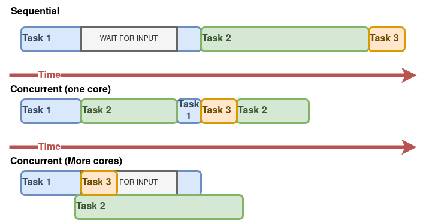
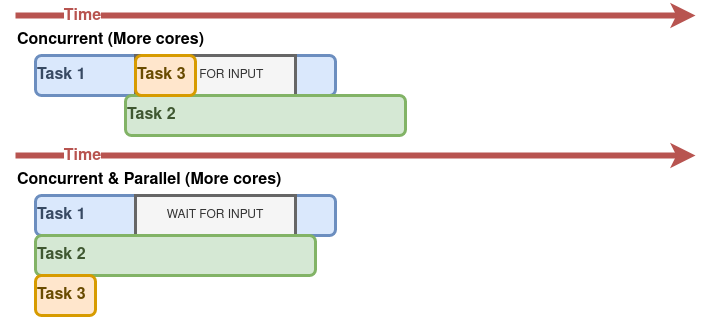
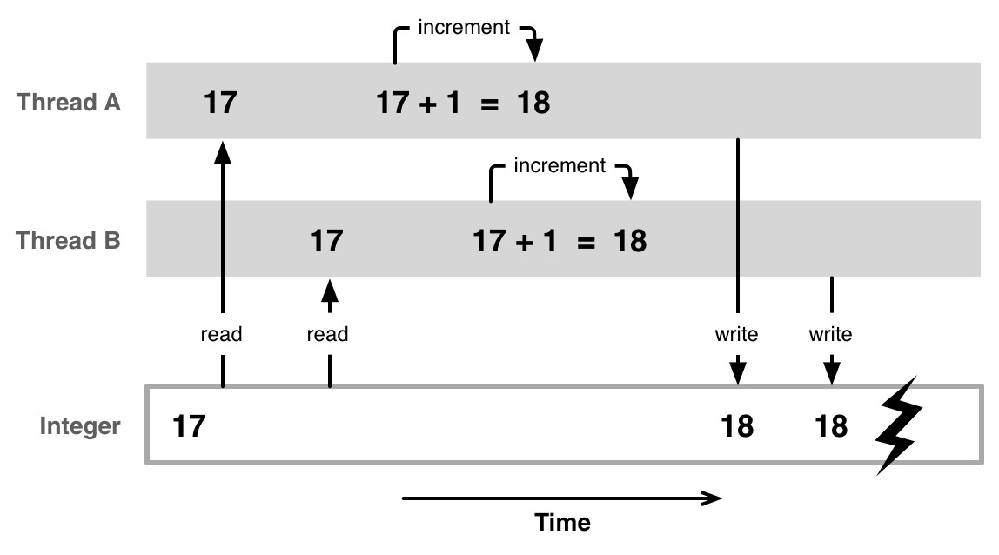
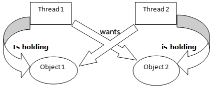

# Конкурентност
- Настала као механизам за оптимизацију употребе процесора.
- Изузетно је актуелна јер омогућава:
    - Једноставнију реализацију функционално независних делова програма (нпр. главни програм и позадинске функције).
    - Боље и равномерније искоришћење процесора (уместо да процесор чека неки процес, може да извршава неки други процес за то време).

## Циљ конкурентности
- __Потенцијално__ убрзање извршавања програма коришћењем више језгара/процесора (уместо да један процесор сабира милион елемената, боље да 4 процесора  сабирају по 250 000 елемената).
- __Идеално__ се сви задаци дешавају _истовремено_ чиме се максимално смањује време извршавања програма.

## Конкурентно програмирање
- На овим вежбама ћемо говорити о конкурентном програмирању употребом:
    - Нити
    - Критичних секција

# Нити (енг. _threads_)
- У оперативном систему нити представљају:
  - __токове извршавања, тј. функције програмског кода__ (који се преплићу на процесору)
  - чине основу распоређивања (енг. _scheduling entity_)

## Извршавање програма
- Сваки програм има бар једну нит (ток извршавања) насталу од функције `main()`.
- Програм који се састоји само од једне нити се назива __секвенцијални__ програм.
- Програм који се састоји од више (од једне) нити се назива __конкурентни__ програм.

## Секвенцијално наспрам конкурентног извршења

<!-- Секвенцијално извршење програма подразумева један алгоритам у ком се задаци дешавају просто један за другим. С друге стране код конкурентних окружења се задаци могу слободно преплитати без обзира да ли постоји чекања у задатку или не. -->

## Идеал извршења: паралелизам

<!-- У идеалном случају све апсолутно сви задаци могу извршавати истовремено, сваки на свом језгру чиме се постиже максимално убрзање. -->

## Од чега настају нити?
- Нити настају од функција.
- Свака нит када се ствара крене да извршава "свој" код, тј. тело некакве функције која је прослеђена конструктору нити (`std::thread`).

## `int main()`
- Улазна тачка (енг. _entry point_) програма, тј. почетак корисничког дела програма је функција `main()`.
- Завршетак корисничког дела програма наступа када се заврши функција `main()`.
- _Ово важи како за секвенцијални тако и за конкурентни програм!_
- Из претходног следи...

## `int main()` нит
- Ова нит је нарочитно битна!
- Програм траје колико и `main()`.
- Када се заврши `main()`, завршава се и цео програм, што подразумева прекидање свих нити процеса.
- Осим тога, `main()` нит је као и све друге нити.

# `std::thread`
- Служи за стварање нити (тока извршавања).
- Када се створи нит, објекат класе `std::thread` је у стању _'joinable'_ (показује на ток извршавања). Ово значи да је нит кренула да се извршава.
- Нит се преводи из стања _'joinable'_ операцијама:
  - `join()`
  - `detach()`
- Уколико се нит __не преведе__ из стања _'joinable'_ неком од наведених метода, добија се грешка: `Terminate called without an active exception. Core dumped.`

## Пример: Здравко нит
```c++
void zdravo() {
    cout << "Zdravo Sveto!" << endl;
}

void zdravko_primer() {
    thread nit(zdravo);
    nit.join();
}
```

## `join()` или `detach()`?
- Операција `join()` __блокира нит позиваоца__ док се нит на којој је операција `join()` позвана не заврши.
  - Користи се када нит `main()` _чека_ резултат рада нити које је створио.
- Операција `detach()` __раздваја нит позиваоца__ од нити на којој је операција `detach()` позвана, тако да нит позивалац не чека да се заврши нит на којој је позвана операција `detach()`.

## Пример: Висина - откачена нит
```c++
void visina_primer(thread &nit) {
    nit = thread([]()->void {
        int v;
        cout << "Unesite svoju visinu u [cm]: ";
        cin >> v;
        cout << "Vasa visina je " << v << "cm." << endl;
    });
    nit.detach();
}
```

## Аргументи и повратна вредност
- За нит насталу од функције `f()`:
  - При стварању, нити се морају проследити аргументи по истим правилима као да се позива обична Ц++ функција `f()`.
  - Вредности свих аргумената нити се при стварању копирају у контекст нити.
  - Повратна вредност функције `f()` се занемарује (увек је `void`).

## Пример: аргументи нити
```c++
void zbir(int a, int b, int &rez) {
    rez = a + b;
}

void argumenti_niti() {
    int rezultat = -420;
    thread nit(zbir, 2, 7, ref(rezultat));
    nit.join();
    cout << "Rezultat sabiranja: " << rezultat << endl;
}
```

# Међусобна искључивост

- Међусобно искључиво приступање нити __заједничким/дељеним ресурсима__ је неопходно да би се заштитила конзистентност тих ресурса.
  - Шта је то __ресурс__ у (конкурентном) програму?
  - Шта значи __заједнички/дељени__ ресурс?
  - Шта значи бити __конзистентан__?
- Конзистентност се нарушава стихијским приступањем дељеним ресурсима (долази до "стања тркања").

## Стање тркања (енг. _race-condition_)

- Када две (или више) нити истовремено приступају незаштићеном дељеном ресурсу:
  - Оне се тркају (енг. _race_) која ће пре да приступи ресурсу.
  - Отуда назив: _race-condition_.
  - Последица: резултат извршавања неочекивано зависи од редоследа догађаја (приступа), односно тога _ко је победио у трци_.
  - То значи да је наш детерминистички програм управо постао __не__-детерминистички.

## Стање тркања (енг. _race-condition_)



## Пример: тркање

```c++
#define ITER_NO 100000000
void trkanje_primer() {
  int brojac = 0;
  thread nit1([&brojac]() {
    for (int i = 0; i < ITER_NO; i++) brojac++;});
  thread nit2([&brojac]() {
    for (int i = 0; i < ITER_NO; i++) brojac--;});
  nit1.join();
  nit2.join();
  cout << brojac << endl;
}
```

## Исправан програм

- Да би конкурентни програм био __исправан__ сви приступи __дељеним променљивама__ морају бити __ексклузивни и (по потреби) синхронизовани__.
- Екслузивност се постиже забраном __истовременог__ приступа дељеном ресурсу од стране више нити.
- Синхронизација се постиже успостављањем __унапред одређеног редоследа приступа__ нити дељеном ресурсу.

## Пример: ексклузивност

```c++
void ekskluzivnost_primer() {
  int brojac = 0;
  mutex e;
  thread nit1([&brojac, &e]() {
    for (int i = 0; i < ITER_NO; i++) {
      e.lock(); brojac++; e.unlock();}});
  thread nit2([&brojac, &e]() {
    for (int i = 0; i < ITER_NO; i++) {
      e.lock(); brojac--; e.unlock();}});
  nit1.join();
  nit2.join();
  cout << brojac << endl;
}
```

# `std::mutex`

- Примитива која обезбеђује међусобну искључивост.
- На енглеском _MUTual EXclusion_ - отуда назив класе.
- Незаобилазан концепт у конкурентном програмирању.
- Да би се користила класа `std::mutex` потребно је укључивање заглавља `<mutex>`.

## `std::mutex`

- Нуди операције:
  - `lock()`
  - `unlock()`
- Треба __избегавати__ директно коришћење ових операција!
  - Нису сигурне у случају изузетка (енг. _exception safe_).
- Треба пазити код коришћења више објеката класе `std::mutex` у програму.
- Могуће је изазивање мртве петље (енг. _deadlock_)!

## `std::mutex`

- __Објекте класе `std::mutex` је ЗАБРАЊЕНО копирати.__.
- Чак и да је то могуће, програм семантички не би био исправан јер би нити закључавале различите пропуснице (копије) уместо јединствене пропуснице (оригинала).
- Нови стандард пружа могућност да се компајлеру експлицитно забрани да створи неке од метода које се подразумевано аутоматски генеришу (нпр. конструктор или оператор доделе).

## `std::mutex`

```c++
class mutex {

    . . .

    mutex(const mutex&) = delete;

    . . .

}
```

## Пример: пропуштеница

```c++
mutex m;
void f() {  // napraviti 2 niti od funkcije f
   int * veliki_niz;
   try {
      m.lock();
      veliki_niz = new int[1000000000000];
      m.unlock();
   } catch (const bad_alloc& e) {
      cout << "Alokacija memorije neuspesna!: ";
      cout << e.what() << endl;
   }
}
```

## `std::unique_lock`

- Служи за "закључавање" објеката класе `std::mutex`.
- Шаблонска (енг. _template_) класа.
  - Параметар шаблона за наше задатке ће бити класа `std::mutex`.
- Конструктору се као аргумент преноси референца на објекат класе `std::mutex` који треба закључати.
  - пример:
  - `unique_lock<mutex> ul(m);` за `mutex m;`

## `std::unique_lock`

- Обезбеђује "аутоматско" ослобађање објекта класе `std::mutex` (у деструктору) када објекат класе заврши свој животни век.
- Омогућује привремено отпуштање пропуснице (операција `unlock()`), што се може користити ради отпуштања пропуснице ради испуњења услова чекања или повременог отпуштања пропуснице ради спречавања "изгладњивања" нити.

## Критична секција

- Критична секција је део кода у којем се приступа дељеном ресурсу.
- Критична секција треба да је __што краћа__!
  - У њој долази до __серијализације извршавања__ нити!
- Улаз у и излаз из критичне секције се штити механизмом за синхронизацију (`std::mutex`).

## Критична секција (КС)

```c++
void visina() {
  int v;
  m.lock(); // zakljucavanje propusnice za iostream
  // ulazak u KS (pocetak koriscenja resursa - iostream)
  cout << "Koliko ste visoki [cm]?" << endl;
  cin >> v;
  cout << "Vasa visina je " << v << " cm." << endl;
  // izlazak iz KS (kraj koriscenja resursa - iostream)
  m.unlock();  // oslobadjamo pristup deljenom resursu
}
```

## Мртва петља (енг. _deadlock_)

- Мора се пазити како се формирају критичне секције!
- У случају коришћења више од једне пропуснице у програму, могуће је изазивање мртве петље.
- Најбоља пракса је да уколико има више пропусница у програму, критичне секције тих пропусница буду раздвојене.

## Мртва петља (енг. _deadlock_)



## Класа омотач око дељене променљиве

- Добра пракса је да се као дељене променљиве користе објекти класа које:
  - енкапсулирају атрибуте,
  - укључују и објекте за синхронизацију (`std::mutex`) и
  - приступ атрибутима обезбеђују преко __ексклузивних и синхронизованих__ метода.

