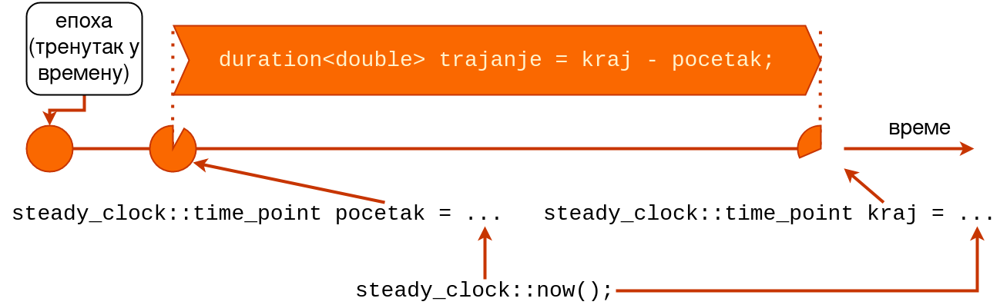

# Време
- Понекад је неопходно да водимо рачуна о протеклом времену током програма.
- Ми то највише користимо за симулације, али се користи и када желимо да рачунар садржи фину контролу времена.
- Ц++ нуди софистициран систем који то омогућава

## Пропорција (`std::ratio`)
- Класа за аритметичке операције са рационалним бројевима у време превођења (енг. *compile time*).
  - `typedef ratio<1, 1000> milli;  
  // npr. metar 1 je 1000 milimetara`
- Предефинисани типови:
  - `nano`
  - `micro`
  - `milli`
  - `centi`
  - `deci`
  - `deca`
  - `hecto`
  - `mega`
  - ...

## Мерење времена у језику Ц++
- Све је у простору имена `std::chrono`.
- Битне су 3 класе:
  - `std::chrono::duration` - временски период/интервал (између  два тренутка у времену)
  - `std::chrono::time_point` - тренутак у времену (измерен часовником)
  - `std::chrono::Clock` - часовник

## Временски период
- Представљен класом `std::chrono::duration`.
- Предефинисани типови:
  - `hours`
  - `minutes`
  - `seconds`
  - `milliseconds`
  - `microseconds`
  - `nanoseconds`
  - ...

## Временски период
Предефинисани типови временских периода:
```c++
typedef duration<long, ratio<60>> minutes;
typedef duration<long> seconds;
typedef duration<long, milli> milliseconds;
```
- први параметар шаблона - тип интерне евиденције о времену (може бити било који бројчани тип)
- други параметар шаблона - однос (енг. _ratio_) према референтној јединици: секунди

## Временски период
```c++
typedef duration<long, ratio<60>> minutes;
minutes m1(3); // 3: tokom upotrebe se 
               //    preracunava u sekunde [180s]
minutes m2(5);
minutes m3 = m1 + m2; // 8 minuta [480s]
typedef duration<double, milli> dms;
dms dm1(1.3);
dms dm2(5);
dms dm3 = dm1 + dm2; // 6.3
dms dm4 = dm1 + m1;  // 180 001.3 = 3 min + 1.3ms
minutes m4 = m1 + dm2; 
// linija iznad se ne kompajlira! Gubitak preciznosti!
milliseconds m5 = dm1; 
// linija iznad se ne kompajlira! G. P.! [double->long]
```
## Тренутак у времену
- Представљен је класом `std::chrono::time_point`.
- Представља **епоху** плус или минус временски период (енг. _duration_).
- Епоха је унапред фиксиран моменат у времену!
  - за _UNIX_ системе то је типично 1.1.1970. у 00:00 ГМТ.
- Тренутно време се може сазнати позивом методе `now()` неког од часовника.

## Часовник
- Бележи протекло време од почетка епохе. Стандард дефинише 8 часовника, од којих су наредна 3 ту од Ц++11 стандарда:
  1. **`std::chrono::system_clock`** - базиран на системском сату, подесан за приказ календарских информација кориснику (приказ у облику датума и времена) али због скокова није најподеснији за мерење трајања операција
  2. **`std::chrono::steady_clock`** - увек монотоно растући, најадекватнији за мерење операција
  3. **`std::chrono::high_resolution_clock`** - часовник највише могуће прецизности; неретко се може наићи на ситуацију да је већ 2. сат најпрецизнији па су исти

## Приказ односа појмова о времену


## Привремено заустављање активности нити
- Понекад хоћемо да нит сачека не _услов_ већ неки период времена.
```c++
using namespace chrono;
// ...
this_thread::sleep_for(seconds(1));
// takodje, od standarda c++14 moze i:
this_thread::sleep_for(1s);
```

# Синхронизација

- У примерима са претходног часа су ресурси били у спремном стању тако да је било довољно приступ ресурсима ограничити на једну нит у једном тренутку.
- Међутим, поставља се питање да ли је таква врста контроле приступа _довољно_ добра увек?

## Пример: нервозни паркинг (`04_parking`)

```c++
// parking.hpp
  void udji(int rbr) {
    while (true) {
      unique_lock<mutex> lock(m);
      if (stanje == SLOBODAN) {
        stanje = ZAUZET;
        break;
      }
    }         
  }
```

## Оптерећење рачунара

- Отворимо нов терминал и у њему покренимо наредбу: `top`
  - за Виндовс ентузијасте ту је таск менаџер.
- Увидети тренутно стање искоришћености процесора.
- Покренимо пример `04_parking` и пратимо промене стања.
- Шта се десило? 

## Активно чекање

- Активно чекање је појава непрестаног покушавања приступа ресурсу све док он не буде слободан за коришћење.
- У претходном примеру смо видели да решење функционише, али да преоптерећује рачунар без потребе.
- Како бисмо решили проблем активног чекања?

## `std::condition_variable`

- Класа `std::condition_variable` управо решава проблем активног чекања.
- Ради искључиво са објектима класе `std::unique_lock`.
- Подржава операције:
  - `wait()`
  - `notify_one()`
  - `notify_all()`
- У пракси опонаша ред чекања јер води евиденцију о свим нитима које покушавају да заузму пропусницу.

## Пример: прво ја
```c++
  ...
    thread nit1([&m, &prvi, &prvi_prosao] {
        unique_lock<mutex> l(m);
        while (!prvi)
            prvi_prosao.wait(l);
        cout << "Sacekali smo prvog!" << endl;
    }), nit2([&m, &prvi, &prvi_prosao] {
        unique_lock<mutex> l(m);
        prvi = true;
        cout << "Prvi zavrsio." << endl;
        l.unlock();
        prvi_prosao.notify_one();
    });
  ...
```

## Пример: стрпљив паркинг (`04_parking`)

```c++
// parking.hpp
  void udji(int rbr) {
    unique_lock<mutex> l(m);
    while (stanje == ZAUZET) {
        slobodan.wait(l); 
    }
    // alternativa za while petlju:
    // slobodan.wait(l, [&this]{return stanje != ZAUZET});
    stanje = ZAUZET; 
  }
```
