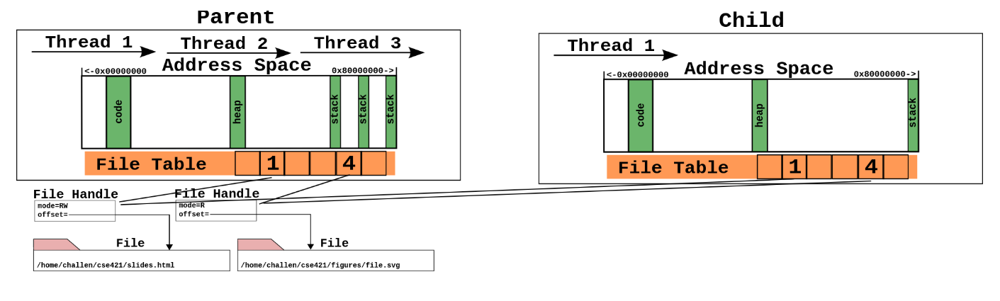

# Процеси
- Сваки процес који се покрене има свој јединствени број, тзв. идентификатор процеса или _pid_.
- Конкретно на Јуникс оперативним системима сваки процес ствара неки други процес осим _init_ процеса који је родитељ свих осталих процеса.
- Ово се може видети покретањем команде `pstree` у терминалу.
  - На системима са _systemd_-ом, _init_ бива замењен њиме.

## ИД процеса (`Primeri/01_pid`)
- Сваки програм када се покрене добије свој јединствени идентификатор процеса, тј. _pid_.
- Могуће је пид добавити програматички користећи се системским позивом `getpid()`.
- Такође, могуће је добавити пид родитељског процеса за текући процес позивом `getppid()`.
- Повратна вредност обе функције је типа `pid_t`.
- Налази се у заглављу `<unistd.h>`.

## Подвајање процеса (`fork()`)
- `fork()` [системски позив](https://man7.org/linux/man-pages/man2/fork.2.html) нам омогућује да тренутни процес дуплирамо.
- Процес створен на овај начин је:
  - дете процесу који позива `fork()`
  - независан од позивајућег процеса
  - има копиран читав садржај родитељског процеса
  - једино шта деле су дескриптори раније отворених датотека

## Подвајање процеса (`fork()`)

<!-- На слици се подразумева да нит1 родитељског процеса позива подвајање.
Због тога, код детета видимо само један стек, стек нити1 родитељског процеса.
Садржај преосталих нити се не копира. -->

## Подвајање процеса (`Primeri/02_fork`)
- У моменту када се позове `fork()` системски позив, након припреме новог процеса, имамо 2 процеса који настављају да извршавају код од линије где је позван `fork()` па надаље.
- Уколико је позив био неуспешан, повратна вредност је -1.
- У супротном, у сваком од процеса враћа [посебну повратну вредност](https://www.csl.mtu.edu/cs4411.ck/www/NOTES/process/fork/create.html):
  - у детету (новостворени процес) враћа 0
  - у родитељу (оригинални процес) враћа __пид детета (позитиван број)__
  - ово нам је битно да би даље у коду разликовали процесе и одлучили шта желимо да који извршава

# Дељење меморије међу процесима
- Као што смо видели, 2 процеса су скоро потпуно независна након системског позива `fork()`.
- Како поделити меморију између подвојених процеса?
- Користити системске позиве за [рад са дељеном меморијом](https://www.csl.mtu.edu/cs4411.ck/www/NOTES/process/shm/example-1.html), из `shm` фамилије системских позива.

## Кораци у раду са дељеном меморијом
1. алоцирање сегмента РАМа који ће бити дељен
2. добављање адресе сегмента
3. коришћење сегмента
4. одјава коришћења сегмента
5. ослобађање сегмента

## 1. Алокација сегмента (`shmget()`)
- У заглављу `<sys/shm.h>`.
- [Системски позив](https://man7.org/linux/man-pages/man2/shmget.2.html) `shmget()` прима 3 параметра:
  1. кључ сегмента, најчешће `IPC_PRIVATE` као сигнал да нам треба нов сегмент
  2. величина сегмента у бајтовима (`shmget()` ће поравнати ову меморију па се може десити да добијемо више)

## 1. Алокација сегмента (`shmget()`)
- [Системски позив](https://man7.org/linux/man-pages/man2/shmget.2.html) `shmget()` прима 3 параметра:
  3. опције, пример:
    - `IPC_CREAT|0660` где нам прва опција наглашава да нам треба стварање новог сегмента а друга опција регулише дозволе приступа (читај/пиши за власника тренутног процеса и његову групу а ништа за остале)
- Враћа ИД створеног сегмента или -1 у случају неуспеха.

## 2. Добављање адресе сегмента (`shmat()`)
- У заглављу `<sys/shm.h>`.
- [Системски позив](https://man7.org/linux/man-pages/man3/shmat.3p.html) `shmat()` прима 3 параметра:
  1. ИД сегмента којем желимо да се пријавимо као корисник
  2. адреса где желимо да нам буде сегмент
  3. опције
- Враћа адресу меморијског блока за коришћење у виду генералног показивача (`void*`; мора се кастовати у одговарајући тип).

## 4. одјава коришћења сегмента (`shmdt()`)
- У заглављу `<sys/shm.h>`.
- [Системски позив](https://man7.org/linux/man-pages/man3/shmdt.3p.html) `shmdt()` прима 1 параметар:
  1. адреса добијена у кораку 2 од `shmat()` позива
- Враћа -1 након неуспеха, у супротном 0.

## 5. ослобађање сегмента (`shmctl()`)
- У заглављу `<sys/shm.h>`.
- [Системски позив](https://man7.org/linux/man-pages/man2/shmctl.2.html) `shmctl()` прима 3 параметра:
  1. ИД сегмента којим желимо да управљамо
  2. операција коју желимо да учинимо (у нашем случају ће бити `IPC_RMID`)
  3. структура `shmid_ds` која ће прихватити информације о сегменту (у нашем случају можемо игнорисати и послати `nullptr`)
- Враћа -1 након неуспеха, у супротном ненула вредност а у зависности од жељене операције.

## Чекање на дете (`wait()`, `Primer/03_fork_sa_shm`)
- У заглављу `<sys/shm.h>`.
- [Системски позив](https://man7.org/linux/man-pages/man2/wait.2.html) `wait()`.
- Користи се за проверу стања и чекање процеса детета.
- Прима 1 параметар:
  1. адресу целог броја да би се проследио статус процеса; може бити `nullptr`
- Враћа -1 у случају грешке, у супротном ИД терминираног дечјег процеса.

## Стварање новог процеса (`clone()`)
- [Системски позив](https://man7.org/linux/man-pages/man2/clone.2.html) `clone()`.
- Користи се за стварање дечјих процеса или нових нити у процесу.
- Прима 4 параметра:
  1. показивач на функцију
  2. показивач на стек
  3. опције
  4. показивач на аргументе
- Враћа -1 у случају грешке, у супротном ИД створеног дечјег процеса/нити.

## Стварање новог процеса
- У примеру се прави нов процес:
  1. показивач на функцију; која мора да:
    - прима као један параметар, показивач на блок меморије са аргументима (`void*`)
    - врати цео број као информацију о успешности (0 је успех)
  2. показивач на стек:
    - притом, пошто се стек користи уназад, мора се послати адреса последњег бајта стека!

## Стварање новог процеса (`Primeri/04_clone`)
- У примеру се прави нов процес:
  3. опције:
    - `CLONE_VM` - нов процес користи исти меморијски простор као родитељ
    - `SIGCHLD` - омогућење детету да пошаље сигнал родитељу након терминације (неопходно да би радило чекање на дечји процес)
  4. показивач на блок меморије са аргументима:
    - мора се пазити на начин паковања и распакивања аргумената из блока!

# Отварање У/И токова (`pipe()`)
- Ради комуникације између процеса можемо и да отворимо посебне [улазно/излазне токове](https://ops-class.org/slides/2017-02-10-forksynch/#_pipes) (и [још један извор](http://www.cse.cuhk.edu.hk/~ericlo/teaching/os/lab/6-IPC1/reference.html)) кроз које можемо слати поруке.
- За разлику од дељене меморије ови токови се понашају као датотеке тако да и комуникација мора тећи као са датотекама.
- За ове потребе се користи [системски позив](https://man7.org/linux/man-pages/man2/pipe.2.html) `pipe()`.

## Отварање У/И токова (`pipe()`)
- Налази се у заглављу `<unistd.h>`.
- `pipe()` прима 1 параметар:
  1. адреса на низ од 2 цела броја
    - у њима ће се редом сачувати идентификатори дескриптора тока за читање потом писање података
- Враћа -1 након неуспеха, у супротном 0.

## Отварање У/И токова (`pipe()`)
- Са токовима се мора пажљиво баратати!
- Након што се ток подели свим процесима, процеси су у обавези да пре свега осталог затворе ток који неће користити:
  - нити ствараоци садржаја морају затворити токове за читање података
  - нити читачи садржаја морају затворити токове за писање података

## Отварање У/И токова (`Primeri/05_fork_sa_pipe`)
- Позиви са [писање](https://man7.org/linux/man-pages/man2/write.2.html) и [читање](https://man7.org/linux/man-pages/man2/read.2.html) се налазе у заглављу `<unistd.h>`.
- И писање (`write()`) и читање (`read()`) користе по 3 параметра:
  1. ИД дескриптора за писање/читање
  2. адреса бафера за писање/читање
  3. број бајта за писање/читање

# Позивање спољашњих програма (`execv()`)
- Позивање спољаших програма програматички је могуће уз помоћ фамилију `exec` [системских позива](https://man7.org/linux/man-pages/man3/exec.3.html).
- Ова фамилија системских позива је специфична по томе да спољашњи програм у потпуности преузме позивајући процес.
- У случају успешног системског позива, спољашњи програм преузима све, пид позиваоца, поставља свој стек испочетка итд. и више се не враћамо у позивајући код.
- Позивајући програм се наставља само у случају НЕУСПЕШНОГ позива спољашњег програма.

## Позивање спољашњих програма (`execv()`, `Primeri/06_execv`)
- Налазе се у заглављу `<unistd.h>`.
- Прима 2 параметра:
  1. путању до извршне датотеке
  2. низ показивача на аргументе
    - овај низ МОРА да се заврши `nullptr` показивачем као сигналом прекида низа
- Повратна вредност ће постати повратна вредност програма ако је спољашњи програм успешно створен.
- Уколико није било успеха, просто се враћа -1 позивајућем окружењу да потом одлучи шта ће радити даље.

# Ланчање програма (енг. piping)
- Уобичајена појава у програмирању је да се не пише код за решавање проблема који је већ решен.
- Уместо тога, боље је искористити већ готово решење и евентуално га спојити са нашим или другим већ готовим решењем.
- Надовезивање више програма један на други се посебно лако може урадити ако су програми написани тако да примају параметре са стандардног улаза или као параметара а излаз шаљу на стандардни излаз.

## Ланчање програма (енг. piping)
- У оваквој ситуацији се приступа ланчању програма, или познатије као пајповање програма.
- Веома честа појава у шел скриптовању где се резултат једне команде ланча на улаз наредне команде.
- Пример:
  - `ps ax | grep firefox`
  - овде се излаз програма `ps` (списак свих процеса) шаље директно као улаз у `grep` програм који ће одбацити линије које не садрже реч `"firefox"`. 

## Ланчање: Ц++ (`dup2()`)
- Да би се овај ефекат постигао у Ц++ коду, неопходно је:
  - пре позива спољног програма направити ток (енг. pipe)
  - због начина на који раде `exec` позиви, подвојити процес (`fork()`)
  - у детету пре позива `exec`, треба преусмерити стандардни излаз на ток (користећи се `dup2` позивом)
  - у родитељу се кроз ток чита излаз спољашег програма!

## Ланчање: Ц++ (`dup2()`, `Primeri/07_execv_sa_pipe`)
- [Системски позив](https://man7.org/linux/man-pages/man2/dup.2.html) `dup2()` се користи за дуплирање дескриптора тока.
- Налази се у заглављу `<unistd.h>`.
- У нашем случају ћемо га искористити за преузимање контроле над стандардним излазом.
- има 2 параметра:
  1. ИД оригиналног дескриптора (у нашем случају ИД дескриптора тока за писање)
  2. нов ИД дескриптора (у нашем случају 0, што је ИД за `stdout`)
- Враћа -1 у случају неуспеха, у супротном ИД новог дескриптора.
