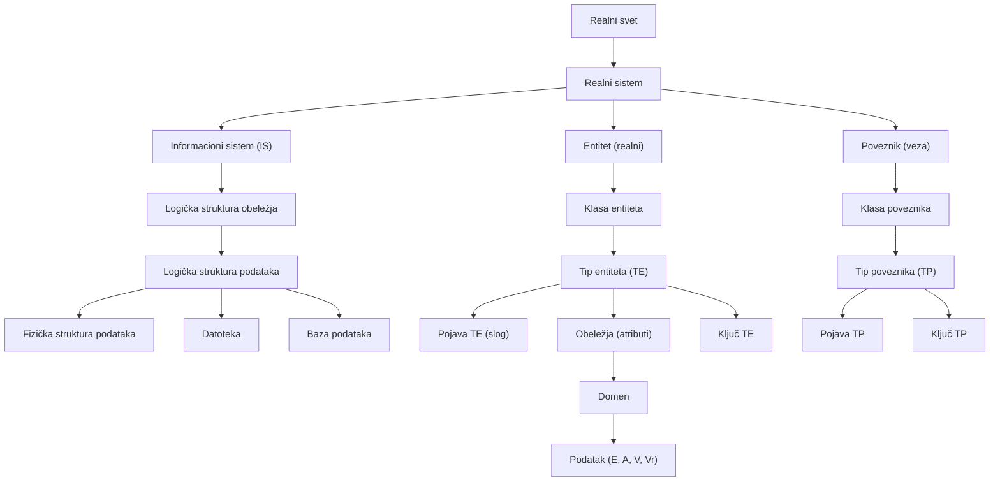

# Osnovni pojmovi - Baze podataka 1

## Uvod - o čemu se radi?

Pre nego što počnemo da pričamo o bazama podataka, tabelama, SQL-u i svemu ostalom, moramo da razumemo temelje na kojima sve to počiva. Ova lekcija pokriva osnovne pojmove - gradivne blokove od kojih je sačinjeno celokupno gradivo predmeta. Bez solidnog razumevanja ovih koncepata, sve što dolazi kasnije biće nejasno.

Zamislimo da gradimo kuću. Pre nego što razmišljamo o boji zidova ili rasporedu nameštaja, moramo da postavimo temelje i da razumemo od čega se kuća sastoji. Ova lekcija je upravo to - temelj za sve što sledi.

Krenimo redom.

---

## Realni svet i realni sistem

Sve počinje od **realnog sveta**. To je, jednostavno rečeno, sve što nas okružuje i što možemo da percipiramo kao realno - ljudi, firme, fakulteti, bolnice, knjige, automobili, transakcije.

Unutar tog realnog sveta postoje razni delovi koji funkcionišu po određenim pravilima. Te delove nazivamo **sistemima**.

### Šta je sistem?

**Sistem** je strukturirani skup objekata (činilaca, elemenata) utvrđenog stanja i ponašanja, koji se nalaze u međusobnoj interakciji da bi ostvarili unapred zadate ciljeve.

Hajde da raščlanimo ovu definiciju na delove, jer je svaki deo bitan:

- **Strukturirani skup objekata** - nisu to nasumični elementi, već organizovani činioci
- **Utvrđenog stanja i ponašanja** - znamo šta svaki element radi i u kakvom je stanju
- **U međusobnoj interakciji** - elementi nisu izolovani, oni komuniciraju i utiču jedni na druge
- **Da bi ostvarili zadate ciljeve** - sve to ima svrhu, postoji razlog zašto sistem postoji

Zamislimo fakultet kao sistem. Studenti, profesori, predmeti, sale - sve su to elementi sistema. Oni nisu tu slučajno - svaki ima svoju ulogu, međusobno komuniciraju (studenti slušaju predavanja, profesori predaju, ocenjuju), i sve to postoji sa ciljem da se studenti obrazuju.

### Realni sistem vs. apstraktni sistem

Sistemi mogu postojati na dva načina:

**Realni sistem** je sistem kao deo realnog sveta. On poseduje:
- **Cilj delovanja** - zašto sistem postoji
- **Resurse (činioce)** - od čega se sistem sastoji
- **Procese** - šta se u sistemu dešava
- **Strukturu** - kako su elementi organizovani
- **Okruženje** - šta je oko sistema

**Apstraktni sistem** je sistem kao deo apstraktnog (imaginarnog) sveta, specificiran putem matematičkih struktura. Na primer, matematički model koji opisuje ponašanje nekog realnog sistema.

> [!IMPORTANT]
> Razlika između realnog i apstraktnog sistema je česta na ispitu. Realni sistem postoji u stvarnosti (fabrika, bolnica, fakultet), dok je apstraktni sistem matematički model nečega.

---

## Informacioni sistem (IS)

Sada dolazimo do ključnog koncepta koji povezuje realni svet sa bazama podataka.

### Definicija informacionog sistema

**Informacioni sistem (IS)** je model realnog sistema (procesa i resursa).

Zamislimo ovo ovako: imate biblioteku sa hiljadama knjiga. Sama biblioteka, sa policama, knjigama, čitaocima i bibliotekarima - to je realni sistem. Ali informacioni sistem te biblioteke je nešto drugo - to je sistem koji pamti podatke o svim knjigama, ko je šta pozajmio, kada treba da vrati, koliko kojih knjiga ima na stanju. IS je, dakle, "slika" realnog sistema, preslikana u podatke.

### Cilj izgradnje IS

**Cilj izgradnje IS** je pružanje informacija neophodnih za funkcionisanje i upravljanje realnim sistemom.

Bez IS-a, bibliotekar ne bi znao ko je koju knjigu pozajmio. Direktor fabrike ne bi znao koliko proizvoda je napravljeno danas. Dekan ne bi znao koliko studenata je položilo ispit. IS postoji da bi ti podaci bili dostupni onima kojima trebaju.

### Mesto IS u realnom sistemu

IS je **infrastrukturna komponenta realnog sistema**, namenjena da podrži upravljački sistem realnog sistema. Drugim rečima, IS nije sam sebi svrha - on služi da pomogne ljudima koji donose odluke u realnom sistemu.

### Zadaci informacionog sistema

IS obavlja šest ključnih zadataka:

1. **Obuhvat (akvizicija) podataka** - prikupljanje podataka iz realnog sistema
2. **Skladištenje podataka** - čuvanje podataka na trajnom medijumu
3. **Prenos podataka** - distribucija podataka do mesta gde su potrebni
4. **Prezentovanje podataka** - prikazivanje podataka u razumljivom obliku
5. **Obrada podataka** - transformacija sirovih podataka u korisne informacije
6. **Automatizacija upravljačkih funkcija u RS** - podrška upravljanju

Zamislimo fakultetski IS: podatke o studentima unosimo pri upisu (obuhvat), čuvamo ih u bazi (skladištenje), šaljemo obaveštenja studentima (prenos), prikazujemo rezultate ispita (prezentovanje), računamo prosek ocena (obrada), i automatski generišemo rang liste (automatizacija).

### Činioci informacionog sistema

IS se sastoji od sledećih činilaca:

- **Računarsko-komunikaciona i softverska infrastruktura** - hardver i bazni softver
- **Baza ("skladište") podataka** - srce IS-a, centralno mesto gde se čuvaju podaci
- **Aplikacije (softverski paketi) za rad s podacima** - programi kroz koje korisnici pristupaju podacima
- **Projektna i korisnička dokumentacija** - uputstva i tehnička dokumentacija
- **Krajnji korisnici** - ljudi koji koriste IS
- **Tim za obezbeđenje eksploatacije i održavanja** - ljudi koji održavaju IS

> [!NOTE]
> IS je, dominantno, **softverski proizvod**. Iako uključuje ljude i dokumentaciju, srž IS-a čini softver.

### Primeri informacionih sistema

Informacioni sistemi su svuda oko nas. Evo nekoliko primera iz prakse:

**Bankovne aplikacije** - upravljanje tekućim računima, transakcijama, štednjom, klijentima i kreditima. Kada koristite mobilno bankarstvo, vi koristite IS banke.

**Telekomunikacije** - podaci o pozivima, telefonski računi, praćenje kvarova, model mreže. Svaki telefonski poziv koji napravite beleži se u IS-u operatera.

**Medicina** - podaci o pacijentima, istorija bolesti, pomoć pri dijagnostikovanju. RFZO (Republički fond za zdravstveno osiguranje) je jedan takav sistem.

**Transport** - red vožnje/letenja, rezervacija i kupovina karata, odabir mesta za sedenje. Kada kupite avionsku kartu online - to je IS.

**Nauka** - prikupljanje i obrada podataka iz eksperimenata i istraživanja.

**Sistemi za pomoć pri odlučivanju** - podaci o poslovanju, izveštaji, višedimenzionalni pogledi, data mining. Ovi sistemi pomažu menadžerima da donose bolje odluke.

**Geoinformacioni sistemi (GIS)** - upravljanje, pretraživanje, analiza, manipulisanje i prezentacija geoinformacija. Koriste se u katastru, zaštiti životne sredine, upravljanju resursima.

**Industry 4.0 i pametne fabrike (Smart factory)** - napredne tehnologije poput Cyber-Physical Systems (CPS), Internet of Things (IoT), Wireless Sensor Network (WSN), pametnih resursa (roboti, coboti, AGV), RFID senzora, pametnih materijala, pametnog skladištenja i pametnih proizvoda. Sve ove tehnologije generišu ogromne količine podataka (Big Data) koje zahtevaju inteligentne IS za skladištenje i obradu.

**Društvene mreže** - korisnički nalozi, poruke, objave, video klipovi, slike. Facebook, Instagram, Twitter - sve su to ogromni informacioni sistemi.

### Arhitektura softvera

U praksi, IS se realizuje kroz višeslojnu arhitekturu softvera. Tipična arhitektura uključuje klijentsku stranu (pretraživač ili aplikacija), **application server** (server aplikacija koji obrađuje poslovnu logiku), i server baze podataka koji čuva podatke.

---

## Entitet i klasa entiteta

Sada napuštamo opšte pojmove i ulazimo u srž modeliranja podataka. Hajde da pogledamo kako se realni svet preslikava u IS.

### Entitet

**Entitet (realni entitet)** je jedinica posmatranja, odnosno činilac (resurs) poslovanja u realnom sistemu.

Ovo je veoma širok pojam. Entitet može biti bilo šta što nas zanima u kontekstu posmatranog sistema - osoba, predmet, događaj, mesto. Na fakultetu, entiteti su studenti, profesori, predmeti, sale. U biblioteci - knjige, čitaoci, police.

Na primer, konkretan student Petar je jedan entitet. Profesorka Nina je drugi entitet. Predmet "Baze podataka 1" je treći entitet.

### Klasa realnih entiteta

**Klasa realnih entiteta** je skup "sličnih" entiteta, odnosno skup entiteta koji poseduje zajedničko svojstvo.

Formalno se zapisuje kao:

$$E = \{e_i \mid P(e_i)\}$$

Gde je:
- $E$ - klasa entiteta
- $e_i$ - jedan entitet iz te klase
- $P(e_i)$ - predikat (svojstvo) koje svi entiteti u klasi dele

Na primer, Petar, Nina i Srećko su svi studenti. Oni čine klasu entiteta **Student**. Ono što ih čini "sličnim" je to što su svi upisani na fakultet kao studenti - to je njihovo zajedničko svojstvo $P(e_i)$.

Isto tako, Milan, Ana, Mila, Nikola i Jelena su nastavnici - oni čine klasu entiteta **Nastavnik**. Predmeti "Baze podataka 1", "HCI", "Matematika", "Baze podataka 2" čine klasu entiteta **Predmet**.

> [!TIP]
> Entitet je konkretan primerak (npr. student Petar), a klasa entiteta je skup svih takvih primeraka (npr. svi studenti). Zamislite klasu kao "kategoriju" u koju spadaju konkretni entiteti.

---

## Poveznik i klasa poveznika

Entiteti u realnom sistemu ne postoje izolovano - oni su u međusobnim odnosima (vezama). Te veze su jednako bitne kao i sami entiteti.

### Poveznik (veza)

**Poveznik (veza)** reprezentuje odnos dva ili više realnih entiteta, ili prethodno uspostavljenih poveznika.

Zamislimo studenta Petra i predmet "Baze podataka 1". Između njih postoji veza - Petar **sluša** taj predmet. Ta veza "sluša" je poveznik.

Isto tako, profesor Milan **predaje** predmet "Baze podataka 1" - i to je poveznik. Petar **polaže** ispit iz "Baze podataka 1" sa ocenom 10, dana 10.10.2022 - i to je poveznik, ali ovaj nosi i dodatne podatke (ocenu i datum).

Obratite pažnju na jednu bitnu stvar iz definicije: poveznik može da reprezentuje odnos ne samo između entiteta, nego i između **prethodno uspostavljenih poveznika**. To znači da veze mogu da se grade jedne na druge.

### Klasa poveznika

**Klasa poveznika** je skup veza između klasa realnih entiteta ili prethodno identifikovanih klasa poveznika. To je skup poveznika koji poseduje isto svojstvo.

Formalno:

$$S = \{(e_1, \ldots, e_m) \mid P(e_1, \ldots, e_m)\}$$

Gde je:
- $e_i$ $(i \in \{1, \ldots, m\})$ - jedan realni entitet ili prethodno uspostavljeni poveznik

Na primer, klasa poveznika "Sluša" obuhvata sve veze oblika "student X sluša predmet Y". Klasa poveznika "Predaje" obuhvata sve veze oblika "nastavnik X predaje predmet Y".

---

## Obeležje, domen i podatak

Sada prelazimo na sledeći sloj detaljnosti - kakve osobine imaju entiteti i poveznici, i kako se te osobine formalno opisuju.

### Obeležje (atribut)

Setimo se predikata $P(e_i)$ i $P(e_1, \ldots, e_m)$ - to je svojstvo koje opisuje klasu entiteta ili poveznika, iskazuje osobine te klase.

**Obeležje (atribut)** je osobina klase realnih entiteta ili poveznika. Proističe iz semantike predikata $P(e_i)$.

Svaki entitet ima neke osobine koje ga opisuju. Student ima matični broj, ime, prezime, datum rođenja. Predmet ima šifru i naziv. Nastavnik ima šifru i prezime. Ove osobine su upravo obeležja (atributi).

Obeležja se označavaju velikim slovima ili mnemonicima: $A$, $B$, $X$, $W$, ili opisno: BRI, Datum\_Prispeća, JMBG, Prz, Ime.

### Vrste obeležja

Obeležja se razlikuju prema mogućnosti dekomponovanja na celine nižeg reda:

**Elementarno obeležje** - ne dekomponuje se dalje, reprezentuje atomičnu (elementarnu) vrednost. Na primer: Grad, Ulica, Broj, Stan - svako od ovih je elementarno obeležje, ne može se razbiti na manje smislene delove.

**Složeno obeležje** - može se dekomponovati na druga obeležja, reprezentuje složenu vrednost. Na primer: ADRESA = (Grad, Ulica, Broj, Stan). Adresa se sastoji od grada, ulice, broja i stana - dakle, može se razbiti na manje delove.

**Skupovno obeležje** - reprezentuje skup vrednosti istog tipa. Na primer, obeležje "Telefoni" jednog radnika može sadržati više telefonskih brojeva.

> [!WARNING]
> Česta greška studenata je mešanje elementarnog i složenog obeležja. Zapamtite: ako se obeležje može rastaviti na smislene delove, ono je složeno. Ako ne može, elementarno je.

### Domen

**Domen** je specifikacija skupa mogućih vrednosti obeležja, sa definisanim dozvoljenim relacijama i operacijama nad datim skupom.

Jednostavnije rečeno, domen kaže: "Evo, ovo su sve vrednosti koje ovo obeležje sme da ima." Ako imamo obeležje Ocena, nema smisla da mu dodelimo vrednost "banana" ili -5. Domen definiše šta je dozvoljeno.

#### Vrste domena prema načinu nastanka:

- **Predefinisani (primitivni) domeni** - "a priori" definisani, dolaze unapred (npr. celi brojevi, realni brojevi, stringovi)
- **Korisnički definisani (izvedeni) domeni** - definisani korišćenjem postojećih domena, primenom unapred utvrđenih pravila

#### Pridruživanje domena obeležju

Svakom obeležju se pridružuje domen - time se specificira skup mogućih vrednosti obeležja.

Oznake:
- $Dom(A)$ ili $(A : D)$ - oznake za pridruženi domen obeležju $A$
- $dom(A)$ - oznaka za skup mogućih vrednosti obeležja $A$

> [!IMPORTANT]
> Obratite pažnju na razliku: $Dom(A)$ sa velikim D označava **specifikaciju domena** (pravilo), dok $dom(A)$ sa malim d označava **konkretan skup vrednosti** koje iz toga proizilaze.

#### Primer domena

Specifikacija domena:

$$D_{OCENA} ::= \{d \in \mathbb{N} \mid d \geq 5 \land d \leq 10\}$$

Ovo kaže: domen DOCENA je skup prirodnih brojeva koji su veći ili jednaki 5 i manji ili jednaki 10.

Pridruživanje domena obeležju:
- $Dom(Ocena) = D_{OCENA}$
- $(Ocena : D_{OCENA})$

Skup mogućih vrednosti obeležja:
- $dom(OCENA) = \{5, 6, 7, 8, 9, 10\}$

Dakle, obeležje Ocena može imati samo vrednosti 5, 6, 7, 8, 9 ili 10. Ništa drugo.

### Podatak

Sada dolazimo do jednog od najbitnijih pojmova u celom kursu.

**Podatak** je uređena četvorka:

$$(Entitet, Obeležje, Vreme, Vrednost)$$

Gde je:
- **Entitet** - identifikator (oznaka) entiteta o kome je reč
- **Obeležje** - oznaka (mnemonik) obeležja čiju vrednost beležimo
- **Vreme** - vremenska odrednica (kada važi ovaj podatak)
- **Vrednost** - jedna vrednost iz $dom(A)$

Na primer: (Petar, Ocena\_iz\_BP1, 10.10.2022, 9) je podatak. Govori nam da je entitet Petar, za obeležje Ocena iz BP1, u vremenu 10.10.2022, imao vrednost 9.

### Kontekst podatka

**Kontekst podatka** je semantička (smisaona) komponenta podatka. Predstavlja trojku:

$$(Entitet, Obeležje, Vreme)$$

Ovo je ono što daje **smisao** podatku. Ako neko kaže samo "9", to nam ne znači ništa. Ali ako kažemo "(Petar, Ocena iz BP1, 10.10.2022)" - e, sada znamo kontekst. Vrednost "9" unutar tog konteksta ima jasan smisao.

> [!CAUTION]
> Ako se eksplicitno navede samo vrednost, a obeležje, entitet ili vreme nije ni implicitno zadato, to **nije podatak**, jer smisao nije određen. Ovo je česta zamka na ispitu - broj "9" sam po sebi NIJE podatak.

### Vremenska komponenta podatka

Komponenta **Vreme** može se izostaviti pod određenim uslovima:

1. Ako se uvede konvencija da se podatak, u tom slučaju, odnosi na vremenski trenutak u kojem se tim podatkom manipuliše, ili
2. Ako se identifikuje posebno obeležje, čija vrednost predstavlja vremensku odrednicu posmatranog podatka.

Konačno, treba zapamtiti: **podatak je činjenica iz realnog sistema**. Svaki podatak u bazi reprezentuje nešto što je stvarno, nešto što postoji ili se desilo u realnom sistemu.

---

## Tip entiteta i pojava tipa entiteta

Sada od realnog sveta prelazimo ka modelu - ka informacionom sistemu. Klasa realnih entiteta postoji u realnosti. Ali u IS-u, mi tu klasu modeliramo kao **tip entiteta**.

### Tip entiteta (TE)

**Tip entiteta (TE)** je model klase realnih entiteta u informacionom sistemu. Gradi se od obeležja bitnih za realizaciju ciljeva IS.

TE poseduje:
- **Naziv**: $N$
- **Skup obeležja**: $Q = \{A_1, \ldots, A_n\}$

Skup obeležja TE predstavlja **podskup** skupa obeležja klase realnih entiteta. To je bitna stvar - u realnom svetu, student ima stotine osobina (boja očiju, visina, omiljeni film...), ali u IS fakulteta nas zanimaju samo neke (matični broj, ime, prezime, datum rođenja). Zato je skup obeležja TE podskup svih osobina koje entitet ima.

**Primer:**

$$Radnik(\{Mbr, Ime, Prz, Zan, JMBG\})$$

Ovde je "Radnik" naziv TE, a {Mbr, Ime, Prz, Zan, JMBG} je skup obeležja.

### Pojava tipa entiteta

**Pojava tipa entiteta** je model jednog realnog entiteta u IS.

Ako je tip entiteta "šablon" ili "kalup", onda je pojava tipa entiteta jedan konkretan primerak napravljen po tom šablonu.

Formalno, tip entiteta reprezentuje skup pojava:

$$SP(N) = \{p_i \mid P(p_i)\}$$

Svaka pojava $p_i \in SP(N)$ reprezentuje tačno jedan realni entitet $e_i \in E$.

#### Formalna definicija pojave

Dat je tip entiteta s nazivom $N$ i skupom obeležja $Q = \{A_1, \ldots, A_n\}$.

Pojava tipa entiteta, u zadatom trenutku vremena $p(N, Vreme)$, ili samo $p(N)$ ako se vremenska odrednica ne navodi, predstavlja skup podataka:

$$p(N) = \{(A_1, a_1), \ldots, (A_n, a_n)\}$$

Za svaki $A_i \in Q$ važi da je $a_i \in dom(A_i)$.

To znači da je pojava TE skup parova (obeležje, vrednost), gde svaka vrednost pripada domenu svog obeležja.

#### Pojava kao n-torka (torka)

Ukoliko se u skup atributa tipa entiteta uvede redosled $(A_1, \ldots, A_n)$, tada se pojava $p(N)$ posmatra kao **n-torka (torka)**:

$$(a_1, \ldots, a_n)$$

Uređenje vrednosti podataka u pojavi je diktirano uređenjem obeležja u tipu entiteta.

**Primer:**

Tip entiteta: $Radnik(Mbr, Ime, Prz, Zan, JMBG)$

Jedna pojava (torka): $(1040, Eva, Tot, Programer, 1304971720014)$

Ova torka nam kaže da postoji radnik sa matičnim brojem 1040, imenom Eva, prezimenom Tot, zanimanjem Programer i JMBG-om 1304971720014.

### Identifikator tipa entiteta

Svaki tip entiteta mora imati način da se pojedinačne pojave razlikuju jedne od drugih. Za to služi identifikator.

**Identifikator tipa entiteta** je skup obeležja koji ima ulogu da obezbedi način za jedinstveno (nedvosmisleno) označavanje (identifikaciju) bilo koje pojave tipa entiteta.

Bilo koja vrednost identifikatora TE:
- Označava **najviše jednu** pojavu tipa entiteta
- Naziva se **identifikator pojave TE**
- Predstavlja jednu od četiri komponente podatka (komponentu Entitet)

#### Vrste identifikatora tipa entiteta

**Eksterni identifikator TE** - nije podskup skupa obeležja tipa entiteta. To su oznake koje dolaze "spolja", ne iz samih obeležja TE.

Primer za $TE\ Radnik(\{Mbr, Ime, Prz, JMBG\})$:
- $RBR\_Pojave\_TE \in \{1, \ldots, n\}$ - redni broj pojave
- $Oznaka\_Pojave\_TE \in \{p_1, \ldots, p_n\}$ - proizvoljna oznaka
- $MEM\_Adresa\_Pojave\_TE \in \{a_1, \ldots, a_n\}$ - memorijska adresa

Nijedan od ovih identifikatora (redni broj, oznaka, memorijska adresa) ne nalazi se među obeležjima TE Radnik - zato su eksterni.

**Interni identifikator TE** - jeste podskup skupa obeležja tipa entiteta.

Primer za $TE\ Radnik(\{Mbr, Ime, Prz, JMBG\})$:
- $Mbr$ - matični broj jednoznačno identifikuje radnika
- $JMBG$ - JMBG isto jednoznačno identifikuje radnika
- $\{Mbr, Ime, Prz, JMBG\}$ - ceo skup obeležja takođe identifikuje (ali nije minimalan)

### Ključ tipa entiteta

Evo jednog od najbitnijih pojmova u celom predmetu.

**Ključ TE** je minimalni interni identifikator tipa entiteta.

Formalno: skup obeležja tipa entiteta $N$, $X \subseteq Q$, $Q = \{A_1, \ldots, A_n\}$, takav da:

**(1°)** Ne postoje dve pojave TE $N$ s istom x-vrednošću (za $X$), i svaka pojava TE mora imati zadatu x-vrednost - **svojstvo jednoznačne identifikacije**

**(2°)** Ne postoji $X' \subset X$, za koji važi (1°) - **svojstvo minimalnosti**

Hajde da ovo prevedemo na običan jezik. Ključ mora da zadovolji dva uslova:

1. **Jednoznačna identifikacija**: Ako znamo vrednost ključa, možemo nedvosmisleno da odredimo o kojoj se pojavi radi. Dve različite pojave ne smeju imati istu vrednost ključa.

2. **Minimalnost**: Ne smemo moći da izbacimo nijedno obeležje iz ključa, a da i dalje zadovoljimo prvi uslov. Ključ mora biti "najmanji mogući".

> [!WARNING]
> Studenti često zaboravljaju svojstvo minimalnosti. Kombinacija {Mbr, Ime, Prz, JMBG} jeste interni identifikator (jer jednoznačno identifikuje svaku pojavu), ali NIJE ključ, jer možemo izbaciti Ime i Prz, a Mbr sam po sebi dovoljno identifikuje svaku pojavu.

#### Struktura tipa entiteta sa ključem

Svaki tip entiteta poseduje bar jedan ključ i predstavlja uređenu strukturu:

$$N(Q, C)$$

Gde je:
- $N$ - naziv TE
- $Q = \{A_1, \ldots, A_n\}$ - skup obeležja TE
- $C$ - skup ograničenja TE
- $K = \{K_1, \ldots, K_m\} \subseteq C$ - skup ključeva TE ($K \neq \emptyset$)
- Skup svih pojava TE $SP(N)$ mora zadovoljavati $C$

**Primer:**

$$Radnik(\{Mbr, Ime, Prz, JMBG\}, \{Mbr, JMBG\})$$

Ovde su $Mbr$ i $JMBG$ dva ekvivalentna ključa TE Radnik. Oba zadovoljavaju i jednoznačnu identifikaciju i minimalnost.

#### Primarni ključ

**Primarni ključ** je jedan izabrani ključ iz skupa ključeva TE. Kada TE ima više ključeva, biramo jedan kao "glavni" i njega zovemo primarni ključ. Često se označava podvlačenjem.

**Primer:**

$$Radnik(\{Mbr, Ime, Prz, JMBG\}, \{Mbr, JMBG\})$$

Ako izaberemo $Mbr$ kao primarni ključ, skraćena notacija je:

$$Radnik(\underline{Mbr}, Ime, Prz, JMBG)$$

> [!TIP]
> Na ispitu, kada vidite podvučeno obeležje u zapisu tipa entiteta, to je primarni ključ. Ova skraćena notacija se koristi veoma često.

---

## Tip poveznika i pojava tipa poveznika

Kao što smo entitete modelirali tipovima entiteta, tako i veze (poveznike) modeliramo tipovima poveznika.

### Tip poveznika (TP)

Entiteti realnog sistema nalaze se u međusobnim odnosima (vezama) - to su poveznici. IS treba da sadrži model tih veza.

**Tip poveznika (TP)** povezuje dva ili više TE, ili prethodno definisanih TP. On je model veza između pojava povezanih TE ili TP, odnosno između realnih entiteta ili veza.

Formalno, TP je struktura:

$$N(N_1, N_2, \ldots, N_m, Q, C)$$

Gde je:
- $N$ - naziv tipa poveznika
- $N_i$ $(i \in \{1, \ldots, m\})$ - **povezani tip** (tip entiteta ili prethodno definisani tip poveznika)
- $Q = \{B_1, \ldots, B_n\}$ - skup obeležja TP
- $C$ - skup ograničenja TP
- $K = \{K_1, \ldots, K_k\} \subseteq C$ - skup ključeva TP ($K \neq \emptyset$)

TP reprezentuje skup pojava poveznika:

$$SP(N) = \{(p_1, \ldots, p_m) \mid P(p_1, \ldots, p_m)\}$$

Gde je:
- $p_i$ $(i \in \{1, \ldots, m\})$ - jedna pojava TE ili TP $N_i$
- $P(p_1, \ldots, p_m)$ - osobina (predikat) TP $N$

**Primer:**

Tip poveznika nad TE Student i Predmet:

$$Sluša(Student, Predmet, \{Semestar\}, C_1)$$

Tip poveznika nad TE Nastavnik i Predmet:

$$Predaje(Nastavnik, Predmet, \{Datum\}, C_2)$$

Tip poveznika nad TP Sluša i Predaje (poveznik nad poveznicima!):

$$PolažeIspit(Sluša, Predaje, \{Ocena\}, C_3)$$

Obratite pažnju na treći primer - PolažeIspit ne povezuje dva tipa entiteta, već dva tipa poveznika (Sluša i Predaje). Ovo je moguće i dozvoljeno po definiciji.

### Pojava tipa poveznika

**Pojava tipa poveznika** $N(N_1, N_2, \ldots, N_m, \{B_1, \ldots, B_k\}, C)$ reprezentuje jedan poveznik u realnom sistemu.

Oznaka: $p(N, Vreme)$ u zadatom trenutku vremena, ili samo $p(N)$ ako se vremenska odrednica ne navodi.

Pojava predstavlja skup podataka:

$$p(N) = (p_1, \ldots, p_m)(N) = \{(B_1, b_1), \ldots, (B_k, b_k)\}$$

Za svaki $B_i$ mora biti $b_i \in dom(B_i)$, i skup svih pojava $p(N)$ mora zadovoljavati skup ograničenja $C$.

### Identifikator tipa poveznika

**Identifikator tipa poveznika** je niz:

$$(N_1, N_2, \ldots, N_m)$$

ili neki njegov neprazan podniz.

Ima ulogu da obezbedi način za jedinstveno (nedvosmisleno) označavanje (identifikaciju) bilo koje pojave tipa poveznika.

Bilo koja vrednost identifikatora TP - niz $(p_1, \ldots, p_m)$ - označava najviše jednu pojavu tipa poveznika. Naziva se identifikator pojave TP. Niz pojava tipova $(p_1, \ldots, p_m)$ ili jeste ili nije u vezi.

### Ključ tipa poveznika

**Ključ TP** je skup obeležja $X$, izveden na osnovu ključeva povezanih tipova $(N_1, N_2, \ldots, N_m)$.

Vrlo često (ali ne uvek):

$$X \subseteq K_1 \cup \ldots \cup K_m$$

gde je $(i \in \{1, \ldots, m\})(K_i$ je jedan izabrani ključ povezanog tipa $N_i)$.

$X = \{A_1, \ldots, A_n\}$, takav da:

**(1°)** Ne postoje dve pojave TP $N$ s istom x-vrednošću (za $X$) - **svojstvo jednoznačne identifikacije**

**(2°)** Ne postoji $X' \subset X$, za koji važi (1°) - **svojstvo minimalnosti**

### Alternativna terminologija

U literaturi se može sresti alternativna terminologija:

| Naš termin | Alternativni termin |
|---|---|
| Tip entiteta | Entitet |
| Pojava tipa entiteta | Instanca entiteta |
| Tip poveznika | Poveznik ili veza |
| Pojava tipa poveznika | Instanca poveznika |

> [!WARNING]
> Budite pažljivi sa ovom terminologijom. Kada neko kaže "entitet", može misliti na konkretan realni entitet, ali i na tip entiteta. Kontekst je bitan.

---

## Strukture podataka

Sada prelazimo na nešto apstraktnije - kako se podaci organizuju i strukturiraju.

### Definicija strukture podataka

**Struktura podataka** je orijentisani graf $G$:

$$G(V, \Gamma)$$

Gde je:
- $V$ - skup čvorova. Svaki čvor reprezentuje neke podatke i svakom čvoru je pridružena određena semantika.
- $\Gamma$ - skup grana. $\Gamma \subseteq V \times V$ - binarna relacija. Svaka grana reprezentuje neke veze između podataka i svakoj grani je pridružena određena semantika.

Zamislimo grad kao graf - raskrsnice su čvorovi, ulice su grane. Svaka raskrsnica ima neko "značenje" (npr. centar grada, periferija), i svaka ulica povezuje dve raskrsnice. Strukture podataka funkcionišu na isti princip.

### Vrste struktura podataka

Strukture podataka se klasifikuju na dva načina.

#### Prema nivou apstrakcije pridružene semantike:

- **Logičke strukture obeležja** - najapstraktniji nivo, modelira odnose između tipova
- **Logičke strukture podataka** - srednji nivo, opisuje konkretne podatke i njihove veze
- **Fizičke strukture podataka** - najkonkretniji nivo, opisuje kako su podaci smešteni na medijum

#### Prema mogućem broju direktnih prethodnika i sledbenika čvorova grafa:

- **Linearne strukture podataka**
  - Cikličke (poslednji element se vraća na prvi)
  - Acikličke (nema ciklusa)
- **Strukture tipa stabla (drveta)** - svaki čvor ima tačno jednog prethodnika (osim korena)
- **Mrežne strukture podataka** - čvorovi mogu imati više prethodnika i sledbenika

---

## Logička struktura obeležja (LSO)

### Definicija

**Logička struktura obeležja (LSO)** je struktura nad skupom tipova entiteta, tipova poveznika i njihovih atributa. To je model dela realnog sistema (resursa).

Formalno:

$$M = (S_{TE}, R_{TE})$$

Gde je:
- $S_{TE}$ - skup tipova (entiteta i/ili poveznika)
- $R_{TE}$ - relacija koja $S_{TE}$ snabdeva strukturom. Modelira odnose koji postoje između realnih entiteta istih ili različitih klasa. Svaka grana u $R_{TE}$ prikazuje jednu vezu tipa s nekim njegovim povezanim tipom.

### Dva pristupa organizaciji LSO

Postoje dva pristupa kako organizovati LSO, i razumevanje razlike između njih može biti bitno na ispitu.

#### Pristup (A) - "I TE i TP su čvorovi"

Ovaj pristup se koristi u materijalu predmeta:
- $S_{TE}$ sadrži skup svih TE i TP modeliranog dela sistema
- $R_{TE}$ sadrži grane koje prikazuju veze TP s njegovim povezanim tipovima
- Simboli za vizuelni prikaz čvorova mogu, a ne moraju biti različiti za TE i TP

Primer: Predmet, Student, Nastavnik su čvorovi (TE), a Pohađa, Povera, Ispit su takođe čvorovi (TP), povezani granama sa odgovarajućim TE.

#### Pristup (B) - "TE su čvorovi, a TP su grane"

Ovo je alternativni pristup koji se istorijski prvi pojavio:
- $S_{TE}$ sadrži skup svih TE modeliranog dela sistema
- $R_{TE}$ sadrži grane koje prikazuju sve TP i veze s njihovim povezanim tipovima
- Pristup zahteva redefiniciju pojma TP:
  - TP ne sme da sadrži skup obeležja $Q$ i skup ograničenja $C$
  - TP ne može, kao povezani tip, da referencira drugi TP, već samo TE
- Menja se pogled na upotrebu koncepta TE
- Problem: iskazivanje TP reda većeg od 2 zahteva korišćenje pojma hipergrane grafa

> [!IMPORTANT]
> Pristup (A) je fleksibilniji jer dozvoljava TP da ima obeležja i da referencira druge TP. Pristup (B) je jednostavniji, ali ograničeniji. Na ovom predmetu se koristi pristup (A).

### Nivoi detaljnosti vizuelnog prikaza LSO

LSO se može prikazati na dva nivoa detaljnosti:

1. **Nivo tipova entiteta i tipova poveznika** (globalni prikaz) - prikazuje samo tipove i veze među njima, bez obeležja
2. **Nivo obeležja** (detaljni prikaz) - prikazuje i obeležja svakog tipa

#### Primer - globalni prikaz (pristup B)

Na globalnom nivou, pristupom B, možemo imati strukturu gde su Projekat, Radnik, Kadar i Radno_mesto tipovi entiteta (čvorovi), povezani granama "Realizuje se kroz", "Učestvuje", "Radi na", "Je" i "Zadaci na projektu".

#### Primer - globalni prikaz (pristup A)

Pristupom A, isti sistem bismo prikazali tako da su i TE (Predmet, Student, Nastavnik) i TP (Pohađa, Povera, Ispit) svi čvorovi u grafu, povezani granama.

#### Primer - detaljni prikaz (nivo obeležja)

Na detaljnom nivou, uz svaki tip se prikazuju i njegova obeležja. Na primer:

- **Predmet**: PrSif, PrNaz
- **Student**: StSif, StPrz
- **Nastavnik**: NasSif, NasPrz
- **Pohađa**: Semestar
- **Povera**: (bez dodatnih obeležja)
- **Ispit**: Datum, Ocena

Drugi primer na nivou obeležja prikazuje tipove Radnik (sa obeležjima MBR, IME, PRZ, GRD), Zgrada (sa SZG, ADR, BRS), Preduzeće (sa SPR, NRO, DEL), te tipove poveznika Smešten, Nalazi se i Radi.

---

## Logička struktura podataka (LSP)

### Definicija

**Logička struktura podataka (LSP)** definiše se nad skupom podataka, putem posebne relacije. Definiše se u granicama zadate LSO.

Ključna stvar: **LSO predstavlja kontekst (model) za LSP**. LSO je "šablon", a LSP je "popunjen šablon" sa konkretnim podacima.

**Šema logičke strukture podataka** je LSO nad kojom je definisana LSP.

### Pojava TE u kontekstu LSP

Kada govorimo o pojavi TE u kontekstu LSP, pojavljuju se dva bitna pojma:

**Tip sloga** - linearna struktura skupa obeležja datog TE. To je "zaglavlje tabele", šablon po kome se unose podaci.

**N-torka (slog)** - linearna struktura nad skupom podataka jednog entiteta datog tipa. Složeni podatak, nad složenim obeležjem, dobijenim na osnovu skupa obeležja TE $Q$. To je jedan "red u tabeli".

| BRI | Ime | Prezime | DatumRođenja |
|-----|-----|---------|--------------|
| 5078 | Sanja | Marić | 21.01.1997. |

U ovom primeru, prvi red (BRI, Ime, Prezime, DatumRođenja) je **tip sloga**, a red (5078, Sanja, Marić, 21.01.1997.) je jedan **slog**.

### Datoteka

**Datoteka** je struktura podataka nad skupom pojava jednog TE. Kontekstna LSO definiše tip sloga (linearna struktura skupa obeležja datog TE), a datoteka sadrži sve slogove.

| BRI | Ime | Prezime | DatumRođenja |
|-----|-----|---------|--------------|
| 5078 | Sanja | Marić | 21.01.1997. |
| 5081 | Luka | Jović | 02.11.1997. |
| 5083 | Ana | Kojić | 27.03.1997. |
| 5091 | Aleksa | Bojić | 27.10.1997. |

Cela ova tabela je **datoteka** - skup slogova istog tipa. Gornji red je tip sloga, a svaki naredni red je jedan slog.

### Baza podataka

**Baza podataka** je logička struktura nad skupom pojava skupa TE i TP. Kontekstna LSO je struktura nad skupom TE i TP, koja čini **šemu baze podataka**.

Dakle, dok datoteka sadrži podatke o jednom tipu entiteta, baza podataka sadrži podatke o svim tipovima entiteta i tipovima poveznika jednog sistema - sa svim međusobnim vezama.

### Reprezentacije LSP

Logičke strukture podataka se mogu vizuelno (i memorijski) reprezentovati na dva načina:

1. **Putem grafova** - čvorovi reprezentuju slogove, grane reprezentuju veze između slogova
2. **Putem tabela** - tabelarni prikaz koji nam je najpoznatiji iz relacionih baza podataka

#### Primer reprezentacije putem grafa

U grafovskoj reprezentaciji, konkretni slogovi (npr. radnici, zgrade, poslovnice) su čvorovi, a grane između njih pokazuju veze (npr. radnik radi u poslovnici koja se nalazi u zgradi).

#### Primer relacione baze podataka (reprezentacija putem tabela)

Evo primera relacione baze podataka sa šest tabela:

**Radnik:**

| MBR | IME | PRZ | GRD | SEF |
|-----|-----|-----|-----|-----|
| 159 | Ivo | Ban | 1940 | 081 |
| 081 | Eva | Pap | 1948 | |
| 013 | Ana | Ras | 1962 | 081 |
| 015 | Ena | Kon | 1975 | 013 |

**Poslovnica:**

| SPO | NAZ | DIR |
|-----|-----|-----|
| 03 | Lim 1 | 013 |
| 13 | Matica | 081 |
| 23 | Lim 3 | 013 |

**Zgrada:**

| SZG | ADR | BRS |
|-----|-----|-----|
| 003 | Puškinova 8 | 3 |
| 013 | Andrićeva 13 | 8 |
| 015 | Tolstojeva 1 | 4 |
| 113 | Balzakova 44 | 8 |

**Zaposlen:**

| MBR | SPO |
|-----|-----|
| 159 | 23 |
| 081 | 23 |
| 013 | 03 |

**Nalazi_se:**

| SPO | SZG |
|-----|-----|
| 03 | 013 |
| 13 | 003 |
| 23 | 015 |

**Poseduje_Stan_u:**

| MBR | SZG |
|-----|-----|
| 081 | 003 |
| 081 | 015 |
| 013 | 113 |

Ovaj primer prikazuje kompletnu relacionu bazu podataka gde tabele Radnik, Poslovnica i Zgrada su tipovi entiteta, dok Zaposlen, Nalazi_se i Poseduje_Stan_u su tipovi poveznika koji modeliraju veze između njih.

---

## Fizička struktura podataka (FSP)

Na kraju, dolazimo do poslednjeg nivoa - kako se podaci fizički smeštaju.

### Definicija

**Fizička struktura podataka (FSP)** je logička struktura podataka smeštena na materijalni nosilac podataka - memorijski medijum. Uključuje podatke o samom načinu smeštanja LSP na memorijski medijum.

FSP zahteva izbor pristupa i postupaka za:

- **Upravljanje slobodnim i zauzetim memorijskim prostorom** - gde ima mesta za nove podatke
- **Izbor lokacija za smeštanje podataka** - gde će koji podatak biti zapisan
- **Kodiranje podataka** - kako se podaci pretvaraju u binarne zapise
- **Formatiranje i interpretaciju sadržaja lokacija** - kako se čita ono što je zapisano
- **Memorisanje veza u strukturi podataka** - kako se čuvaju veze između podataka
- **Kreiranje fizičke strukture podataka** - kako se cela struktura pravi na medijumu
- **Pristupanje podacima i njihovo selektovanje** - kako se pronalaze i čitaju podaci
- **Ažuriranje i reorganizovanje strukture podataka** - kako se podaci menjaju i struktura održava

Zamislimo biblioteku ponovo. LSO je plan biblioteke (koji delovi postoje - naučna literatura, beletristika, dečje knjige). LSP su konkretne knjige raspoređene po tim delovima. A FSP je fizički raspored polica u prostoriji, oznake na policama, sistem za pronalaženje knjige po broju police i reda - sve ono što se tiče konkretnog fizičkog smeštanja.

> [!TIP]
> Na ispitu se često traži da objasnite razliku između LSO, LSP i FSP. Zapamtite ovako: LSO je **šema** (šablon), LSP je **popunjena šema** (podaci po šablonu), a FSP je **kako su ti podaci fizički zapisani na disku**.

---

## Pregled celokupne hijerarhije pojmova

Hajde da sve što smo prošli povežemo u jednu celinu. Ovo je "velika slika" koja pokazuje kako se pojmovi nadovezuju jedni na druge:

Ovaj dijagram pokazuje tok od realnog sveta do fizičke strukture podataka. Sve počinje od realnog sveta, prolazi kroz modeliranje (entiteti, tipovi, obeležja, ključevi), i završava se u konkretnim strukturama podataka koje se smeštaju na disk.

---

## 🎴 Brza pitanja (definicije, pojmovi, delovi)

**P:** Šta je realni svet?

**P:** Šta je sistem?

**P:** Koja četiri elementa čine definiciju sistema?

**P:** Šta je realni sistem?

**P:** Kojih pet karakteristika poseduje realni sistem?

**P:** Šta je apstraktni sistem?

**P:** Šta je informacioni sistem (IS)?

**P:** Koji je cilj izgradnje IS?

**P:** Kako se IS pozicionira u realnom sistemu?

**P:** Kojih šest zadataka obavlja IS?

**P:** Koji su činioci informacionog sistema? (nabrojati svih šest)

**P:** Zašto se kaže da je IS dominantno softverski proizvod?

**P:** Navesti primer IS iz domena bankarstva.

**P:** Navesti primer IS iz domena telekomunikacija.

**P:** Navesti primer IS iz domena medicine.

**P:** Navesti primer IS iz domena transporta.

**P:** Šta su sistemi za pomoć pri odlučivanju?

**P:** Šta su geoinformacioni sistemi (GIS)?

**P:** Šta je Industry 4.0 i koje napredne tehnologije uključuje?

**P:** Šta je entitet (realni entitet)?

**P:** Šta je klasa realnih entiteta?

**P:** Kako se formalno zapisuje klasa realnih entiteta?

**P:** Šta je poveznik (veza)?

**P:** Šta je klasa poveznika i kako se formalno zapisuje?

**P:** Šta je obeležje (atribut)?

**P:** Koje su tri vrste obeležja prema mogućnosti dekomponovanja?

**P:** Šta je elementarno obeležje? Navesti primer.

**P:** Šta je složeno obeležje? Navesti primer.

**P:** Šta je skupovno obeležje?

**P:** Šta je domen?

**P:** Koje su dve vrste domena prema načinu nastanka?

**P:** Šta je predefinisani (primitivni) domen?

**P:** Šta je korisnički definisani (izvedeni) domen?

**P:** Šta označava $Dom(A)$, a šta $dom(A)$?

**P:** Šta je podatak i od kojih četiri komponenti se sastoji?

**P:** Šta je kontekst podatka?

**P:** Zašto sama vrednost bez konteksta nije podatak?

**P:** Kada se komponenta Vreme može izostaviti iz podatka?

**P:** Šta je tip entiteta (TE)?

**P:** Šta poseduje tip entiteta?

**P:** Zašto je skup obeležja TE podskup skupa obeležja klase realnih entiteta?

**P:** Šta je pojava tipa entiteta?

**P:** Kako se formalno zapisuje skup pojava tipa entiteta?

**P:** Šta je pojava TE kao skup podataka? Napisati formalnu definiciju.

**P:** Šta je n-torka (torka) u kontekstu pojave TE?

**P:** Šta je identifikator tipa entiteta?

**P:** Šta je eksterni identifikator TE? Navesti primere.

**P:** Šta je interni identifikator TE? Navesti primere.

**P:** Šta je ključ tipa entiteta?

**P:** Koja dva svojstva mora da zadovolji ključ TE?

**P:** Šta je svojstvo jednoznačne identifikacije?

**P:** Šta je svojstvo minimalnosti?

**P:** Kako se zapisuje struktura TE sa ključem? Šta je $N(Q, C)$?

**P:** Šta je primarni ključ?

**P:** Šta je tip poveznika (TP)?

**P:** Kako se formalno zapisuje tip poveznika?

**P:** Šta su povezani tipovi u TP?

**P:** Šta reprezentuje skup pojava TP?

**P:** Šta je pojava tipa poveznika?

**P:** Šta je identifikator tipa poveznika?

**P:** Kako se izvodi ključ tipa poveznika?

**P:** Kako alternativna terminologija naziva tip entiteta, pojavu TE, tip poveznika i pojavu TP?

**P:** Šta je struktura podataka? Kako se formalno definiše?

**P:** Šta je $V$, a šta $\Gamma$ u definiciji strukture podataka?

**P:** Koje su vrste struktura podataka prema nivou apstrakcije?

**P:** Koje su vrste struktura podataka prema broju prethodnika i sledbenika?

**P:** Šta je linearna struktura podataka? Koje podvrste postoje?

**P:** Šta je struktura tipa stabla?

**P:** Šta je mrežna struktura podataka?

**P:** Šta je logička struktura obeležja (LSO)?

**P:** Kako se formalno zapisuje LSO? Šta je $M = (S_{TE}, R_{TE})$?

**P:** Koji su dva pristupa organizaciji LSO?

**P:** Opisati pristup (A) za organizaciju LSO.

**P:** Opisati pristup (B) za organizaciju LSO.

**P:** Koja su ograničenja pristupa (B)?

**P:** Koji su nivoi detaljnosti vizuelnog prikaza LSO?

**P:** Šta je logička struktura podataka (LSP)?

**P:** Šta je šema logičke strukture podataka?

**P:** Šta je tip sloga?

**P:** Šta je slog (n-torka) u kontekstu LSP?

**P:** Šta je datoteka u kontekstu LSP?

**P:** Šta je baza podataka u kontekstu LSP?

**P:** Šta je šema baze podataka?

**P:** Koji su načini reprezentacije LSP?

**P:** Šta je fizička struktura podataka (FSP)?

**P:** Nabrojati osam pristupa/postupaka koje FSP zahteva.

---

## 📝 Šira pitanja za proveru razumevanja

**P:** Objasnite vezu između realnog sistema, informacionog sistema i baze podataka. Kako se realni svet preslikava u IS?

**O:** Realni sistem je deo realnog sveta sa definisanim ciljevima, resursima i procesima. Informacioni sistem je model tog realnog sistema, namenjen da pruži informacije neophodne za funkcionisanje i upravljanje realnim sistemom. Baza podataka je centralna komponenta IS-a u kojoj se čuvaju podaci - ona predstavlja logičku strukturu nad skupom pojava svih tipova entiteta i tipova poveznika. Preslikavanje ide od realnih entiteta ka tipovima entiteta, od realnih veza ka tipovima poveznika, a sve zajedno čini bazu podataka.

**P:** Koja je razlika između entiteta, klase entiteta, tipa entiteta i pojave tipa entiteta? Objasnite na primeru.

**O:** Entitet je konkretan objekat u realnom svetu (npr. student Petar). Klasa entiteta je skup sličnih entiteta (svi studenti). Tip entiteta je model te klase u IS, definisan nazivom i skupom obeležja (npr. Student(BRI, Ime, Prz)). Pojava tipa entiteta je model jednog konkretnog entiteta u IS - jedan slog u tabeli (npr. (5078, Sanja, Marić)). Ključna razlika je da entitet i klasa postoje u realnom svetu, dok tip entiteta i pojava postoje u modelu (IS).

**P:** Objasnite razliku između internog identifikatora i ključa tipa entiteta. Zašto svaki ključ jeste interni identifikator, ali obrnuto ne važi?

**O:** Interni identifikator je bilo koji podskup obeležja TE koji jednoznačno identifikuje svaku pojavu. Ključ je minimalni interni identifikator - zadovoljava i jednoznačnu identifikaciju i minimalnost. Na primer, za TE Radnik(Mbr, Ime, Prz, JMBG), skup {Mbr, Ime, Prz, JMBG} je interni identifikator (jer jednoznačno identifikuje), ali nije ključ jer možemo izbaciti Ime i Prz. Mbr sam je ključ jer je minimalan.

**P:** Za domen $D_{OCENA} ::= \{d \in \mathbb{N} \mid d \geq 5 \land d \leq 10\}$, objasnite šta je specifikacija domena, pridruživanje domena i skup mogućih vrednosti. Navedite sve tri notacije.

**O:** Specifikacija domena je pravilo koje definiše dozvoljene vrednosti: $D_{OCENA} ::= \{d \in \mathbb{N} \mid d \geq 5 \land d \leq 10\}$. Pridruživanje domena obeležju se zapisuje kao $Dom(Ocena) = D_{OCENA}$ ili $(Ocena : D_{OCENA})$. Skup mogućih vrednosti je konkretan skup koji proizilazi iz specifikacije: $dom(OCENA) = \{5, 6, 7, 8, 9, 10\}$.

**P:** Zašto vrednost "9" sama po sebi nije podatak? Šta joj nedostaje?

**O:** Podatak je uređena četvorka (Entitet, Obeležje, Vreme, Vrednost). Vrednost "9" je samo jedna komponenta te četvorke. Bez konteksta - trojke (Entitet, Obeležje, Vreme) - ne znamo čemu se ta vrednost odnosi. Da li je to ocena, broj u adresi, ili nešto treće? Kontekst daje smisao podatku, a bez njega smisao nije određen.

**P:** Objasnite razliku između pristupa (A) i pristupa (B) u organizaciji LSO. Koji su nedostaci pristupa (B)?

**O:** U pristupu (A), i tipovi entiteta i tipovi poveznika su čvorovi u grafu, a grane pokazuju veze TP sa povezanim tipovima. U pristupu (B), samo TE su čvorovi, a TP su grane grafa. Nedostaci pristupa (B) su: TP ne sme imati obeležja ni ograničenja, TP ne može referencirati drugi TP (samo TE), i iskazivanje TP reda većeg od 2 zahteva pojam hipergrane. Pristup (A) je fleksibilniji i koristi se na ovom predmetu.

**P:** Objasnite hijerarhiju: logička struktura obeležja - logička struktura podataka - fizička struktura podataka. Kako se međusobno odnose?

**O:** LSO je najapstraktniji nivo - definiše tipove entiteta, tipove poveznika i njihova obeležja (šema, šablon). LSP se definiše u granicama zadate LSO i popunjava tu šemu konkretnim podacima - slogovi, datoteke, baza podataka. FSP je LSP smeštena na materijalni nosilac podataka i uključuje sve aspekte fizičkog skladištenja. LSO je kontekst za LSP, a LSP je ono što se fizički realizuje kroz FSP.

**P:** Šta je datoteka, a šta baza podataka u kontekstu logičke strukture podataka? Koja je ključna razlika?

**O:** Datoteka je struktura podataka nad skupom pojava jednog tipa entiteta - sadrži slogove istog tipa (npr. svi studenti). Baza podataka je logička struktura nad skupom pojava više tipova entiteta i tipova poveznika, sa svim međusobnim vezama. Ključna razlika je u obimu: datoteka pokriva jedan TE, dok baza podataka pokriva ceo modeliran sistem sa svim TE, TP i njihovim vezama.

**P:** Dat je tip poveznika PolažeIspit(Sluša, Predaje, {Ocena}, C3). Objasnite zašto je ovo primer poveznika nad poveznicima i šta to znači.

**O:** PolažeIspit je tip poveznika čiji povezani tipovi (Sluša i Predaje) nisu tipovi entiteta, već su sami tipovi poveznika. Sluša povezuje Studenta i Predmet, Predaje povezuje Nastavnika i Predmet. PolažeIspit modelira situaciju kada student koji sluša predmet polaže ispit kod nastavnika koji taj predmet predaje. Po definiciji, poveznik može reprezentovati odnos prethodno uspostavljenih poveznika, što ovo potvrđuje.

**P:** Navedite i objasnite svih šest zadataka informacionog sistema na primeru fakultetskog IS-a.

**O:** Šest zadataka IS su: obuhvat podataka (unos podataka o studentima pri upisu), skladištenje podataka (čuvanje podataka u bazi), prenos podataka (slanje obaveštenja studentima), prezentovanje podataka (prikazivanje rezultata ispita), obrada podataka (računanje proseka ocena, rang lista), i automatizacija upravljačkih funkcija (automatsko generisanje izveštaja za dekanat). Svaki zadatak ima svoju ulogu u ciklusu od prikupljanja sirovih podataka do njihovog pretvaranja u korisne informacije.
