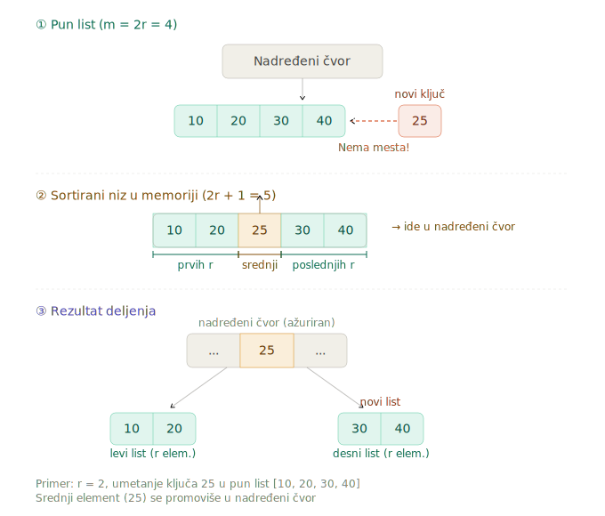
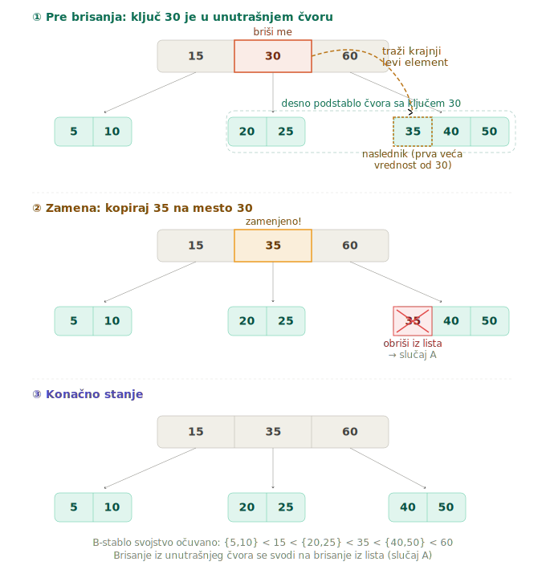
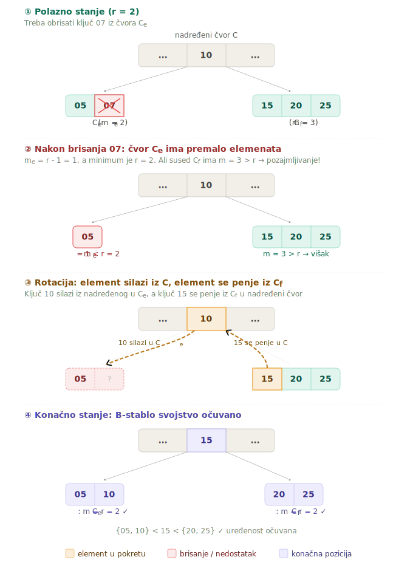
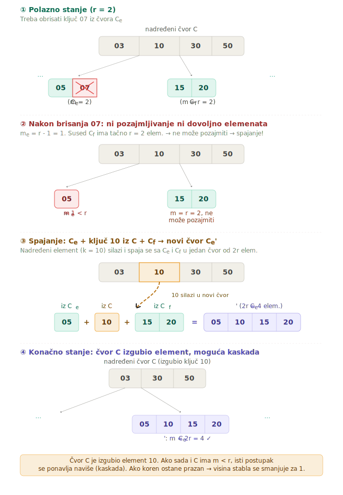
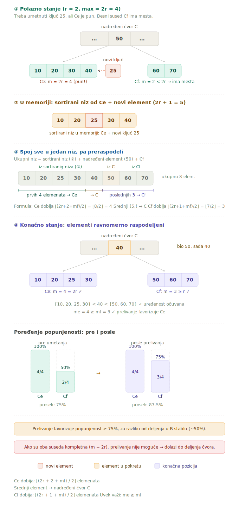
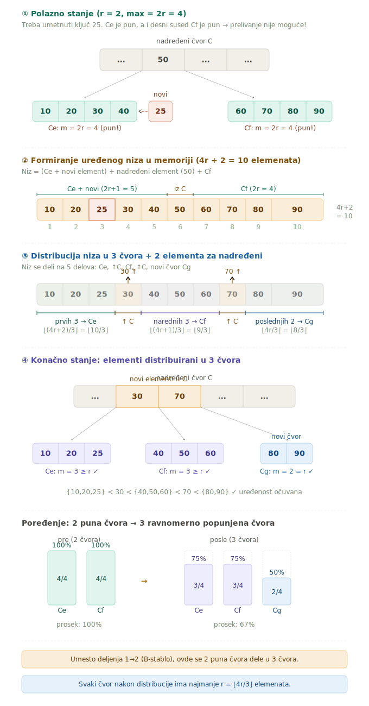

# B-stabla: Osnovno B-stablo, B\*-stablo, B#-stablo i B⁺-stablo

## Uvod - Zašto nam trebaju B-stabla?

Zamislimo da radimo u velikoj biblioteci sa 100.000 knjiga. Svaki put kad neko traži određenu knjigu po kataloškome broju, morali bismo da prelistamo hiljade kartica u kartoteci. Klasična indeks-sekvencijalna organizacija funkcioniše solidno, ali ima jednu ozbiljnu manu - vremenom, kako dodajemo i brišemo slogove, zona prekoračenja raste, a performanse obrade se pogoršavaju.

B-stablo je odgovor na taj problem. To je **dinamička indeksna struktura** koja se sama reorganizuje prilikom svakog ažuriranja, tako da performanse nikada ne degradiraju. Hajde da krenemo od osnova i prođemo kroz sve varijante, korak po korak.

---

## 1. Osnovno B-stablo

### 1.1 Definicija i svojstva

**B-stablo** je puno stablo traženja koje služi kao gusto popunjeni, dinamički indeks. Evo šta to konkretno znači:

- **Puno stablo** - svi listovi su na jednakoj udaljenosti od korena. Put od korena do bilo kog lista je uvek iste dužine. To je ono što garantuje ujednačene performanse traženja.
- **Stablo traženja** - elementi su uređeni tako da omogućavaju efikasno pretraživanje.
- **Gusto popunjeni indeks** - svaka vrednost ključa iz primarne zone propagira se u zonu indeksa.
- **Dinamički indeks** - ažurira se automatski, prati svaku promenu u primarnoj zoni.

B-stablo ima dva ključna parametra:

- **Visina $h$** - koliko nivoa ima stablo (udaljenost od korena do listova).
- **Rang $r$** (gde je $r \geq 2$) - određuje minimalan i maksimalan broj elemenata u čvorovima. Red stabla je $n = 2r + 1$.

### 1.2 Pravila popunjenosti čvorova

Ovo su pravila koja B-stablo čine B-stablom. Svaki čvor mora da ih poštuje:

1. Svaki čvor sadrži **maksimalno $2r$ elemenata**.
2. Svaki čvor, **izuzev korena**, sadrži **minimalno $r$ elemenata**.
3. **Koren** sadrži minimalno **1 element**.
4. Svaki čvor sa $m$ elemenata, koji **nije list**, poseduje tačno $m + 1$ direktno podređenih čvorova.

> [!IMPORTANT]
> Pravilo o minimalnom broju elemenata ($r$) važi za SVE čvorove osim korena. Koren može imati i samo 1 element. Ovo pravilo je temelj celokupnog balansiranja B-stabla.

### 1.3 Format čvora B-stabla

Svaki čvor B-stabla je zapravo jedan blok zone indeksa. Unutar čvora, elementi su složeni u niz. Svaki **element** je trojka:

$$(k_e, A_e, P_e), \quad e \in \{1, \ldots, m\}$$

gde je:

- $k_e$ - **vrednost ključa** sloga $S_i$ (gde $i \in \{1, 2, \ldots, N\}$)
- $A_e$ - **pridruženi podatak** (adresa sloga u primarnoj zoni)
- $P_e$ - **pokazivač** ka podstablu sa većim vrednostima ključa od $k_e$

Pored toga, na početku čvora postoji i specijalni pokazivač $P_0$, koji pokazuje na podstablo sa vrednostima ključa manjim od $k_1$.

### 1.4 Uslovi stabla traženja

Da bi B-stablo funkcionisalo kao stablo traženja, moraju da važe sledeći uslovi:

1. **Ključevi unutar čvora su sortirani rastućim redosledom:**

$$(\forall i \in \{1, \ldots, m-1\})(k_i < k_{i+1})$$

2. **Svi ključevi u podstablu na koji pokazuje $P_0$ su manji od $k_1$:**

$$(\forall k \in K(P_0))(k < k_1)$$

3. **Ključevi u podstablu na koji pokazuje $P_i$ su između $k_i$ i $k_{i+1}$:**

$$(\forall i \in \{1, \ldots, m-1\})(\forall k \in K(P_i))(k_i < k < k_{i+1})$$

4. **Svi ključevi u podstablu na koji pokazuje $P_m$ su veći od $k_m$:**

$$(\forall k \in K(P_m))(k_m < k)$$

Zamislimo čvor kao "čuvara na kapiji" - kad stigne vrednost ključa, čvor kaže: "Hej, ti idi levo (manje vrednosti), ti ostani ovde (pronašao sam te), ti idi desno (veće vrednosti)."

### 1.5 Popunjenost B-stabla - kompletno i poluprazno stablo

Za isti broj slogova $N$ i rang $r$, B-stablo može imati različite visine i različite brojeve čvorova. Dva ekstrema su nam bitna:

**Kompletno (popunjeno) B-stablo** - svi čvorovi sadrže po $2r$ elemenata. Stablo ne može biti gušće popunjeno od ovog.

**Poluprazno (polupuno) B-stablo** - svi čvorovi, osim korena, sadrže po $r$ elemenata, a koren sadrži samo 1 element. Stablo ne može biti ređe popunjeno od ovog.

### 1.6 Broj čvorova i elemenata po nivoima

Hajde da pogledamo kako se čvorovi i elementi raspoređuju po nivoima hijerarhije B-stabla ranga $r$:

| Nivo (i-1) | Visina (i) | Kompletno: Broj čvorova | Kompletno: Broj elemenata | Poluprazno: Broj čvorova | Poluprazno: Broj elemenata |
|:---:|:---:|:---:|:---:|:---:|:---:|
| 0 | 1 | 1 | $2r$ | 1 | 1 |
| 1 | 2 | $(2r+1)^1$ | $2r(2r+1)^1$ | 2 | $2r$ |
| 2 | 3 | $(2r+1)^2$ | $2r(2r+1)^2$ | $2(r+1)^1$ | $2r(r+1)^1$ |
| ... | ... | ... | ... | ... | ... |
| $i-1$ | $i$ | $(2r+1)^{i-1}$ | $2r(2r+1)^{i-1}$ | $2(r+1)^{i-2}$ | $2r(r+1)^{i-2}$ |
| $h-1$ | $h$ | $(2r+1)^{h-1}$ | $2r(2r+1)^{h-1}$ | $2(r+1)^{h-2}$ | $2r(r+1)^{h-2}$ |

### 1.7 Ukupan broj čvorova

**Za kompletno stablo:**

$$C^{kp} = \sum_{i=0}^{h-1}(2r+1)^i = \frac{(2r+1)^h - 1}{2r}$$

**Za poluprazno stablo:**

$$C^{pp} = 1 + 2\sum_{i=0}^{h-2}(r+1)^i = 1 + 2 \cdot \frac{(r+1)^{h-1} - 1}{r}$$

### 1.8 Visina B-stabla

Iz broja elemenata za kompletno stablo možemo izvesti broj slogova $N$:

$$N = 2r \cdot C^{kp} = (2r+1)^h - 1$$

pa je **minimalna visina**:

$$h_{min} = \log_{2r+1}(N+1)$$

Iz broja elemenata za poluprazno stablo:

$$N = 2(r+1)^{h-1} - 1$$

pa je **maksimalna visina**:

$$h_{max} = 1 + \log_{r+1}\left(\frac{N+1}{2}\right)$$

Uvek važi: $h_{min} \leq h \leq h_{max}$.

Za minimalan i maksimalan broj čvorova:

$$C_{min} = \frac{N}{2r}, \quad C_{max} = 1 + \frac{N-1}{r}$$

**Primer tabelarnog pregleda za $r = 50$:**

| $N$ | $r$ | $h_{min}$ | $h_{max}$ | $C_{min}$ | $C_{max}$ |
|:---:|:---:|:---:|:---:|:---:|:---:|
| $10^3$ | 50 | 2 | 2 | 10 | 20 |
| $10^4$ | 50 | 2 | 3 | $10^2$ | $2 \cdot 10^2$ |
| $10^5$ | 50 | 3 | 3 | $10^3$ | $2 \cdot 10^3$ |
| $10^6$ | 50 | 3 | 4 | $10^4$ | $2 \cdot 10^4$ |

> [!TIP]
> Za praktične vrednosti ranga $r$ i broja slogova $N$, visina B-stabla se kreće u veoma malom rasponu (obično 2-4). To znači da za pronalaženje bilo kog sloga u bazi od milion zapisa treba svega 3-4 pristupa disku!

---

## 2. Formiranje datoteke sa B-stablom

### 2.1 Struktura datoteke sa B-stablom

Datoteka sa B-stablom se sastoji od dve zone:

**Zona indeksa** - spregnuta struktura u obliku B-stabla. To je gusto popunjeni, dinamički indeks. Svaka vrednost ključa iz primarne zone propagira se u zonu indeksa. Dinamički se ažurira - prati svako ažuriranje primarne zone i omogućava traženja u primarnoj zoni.

**Primarna zona** - serijska datoteka. Koriste se dobre osobine serijske datoteke pri ažuriranju, pod pretpostavkom da se traženja ne vrše direktno u serijskoj datoteci.

### 2.2 Postupak formiranja

Formiranje se odvija u sledećem redosledu:

1. **Formiranje primarne zone** - preuzimanjem postojeće serijske datoteke ili sukcesivnim učitavanjem slogova ulazne serijske datoteke.
2. **Formiranje zone indeksa** - upisuje se zaglavlje stabla traženja, inicijalizuju se pokazivači (na koren stabla, krajnji levi čvor, prvi blok u lancu praznih blokova), formira se lanac praznih blokova.
3. **Sukcesivno čitanje slogova** primarne zone i dinamičko upisivanje novih elemenata u B-stablo. Upisivanje prvog elementa formira koren stabla.

### 2.3 Upis novog elementa u B-stablo

Svaki upis novog elementa počinje **neuspešnim traženjem** - traženje koje kreće od korena, poređenjem argumenata traženja sa vrednostima ključa u svakom čvoru, praćenjem odgovarajućih pokazivača, sve dok ne stigne do lista gde bi element trebalo da bude, ali ga nema. Upis započinje na mestu zaustavljanja tog neuspešnog traženja, u listu.

Sada postoje dva scenarija:

**(A) List je delimično popunjen: $m_e < 2r$**

Ovo je jednostavan slučaj. Novi element se upisuje na poziciju zaustavljanja traženja, a elementi sa većom vrednošću ključa u čvoru pomeraju se za jednu poziciju udesno. Zamislimo da imamo policu sa knjigama sortiranim po broju - ubacujemo novu knjigu na pravo mesto, a sve knjige desno od nje pomerimo za jedno mesto.

**(B) List je potpuno popunjen: $m_e = 2r$ - DELJENJE LISTA**

Ovde stvari postaju zanimljivije. List je pun, nema mesta za novi element. Rešenje je **deljenje lista na dva lista**:

1. Alocira se novi (desni) list.
2. U operativnoj memoriji se formira uređeni niz od $2r + 1$ elemenata (starih $2r$ + novi element).
3. **Prvih $r$ elemenata** ostaje u levom (postojećem) listu.
4. **Srednji element** (na poziciji $r + 1$) upisuje se u nadređeni čvor - ovo može izazvati deljenje nadređenog čvora!
5. **Poslednjih $r$ elemenata** upisuje se u desni (novi) list.
6. Ako se deli koren, dolazi do formiranja **novog korena** i **povećavanja visine stabla za 1**.

> [!WARNING]
> Deljenje čvorova može da se propagira od lista ka korenu stabla (kaskadno deljenje). U najgorem slučaju, svaki čvor na putu od lista do korena se deli, i na kraju se deli i sam koren, što povećava visinu stabla za 1.

### 2.4 Primer formiranja B-stabla

Neka imamo ulaznu serijsku datoteku od $N = 18$ slogova i gradimo B-stablo ranga $r = 2$. To znači da svaki čvor može imati maksimalno $2r = 4$ elementa, a minimalno $r = 2$ elementa (osim korena koji može imati 1). Rezultat je B-stablo visine $h = 3$, koje izgleda ovako:

Koren sadrži element: 34. Na drugom nivou su čvorovi sa elementima: (15, 25) i (43, 64). Na trećem nivou (listovima) nalaze se čvorovi: (03, 07, 13), (19, 23), (27, 29), (37, 40), (46, 49), (71, 88).

---

## 3. Traženje u datoteci sa B-stablom

### 3.1 Traženje logički narednog sloga

Kada tražimo logički naredni slog, koristimo **modifikovani simetrični postupak prolaska kroz B-stablo**. Postupak naizmenično pristupa listovima i njihovim nadređenim elementima.

Traženje se vrši od **tekućeg elementa stabla**. Inicijalno, tekući element je onaj sa najmanjom vrednošću ključa u krajnjem levom listu. Poređenje se vrši između argumenta traženja $a$ i vrednosti ključa elemenata stabla $k_e$. Traženje se uspešno završava kad je $a = k_e$, a neuspešno kad naiđe na element sa $k_e > a$ ili dođe do kraja krajnjeg desnog lista.

### 3.2 Traženje slučajno odabranog sloga

Traženje započinje u korenu stabla, eventualno se nastavlja u podređenim čvorovima i završava se u čvoru u kojem je element pronađen (uspešno) ili u listu (neuspešno). Na svakom nivou hijerarhije stabla pristupa se najviše jednom čvoru.

Algoritam u svakom čvoru poredi argument traženja $a$ sa vrednostima ključa $k_e$:
- Ako je $a = k_e$ - traženom slogu pristupa se na osnovu adrese $A_e$ (uspešno).
- Ako je $a < k_e$ - traženje se nastavlja u podstablu na koji pokazuje $P_{e-1}$.
- Ako je $a > k_m$ (veće od svih u čvoru) - traženje se nastavlja u podstablu na koji pokazuje $P_m$.

**Broj pristupa pri traženju slučajno odabranog sloga:**

Ako postoji **samo jedan bafer** u operativnoj memoriji za smeštaj čvorova B-stabla:
- Uspešno traženje: $R_u = h + 1$ (visina stabla + 1 pristup primarnoj zoni)
- Neuspešno traženje: $R_n = h$

Ako postoji **$h$ bafera** u operativnoj memoriji (za smeštaj kompletnog pristupnog puta):
- Uspešno: $0 \leq R_u \leq h + 1$
- Neuspešno: $0 \leq R_n \leq h$
- Ako je celo stablo u OM: $R_u = 1 (za slog iz primarne zone), R_n = 0$

---

## 4. Obrada datoteke sa B-stablom

### 4.1 Režimi obrade

Indeksna datoteka sa B-stablom se može koristiti i kao **vodeća** i u režimu **redosledne** i u režimu **direktne obrade**. U svim slučajevima pokazuje solidne performanse.

### 4.2 B-stablo kao vodeća datoteka

Ukupan broj pristupa $R_{uk}^v$ zavisi od nekoliko faktora:
- Da li je stablo kompletno ili poluprazno (kompletno ima najmanji broj čvorova, poluprazno najveći).
- Da li je rezervisano $h$ bafera za ceo pristupni put ili samo 1 bafer.
- Da li su sukcesivno traženi slogovi u primarnoj zoni smešteni u fizički susedne lokacije ili ne.

Za slučaj jednog bafera, ukupan broj pristupa kada se B-stablo koristi kao vodeća datoteka uzima celobrojne vrednosti iz intervala:

$$\left\lceil \frac{N}{f} \right\rceil + \left\lceil \frac{N}{2r} \right\rceil \leq R_{uk}^v \leq \left\lfloor \frac{N+1}{r+1} \right\rfloor + \left\lfloor \frac{N-r}{r+1} \right\rfloor + N$$

U najpovoljnijem slučaju (kada u operativnoj memoriji postoji $h$ bafera), potrebno je izvršiti $N/2r$ pristupa kompletnog B-stabla, a svaki blok primarne zone sadrži $f$ logički neposredno susednih slogova, pa je potrebno izvršiti $\lceil N/f \rceil$ pristupa primarnoj zoni.

U najnepovoljnijem slučaju (poluprazno stablo, samo jedan bafer), B-stablo je poluprazno, a za smeštaj čvorova postoji samo jedan bafer. Tada je potrebno izvršiti $C_h = (N+1)/(r+1)$ pristupa listovima i $E = (N-r)/(r+1)$ pristupa čvorovima koji ne predstavljaju listove, plus $N$ pristupa primarnoj zoni.

### 4.3 Redosledna obrada putem vodeće datoteke

U redoslednoj obradi indeksne datoteke sa B-stablom, putem vodeće datoteke od $N_v = N_v^u + N_v^n$ slogova ($N_v^u$ slogova koji iniciraju uspešno traženje, $N_v^n$ slogova koji iniciraju neuspešno traženje), ukupni broj pristupa $R_{uk}^r$ obrađivanoj indeksnoj datoteci uzima celobrojne vrednosti iz sledećeg intervala:

$$\left\lceil \frac{N_v^u}{f} \right\rceil + \left\lceil \frac{N}{2r} \right\rceil \leq R_{uk}^r \leq N_v^u + \left\lfloor \frac{N+1}{r+1} \right\rfloor + \left\lfloor \frac{N-r}{r+1} \right\rfloor$$

Pritome, važi pretpostavka da se u obradi traži i slog sa najvećom vrednošću ključa indeksne datoteke.

**Očekivani broj pristupa** $\overline{R}$ pri uspešnom ili neuspešnom traženju jednog logički narednog sloga iznosi:

$$\overline{R} = \frac{R_{uk}^r}{N_v}$$

gde je $R_{uk}^r$ dato gornjim izrazom.

**Primer 13.11.** Neka se datoteka od $N = 10000$ slogova, organizovana kao indeksna sa B-stablom ranga $r = 50$ i sa faktorom blokiranja $f = 10$ u primarnoj zoni, obrađuje putem vodeće datoteke od $N_v^u = 8400$ i $N_v^n = 900$ slogova u režimu redosledne obrade. Ukupni broj pristupa $R_{uk}^r$ pri ovoj obradi uzima celobrojne vrednosti iz intervala $[940, 8791]$, a očekivani broj pristupa $\overline{R}$ pri traženju jednog logički narednog sloga uzima vrednosti iz intervala $[0{,}10,\ 0{,}965]$.

Ako vreme pristupa i prenosa jednog bloka u operativnu memoriju iznosi $\overline{t} = 30\ msek$, tada ukupno očekivano vreme razmene podataka između datoteke i operativne memorije, pri redoslednoj obradi, uzima vrednosti iz intervala $[28{,}2,\ 263{,}7]$ sek.

### 4.4 Direktna obrada

Indeksne datoteke sa B-stablom su pogodne za direktnu obradu, jer obezbeđuju relativno brz pristup slučajno odabranom slogu. Ako se indeksna datoteka sa B-stablom obrađuje putem vodeće datoteke sa $N_v = N_v^u + N_v^n$ slogova, tada se ukupni broj pristupa $R_{uk}^d$ pri toj obradi određuje putem formule:

$$R_{uk}^d = R_u N_v^u + R_n N_v^n$$

gde su $R_u$ i $R_n$ dati formulama za uspešno, odnosno neuspešno traženje.

**Primer 13.12.** Ako se indeksna datoteka iz primera 13.11 obrađuje u režimu direktne obrade, vodećom datotekom od $N_v^u = 2100$ i $N_v^n = 900$ slogova, pod pretpostavkom da je $h = 4$ i za smeštaj čvorova rezervisan samo jedan bafer, dobija se $R_{uk}^d = 14100$ i $\overline{T} \approx 7$ min. Broj pristupa pri uspešnom traženju jednog slučajno odabranog sloga iznosi $R_u = 5$, a pri neuspešnom traženju $R_n = 4$, te odgovarajuća vremena iznose $\overline{t}_u = 150$ msek i $\overline{t}_n = 120$ msek.

---

## 5. Ažuriranje indeksne datoteke sa B-stablom

Ažuriranje se vrši u režimu direktne obrade. Svaki upis novog sloga u primarnu zonu zahteva upis novog elementa u B-stablo. Svako brisanje sloga iz primarne zone izaziva potrebu brisanja i odgovarajućeg elementa iz B-stabla. Dok je brisanje sloga u primarnoj zoni logičko, brisanje elementa u B-stablu je fizičko. Obe aktivnosti su kompleksne, jer B-stablo mora predstavljati puno, dobro balansirano stablo traženja i nakon njihove realizacije.

### 5.1 Upis novog elementa u B-stablo

Upis novog sloga u datoteku vrši se na isti način kao i pri formiranju datoteke, koristeći indeks slobodnih lokacija $E$ u zaglavlju zone indeksa.

Upis novog elementa u B-stablo, pri ažuriranju, vrši se nakon neuspešnog traženja, tako da se logičko mesto upisa svakog novog elementa nalazi u listu. Ukoliko list sadrži $m < 2r$ elemenata, novi element se upisuje u lokaciju koja odgovara njegovoj vrednosti ključa. Ukoliko list sadrži $m = 2r$ elemenata, vrši se **deljenje lista**. Deljenje se vrši kao i pri formiranju B-stabla.

**Minimalan broj pristupa** pri upisu novog elementa u B-stablo se dobija ako list sadrži $m < 2r$ elemenata. Tada je potrebno:
- $R_s$ pristupa do lista i
- 1 pristup za upis modifikovanog lista u zonu indeksa,

gde je $R_s$ dato formulom za neuspešno traženje.

Saglasno iznetom, broj pristupa $R_i$ pri upisu jednog novog elementa u B-stablo uzima celobrojne vrednosti iz intervala $[R_s + 1,\ 4h]$, odnosno

$$R_s + 1 \leq R_i \leq 4h$$

**Maksimalan broj pristupa** pri upisu novog elementa u B-stablo se dobija pri deljenju svih čvorova u pristupnom putu. Tada je, pod pretpostavkom da je u operativnoj memoriji rezervisan samo jedan bafer za smeštaj čvorova B-stabla, potrebno izvršiti:
- $h$ pristupa do lista,
- $h - 1$ pristupa za čitanje direktno nadređenih čvorova,
- $2h$ pristupa za upis novih čvorova dobijenih deljenjem i
- 1 pristup za upis novog korena.

Ukupno: $4h$ pristupa.

**Srednji broj pristupa** pri upisu novog elementa u B-stablo je znatno manji od maksimalnog, jer u većini slučajeva ne dolazi do deljenja. Ukupni broj deljenja, pri formiranju B-stabla od $C$ čvorova iznosi $C - 1$, jer se svi, osim prvog čvora, dobijaju deljenjem. Maksimalan broj čvorova, pri datom broju elemenata, sadrži poluprazno stablo. Tada je $C - 1 = (N-1)/r$.

Jedno deljenje čvora, u najnepovoljnijem slučaju, zahteva **4 pristupa B-stablu** (jedan pristup susedu, jedan pristup direktno nadređenom, jedan pristup za upis spojenog čvora i jedan pristup za upis modifikovanog nadređenog čvora). Najnepovoljniji slučaj se dobija kada postoji samo jedan bafer za čvorove stabla i kada deljenje čvora ne dovodi do deljenja nadređenog čvora. Tada je, pored $h$ pristupa do lista, potrebno:

- 2 pristupa za upis dva nova čvora u zonu indeksa,
- 1 pristup za čitanje direktno nadređenog čvora i
- 1 pristup za upis modifikovanog direktno nadređenog čvora u zonu indeksa.

Za $N \gg 1$ i $r \gg h$, dobija se $\overline{R}_i \approx h + 1$.

### 5.2 Brisanje elementa iz B-stabla

Pošto se brisanje sloga u primarnoj zoni vrši logički, neće mu biti poklanjana dalja pažnja. Brisanje elementa iz B-stabla je fizičko.

Brisanju prethodi **uspešno traženje** u B-stablu. Neka je pri tome pronađen element sa vrednošću ključa $k_e$. Element sa vrednošću ključa $k_e$ se sme izbrisati jedino ako se nalazi u **listu**.

#### Slučaj A: Element za brisanje nalazi se u listu

**(A1) List sadrži $m_e > r$ elemenata ili je koren stabla** - Vrši se jednostavno fizičko oslobađanje lokacije izbrisanog elementa, sa pomeranjem ostalih elemenata ulevo. Nakon brisanja, u listu ostaje $m_e - 1 \geq r$ elemenata.

**(A2) List sadrži $m_e = r$ elemenata i nije koren stabla** - Fizičko oslobađanje lokacije izbrisanog elementa nije dozvoljeno jer bi čvor imao manje od $r$ elemenata. Ovde postoje dva podslučaja:

**(A21) Postoji barem jedan susedni čvor sa $m_f > r$ elemenata** - primenjuje se **tehnika pozajmljivanja**.

**(A22) Svi susedni čvorovi imaju $m_f = r$ elemenata** - primenjuje se **tehnika spajanja**.

#### Slučaj B: Element za brisanje NE nalazi se u listu

Element se **zamenjuje** elementom koji sadrži prvu veću vrednost ključa. To je krajnji levi element u krajnjem levom čvoru desnog podstabla u odnosu na element koji se briše. Nakon zamene, taj element s prvom većom vrednošću ključa fizički se briše iz lista - čime se vraćamo na slučaj A.

### 5.3 Susedni čvorovi - definicija

Dva čvora $C_e$ i $C_f$ se nazivaju **susednim**, ako imaju zajednički direktno nadređeni čvor $C$ i ako važi:

$$(\nexists k \in K(C))(k_m < k < k_1)$$

gde je $K(C)$ skup vrednosti ključa u čvoru $C$, $k_m$ najveća vrednost ključa u čvoru $C_e$, a $k_1$ najmanja vrednost ključa u čvoru $C_f$.

Drugim rečima, između njih u nadređenom čvoru ne postoji nijedan drugi ključ.

> [!NOTE]
> U daljem tekstu se smatra da se sve operacije nad B-stablom, koje su zasnovane na pozajmljivanju, izvršavaju sa desnim susedom, ako on postoji. Inače, sa levim susedom.

### 5.4 Tehnika pozajmljivanja

Pozajmljivanje se primenjuje kada nakon brisanja elementa, čvor $C_e$ sadrži $m_e = r - 1$ elemenata, a bar jedan njegov sused $m > r$ elemenata. Neka je to desni sused, čvor $C_f$. Postupak se odvija na sledeći način:

1. Prvo se u operativnoj memoriji vrši spajanje čvorova $C_e$ i $C_f$ u čvor $C_e'$, i upis delova čvora $C_e'$ u čvorove $C_e$, $C$ i $C_f$.
2. Element $(k, A)$ je zajednički nadređeni element čvorova $C_e$ i $C_f$ u čvoru $C$. Element $(k_f', A_f')$ je zamenio u čvoru $C$ element $(k, A)$. Elemental $(k, A)$ je dopunio čvor $C_e$. Pri tome je $(k_f', A_f')$ nasledio pokazivač $P_f$ od $(k, A)$. Element $(k, A)$ je dobio kao pokazivač pokazivač $P_0$ čvora $C_f$, a pokazivač $P_f$ elementa $(k_f', A_f')$ postao je pokazivač $P_0$ čvora $C_f$.

Suština: element "silazi" iz nadređenog čvora u čvor iz kog se brisalo, a element iz suseda "penje" se u nadređeni čvor.

### 5.5 Tehnika spajanja

Spajanje se primenjuje kada nakon brisanja elementa, čvor $C_e$ sadrži $m_e = r - 1$ elemenata, a svi susedni čvorovi imaju tačno $m_f = r$ elemenata. Tada se vrši ili spajanje, kada se dva susedna lista spajaju u jedan, ili pozajmljivanje, kada se elementi dva susedna lista približno ravnomerno raspodele, kako bi oba imala $m \geq r$ elemenata.

Kada se vrši spajanje: Ako nakon brisanja elementa, list $C_e$ sadrži $m = r - 1$ elemenata, dolazi do njegovog spajanja sa susedom $C_f$, ako sused ima samo $r$ elemenata. Pri spajanju listova $C_e$ i $C_f$ formira se novi list $C_e'$ sa $2r$ elementima. Pri tome se nadređeni element lista $C_e$ sa vrednošću ključa $k$ briše iz čvora $C$ i upisuje se u list $C_e'$ kao element $(k, A, P_0')$, gde je $P_0'$ pokazivač $P_0$ lista $C_f$.

Indeks $m$ krajnjeg desnog elementa čvora $C_f$ na slici ima vrednost $m = r$.

Nakon spajanja listova $C_e$ i $C_f$, direktno nadređeni čvor $C$ je ostao bez jednog elementa. Sada za njega može važiti $m < r$. Brisanje elementa u listu može dovesti do potrebe spajanja čvorova na višim nivoima hijerarhije. Proces se može produžiti do korena. Ako koren sadrži samo jedan element, doći će do smanjenja visine stabla za jedan. Postupak spajanja dva čvora na svakom nivou hijerarhije B-stabla identičan je opisanom postupku spajanja listova.

### 5.6 Broj pristupa pri brisanju

**Minimalan broj pristupa** $R_d$ pri brisanju jednog elementa iz B-stabla se dobija ako se briše element u listu koji sadrži $m > r$ elemenata. Tada je potrebno:
- $R_s$ pristupa do lista i
- 1 pristup za upis modifikovanog lista u zonu indeksa.

Dakle, $R_d$ uzima celobrojne vrednosti iz intervala:

$$R_s + 1 \leq R_d \leq 4h - 1$$

Pri izvođenju izraza za maksimalan broj pristupa pri brisanju, pretpostavljeno je da se pre spajanja ne vrši provera oba, već samo jednog suseda. U slučaju provere oba suseda, maksimalan broj pristupa bi iznosio $5h - 2$.

**Maksimalan broj pristupa** pri brisanju jednog elementa iz B-stabla je potreban samo u izuzetnim slučajevima, pri brisanju jednog elementa je znatno manji. Ukupan broj spajanja, pri brisanju svih elemenata iz B-stabla iznosi $C - 1$, jer se spajanja mogu vršiti dok ne preostane samo jedan čvor. Maksimalan broj čvorova, pri datom broju elemenata, sadrži poluprazno stablo. Tada je $C - 1 = (N-1)/r$. Svako spajanje zahteva, u najnepovoljnijem slučaju, 4 pristupa B-stablu.

**Srednji broj pristupa** pri brisanju jednog elementa iznosi:

$$\frac{4(N-1)}{Nr}$$

---

## 6. Ocena karakteristika indeksne datoteke sa B-stablom

### 6.1 Prednosti

Indeksne datoteke sa B-stablom poseduju dve značajne prednosti nad indeks-sekvencijalnim datotekama:

1. **Ne zahtevaju postojanje zone prekoračenja**, jer im struktura primarne zone odgovara strukturi serijske datoteke.
2. **Maksimalni broj pristupa pri traženju slučajno odabranog sloga je tačno definisan.** Ne može biti veći od $h + 1$, a visina $h$ B-stabla je proporcionalna logaritmu za osnovu $r$ od broja slogova $N$. Za praktične vrednosti ranga $r$ i broja slogova $N$, visina stabla ne prelazi vrednost $h = 5$. Indeksne datoteke sa B-stablom su veoma pogodne za direktnu obradu.

### 6.2 Nedostaci

Analiza performansi obrade ove datoteke, sprovedena u prethodnim tačkama ovog poglavlja, ukazuje i na dva njena nedostatka:

1. **Nije najpogodnije rešenje za redoslednu obradu.** Postoje dva razloga: broj pristupa datoteci zavisi od broja slogova $N_v$ vodeće datoteke. Drugi razlog leži u potrebi primene modifikovanog algoritma simetričnog postupka prolaska kroz stablo pri traženju adrese lokacije logički narednog sloga. Taj postupak zahteva relativno veliki broj pristupa čvorovima stabla, a još je potrebno po jedan pristup primarnoj zoni za svako uspešno traženje.

2. **Deljenje čvorova favorizuje izgradnju polupraznog B-stabla.** Pri datom broju slogova $N$ i datom rangu $r$, poluprazno stablo poseduje maksimalan broj čvorova i maksimalnu visinu, što rezultuje u nižim performansama traženja i obrade nego u slučaju B-stabla sa kompletnijim čvorovima.

**Primer 13.17.** U praksi se indeksne datoteke sa B-stablom često formiraju korišćenjem sekvencijalne ulazne datoteke, jer takav postupak rezultuje u kraćem vremenu formiranja datoteke. U stvari, skraćuje se vreme izgradnje B-stabla, jer se novi elementi upisuju u tekući list. Međutim, opisani postupak rezultuje u B-stablu čiji su svi listovi, eventualno osim krajnjeg desnog, poluprazni.

> [!IMPORTANT]
> Rešenje problema izgradnje polupraznog stabla donose varijante B-stabla kod kojih se deljenje čvorova odlaže korišćenjem tehnike nazvane **prelivanje**. Prva varijanta je $B^*$-stablo, a druga je $B^\#$-stablo (B heš stablo).

---

## 7. B\*-stablo

### 7.1 Motivacija i ideja

B\*-stablo je strukturalno isto kao osnovno B-stablo, ali uvodi **tehniku prelivanja** koja ublažava problem favorizacije polupraznog stabla. Ideju B\*-stabla opisali su autori ideje B-stabla, Bayer i McCreight. Prelivanje se koristi i pri formiranju i pri ažuriranju B\*-stabla, da bi se odložilo deljenje čvora.

### 7.2 Tehnika prelivanja

Prelivanje se realizuje na sledeći način. Ako treba upisati novi element u čvor $C_e$ koji je kompletan (sadrži $m = 2r$ elemenata), a njemu susedni čvor $C_f$ sadrži $m < 2r$ elemenata:

1. Prvo se u operativnoj memoriji, od čvora $C_e$ i novog elementa, formira niz od $2r + 1$ elemenata, uređen saglasno rastućim vrednostima ključa.
2. Zatim se izvrši prelivanje između dobijenog niza i čvora $C_f$, kao što se vrši prelivanje kod brisanja u osnovnom B-stablu.

Prelivanje se vrši ako bar jedan od suseda čvora $C_e$ sadrži $m < 2r$ elemenata. Ako oba suseda zadovoljavaju taj uslov, onda se prelivanje vrši sa desnim. Na ovom mestu se posmatra prelivanje sa desnim susedom. Pri prelivanju se prvo formira niz:

$$e_1^e, \ldots, e_{2r}^e, e_{2r+1}, i^s, e, e_1^f, \ldots, e_{m_f}^f$$

elemenata čvorova $C_e$ i $C_f$, gde je $e$ zajednički nadređeni element čvorova $C_e$ i $C_f$ u čvoru $C$. Nakon deljenja niza, čvor $C_e$ sadrži prvih $\lfloor(2r + 2 + m_f)/2\rfloor$ elemenata tog niza, gde je $m_f$ broj elemenata čvora $C_f$. Element sa rednim brojem $\lfloor(2r + 2 + m_f)/2\rfloor + 1$ u nizu upisuje se u čvor $C$, a poslednjih $\lfloor(2r + 1 + m_f)/2\rfloor$ elemenata niza sadrži čvor $C_f$. Znači, nakon prelivanja će važiti $m_e \geq m_f$.

Nakon prelivanja, čvor $C_f$ sadrži minimalan broj elemenata, ako je pre prelivanja sadržao samo $m_f = r$ elemenata. Tada je nakon prelivanja $m_f' = \lfloor(3r + 1)/2\rfloor$. Ako je pre prelivanja čvor $C_f$ sadržao $m_f = 2r - 1$ element, nakon prelivanja čvor $C_e$ i $C_f$ sadrže po $2r$ elemenata. **Prelivanje favorizuje izgradnju stabla kod kojeg je kapacitet čvorova popunjen najmanje 75%.**

> [!IMPORTANT]
> Kod B\*-stabla, 50% predstavlja donju granicu popunjenosti čvorova (kao i kod osnovnog B-stabla), ali prelivanje praktično podiže prosečnu popunjenost na oko **75%**.

Međutim, ako se pri upisu novog elementa prepuni čvor čija oba suseda su kompletna, dolazi do deljenja. Deljenjem se ponovo dobijaju čvorovi sa po $r$ elemenata, što znači da i u B\*-stablu dolazi do deljenja.

---

## 8. B#-stablo (B heš stablo)

### 8.1 Motivacija i ideja

B#-stablo predstavlja varijantu osnovnog B-stabla i B\*-stabla kod koje se za čvorove na svim nivoima hijerarhije, osim na prva dva, **garantuje popunjenost od najmanje 66%**, a time i povoljnije performanse stabla traženja. Efekat se postiže uvođenjem postupka **distribuiranog deljenja**.

### 8.2 Tehnika distribuiranog deljenja

Kada treba upisati nov element u čvor $C_e$ koji je kompletan, a kompletna su mu i oba suseda, elementi susednih čvorova $C_e$ i $C_f$ se **distribuiraju u tri čvora**. Postupak je sledeći:

1. Prvo se formira niz od $2r + 1$ elementa čvora $C_e$, zajedničkog nadređenog elementa čvorova $C_e$ i $C_f$ u čvoru $C$, i od $2r$ elemenata čvora $C_f$.
2. Zatim se vrši distribucija elemenata tog niza od $4r + 2$ elemenata:
   - Prvih $\lfloor(4r + 2)/3\rfloor$ elemenata upisuje se u čvor $C_e$.
   - Element sa rednim brojem $\lfloor(4r + 2)/3\rfloor + 1$ u nizu, upisuje se u nadređeni čvor $C$.
   - Narednih $\lfloor(4r + 1)/3\rfloor$ elemenata upisuje se u čvor $C_f$.
   - Element sa rednim brojem $\lfloor(4r + 2)/3\rfloor + \lfloor(4r + 1)/3\rfloor + 2$ upisuje se u nadređeni čvor $C$.
   - Poslednjih $\lfloor 4r/3 \rfloor$ elemenata upisuje se u novi čvor $C_g$.

### 8.3 Razlika između B# i B\*-stabla

Pri formiranju i ažuriranju B#-stabla, klasično deljenje se primenjuje jedino u slučaju kada se prepuni koren stabla. U svim drugim prilikama, koristi se prelivanje i distribuirano deljenje. Krajnji cilj je da se dobije stablo sa što "kompletnijim" čvorovima, što garantuje manji broj čvorova i manju visinu stabla.

> [!TIP]
> Za ispit je korisno zapamtiti ključnu razliku: B\*-stablo koristi prelivanje (2 čvora, 75% popunjenost), a B#-stablo dodaje i distribuirano deljenje (3 čvora, 66% garantovana popunjenost).

---

## 9. B⁺-stablo

### 9.1 Motivacija i problem koji rešava

Jedan od nedostataka osnovnog B-stabla i njegovih varijanti $B^*$ i $B^\#$ je činjenica da je pri traženju logički narednog sloga potrebno pristupati svim čvorovima stabla, te se odgovarajuća indeksna datoteka ne može kvalifikovati kao pogodna za redoslednu obradu. **Modifikacija osnovnog B-stabla**, kod koje:

- **vrednosti ključa svih slogova se nalaze u listovima**,
- **svi listovi su spregnuti** tako da sadrže informaciju o vezama između slogova u logičkoj strukturi podataka datoteke,
- **čvorovi na višim nivoima stabla traženja** sadrže najmanje vrednosti ključa iz svakog lista osim iz krajnjeg levog,
- **vrednosti ključa čvorova koji ne predstavljaju listove**, se u nadređenim čvorovima **ne ponavljaju**, tako da struktura onih čvorova koji ne predstavljaju listove odgovara strukturi osnovnog B-stabla,

pogodnija je za traženje logički narednog sloga. Ovakvo stablo traženja se često u literaturi naziva **B⁺-stablom**.

### 9.2 Struktura B⁺-stabla

**Format bloka zone indeksa** je sličan kao i u slučaju osnovnog B-stabla.

**Čvorovi B⁺-stabla na nivou $h - 1$** sadrže elemente $(k_e, P_e)$, pri čemu pokazivač $P_e$ predstavlja adresu direktno podređenog lista sa vrednostima ključa većim ili jednakim $k_e$. Pokazivač $P_0$ predstavlja adresu podređenog čvora sa vrednostima ključa manjim od najmanje vrednosti ključa u posmatranom čvoru. Čvorovi na nivoima od 1 do $h - 2$ sadrže parove $(k_e, P_e)$, pri čemu $P_e$ predstavlja adresu direktno podređenog čvora sa većim vrednostima ključa od $k_e$. Pokazivač $P_0$ i u ovim čvorovima sadrži adresu podređenog čvora sa vrednostima ključa manjim od najmanje vrednosti ključa u posmatranom čvoru.

**Listovi B⁺-stabla** sadrže parove $(k_e, A_e)$, gde je $A_e$ adresa lokacije sloga u primarnoj zoni. Pokazivači $P_0$ u listovima sadrže adresu lista sa prvom većom vrednošću ključa, što znači da listovi obrazuju spregnutu datoteku sa linearnom logičkom strukturom.

**Primer 13.20.** Na slici 13.18 prikazana je struktura jednog B⁺-stabla ranga $r = 2$ i visine $h^+ = 3$, koje sadrži 19 različitih vrednosti ključa i 24 elementa. Vrednosti ključa iz svakog osim krajnjeg levog lista ponavljaju se u po jednom čvoru koji ne predstavlja list. B⁺-stablo sa slike 13.18 se može posmatrati kao stablo traženja indeksne datoteke sa slike 13.3, proširene slogom sa vrednošću ključa $k(S_{19}) = 01$.

### 9.3 Visina B⁺-stabla

Kao i osnovno B-stablo i B⁺-stablo može biti poluprazno, a može biti i kompletno. Minimalni i maksimalni broj čvorova B⁺-stabla ranga $r$ i visine $h^+$ dati su istim formulama kao i u slučaju osnovnog B-stabla (formule za $C^{kp}$ i $C^{pp}$).

Pri datom broju slogova $N$ u primarnoj zoni, B⁺-stablo ranga $r$ će imati **minimalnu visinu** ako je kompletno. Tada listovi sadrže:

$$N = 2r(2r+1)^{h^+ - 1}$$

elemenata, te minimalna visina B⁺-stabla iznosi:

$$h_{min}^+ = 1 + \log_{2r+1}\left(\frac{N}{2r}\right)$$

B⁺-stablo ranga $r$ ima **maksimalnu visinu**, pri datom broju slogova $N$, ako je poluprazno. Tada listovi sadrže:

$$N = 2r(r+1)^{h^+ - 2}$$

elemenata, te maksimalna visina B⁺-stabla iznosi:

$$h_{max}^+ = 2 + \log_{r+1}\left(\frac{N}{2r}\right)$$

### 9.4 Razlika u broju elemenata - $\Delta E$

Ako se sa $\Delta E$ označi razlika između broja elemenata u B⁺-stablu i broja slogova u primarnoj zoni, ta razlika je minimalna kada je B⁺-stablo kompletno, a maksimalna kada je poluprazno. Pošto je broj elemenata u čvorovima koji ne predstavljaju listove uvek za jedan manji od broja listova, $\Delta E$ uzima celobrojne vrednosti iz intervala:

$$\left\lceil \frac{N}{2r} \right\rceil - 1 \leq \Delta E \leq \left\lfloor \frac{N}{r} \right\rfloor - 1, \quad N \geq r$$

### 9.5 Formiranje B⁺-stabla

Osnovna razlika između postupka formiranja $B$ i $B^+$-stabla potiče od potrebe da se pri deljenju lista "srednji" element upiše i u nadređeni čvor i u novi list, kao element sa najmanjom vrednošću ključa u novom listu. Takođe, u $P_0$ pokazivač novog lista se upisuje adresa novog lista, a u $P_0$ pokazivač starog lista prethodni sadržaj pokazivača starog lista. Čvorovi B⁺-stabla koji ne predstavljaju listove dele se kao i čvorovi osnovnog B-stabla.

Pri formiranju B⁺-stabla mogu se koristiti sva tri postupka upisa novog elementa u B-stablo: **deljenje**, **prelivanje** i **distribuirano deljenje**. Pri tome se mora voditi računa o specifičnostima strukture B⁺-stabla. Na taj način se dobija B⁺-stablo sa performansama sličnim performansama B#-stabla.

#### Specifičnosti deljenja lista u B⁺-stablu

Pri deljenju lista B⁺-stabla, prvih $r$ od $2r + 1$ elemenata ostaje u listu, element sa rednim brojem $r + 1$ se upisuje u nadređeni čvor, a poslednjih $r + 1$ elemenata se upisuje u novi list (jer se element $r + 1$ **ponavlja** - i u nadređenom čvoru i u novom listu). Neterminalni čvorovi dele se na isti način kao kod B-stabla.

#### Specifičnosti prelivanja u listovima B⁺-stabla

Pri prelivanju između listova $L$ i $L'$ B⁺-stabla, prvih $\lfloor(2r + 1 + m')/2\rfloor$ elemenata niza od $2r + 1 + m'$ elemenata ostaje u listu $L$, gde je $m'$ broj elemenata lista $L'$. Element sa rednim brojem $\lfloor(2r + 1 + m')/2\rfloor + 1$ se upisuje u nadređeni čvor, a poslednjih $\lceil(2r + 1 + m)/2\rceil$ elemenata se upisuje u listu $L'$.

#### Specifičnosti distribuiranog deljenja u B⁺-stablu

Pri distribuiranom deljenju listova $L$ i $L'$ B⁺-stabla, prvih $\lfloor(4r + 1)/3\rfloor$ elemenata niza od $4r + 1$ elemenata ostaje u listu $L$, element sa rednim brojem $\lfloor(4r + 1)/3\rfloor + 1$ u nizu upisuje se u nadređeni čvor, u list $L'$ se upisuje $\lceil(4r+1)/3\rceil$ sukcesivnih elemenata niza, počev od elementa sa rednim brojem $\lfloor(4r + 1)/3\rfloor + 1$. Element sa rednim brojem $\lfloor(4r + 1)/3\rfloor + \lceil(4r + 1)/3\rceil + 1$ se takođe upisuje u nadređeni čvor, a u novi list $L''$ se upisuje $\lceil 4r / 3 \rceil$ poslednjih elemenata niza.

### 9.6 Traženje u B⁺-stablu

#### Traženje logički narednog sloga

Traženje adrese lokacije u primarnoj zoni logički narednog sloga vrši se u **listovima B⁺-stabla**, primenom kombinacije metoda linearnog traženja i metode praćenja pokazivača. Metoda linearnog traženja se koristi u listu kao u sekvencijalnoj datoteci, a praćenje pokazivača se koristi za prelazak iz lista u list. Logički susedni listovi ne zauzimaju fizički susedne blokove zone indeksa.

Traženje adrese lokacije logički narednog sloga vrši se od tekućeg elementa B⁺-stabla. Inicijalno, tekući element je prvi element krajnjeg levog lista B⁺-stabla. Pri uspešnom traženju, potrebno je izvršiti još jedan pristup u primarnu zonu da bi se slog preneo u operativnu memoriju. Neuspešno traženje se zaustavlja na elementu u listu B⁺-stabla.

**Broj pristupa $R_u$** za pronalaženje jednog logički narednog sloga u indeks-nesekvencijalnoj datoteci sa B⁺-stablom uzima celobrojne vrednosti iz intervala:

$$0 \leq R_u \leq C_h - \lceil i/r \rceil + 1$$

gde je:

$$\left\lceil \frac{N}{2r} \right\rceil \leq C_h \leq \left\lfloor \frac{N}{r} \right\rfloor$$

$C_h$ je broj listova, a $i$ je redni broj tekućeg elementa stabla u logičkoj strukturi podataka datoteke.

Pri neuspešnom traženju jednog logički narednog sloga, broj pristupa $R_n$ uzima celobrojne vrednosti iz intervala:

$$0 \leq R_n \leq C_h - \lceil i/r \rceil$$

Efikasnost traženja logički narednog sloga u indeks-nesekvencijalnoj datoteci sa B⁺-stablom ne zavisi od broja bafera rezervisanih u operativnoj memoriji za smeštaj čvorova B⁺-stabla.

#### Traženje slučajno odabranog sloga

Traženje adrese lokacije u primarnoj zoni slučajno odabranog sloga počinje u korenu B⁺-stabla, a uvek se završava u jednom od listova. Traženje u čvoru koji ne predstavlja list završava se kada se pronađe element sa većom ili jednakom vrednošću ključa u odnosu na argument traženja, ili kada se dođe do kraja čvora.

Ako je $a < k_e$, prati se pokazivač $P_{e-1}$; ako je $a = k_e$, prati se pokazivač $P_e$; ako je $a > k_m$, prati se pokazivač $P_m$. U slučaju uspešnog traženja sloga se nalazi u listu. Nakon toga, potreban je još jedan pristup u primarnu zonu da bi se traženi slog pročitao.

**Broj pristupa - samo jedan bafer u OM za stablo pristupa:**
- Uspešno traženje: $R_u = h^+ + 1$
- Neuspešno traženje: $R_n = h^+$

Ako postoji $h$ bafera, tada, u slučaju uspešnog i u slučaju neuspešnog traženja, broj pristupa B⁺-stablu iznosi $R = h^+$, gde $h^+$ uzima celobrojne vrednosti iz intervala:

$$\left[1 + \log_{2r+1}\frac{N}{2r},\ 2 + \log_{r+1}\frac{N}{2r}\right]$$

odnosno:

$$1 + \left\lceil \log_{2r+1}\frac{N}{2r} \right\rceil \leq h^+ \leq 2 + \left\lfloor \log_{r+1}\frac{N}{2r} \right\rfloor$$

Kao i u slučaju indeksne datoteke sa osnovnim B-stablom, pri uspešnom traženju slučajno odabranog sloga u indeksnoj datoteci sa B⁺-stablom važi:

$$0 \leq R_u \leq h^+ + 1$$

a pri neuspešnom traženju važi:

$$0 \leq R_n \leq h^+$$

Pri istom broju slogova $N$ u datoteci i istom rangu $r$, broj elemenata $E^+$ u B⁺-stablu je veći nego broj elemenata $E^\#$ u B#-stablu, tako da uvek važi $h^+ \geq h^\#$, gde je $h^\#$ visina B#-stabla. Saglasno tome je i broj pristupa pri traženju u B⁺-stablu uvek veći ili jednak broju pristupa pri traženju u odgovarajućem B#-stablu.

### 9.7 Obrada indeks-nesekvencijalne datoteke sa B⁺-stablom

Indeks-nesekvencijalna datoteka sa B⁺-stablom predstavlja pogodnije rešenje za redoslednu obradu od datoteke sa osnovnim $B$, $B^*$ ili $B^\#$-stablom, zahvaljujući činjenici da se sve vrednosti ključa datoteke nalaze u listovima B⁺-stabla. Efikasnost direktne obrade datoteke sa B⁺-stablom se neznatno razlikuje od efikasnosti direktne obrade datoteke sa B#-stablom, te joj dalje neće biti poklanjana pažnja.

Kada se indeks-nesekvencijalna datoteka sa B⁺-stablom koristi kao vodeća, ukupni broj pristupa $R_{uk}^v$ datoteci uzima celobrojne vrednosti iz intervala:

$$\left\lceil \frac{N}{f} \right\rceil + \left\lceil \frac{N}{2r} \right\rceil \leq R_{uk}^v \leq N + \left\lfloor \frac{N}{r} \right\rfloor$$

gde je $f$ faktor blokiranja u primarnoj zoni datoteke.

U redoslednoj obradi indeks-nesekvencijalne datoteke sa B⁺-stablom putem vodeće datoteke od $N_v = N_v^u + N_v^n$ slogova, ukupni broj pristupa $R_{uk}^r$ obrađivanoj indeks-nesekvencijalnoj datoteci sa B⁺-stablom uzima celobrojne vrednosti iz intervala:

$$\left\lceil \frac{N_v^u}{f} \right\rceil + \left\lceil \frac{N}{2r} \right\rceil \leq R_{uk}^r \leq N_v^u + \left\lfloor \frac{N}{r} \right\rfloor$$

Očekivani broj pristupa $\overline{R}$ bilo pri uspešnom bilo pri neuspešnom traženju logički narednog sloga iznosi:

$$\overline{R} = \frac{R_{uk}^r}{N_v}$$

gde je $R_{uk}^r$ dato gornjim izrazom.

Treba zapaziti da, saglasno gornjim izrazima, efikasnost redosledne obrade indeks-nesekvencijalne datoteke sa B⁺-stablom zavisi od broja slogova vodeće datoteke i da je za svako uspešno traženje logički narednog sloga potrebno, u najnepovoljnijem slučaju, izvršiti jedan pristup primarnoj zoni datoteke.

Da bi se ovaj najnepovoljniji slučaj izbegao, u praksi se uvodi sledeće ograničenje u smeštanje slogova čije vrednosti ključa se nalaze u istom listu. Svakom listu se pridružuje $\lceil m/f \rceil$ blokova u primarnoj zoni ($r \leq m \leq 2r$), a slogovi se smeštaju samo u blokove pridružene odgovarajućem listu. U operativnoj memoriji se rezerviše $\lceil 2r/f \rceil$ bafera za smeštaj blokova primarne zone. Saglasno tome, formula se transformiše u:

$$\left\lceil \frac{N_v^u}{f} \right\rceil + \left\lceil \frac{N}{2r} \right\rceil \leq R_{uk}^r \leq \left\lfloor \frac{N}{r} \right\rfloor \left(1 + \left\lceil \frac{r}{f} \right\rceil\right)$$

**Primer 13.24.** Neka se datoteka od $N = 10000$ slogova, organizovana kao indeks-nesekvencijalna sa B⁺-stablom ranga $r = 50$ i faktorom blokiranja $f = 10$ u primarnoj zoni, obrađuje putem vodeće datoteke od $N_v^u = 8400$ i $N_v^n = 900$ slogova u režimu redosledne obrade. Ukupni broj pristupa $R_{uk}^r$ pri ovoj obradi uzima vrednosti iz intervala $[940, 8600]$. Očekivani broj pristupa $\overline{R}$ pri traženju jednog logički narednog sloga uzima vrednosti iz intervala $[0{,}10,\ 0{,}92]$.

**Primer 13.25.** S obzirom na formulu sa grupisanjem, ukupni broj pristupa $R_{uk}^r$ pri obradi indeks-nesekvencijalne datoteke sa B⁺-stablom iz primera 13.24 uzima vrednosti iz intervala $[940, 1000]$, što ukazuje na značajno bolje performanse redosledne obrade datoteke sa B⁺-stablom u odnosu na datoteku sa osnovnim B-stablom, sa istim skupom slogova (primer 13.11, ne ukazuje na značajnije poboljšanje).

Upoređenje performansi redosledne obrade indeks-nesekvencijalne datoteke sa B⁺-stablom sa performansama obrade indeks-nesekvencijalne datoteke sa osnovnim B-stablom, sa istim skupom slogova (primer 13.11), ukazuje na značajnije poboljšanje.

### 9.8 Ažuriranje B⁺-stabla

Upis novog elementa u B⁺-stablo vrši se na isti način kao pri formiranju B⁺-stabla.

Prilikom **brisanja** elementa iz čvora sa $r$ elemenata koriste se ili pozajmljivanje ili spajanje. Brisati se može i element u listu i, ako je ponovljen, element sa istom vrednošću ključa u nadređenom čvoru. Ako se brišu samo elementi u listu, smanjuje se broj pristupa B⁺-stablu, potreban za izvršavanje operacije. Pri tome, u čvorovima na višim nivoima hijerarhije ostaju elementi sa neaktuelnim vrednostima ključa. Ovi elementi ne ometaju proces traženja. Eliminišu se iz datoteke prilikom njene reorganizacije.

---

## 10. Uporedni pregled svih varijanti

| Karakteristika | B-stablo | B\*-stablo | B#-stablo | B⁺-stablo |
|:---|:---:|:---:|:---:|:---:|
| Min. popunjenost čvorova | 50% | 50% (ali ~75% u praksi) | 66% | 50% (zavisi od varijante) |
| Tehnika pri prepunjenosti | Deljenje | Prelivanje + deljenje | Prelivanje + distribuirano deljenje | Deljenje (+ prelivanje/distr.) |
| Ključevi u listovima | Samo neki | Samo neki | Samo neki | SVI |
| Listovi spregnuti | Ne | Ne | Ne | Da |
| Pogodnost za redoslednu obradu | Slabija | Slabija | Slabija | Dobra |
| Pogodnost za direktnu obradu | Dobra | Dobra | Dobra | Dobra |
| Visina stabla (za iste $N$, $r$) | Referentna | Manja ili jednaka | Manja ili jednaka | Veća ili jednaka |

> [!CAUTION]
> Na ispitu se često traži poređenje varijanti B-stabla. Zapamtite: B⁺-stablo ima VEĆU visinu od osnovnog B-stabla (jer listovi sadrže SVE ključeve, pa ima više elemenata), ali je MNOGO pogodnije za redoslednu obradu jer se prolazi samo kroz listove.

---

## 🎴 Brza pitanja (definicije, pojmovi, delovi)

**P:** Šta je B-stablo?

**P:** Šta znači da je B-stablo "puno stablo"?

**P:** Šta je rang $r$ B-stabla?

**P:** Šta je red $n$ B-stabla i kako se izračunava?

**P:** Koliko minimalno elemenata mora imati svaki čvor B-stabla (osim korena)?

**P:** Koliko maksimalno elemenata može imati čvor B-stabla?

**P:** Koliko minimalno elemenata mora imati koren B-stabla?

**P:** Koliko direktno podređenih čvorova ima čvor sa $m$ elemenata koji nije list?

**P:** Šta je element B-stabla i od čega se sastoji (trojka)?

**P:** Šta predstavlja $k_e$ u elementu B-stabla?

**P:** Šta predstavlja $A_e$ u elementu B-stabla?

**P:** Šta predstavlja $P_e$ u elementu B-stabla?

**P:** Šta predstavlja pokazivač $P_0$ u čvoru B-stabla?

**P:** Navedi četiri uslova stabla traženja u B-stablu.

**P:** Šta je kompletno (popunjeno) B-stablo?

**P:** Šta je poluprazno (polupuno) B-stablo?

**P:** Kako se izračunava ukupan broj čvorova kompletnog B-stabla?

**P:** Kako se izračunava ukupan broj čvorova polupraznog B-stabla?

**P:** Kako se izračunava minimalna visina B-stabla?

**P:** Kako se izračunava maksimalna visina B-stabla?

**P:** Od kojih zona se sastoji datoteka sa B-stablom?

**P:** Kakva je struktura primarne zone datoteke sa B-stablom?

**P:** Kakva je struktura zone indeksa datoteke sa B-stablom?

**P:** Opiši postupak formiranja datoteke sa B-stablom.

**P:** Šta prethodi upisu novog elementa u B-stablo?

**P:** Šta se dešava kad se novi element upisuje u delimično popunjen list ($m < 2r$)?

**P:** Šta se dešava kad se novi element upisuje u potpuno popunjen list ($m = 2r$)?

**P:** Opiši postupak deljenja lista pri upisu.

**P:** Šta se dešava kad se deli koren B-stabla?

**P:** Kako funkcioniše traženje logički narednog sloga u B-stablu?

**P:** Kako funkcioniše traženje slučajno odabranog sloga u B-stablu?

**P:** Koliki je broj pristupa $R_u$ pri uspešnom traženju sa jednim baferom?

**P:** Koliki je broj pristupa $R_n$ pri neuspešnom traženju sa jednim baferom?

**P:** Koliki je broj pristupa ako je celo stablo u operativnoj memoriji?

**P:** Od čega zavisi ukupan broj pristupa $R_{uk}^v$ kada se B-stablo koristi kao vodeća datoteka?

**P:** Navedi formulu za $R_{uk}^v$ (interval) za B-stablo kao vodeću datoteku.

**P:** Šta je $R_{uk}^r$ i kako se računa?

**P:** Kako se računa očekivani broj pristupa $\overline{R}$ pri traženju logički narednog sloga?

**P:** Navedi formulu za $R_{uk}^d$ pri direktnoj obradi.

**P:** Kako se vrši ažuriranje indeksne datoteke sa B-stablom?

**P:** Koliki je interval broja pristupa pri upisu novog elementa ($R_i$)?

**P:** Kako se izračunava srednji broj pristupa pri upisu za $N \gg 1$ i $r \gg h$?

**P:** Šta prethodi brisanju elementa iz B-stabla?

**P:** U kom slučaju se element može fizički izbrisati iz B-stabla?

**P:** Šta se dešava pri brisanju elementa iz lista sa $m > r$ elemenata?

**P:** Šta se dešava pri brisanju elementa iz lista sa $m = r$ elemenata?

**P:** Koji su susedni čvorovi B-stabla - definicija?

**P:** Šta je tehnika pozajmljivanja i kada se primenjuje?

**P:** Opiši postupak pozajmljivanja u B-stablu.

**P:** Šta je tehnika spajanja i kada se primenjuje?

**P:** Opiši postupak spajanja u B-stablu.

**P:** Šta se dešava ako je element za brisanje u neterminalnom čvoru?

**P:** Koliki je interval broja pristupa pri brisanju ($R_d$)?

**P:** Koliki je srednji broj pristupa pri brisanju jednog elementa?

**P:** Navedi dve prednosti indeksne datoteke sa B-stablom nad indeks-sekvencijalnom.

**P:** Navedi dva nedostatka indeksne datoteke sa B-stablom.

**P:** Zašto deljenje čvorova favorizuje poluprazno B-stablo?

**P:** Šta je B\*-stablo?

**P:** Šta je tehnika prelivanja u B\*-stablu?

**P:** Kada se primenjuje prelivanje u B\*-stablu?

**P:** Opiši postupak prelivanja u B\*-stablu.

**P:** Kolika je minimalna popunjenost čvora $C_f$ nakon prelivanja, ako je pre prelivanja $m_f = r$?

**P:** Koliku popunjenost čvorova favorizuje B\*-stablo?

**P:** Šta se dešava kad se u B\*-stablu prepuni čvor čija oba suseda su kompletna?

**P:** Šta je B#-stablo (B heš stablo)?

**P:** Koliku minimalnu popunjenost garantuje B#-stablo?

**P:** Šta je tehnika distribuiranog deljenja?

**P:** Opiši postupak distribuiranog deljenja u B#-stablu.

**P:** Koliko čvorova učestvuje u distribuiranom deljenju?

**P:** Kada se u B#-stablu koristi klasično deljenje?

**P:** Šta je B⁺-stablo?

**P:** Koji problem osnovnog B-stabla rešava B⁺-stablo?

**P:** Navedi četiri strukturalne modifikacije B⁺-stabla u odnosu na B-stablo.

**P:** Šta sadrže listovi B⁺-stabla?

**P:** Šta sadrže čvorovi B⁺-stabla na nivou $h - 1$?

**P:** Šta sadrže čvorovi B⁺-stabla na nivoima od 1 do $h - 2$?

**P:** Šta predstavlja $P_0$ u listovima B⁺-stabla?

**P:** Kako se izračunava minimalna visina B⁺-stabla?

**P:** Kako se izračunava maksimalna visina B⁺-stabla?

**P:** Šta je $\Delta E$ i iz kog intervala uzima vrednosti?

**P:** Kako se vrši deljenje lista u B⁺-stablu (specifičnost)?

**P:** Kako se vrši prelivanje u listovima B⁺-stabla (specifičnost)?

**P:** Kako se vrši distribuirano deljenje u listovima B⁺-stabla?

**P:** Kako se vrši traženje logički narednog sloga u B⁺-stablu?

**P:** Navedi formulu za $R_u$ pri traženju slučajno odabranog sloga u B⁺-stablu sa jednim baferom.

**P:** Navedi formulu za $R_n$ pri neuspešnom traženju u B⁺-stablu sa jednim baferom.

**P:** Zašto je visina B⁺-stabla uvek $\geq$ visina B#-stabla pri istim $N$ i $r$?

**P:** Navedi formulu za $R_{uk}^v$ kada se B⁺-stablo koristi kao vodeća datoteka.

**P:** Navedi formulu za $R_{uk}^r$ pri redoslednoj obradi sa B⁺-stablom.

**P:** Kako se vrši ažuriranje (upis) u B⁺-stablu?

**P:** Kako se vrši brisanje u B⁺-stablu?

**P:** Šta se dešava sa neaktuelnim vrednostima ključa u višim nivoima B⁺-stabla nakon brisanja?

**P:** Navedi formulu za $R_{uk}^r$ sa grupisanjem slogova u B⁺-stablu.

---

## 📝 Šira pitanja za proveru razumevanja

**P:** Objasni zašto je visina B-stabla ograničena i šta to praktično znači za performanse traženja u velikim datotekama?

**O:** Visina B-stabla je ograničena odozdo sa $h_{min} = \log_{2r+1}(N+1)$ i odozgo sa $h_{max} = 1 + \log_{r+1}((N+1)/2)$. Pošto je visina proporcionalna logaritmu broja slogova, čak i za veoma velike datoteke (milioni slogova), visina ostaje mala (tipično 2-4 za rang $r = 50$). To znači da traženje bilo kog sloga zahteva svega nekoliko pristupa disku, što garantuje brz pristup.

**P:** Datoteka od $N = 10000$ slogova organizovana je sa B-stablom ranga $r = 50$ i faktorom blokiranja $f = 10$. Obrađuje se putem vodeće datoteke od $N_v^u = 2100$ i $N_v^n = 900$ u režimu direktne obrade. Izračunaj $R_{uk}^d$ uz $h = 4$ i jedan bafer.

**O:** Pri uspešnom traženju: $R_u = h + 1 = 5$. Pri neuspešnom: $R_n = h = 4$. Ukupno: $R_{uk}^d = R_u \cdot N_v^u + R_n \cdot N_v^n = 5 \cdot 2100 + 4 \cdot 900 = 10500 + 3600 = 14100$ pristupa.

**P:** Uporedi tehniku pozajmljivanja i tehniku spajanja pri brisanju elementa iz B-stabla. Kada se primenjuje koja?

**O:** Pozajmljivanje se primenjuje kada čvor nakon brisanja ima $r - 1$ elemenata, ali bar jedan sused ima više od $r$ elemenata. Elementi se preraspoređuju preko nadređenog čvora. Spajanje se primenjuje kada svi susedi imaju tačno $r$ elemenata - dva čvora se spajaju u jedan sa $2r$ elemenata, uz brisanje jednog elementa iz nadređenog čvora. Spajanje može izazvati kaskadno spajanje na višim nivoima, dok pozajmljivanje nikad ne propagira naviše.

**P:** Objasni razliku između B\*-stabla i B#-stabla u pogledu strategije upravljanja prepunjenošću čvorova.

**O:** B\*-stablo koristi tehniku prelivanja (redistribucija elemenata između dva susedna čvora), što favorizuje 75% popunjenost. B#-stablo koristi i prelivanje i distribuirano deljenje (distribucija elemenata u tri čvora kada su i čvor i oba suseda kompletna), garantujući minimum 66% popunjenost na svim nivoima osim prva dva. Klasično deljenje u B#-stablu se koristi samo kad se prepuni koren.

**P:** Zašto B⁺-stablo ima veću visinu od osnovnog B-stabla za iste $N$ i $r$, ali je pogodnije za redoslednu obradu?

**O:** B⁺-stablo ima veću visinu jer sadrži više elemenata - sve vrednosti ključa se ponavljaju i u listovima i u čvorovima na višim nivoima. Međutim, za redoslednu obradu je mnogo pogodnije jer se traženje logički narednog sloga vrši isključivo u spregnutim listovima, bez pristupanja čvorovima na višim nivoima. Kod osnovnog B-stabla, za traženje logički narednog sloga koristi se modifikovani simetrični postupak koji zahteva naizmenično pristupanje listovima i nadređenim čvorovima.

**P:** Izračunaj minimalnu i maksimalnu visinu B⁺-stabla za $N = 10000$ slogova i rang $r = 50$.

**O:** Minimalna visina: $h_{min}^+ = 1 + \log_{101}(10000/100) = 1 + \log_{101}(100) \approx 1 + 1 = 2$. Maksimalna visina: $h_{max}^+ = 2 + \log_{51}(10000/100) = 2 + \log_{51}(100) \approx 2 + 1{,}17 \approx 3$. Dakle, visina B⁺-stabla se kreće između 2 i 3.

**P:** Kako tehnika prelivanja u B\*-stablu ublažava problem polupraznosti i koliku popunjenost čvorova favorizuje?

**O:** Kada se pri upisu čvor prepuni ($m = 2r$), ali bar jedan sused nije kompletan, umesto deljenja vrši se prelivanje - elementi se preraspoređuju tako da oba čvora budu ravnomerno popunjena. Ako je pre prelivanja sused imao $m_f = r$ elemenata, nakon prelivanja će imati $\lfloor(3r + 1)/2\rfloor$ elemenata. Ako je imao $2r - 1$, oba čvora će imati po $2r$ elemenata. Prelivanje favorizuje popunjenost od oko 75%, za razliku od deljenja koje rezultuje čvorovima sa $r$ elemenata (50%).

**P:** Navedi formulu za ukupni broj pristupa $R_{uk}^r$ pri redoslednoj obradi datoteke sa B⁺-stablom (sa grupisanjem slogova). Izračunaj interval za $N = 10000$, $r = 50$, $f = 10$, $N_v^u = 8400$, $N_v^n = 900$.

**O:** Formula: $\lceil N_v^u / f \rceil + \lceil N / 2r \rceil \leq R_{uk}^r \leq \lfloor N / r \rfloor (1 + \lceil r / f \rceil)$. Za zadate parametre: donja granica = $\lceil 8400/10 \rceil + \lceil 10000/100 \rceil = 840 + 100 = 940$. Gornja granica = $\lfloor 10000/50 \rfloor \cdot (1 + \lceil 50/10 \rceil) = 200 \cdot (1 + 5) = 200 \cdot 5 = 1000$. Interval je $[940, 1000]$, što je značajno poboljšanje u odnosu na osnovno B-stablo.

**P:** Objasni specifičnost deljenja lista u B⁺-stablu u odnosu na deljenje u osnovnom B-stablu.

**O:** Kod osnovnog B-stabla, srednji element se prenosi u nadređeni čvor i nestaje iz lista. Kod B⁺-stabla, srednji element ($r + 1$-vi) se upisuje i u nadređeni čvor i u novi desni list - dolazi do ponavljanja istog elementa. To je zato što u B⁺-stablu svi ključevi moraju biti prisutni u listovima. Prvih $r$ elemenata ostaje u levom listu, a $r + 1$ elemenata (uključujući ponovljeni srednji) ide u desni.

**P:** Kako se vrši brisanje elementa koji se ne nalazi u listu B-stabla? Navedi konkretan primer.

**O:** Element koji nije u listu se zamenjuje elementom sa prvom većom vrednošću ključa - to je krajnji levi element u krajnjem levom čvoru desnog podstabla. Na primer, ako brišemo element $k = 34$ iz korena stabla sa slike 13.2, zamenjujemo ga elementom $k = 37$ (koji je krajnji levi u krajnjem levom listu desnog podstabla od $k = 34$). Zatim se $k = 37$ fizički briše iz lista, čime se problem svodi na brisanje iz lista (slučaj A).
