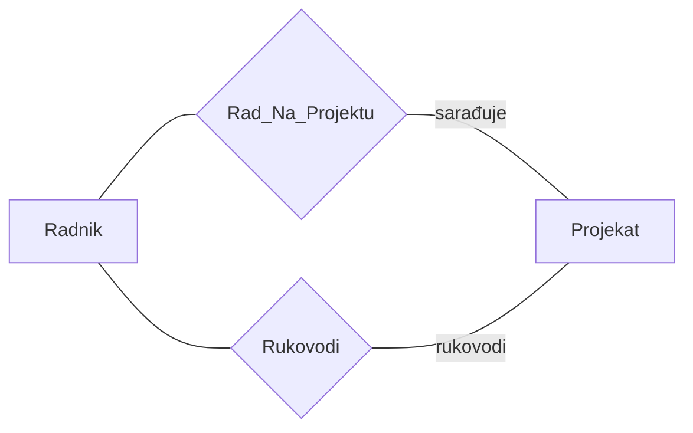
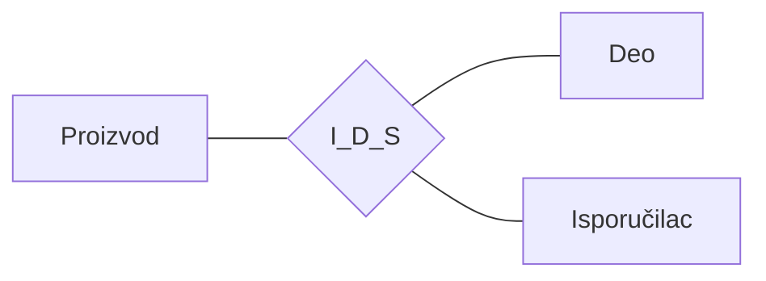
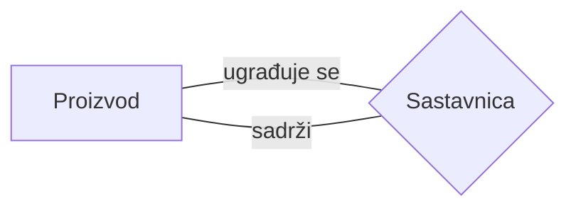

# ER Model - Strukturalna komponenta

---

## Uvod - O čemu se radi?

Zamislimo da želimo da opišemo fakultet - studente, profesore, predmete, ocene. Ili zamislimo bolnicu - pacijente, lekare, dijagnoze. Ili biblioteku - knjige, članove, pozajmice. Sve ovo su **realni sistemi** koje želimo da modelujemo pomoću baze podataka.

ER model (model entiteta i poveznika) nam daje alat za to. Osnovna ideja je jednostavna: realni svet (ili njegov deo koji nas zanima) možemo opisati pomoću **dva osnovna koncepta** - **entiteta** i **poveznika**. To je kao da imamo dva tipa kockica od kojih gradimo celu sliku realnog sistema.

Hajde da krenemo od samog početka i vidimo šta su to entiteti, a šta poveznici.

---

## 2.1 Strukturalna komponenta ER modela podataka

### Entitet i poveznik - osnovni koncepti

**Entitet** je "nešto" što se može jednoznačno identifikovati. Entitet se opisuje i kao "jedinica posmatranja". Može se odnositi na svaki realni subjekat, objekat, događaj, pojavu ili neki apstraktni pojam. Dakle, entitet može biti student, automobil, ispit, grad - bilo šta što možemo prepoznati i razlikovati od svega ostalog.

**Poveznik** predstavlja vezu između dva ili više entiteta. Poveznik konstituišu (čine) povezani entiteti i opis njihove veze. Ako je entitet "stvar", onda je poveznik "odnos između stvari".

> [!NOTE]
> Reč "entitet" dolazi od latinskog *ens, entis* - što znači biće, bitnost. Dakle, entitet je nešto što *jeste*, što *postoji* kao prepoznatljiva celina.

---

**Primer 2.1.** Pogledajmo konkretan primer. Student *Milan Brkić* sa brojem indeksa *89034* je jedan entitet. Predmet *Baze podataka* je drugi entitet. *Polaganje ispita* iz predmeta Baze podataka na dan *09.10.1994.* godine je takođe jedan entitet.

Međutim, jedan mrav se može proglasiti entitetom samo pod uslovom da smo u stanju da ga jednoznačno identifikujemo među drugim mravima, što je malo verovatno. Entitet bi mogla biti neka kolonija mrava.

Sad, pogledajmo poveznike. Jedan poveznik je *"student Milan Brkić sluša predmet Baze podataka"*, a drugi je *"student Milan Brkić je položio predmet Baze podataka"*. To su različiti poveznici između dva ista entiteta (Milan Brkić i Baze podataka). Opisi njihove veze su: "sluša" i "položio".

Ali tu nije kraj. Jedan poveznik između **tri** entiteta glasi: *Milan Brkić je položio predmet Baze podataka na ispitu od 09.10.1994. godine* - tu je treći entitet sam ispit. $\square$

---

### 2.1.1 Entitet i skup (klasa) entiteta

Entiteti koji predstavljaju realne subjekte, objekte, događaje - ljudski intelekt ih može klasifikovati u **skupove sličnih entiteta**. Na primer, svi studenti čine jedan skup, svi predmeti drugi, svi ispiti treći.

Formalno, neka je $e$ entitet, tada je **skup entiteta**:

$$E = \{e \mid P(e)\}$$

gde je $P(e)$ predikat čija istinitosna vrednost ukazuje da li $e$ pripada skupu $E$. Ako $e$ poseduje osobinu $P(e)$, tada $e$ pripada $E$. Isti entitet $e$ može pripadati različitim skupovima entiteta.

Šta to znači u praksi? $P(e)$ je neko pravilo ili uslov koji kaže "da li je ovaj entitet član ovog skupa?". Ako jeste, ulazi u skup.

**Primer 2.2.** Ako je $P(e)$ = "$e$ je student", onda skupu $E$ pripadaju samo studenti, a ne i ostali ljudi. Međutim, ako je $E' = \{e \mid e \text{ je ljudsko biće}\}$, tom skupu pripadaju svi ljudi, ali ne i ostali sisari. Pri tome, studenti pripadaju i skupu $E$ i skupu $E'$. $\square$

Kao što vidimo, isti entitet (recimo, student Marko) može biti u skupu "studenti" i istovremeno u skupu "ljudska bića". Skupovi se mogu preklapati.

---

## 2.1.2 Intenzija ER modela podataka

Na nivou **intenzije**, koncepte ER modela podataka čine: **tip entiteta** i **tip poveznika**. Obeležje predstavlja osnovni gradivni element za konstituisanje ovih složenijih koncepata.

Intenzija je, uprošćeno rečeno, *šablon* - opis strukture bez konkretnih podataka. Zamislimo to kao praznu tabelu sa zaglavljima kolona, ali bez redova sa podacima.

Hajde da krenemo od najjednostavnijeg gradivnog elementa - obeležja.

---

### 2.1.2.1 Obeležja

Skupovi sličnih entiteta se nazivaju i **klasama** entiteta. Svi entiteti jedne klase poseduju bar jednu zajedničku osobinu, na osnovu koje su i svrstani u istu klasu. U opštem slučaju, broj zajedničkih osobina entiteta jedne klase je veći od jedan. Ove osobine nazivaju se **obeležjima** (atributima).

Obeležja se označavaju velikim slovima latinske azbuke, skraćenim nazivom (**mnemonikom**) ili punim nazivom. Velika slova latinske azbuke se koriste kada semantika obeležja nije važna.

> [!TIP]
> Mnemonik je skraćeni naziv koji pomaže da brzo prepoznamo o čemu se radi. Na primer, umesto da pišemo MATIČNI_BROJ_RADNIKA, možemo koristiti kraći mnemonik MBR. Na ispitu obratite pažnju da ispravno koristite mnemonike iz zadatka.

**Primer 2.3.** Ako je *MATIČNI_BROJ_RADNIKA* pun naziv obeležja, odgovarajući mnemonik bi mogao biti *MBR*. $\square$

#### Elementarna i složena obeležja

Obeležja koja se dalje **ne mogu dekomponovati** (rastaviti na delove), ili koja se u posmatranom slučaju ne dekomponuju na komponente, nazivaju se **elementarnim obeležjima**.

**Skup**, niz, ili logički proizvod elementarnih obeležja predstavlja **složeno obeležje**. Tom nizu obeležja se može pridružiti neko ime.

Zamislimo to ovako: IME je elementarno obeležje jer ga ne rastavljamo dalje. Ali ADRESA? To je složeno obeležje jer sadrži MESTO, ULICU, BROJ.

**Primer 2.4.** Obeležja *NAZIV_PROIZVODA*, *BOJA_AUTOMOBILA*, *IME_STANOVNIKA* predstavljaju **elementarna** obeležja različitih klasa entiteta. **Složena** obeležja predstavljaju, na primer:

- $ADRESA = \{MESTO, ULICA, BROJ\}$
- $\{IME, PRZ, MESTO\}$
- $DATUM\_UPLATE = \{DAN, MESEC, GODINA\}$

$\square$

Složena obeležja se, često, označavaju slovima sa kraja abecede, na primer $X$ ili $Y$ ili $Z$, a elementarna slovima sa početka abecede, na primer $A$, $B$ ili $C$. Saglasno rečenom, složeno obeležje je:

$$X = \{A_1, A_2, \ldots, A_k\}$$

odnosno $X = \{A_1, A_2, \ldots, A_k\}$, gde su $A_i$, $1 \le i \le k$, elementarna obeležja. Pri tome, složeno obeležje $X$ je jedanput predstavljeno kao niz, a drugi put kao skup.

---

### 2.1.2.2 Domen

Svakom obeležju odgovara jedan skup svih mogućih vrednosti koje to obeležje, u konkretnim slučajevima, može imati. Taj skup vrednosti se naziva **domenom obeležja**. Domen obeležja $A$ se obeležava sa $dom(A)$. Takođe, domen može posedovati i svoje posebno ime. Isti domen se može pridružiti većem broju različitih obeležja.

Zamislimo domen kao "rečnik dozvoljenih vrednosti". Na primer, za obeležje BOL_AUTOMOBILA, domen je skup svih boja koje automobil može imati.

**Primer 2.5.** Za obeležje *BOJA_AUTOMOBILA* skup vrednosti je:

$$dom(BOJA\_AUTOMOBILA) = \{bela, žuta, crna, plava, \ldots\}$$

$\square$

Obeležjima *IME_STUDENTA* i *IME_NASTAVNIKA* se može pridružiti isti domen sa nazivom *IME*. Taj domen sadrži, kao svoje elemente, sva moguća lična imena.

U strukturama podataka, pojam domena se ne koristi u uobičajenom matematičkom smislu, kao skup originala funkcije, već i kao skup slika. Pojam domena se koristi u smislu skupa iz kojeg semantički definisani objekti, kao što su tip entiteta i obeležje, uzimaju vrednosti.

> [!IMPORTANT]
> Domen je skup **svih mogućih** vrednosti, ne samo onih koje trenutno postoje u bazi. Na primer, dom(BOJA_AUTOMOBILA) sadrži i boje automobila koji tek treba da budu proizvedeni.

---

### 2.1.2.3 Tip entiteta

Sa tačke gledišta zadataka informacionog sistema, nisu sva obeležja klase entiteta jednako važna. Od obeležja, bitnih za realizaciju zadataka informacionog sistema, gradi se **model** realne klase entiteta. Model klase entiteta naziva se **tipom entiteta**.

Zamislimo to na primeru studenata. Svaki student ima mnogo osobina - boju očiju, omiljenu muziku, visinu... Ali za fakultetski informacioni sistem bitni su samo broj indeksa, ime, prezime, fakultet. Upravo ta "bitna" obeležja formiraju tip entiteta.

**Definicija 2.1.** Izraz oblika $N(A_1, \ldots, A_n)$ predstavlja model skupa entiteta $E = \{e \mid P(e)\}$ i naziva se **tipom entiteta**, ako i samo ako $N$ predstavlja ime skupa $\{e \mid P(e)\}$, a $A_1, \ldots, A_n$ obeležja entiteta skupa $\{e \mid P(e)\}$. $\square$

Šta nam ova definicija kaže? Tip entiteta se sastoji od:
- **$N$** - ime (naziv) tipa entiteta, koje opisuje klasu realnih entiteta
- **$A_1, \ldots, A_n$** - niz obeležja koja opisuju osobine entiteta te klase

Kao i svaki model, tip entiteta predstavlja samo **približnu sliku** klase entiteta realnog sistema. Neki put se za reprezentaciju klase entiteta, umesto oznake za tip entiteta $N(A_1, \ldots, A_n)$ koristi samo naziv $N$. Pošto niz $(A_1, \ldots, A_n)$ predstavlja imenovano složeno obeležje, tip entiteta predstavlja semantičku komponentu tog apstraktnog opisa klase realnih entiteta. On daje smisao nizu obeležja koji iza njega sledi.

Klasa entiteta poseduje konačno mnogo osobina zajedničkih svim realnim entitetima. Neka je $\{A_1, \ldots, A_m\}$ skup osobina entiteta $E$. Tada je skup obeležja $\{A_1, \ldots, A_n\}$ odabranih za izgradnju tipa entiteta kao modela klase $E$, pravi ili nepravi podskup skupa obeležja $\{A_1, \ldots, A_m\}$.

**Primer 2.6.** Tip entiteta *Student(BROJ_INDEKSA, IME, PREZIME, NAZIV_FAKULTETA)* reprezentuje sve studente jednog univerziteta. $\square$

Ovde je *Student* ime tipa entiteta ($N$), a *BROJ_INDEKSA, IME, PREZIME, NAZIV_FAKULTETA* su obeležja ($A_1, A_2, A_3, A_4$).

---

### 2.1.2.4 Skup poveznika, uloga entiteta i tip poveznika

Sada kad znamo šta su tipovi entiteta, hajde da se pozabavimo vezama među njima. Skup poveznika $R$ predstavlja relaciju, u matematičkom smislu, između $n$ ($n \ge 2$) skupova entiteta:

$$R = \{(e_1, \ldots, e_n) \mid e_i \in E_i, \; i = 1, \ldots, n\}$$

Pri tome, skupovi $E_i$ ne moraju biti različiti. Svaka $n$-torka $(e_1, \ldots, e_n)$ u $R$ predstavlja jedan poveznik. Svaki entitet $e_i$ u $n$-torki ima svoju **uloga**. Ako se uloge eksplicitno navedu, redosled navođenja entiteta u torki postaje nevažan.

Eksplicitno navođenje uloga posebno dobija na važnosti kada su u pitanju skupovi poveznika između entiteta koji **pripadaju istim skupovima entiteta**. U takvim slučajevima, ista klasa entiteta može egzistirati više različitih skupova poveznika. Entiteti bar jednog od povezanih skupova imaju različite uloge u svakom od posmatranih skupova poveznika.

Ako poveznik povezuje entitete jednog skupa, naziva se **rekurzivnim**.

**Primer 2.7.** Posmatraju se skup entiteta *Radnik* i skup entiteta *Radno_Mesto*. Neka je Aca element u skupu *Radnik*, a *programer* u skupu *Radno_Mesto*. Poveznik (*Aca, programer*) ima semantiku "(radnik) je raspoređen na (radno mesto)".

Ako se u skup *Radnik* uvede relacija poretka sa semantikom "je rukovodilac", tada uređeni par (*Iva, Aca*) nosi informaciju da je Iva Acin rukovodilac. U paru (*Iva, Aca*) oba entiteta pripadaju istom skupu, ali u povezniku imaju potpuno različite uloge. Te uloge u posmatranom povezniku nisu eksplicitno navedene. Isti poveznik, sa eksplicitno navedenim ulogama entiteta, bi bio (*Iva* (rukovodilac), *Aca* (podčinjeni)).

Posmatra se skup entiteta *Radnik* i skup entiteta *Projekat*, pri čemu *Lido* i *Faktura* pripadaju skupu *Projekat*. Parovi (*Aca* (nosilac), *Lido*) i (*Aca* (programer), *Faktura*) predstavljaju različite poveznike između ta dva skupa. U tim poveznicima su uloge entiteta *Aca* eksplicitno navedene. $\square$

> [!WARNING]
> Česta greška na ispitu je brkanje pojmova "poveznik" i "tip poveznika". Poveznik je konkretna veza između konkretnih entiteta (npr. Aca - programer). Tip poveznika je šablon koji opisuje strukturu takvih veza.

Sad prelazimo na formalni model. Slično tipu entiteta, i za poveznike imamo apstraktan opis.

**Definicija 2.2.** Izraz oblika $N(E_1, \ldots, E_n, B_1, \ldots, B_k)$ predstavlja model skupa poveznika $R$ i naziva se **tipom poveznika**, ako i samo ako $N$ predstavlja naziv skupa poveznika $R$, $E_1, \ldots, E_n$ su povezani skupovi entiteta, a $B_1, \ldots, B_k$ obeležja poveznika skupa $R = \{(e_1, \ldots, e_n) \mid e_i \in E_i, \; i = 1, \ldots, n\}$. $\square$

Dakle, tip poveznika ima:
- **$N$** - naziv tipa poveznika
- **$E_1, \ldots, E_n$** - tipovi entiteta koje povezuje
- **$B_1, \ldots, B_k$** - sopstvena obeležja poveznika (koja opisuju samu vezu, ne entitete)

**Primer 2.8.** Tip poveznika *Raspoređen(Radnik, Radno_Mesto, DATUM_RASP)* predstavlja model skupa poveznika oblika (*radnik, radno_mesto*) proširenih navođenjem njihove zajedničke osobine - datuma raspoređivanja (radnika na radno mesto).

Tip poveznika *Rukovodi(Radnik, Radnik)* je model rukovodne hijerarhije, čiji je jedan reprezent par (*Iva, Aca*) iz primera 2.7.

Tipovi poveznika *Rukovodi(Radnik, Projekat)* i *Radi(Radnik, Projekat)* predstavljaju modele odnosa između radnika i projekata. Informacija o različitim ulogama entiteta iz skupa *Radnik*, ugrađena je u naziv tipa poveznika. $\square$

---

## 2.1.3 Dijagrami tipova entiteta i tipova poveznika

Model statičke strukture realnog sistema, realizovan putem ER modela podataka, po pravilu se predstavlja uz pomoć takozvanih **ER dijagrama**. Ovo je vizuelni jezik koji nam omogućava da na pregledan način pokažemo tipove entiteta, njihove veze i obeležja.

Pravila crtanja su sledeća:

- **Tip entiteta** se crta kao **pravougaonik** sa upisanim nazivom (tipa entiteta)
- **Tip poveznika** se crta kao **romb** sa upisanim nazivom (tipa poveznika)
- Ako tip poveznika $R$ povezuje tipove entiteta $E_1, \ldots, E_k$, tada se crta po jedan neusmeren poteg od romba $R$ do geometrijske slike svakog od $E_i$
- **Skupovi vrednosti (domeni)** se prikazuju kao **ovali** sa upisanim nazivom domena i povezuju orijentisanim potegom sa odgovarajućim tipom entiteta ili tipom poveznika
- Orijentacija potega je ka ovalu skupa vrednosti. Naziv obeležja se upisuje na poteg domena, ako se nazivi obeležja i domena razlikuju

#### Nivoi detaljnosti dijagrama

ER dijagrami se mogu crtati na **dva nivoa detaljnosti**: nivo detaljnosti naziva i nivo detaljnosti obeležja.

- **Nivo detaljnosti naziva** daje preglednije dijagrame
- **Nivo detaljnosti obeležja** daje dijagrame sa većom količinom informacija

Da bi se dobili dijagrami sa dobrom preglednošću i sa većom količinom informacija, dva nivoa detaljnosti crtanja dijagrama se kombinuju. Na jednom dijagramu se predstavljaju tipovi entiteta i tipovi poveznika na nivou detaljnosti naziva, a na nizu drugih dijagrama se predstavlja svaki tip entiteta i tip poveznika sa pripadajućim obeležjima i skupovima vrednosti.

**Primer 2.9.** Na slici 2.1 prikazana su dva tipa entiteta *Radnik* i *Projekat*. Između ta dva tipa entiteta postoje dva tipa poveznika *Rad_Na_Projektu* i *Rukovodi*. Entiteti tipa *Radnik* igraju dve uloge u poveznicima dva tipa. To su uloga saradnika na projektu i uloga rukovodioca projekta. Te uloge su ispisane uz potege između odgovarajućeg tipa poveznika i tipa entiteta *Projekat*.

Na slici 2.2 su prikazana tri tipa entiteta *Isporučilac*, *Deo* i *Proizvod* između kojih je definisan jedan tip poveznika *I_D_S*, sa semantikom isporučilac ($I$) isporučuje deo ($D$) za ugradnju u proizvod ($P$).

Na slici 2.3 prikazan je tip entiteta *Proizvod* i tip poveznika *Sastavnica*. Svaka pojava tipa poveznika *Sastavnica* sadrži dva entiteta iz skupa *Proizvod*. Jedan ima ulogu proizvoda, a drugi komponente koja se u taj proizvod ugrađuje. Ove uloge su označene, redom, kao "sadrži" i "ugrađuje se". Drugim rečima, na slici 2.3 je, putem koncepata modela entiteta i poveznika, predstavljen model sastavnice proizvoda.

**Primer 2.10.** Na slici 2.4 su prikazani tipovi entiteta *Radnik*, *Projekat* i tip poveznika *Rad_Na_Projektu* sa odgovarajućim domenima (skupovima vrednosti). Obeležja *DAZ* (datum zaposlenja radnika) i *DAP* (datum početka rada na projektu) dele isti skup vrednosti - domen sa imenom *DATUM*. $\square$

Dijagram na nivou detaljnosti obeležja za Radnik i Projekat izgleda ovako:

| Element | Obeležja |
|---------|----------|
| **Radnik** | MBR, IME, PRZ, DATUM (za DAZ) |
| **Projekat** | SPR, NAP, NAR, IZN |
| **Rad_Na_Projektu** (poveznik) | koristi domene iz oba tipa entiteta + DATUM (za DAP) |

Pri čemu su obeležja radnika: MBR (matični broj radnika), IME, PRZ (prezime), a DATUM je domen za obeležje DAZ. Obeležja projekta su: SPR (šifra projekta), NAP (naziv projekta), NAR (naručilac), IZN (iznos).

---

## 2.1.4 Ekstenzija ER modela podataka

Ekstenzionalne koncepte ER modela podataka čine: **pojava tipa entiteta**, **skup pojava tipa entiteta**, **pojava tipa poveznika** i **skup pojava tipa poveznika**. Podatak predstavlja primitivni koncept, putem kojeg se komponuju nabrojani složeniji koncepti.

Ako je intenzija bila "šablon" (prazna tabela sa zaglavljima), onda je ekstenzija "popunjena tabela" - konkretni podaci koji žive u tom šablonu.

---

### 2.1.4.1 Podatak

Entiteti i poveznici se opisuju putem skupova parova (obeležje, vrednost). Obeležje predstavlja semantičku (smisaonu) komponentu te dvojke.

**Definicija 2.3.** Par (obeležje, vrednost) predstavlja **podatak** o nekom entitetu ili povezniku, ako obeležje predstavlja osobinu posmatranog entiteta ili poveznika, a vrednost pripada domenu tog obeležja. $\square$

Podatak je, dakle, najmanji smisaoni komad informacije - jedno obeležje upareno sa jednom vrednošću.

**Primer 2.11.** Ako se posmatra obeležje *MATIČNI_BROJ_RADNIKA* i jedna njegova vrednost *110451*, tada *110451* predstavlja podatak o nekom radniku jedino ako se unapred zna da *110451* predstavlja vrednost obeležja *MATIČNI_BROJ_RADNIKA*. U suprotnom, *110451* ne predstavlja podatak, jer mu je smisao neodređen.

Broj 7 ne predstavlja podatak, jer mu je smisao neodređen. Može se interpretirati na više načina: kao ocena studenta, kao starost deteta i slično. $\square$

> [!IMPORTANT]
> Sama vrednost (npr. broj 7 ili 110451) **nije** podatak dok se ne zna kom obeležju pripada. Podatak nastaje tek kada se vrednost poveže sa obeležjem koje joj daje smisao.

#### Izvedena obeležja i izvedeni podaci

Obeležja čije se vrednosti dobijaju primenom nekog algoritma na vrednosti drugih obeležja naziva se **izvedenim obeležjem**, a njegove vrednosti **izvedenim podacima**.

**Primer 2.12.** Obeležje *SREDNJA_OCENA* je izvedeno. Njegove vrednosti se dobijaju sabiranjem vrednosti obeležja *OCENA* za sve položene predmete i deljenjem tog zbira vrednošću obeležja *BROJ_POLOŽENIH_ISPITA*. $\square$

---

### 2.1.4.2 Pojava i skup pojava tipa entiteta

Svaka klasa entiteta predstavlja skup sličnih entiteta. Svakom entitetu posmatrane klase odgovaraju konkretne vrednosti obeležja klase entiteta. U okviru informacionog sistema, svaki entitet se predstavlja modelom koji sadrži konkretne vrednosti onih obeležja uz pomoć kojih je opisana klasa entiteta. **Uređenje podataka** u modelu entiteta diktira se **uređenjem skupa obeležja** u tipu entiteta. Obeležjima u tipu entiteta odgovaraju vrednosti tih obeležja (podaci) u modelu entiteta istim redom.

Model jednog entiteta naziva se **pojavom** odgovarajućeg tipa entiteta. Tip entiteta i pojava entiteta predstavljaju apstraktne opise konkretnih realnih entiteta. Tip entiteta predstavlja model na višem nivou apstrakcije nego pojava tipa entiteta.

Formalno, za dati tip entiteta $N(A_1, \ldots, A_n)$ skup funkcija:

$$\{A_i : E \to dom(A_i) \mid i = 1, \ldots, n\}$$

jednoznačno određuje funkciju:

$$(A_1, \ldots, A_n) : E \to dom(A_1) \times \ldots \times dom(A_n)$$

gde je $E$ klasa entiteta, a

$$dom(A_1) \times \ldots \times dom(A_n) = \{(a_1, \ldots, a_n) \mid a_i \in dom(A_i), \; i = 1, \ldots, n\}$$

Funkcija $(A_1, \ldots, A_n)$ je definisana sa $(A_1, \ldots, A_n)(e) = (A_1(e), \ldots, A_n(e))$, gde $e \in E$ je entitet. Drugim rečima, $(a_1, \ldots, a_n)$ predstavlja pojavu tipa entiteta $N(A_1, \ldots, A_n)$, ako je zadovoljena kvantifikatorska formula:

$$F((a_1, \ldots, a_n)) = (\exists e \in E)(\forall i \in \{1, \ldots, n\})(a_i = A_i(e))$$

a skup $P$ pojava tipa entiteta je:

$$P = \{(a_1, \ldots, a_n) \mid F((a_1, \ldots, a_n))\}$$

Šta sve ovo znači? Obeležje $A$ je funkcija koja svakom entitetu $e_i \in E$ pridružuje jednu vrednost iz $dom(A)$, tako da $A(e_i)$ predstavlja podatak o $e_i$ s obzirom na $A$. Vrednost elementarnog obeležja predstavlja elementarni podatak, a vrednost složenog obeležja predstavlja složeni podatak. Ako je $X = \{A_1, \ldots, A_k\}$, tada je $dom(X) \subseteq dom(A_1) \times \ldots \times dom(A_k)$, tako da je $(a_1, \ldots, a_k)$ jedna vrednost obeležja $X$, gde je za svako $i$, $a_i \in dom(A_i)$.

Uređenje podataka u $n$-torki $(a_1, \ldots, a_n)$ je bitno, jer nosi informaciju o tome da je $a_i \in dom(A_i)$.

**Primer 2.13.** Za tip entiteta *Student* iz primera 2.6, moguće pojave predstavljaju sledeće četvorke:

| BROJ_INDEKSA | IME | Fakultet | Naziv_Fakulteta |
|---|---|---|---|
| 159 | Ivo | Ban | Fakultet tehničkih nauka |
| 313 | Eva | Tot | Ekonomski fakultet |

$\square$

---

### 2.1.4.3 Ključ tipa entiteta

Definicija pojma entiteta kao "jedinice posmatranja" ukazuje na potrebu da se entiteti posmatrane klase mogu **razlikovati**. To zahteva da i modeli dva entiteta budu različiti. Neka su $e_1$ i $e_2$ entiteti klase $E$, a $N(A_1, \ldots, A_n)$ tip entiteta, tada mora važiti:

$$(A_1, \ldots, A_n)(e_1) \ne (A_1, \ldots, A_n)(e_2)$$

Znači, mora postojati neprazan skup obeležja $X \subseteq \{A_1, \ldots, A_n\}$ takav da je $X(e_1) \ne X(e_2)$.

Ali nama ne treba bilo koji skup obeležja koji razlikuje entitete - treba nam **najmanji** takav skup. Tu dolazimo do ključa.

**Definicija 2.4.** Neka je $P = \{p_i \mid i = 1, \ldots, k\}$ skup pojava tipa entiteta $N(A_1, \ldots, A_n)$, a $p[X]$ skup pojava $p$ na obeležje $X$. Obeležje $X$ predstavlja **ključ** tipa entiteta $N(A_1, \ldots, A_n)$ ako, za svaki skup $P$ pojava tipa entiteta $N$, važe sledeća dva uslova:

**1°** $\quad (\forall p_i, p_j \in P)(p_i \ne p_j \Rightarrow p_i[X] \ne p_j[X])$ i

**2°** $\quad (\forall X' \subset X)(\neg 1°)$. $\square$

Hajde da raščlanimo ove uslove:

- **Uslov 1° (jedinstvenost)**: Ako su $p_i$ i $p_j$ različite pojave, onda moraju imati i različite vrednosti ključa. U skupu pojava tipa entiteta **ne postoje dve pojave sa istom vrednošću ključa**. Drugim rečima - ključ jedinstveno identifikuje svaku pojavu.

- **Uslov 2° (minimalnost)**: Ključ **ne poseduje suvišna obeležja**. Ako bismo izbacili bilo koje obeležje iz ključa, uslov 1° više ne bi važio.

Ako $X$ zadovoljava samo uslov 1°, naziva se **superključem** tipa entiteta $N$. Superključ je, dakle, bilo koji skup obeležja koji jednoznačno identifikuje pojave, ali ne mora biti minimalan.

Svaki tip entiteta poseduje bar jedan ključ. Neka je $X = \{A_1, \ldots, A_n\}$. Tada uslov 1° trivijalno važi (jer ceo niz obeležja sigurno razlikuje pojave). Ako važi i uslov 2°, $X$ predstavlja ključ. Inače, mora postojati neprazan podskup $\{A_1, \ldots, A_n\}$ za koji važe i 1° i 2°. Ovo razmatranje, ujedno, sugeriše i jedan od mogućih postupaka za određivanje ključa tipa entiteta.

Jedan tip entiteta može posedovati više ključeva. Nazivaju se **ekvivalentnim**. U okviru notacije za tip entiteta, sva obeležja jednog ključa podvlače se jednom, kontinualnom linijom. Jedan od ekvivalentnih ključeva se bira za **primarni**.

**Primer 2.14.** Tip entiteta *Student(BROJ_INDEKSA, IME, PREZIME, ADRESA, MATIČNI_BROJ_STANOVNIKA)* poseduje dva ključa. To su *BROJ_INDEKSA* i *MATIČNI_BROJ_STANOVNIKA*. Ako je reč o tipu entiteta, definisanom u projektu fakultetskog informacionog sistema, obeležje *BROJ_INDEKSA* bi, najverovatnije, bilo izabrano za primarni ključ. $\square$

> [!CAUTION]
> Na ispitu se često pravi greška kod razlikovanja ključa i superključa. Zapamtite: ključ = jedinstvenost + minimalnost. Superključ = samo jedinstvenost (može imati suvišna obeležja). Svaki ključ je superključ, ali svaki superključ NIJE ključ.

---

### 2.1.4.4 Pojava tipa poveznika

Jedan tip poveznika predstavlja apstraktni model većeg broja različitih skupova torki sličnih osobina definisanih nad istim domenima. Jedna torka predstavlja jednu **pojavu tipa poveznika**. Ako je tip poveznika binaran, tada njegove pojave predstavljaju uređene trojke. Prvu komponentu trojke predstavlja jedna pojava prvog tipa entiteta, drugu komponentu trojke jedna pojava drugog tipa entiteta. Treću komponentu predstavlja torka $(b_1, \ldots, b_k) \in dom(B_1) \times \ldots \times dom(B_k)$. Pošto svaku pojavu tipa entiteta reprezentuje odgovarajuća vrednost ključa, dovoljno je da pojava tipa poveznika sadrži vrednosti primarnih ključeva povezanih tipova entiteta umesto kompletnih pojava tih tipova entiteta.

Saglasno rečenom, tip poveznika između tipova entiteta $E_1, \ldots, E_n$ se može predstaviti i kao imenovani niz obeležja, u oznaci $R(A_1, \ldots, A_m)$, pri čemu važi $K_i \subseteq \{A_1, \ldots, A_m\}$, gde $K_i$, $i = 1, \ldots, n$, predstavljaju primarne ključeve povezanih tipova entiteta. Pri tome važi:

$$\{B_1, \ldots, B_k\} = \{A_1, \ldots, A_m\} \setminus \bigcup_{i=1}^{n} K_i$$

gde je $\{B_i \mid i = 1, \ldots, k\}$ skup obeležja skupa poveznika $R$. Ovaj skup obeležja može biti prazan.

#### Ključ tipa poveznika

Opisani način predstavljanja tipa poveznika zahteva da se definiše i pojam **ključa tipa poveznika**. Ključ $K$ tipa poveznika $R$ predstavlja pravi ili nepravi podskup unije primarnih ključeva povezanih tipova entiteta, u oznaci:

$$K \subseteq \bigcup_{i=1}^{n} K_i$$

**Primer 2.15.** Ključ tipa poveznika *Rad_Na_Projektu* sa slike 2.4 je $K = \{MBR, SPR\}$, a ključ tipa poveznika *Raspoređen* sa slike 2.5 je $K = \{MBR\}$. Ključ tipa poveznika *Raspoređen* je pravi podskup unije ključeva povezanih tipova entiteta. $\square$

**Primer 2.16.** Za tip poveznika

*Ispit(BROJ_INDEKSA, IDBROJ_PREDMETA, OCENA)*

ključ predstavlja složeno obeležje $\{BROJ\_INDEKSA, IDBROJ\_PREDMETA\}$.

Tip poveznika *Poveravanje(IDBROJ_NASTAVNIKA, IDBROJ_PREDMETA)* opisuje odnos između nastavnika i predmeta u realnom sistemu, gde se nastavniku poverava izvođenje predavanja iz predmeta. Ako se za ključ tipa entiteta *Poveravanje* odredi *IDBROJ_NASTAVNIKA*, tada tip entiteta opisuje odnos prema kojem se svakom nastavniku poverava samo jedan predmet. Ako se za ključ odredi *IDBROJ_PREDMETA*, tip entiteta opisuje realnu situaciju u kojoj nastavu iz svakog predmeta izvodi samo jedan nastavnik.

Ako se pretpostavi da se istom nastavniku može poveriti izvođenje nastave iz više predmeta, a isti predmet može poveriti većem broju nastavnika, tada sva obeležja tipa entiteta *Poveravanje(IDBROJ_NASTAVNIKA, IDBROJ_PREDMETA)* predstavljaju ključ. Može se zaključiti da semantika modela skupa pojava tipa poveznika značajno zavisi od odabranog ključa. $\square$

> [!IMPORTANT]
> Izbor ključa tipa poveznika **direktno utiče na semantiku** modela! Različiti ključevi opisuju različite realne situacije. Ovo je izuzetno bitno za razumevanje.

---

### 2.1.4.5 Predstavljanje ekstenzije ER modela

Ekstenzija modela entiteta i poveznika se predstavlja putem **tabela**, slično kao u relacionom modelu. Svakom tipu entiteta ili tipu poveznika odgovara jedna tabela sa svim njegovim obeležjima u zaglavlju tabele i podacima o entitetima u vrstama tabele. Vrste predstavljaju modele entiteta ili poveznika posmatranog skupa. Ove tabele se, redom, nazivaju **relacijama** entiteta i relacijama poveznika.

**Primer 2.17.** Na slici 2.5 je prikazan dijagram entiteta i poveznika sa tipovima entiteta *Radnik* i *Radno_Mesto* i tipom poveznika *Raspoređen*. Obeležje *MBR* predstavlja ključ tipa poveznika *Raspoređen*. Na slici 2.6 su prikazane odgovarajuće relacije entiteta i relacija poveznika. Ključevi tipova entiteta i poveznika su podvučeni.

Treba zapaziti da, saglasno tabelama na slici 2.6, postoje neraspoređeni radnici i radna mesta na koja nije raspoređen nijedan radnik. $\square$

**Relacija entiteta Radnik:**

| **MBR** | IME | PRZ | GOD |
|---|---|---|---|
| 88 | Eva | Pop | 1950 |
| 50 | Ivo | Ban | 1950 |
| 01 | Ana | Ras | 1961 |
| 81 | Ana | Tot | 1961 |

**Relacija entiteta Radno_Mesto:**

| **NAZ** | BRI | BRB | SPR |
|---|---|---|---|
| Programer | 5 | 530 | VSS |
| Daktilograf | 3 | 700 | SSS |
| Projektant | 3 | 700 | VSS |
| Kurir | 1 | 300 | NSS |

**Relacija poveznika Raspoređen:**

| **MBR** | NAZ |
|---|---|
| 88 | Daktilograf |
| 01 | Programer |
| 81 | Programer |

> [!NOTE]
> Primetite da radnik sa MBR = 50 (Ivo Ban) ne postoji u relaciji Raspoređen - to znači da taj radnik nije raspoređen ni na jedno radno mesto. Isto tako, radno mesto "Projektant" i "Kurir" nemaju raspoređene radnike.

#### Granica između obeležja, tipa entiteta i tipa poveznika

Između obeležja i tipa entiteta nema jasne razlike, jer se imenovano složeno obeležje koristi za predstavljanje tipa entiteta. Na prvi pogled je lako povući jasnu granicu i između tipa entiteta i tipa poveznika. Međutim, za povlačenje ove granice pouzdan kriterijum je to pitanje da li postojanje pojave jednog tipa entiteta zavisi od postojanja pojave drugog. Ako torke relacije mogu samostalno da egzistiraju, relacija predstavlja ekstenziju tipa entiteta, inače je reč o tipu poveznika.

**Primer 2.18.** Tvrdenje da je granica između pojma obeležja, tipa entiteta i tipa poveznika često nejasna, može se ilustrovati na sledeći način.

Sa jedne tačke gledišta, *Projekat* i *Projektant* predstavljaju tipove entiteta, a *Rad_Na_Projektu* tip poveznika. Pri tome, tip entiteta *Projekat* može sadržati obeležje *NARUČILAC*. Sa druge tačke gledišta, *Naručilac* može predstavljati tip entiteta, a *Projekat* tip poveznika (u smislu da projekat povezuje naručioca i projektanta). Sa treće tačke gledišta, *Rad_Na_Projektu* može predstavljati tip entiteta sa ključem *IDBAK* (čije vrednosti jednoznačno identifikuju aktivnosti na bilo kom projektu), obeležjem *PROJEKTANT* i obeležjem *DATUM_POČETKA*.

Ako se iz relacije entiteta *Radnik* na slici 2.6 ukloni torka *(88, Eva, Pop, 1950)*, torka *(88, Daktilograf)* u relaciji poveznika *Raspoređen* gubi svaki smisao, jer u relaciji *Radnik* ne postoji pojava sa vrednošću ključa $MBR = 88$. Međutim, ako se iz relacije *Raspoređen* ukloni torka *(01, Programer)*, to ne znači da treba bilo šta menjati u relacijama *Radnik* i *Radno_Mesto*. Jednostavno, radnik sa $MBR = 01$ više nije raspoređen na radno mesto programera. $\square$

> [!WARNING]
> Ovo je čest ispitni "trik pitanje" - da li nešto treba modelovati kao obeležje, tip entiteta ili tip poveznika? Odgovor zavisi od konteksta i tačke gledišta. Ne postoji jedan "tačan" odgovor, već treba argumentovati izbor.

---

## Rezime ključnih koncepata

Hajde da sve povežemo u celinu. Strukturalna komponenta ER modela se deli na dva nivoa:

**Intenzija** (šablon, struktura):
- Obeležja (elementarna i složena)
- Domeni obeležja
- Tip entiteta $N(A_1, \ldots, A_n)$
- Tip poveznika $N(E_1, \ldots, E_n, B_1, \ldots, B_k)$
- ER dijagrami (vizuelna reprezentacija)

**Ekstenzija** (konkretni podaci):
- Podatak = par (obeležje, vrednost)
- Izvedena obeležja i izvedeni podaci
- Pojava tipa entiteta
- Ključ tipa entiteta (jedinstvenost + minimalnost)
- Pojava tipa poveznika
- Ključ tipa poveznika
- Tabele (relacije) za predstavljanje ekstenzije

---

## 🎴 Brza pitanja (definicije, pojmovi, delovi)

P: Šta je entitet?

P: Šta je poveznik?

P: Od čega se sastoji poveznik (šta ga konstituiše)?

P: Koja su dva osnovna koncepta ER modela?

P: Šta je skup entiteta? Napiši formalnu definiciju.

P: Šta je predikat $P(e)$ u definiciji skupa entiteta?

P: Može li isti entitet pripadati različitim skupovima entiteta?

P: Šta je klasa entiteta?

P: Šta su obeležja (atributi)?

P: Kako se označavaju obeležja?

P: Šta je mnemonik? Daj primer.

P: Šta je elementarno obeležje?

P: Šta je složeno obeležje?

P: Kako se formalno zapisuje složeno obeležje $X$?

P: Kojim slovima se obično označavaju složena, a kojim elementarna obeležja?

P: Šta je domen obeležja?

P: Kako se obeležava domen obeležja $A$?

P: Može li se isti domen pridružiti različitim obeležjima? Daj primer.

P: Šta je tip entiteta?

P: Napiši Definiciju 2.1 (tip entiteta).

P: Šta predstavlja $N$ u zapisu $N(A_1, \ldots, A_n)$?

P: Šta predstavljaju $A_1, \ldots, A_n$ u zapisu tipa entiteta?

P: Šta je skup poveznika $R$? Napiši formalnu definiciju.

P: Šta je uloga entiteta u povezniku?

P: Kada je eksplicitno navođenje uloga posebno važno?

P: Šta je rekurzivni poveznik?

P: Šta je tip poveznika?

P: Napiši Definiciju 2.2 (tip poveznika).

P: Šta predstavljaju $B_1, \ldots, B_k$ u zapisu tipa poveznika?

P: Kako se crta tip entiteta u ER dijagramu?

P: Kako se crta tip poveznika u ER dijagramu?

P: Kako se crtaju skupovi vrednosti (domeni) u ER dijagramu?

P: Koja su dva nivoa detaljnosti ER dijagrama?

P: Šta čini ekstenzionalne koncepte ER modela podataka?

P: Šta je podatak?

P: Napiši Definiciju 2.3 (podatak).

P: Zašto sama vrednost (npr. broj 7) nije podatak?

P: Šta je izvedeno obeležje?

P: Šta su izvedeni podaci?

P: Šta je pojava tipa entiteta?

P: Šta je uređenje podataka u modelu entiteta i čime je diktirano?

P: Napiši funkciju koju obeležje $A$ predstavlja: $A : E \to$ ?

P: Napiši funkciju $(A_1, \ldots, A_n) : E \to$ ?

P: Napiši kvantifikatorsku formulu $F$ za pojavu tipa entiteta.

P: Napiši formulu za skup pojava $P$ tipa entiteta.

P: Šta je ključ tipa entiteta?

P: Napiši Definiciju 2.4 (ključ tipa entiteta).

P: Šta kaže uslov 1° (jedinstvenost) kod ključa?

P: Šta kaže uslov 2° (minimalnost) kod ključa?

P: Šta je superključ?

P: Koja je razlika između ključa i superključa?

P: Šta su ekvivalentni ključevi?

P: Šta je primarni ključ?

P: Kako se primarni ključ označava u notaciji tipa entiteta?

P: Šta je pojava tipa poveznika?

P: Čime se reprezentuje pojava tipa entiteta unutar pojave tipa poveznika?

P: Napiši formulu za obeležja tipa poveznika: $\{B_1, \ldots, B_k\} = $?

P: Šta je ključ tipa poveznika?

P: Napiši formulu za ključ tipa poveznika $K$.

P: Kako izbor ključa tipa poveznika utiče na semantiku modela?

P: Kako se predstavlja ekstenzija ER modela?

P: Šta je relacija entiteta?

P: Šta je relacija poveznika?

P: Koji je pouzdan kriterijum za razlikovanje tipa entiteta od tipa poveznika?

P: Šta se dešava u relaciji poveznika ako se obriše odgovarajuća pojava iz relacije entiteta?

---

## 📝 Šira pitanja za proveru razumevanja

**P:** Objasni razliku između intenzije i ekstenzije ER modela podataka i daj po jedan primer za svaki nivo.

**O:** Intenzija je nivo opisa strukture - to su tipovi entiteta i tipovi poveznika koji definišu šablon (npr. Student(BROJ_INDEKSA, IME, PREZIME, NAZIV_FAKULTETA)). Ekstenzija je nivo konkretnih podataka - pojave tipa entiteta koje popunjavaju taj šablon (npr. konkretna pojava (159, Ivo, Ban, Fakultet tehničkih nauka)). Intenzija kaže "šta se čuva", a ekstenzija "šta je konkretno sačuvano".

---

**P:** Zašto vrednost 110451 sama po sebi nije podatak, a par (MATIČNI_BROJ_RADNIKA, 110451) jeste? Objasni korišćenjem Definicije 2.3.

**O:** Prema Definiciji 2.3, podatak je par (obeležje, vrednost) gde obeležje predstavlja osobinu entiteta, a vrednost pripada domenu tog obeležja. Sama vrednost 110451 nema smisao - može biti matični broj, broj telefona, poštanski broj. Tek kada se uparuje sa obeležjem MATIČNI_BROJ_RADNIKA, dobija semantiku i postaje podatak.

---

**P:** Objasni razliku između ključa i superključa tipa entiteta. Daj primer gde skup obeležja jeste superključ ali nije ključ.

**O:** Ključ zadovoljava dva uslova: 1° jedinstvenost (nijedne dve pojave nemaju istu vrednost ključa) i 2° minimalnost (ne sadrži suvišna obeležja). Superključ zadovoljava samo uslov 1°. Na primer, za tip entiteta Student, skup {BROJ_INDEKSA, IME} je superključ (jedinstven je jer sam BROJ_INDEKSA već jedinstven), ali nije ključ jer obeležje IME je suvišno - i bez njega bi uslov jedinstvenosti važio.

---

**P:** Na primeru tipa poveznika Poveravanje(IDBROJ_NASTAVNIKA, IDBROJ_PREDMETA), objasni kako različiti izbori ključa menjaju semantiku modela.

**O:** Ako je ključ samo IDBROJ_NASTAVNIKA, to znači da se svakom nastavniku poverava tačno jedan predmet. Ako je ključ IDBROJ_PREDMETA, svaki predmet ima tačno jednog nastavnika. Ako su oba obeležja zajedno ključ, onda jedan nastavnik može predavati više predmeta i jedan predmet može imati više nastavnika. Izbor ključa direktno definiše kardinalnost odnosa.

---

**P:** Ako se iz relacije Radnik (slika 2.6) obriše torka (88, Eva, Pop, 1950), šta se dešava sa relacijom Raspoređen? A ako se iz relacije Raspoređen obriše torka (01, Programer)?

**O:** Brisanjem torke za radnika sa MBR=88 iz relacije Radnik, torka (88, Daktilograf) u relaciji Raspoređen gubi smisao jer referencira nepostojećeg radnika. Ali obrnuto ne važi - brisanje torke (01, Programer) iz Raspoređen samo znači da radnik MBR=01 više nije raspoređen na to mesto, bez posledica po relacije Radnik i Radno_Mesto.

---

**P:** Objasni zašto granica između obeležja, tipa entiteta i tipa poveznika može biti nejasna. Ilustruj na primeru Projekat/Projektant/Naručilac.

**O:** NARUČILAC se može tretirati kao obeležje tipa entiteta Projekat, ali i kao zaseban tip entiteta gde Projekat postaje tip poveznika koji spaja naručioca i projektanta. Isto tako, Rad_Na_Projektu može biti tip poveznika ili tip entiteta sa sopstvenim ključem IDBAK. Modelovanje zavisi od tačke gledišta i zahteva informacionog sistema.

---

**P:** Napiši formalnu definiciju tipa entiteta (Definicija 2.1) i objasni svaki njen deo na primeru Student(BROJ_INDEKSA, IME, PREZIME, NAZIV_FAKULTETA).

**O:** Definicija 2.1 kaže: $N(A_1, \ldots, A_n)$ je tip entiteta ako $N$ predstavlja ime skupa $\{e \mid P(e)\}$, a $A_1, \ldots, A_n$ obeležja entiteta tog skupa. U našem primeru, $N$ = Student (ime klase studenata), $A_1$ = BROJ_INDEKSA, $A_2$ = IME, $A_3$ = PREZIME, $A_4$ = NAZIV_FAKULTETA. Ova četiri obeležja su izabrana od svih mogućih osobina studenata kao bitna za informacioni sistem.

---

**P:** Objasni uslove 1° i 2° iz Definicije 2.4 (ključ tipa entiteta) koristeći formalne zapise i objasni šta bi se desilo kada bi važio samo uslov 1° bez uslova 2°.

**O:** Uslov 1° ($\forall p_i, p_j \in P: p_i \ne p_j \Rightarrow p_i[X] \ne p_j[X]$) garantuje jedinstvenost - nema dve pojave sa istom vrednošću ključa. Uslov 2° ($\forall X' \subset X: \neg 1°$) garantuje minimalnost - nijedno obeležje iz ključa se ne može izbaciti. Bez uslova 2° bismo imali superključ koji može sadržati nepotrebna obeležja, što komplikuje identifikaciju i zauzima više prostora.

---

**P:** Šta je rekurzivni poveznik i zašto su uloge entiteta posebno bitne kod rekurzivnih poveznika? Daj primer.

**O:** Rekurzivni poveznik je onaj koji povezuje entitete istog skupa. Uloge su tu ključne jer se bez njih ne bi znalo koji entitet igra koju ulogu. Na primer, u povezniku Rukovodi(Radnik, Radnik), par (Iva, Aca) bez eksplicitnih uloga ne govori ko je rukovodilac, a ko podčinjeni. Sa ulogama - (Iva (rukovodilac), Aca (podčinjeni)) - značenje je jasno.

---

**P:** Objasni šta znači da obeležje $A$ predstavlja funkciju $A: E \to dom(A)$ i kako se ta funkcija proširuje na složeno obeležje $(A_1, \ldots, A_n)$.

**O:** Obeležje $A$ je funkcija koja svakom entitetu $e \in E$ pridružuje tačno jednu vrednost iz $dom(A)$, pa je $A(e)$ podatak o entitetu $e$. Kada imamo $n$ obeležja, dobijamo funkciju $(A_1, \ldots, A_n): E \to dom(A_1) \times \ldots \times dom(A_n)$, koja svakom entitetu pridružuje $n$-torku vrednosti. Ta $n$-torka predstavlja jednu pojavu tipa entiteta.
