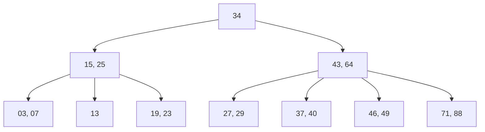

# B-Stabla - Kompletna skripta za ispit

## Uvod - Zašto nam trebaju B-stabla?

Zamislimo sledeću situaciju: imamo bazu podataka sa milion slogova i treba nam brz pristup bilo kojem slogu po ključu. Serijska datoteka bi nas naterala da prolazimo slog po slog - u najgorem slučaju milion pristupa. Sekvencijalna datoteka je bolja za redoslednu obradu, ali i dalje spora za direktan pristup. Indeks-sekvencijalna datoteka pomaže, ali vremenom se njene performanse kvare jer se nakupljaju prekoračioci.

Hajde da upoznamo strukturu koja rešava sve ove probleme na elegantan način - **B-stablo**. Ovo je jedan od najvažnijih koncepata u organizaciji datoteka i koristi se u bukvalno svakom savremenom sistemu za upravljanje bazama podataka (SUBP), bez izuzetka.

---

## Osnovno B-stablo

### Šta je B-stablo?

**B-stablo** je vrsta stabla traženja koje ima nekoliko specifičnih osobina koje ga čine idealnim za rad sa datotekama na disku. Pre svega, to je **puno stablo** i **stablo traženja**, ali sa jednom jako bitnom karakteristikom - koristi se kao **gusto popunjeni, dinamički indeks**.

Hajde da raščlanimo ove termine:
- **Gusto popunjeni** znači da se svaka vrednost ključa iz primarne zone propagira u zonu indeksa (za razliku od retko popunjenog indeksa gde se propagiraju samo neke vrednosti).
- **Dinamički** znači da se indeks automatski ažurira svaki put kad se nešto promeni u primarnoj zoni - ne moramo ga ručno "popravljati".

Vizuelno, B-stablo izgleda kao obrnut drvo - koren je na vrhu, a listovi na dnu. Ono što ga čini posebnim jeste da su **svi listovi na jednakoj udaljenosti od korena**, odnosno put od korena do bilo kog lista je uvek iste dužine. Ovo je ključna osobina jer garantuje predvidivo vreme traženja.

> [!IMPORTANT]
> B-stablo je stablo traženja visine $h$ u kojem su svi listovi na jednakoj udaljenosti od korena. Put od korena do bilo kog lista je iste dužine - to je upravo ono što garantuje ujednačene performanse traženja.

### Rang i red B-stabla

B-stablo ima **rang** $r$ (gde je $r \geq 2$), koji uvodi ograničenje na dozvoljeni broj elemenata u svakom čvoru. **Red** stabla je $n = 2r + 1$.

Rang $r$ direktno definiše koliko elemenata može biti u jednom čvoru:
- Svaki čvor sadrži **maksimalno** $2r$ elemenata
- Svaki čvor, **izuzev korena**, sadrži **minimalno** $r$ elemenata
- Koren sadrži **minimalno 1** element
- Svaki čvor sa $m$ elemenata, koji nije list, poseduje **$m + 1$ direktno podređenih čvorova**

Zamislimo B-stablo kao policu za knjige - svaka polica (čvor) mora imati bar $r$ knjiga (da ne bude prazna), ali ne više od $2r$ knjiga (da ne pukne). Jedini izuzetak je glavna polica (koren) - ona može imati i samo jednu knjigu.

> [!TIP]
> Na ispitu se često pita: "Koliko minimalno/maksimalno elemenata može imati čvor?" Zapamtite: minimum $r$ (osim korena koji ima minimum 1), maksimum $2r$. Red stabla je $n = 2r + 1$.

### Format čvora B-stabla

Svaki čvor B-stabla je zapravo jedan blok u zoni indeksa. Čvor sadrži **niz elemenata**, gde je svaki element trojka:

$$(k_e, A_e, P_e), \quad e \in \{1, \ldots, m\}$$

Gde je:
- $k_e$ - vrednost ključa sloga $S_i$ (gde $i \in \{1, 2, \ldots, N\}$)
- $A_e$ - pridruženi podatak (najčešće adresa sloga u primarnoj zoni)
- $P_e$ - pokazivač ka podstablu s većim vrednostima ključa od $k_e$

Pored toga, čvor ima zaglavlje bloka i specijalni pokazivač $P_0$ koji pokazuje na podstablo sa vrednostima ključa manjim od $k_1$ (prvog ključa u čvoru).

Struktura čvora izgleda ovako:

| Zaglavlje | $P_0$ | $k_1$ $A_1$ $P_1$ | $k_2$ $A_2$ $P_2$ | ... | $k_m$ $A_m$ $P_m$ | Neiskorišćeni prostor |
|-----------|-------|---------------------|---------------------|-----|---------------------|-----------------------|

### Uslovi stabla traženja

Da bi B-stablo funkcionisalo kao stablo traženja, moraju biti ispunjeni sledeći uslovi:

1. **Uređenost unutar čvora:** Ključevi u svakom čvoru su sortirani u rastućem redosledu:
$$(\forall i \in \{1, \ldots, m-1\})(k_i < k_{i+1})$$

2. **Levo podstablo:** Svi ključevi u podstablu na koje pokazuje $P_0$ su manji od prvog ključa:
$$(\forall k \in K(P_0))(k < k_1)$$

3. **Srednja podstabla:** Svi ključevi u podstablu na koje pokazuje $P_i$ su između $k_i$ i $k_{i+1}$:
$$(\forall i \in \{1, \ldots, m-1\})(\forall k \in K(P_i))(k_i < k < k_{i+1})$$

4. **Desno podstablo:** Svi ključevi u podstablu na koje pokazuje $P_m$ su veći od poslednjeg ključa:
$$(\forall k \in K(P_m))(k_m < k)$$

Ovo je ista logika kao i kod binarnog stabla traženja, samo proširena na više ključeva u čvoru.

### Primer B-stabla

Pogledajmo konkretan primer. Imamo B-stablo sa $N = 18$ slogova, ranga $r = 2$, visine $h = 3$. To znači da svaki čvor može imati od 2 do 4 elementa (osim korena koji ima minimum 1).

Stablo izgleda ovako (čitamo od korena ka listovima):

- **Koren (nivo 0):** `34`
- **Nivo 1 (levo):** `15, 25`  |  **Nivo 1 (desno):** `43, 64`
- **Listovi (nivo 2):** `03, 07` | `13` | `19, 23` | `27, 29` | `37, 40` | `46, 49` | `71, 88`

Proverimo uslove: u korenu imamo ključ 34. Sve u levom podstablu (15, 25, 03, 07, 13, 19, 23, 27, 29) je manje od 34 - tačno. Sve u desnom podstablu (43, 64, 37, 40, 46, 49, 71, 88) - čekaj, 37 i 40 su veći od 34 ali su u desnom podstablu čvora sa ključevima 43 i 64 - i nalaze se levo od 43, što je ispravno.

---

### Popunjenost B-stabla

Za isti broj slogova $N$ i rang $r$, B-stablo može imati različite visine i različite brojeve čvorova. To zavisi od toga kako je stablo popunjeno. Postoje dva ekstremna slučaja:

**Poluprazno (polupuno) B-stablo:**
- Svi čvorovi, osim korena, sadrže po $r$ elemenata (minimum dozvoljenih)
- Koren sadrži samo 1 element
- Stablo ne može biti manje popunjeno od ovog

**Kompletno (popunjeno) B-stablo:**
- Svi čvorovi sadrže po $2r$ elemenata (maksimum dozvoljenih)
- Stablo ne može biti više popunjeno od ovog

Ovo su granični slučajevi - u praksi, popunjenost je negde između.

### Broj čvorova i elemenata po nivoima

Hajde da vidimo kako se broj čvorova i elemenata raspoređuje po nivoima hijerarhije B-stabla ranga $r$:

| Nivo | Visina | Kompletno - Br. čvorova | Kompletno - Br. elemenata | Poluprazno - Br. čvorova | Poluprazno - Br. elemenata |
|------|--------|--------------------------|----------------------------|---------------------------|------------------------------|
| 0    | 1      | 1                        | $2r$                       | 1                         | 1                            |
| 1    | 2      | $(2r+1)^1$               | $2r(2r+1)^1$              | 2                         | $2r$                         |
| 2    | 3      | $(2r+1)^2$               | $2r(2r+1)^2$              | $2(r+1)^1$                | $2r(r+1)^1$                  |
| ...  | ...    | ...                      | ...                        | ...                       | ...                          |
| $i-1$| $i$    | $(2r+1)^{i-1}$           | $2r(2r+1)^{i-1}$          | $2(r+1)^{i-2}$            | $2r(r+1)^{i-2}$              |
| $h-1$| $h$    | $(2r+1)^{h-1}$           | $2r(2r+1)^{h-1}$          | $2(r+1)^{h-2}$            | $2r(r+1)^{h-2}$              |

### Formule za broj čvorova stabla

**Kompletno stablo** - ukupan broj čvorova:

$$C_{kp} = \sum_{i=0}^{h-1} (2r+1)^i = \frac{(2r+1)^h - 1}{(2r+1) - 1} = \frac{(2r+1)^h - 1}{2r}$$

**Poluprazno stablo** - ukupan broj čvorova:

$$C_{pp} = 1 + \sum_{i=1}^{h-1} 2(r+1)^{i-1} = 1 + 2 \cdot \frac{(r+1)^{h-1} - 1}{(r+1) - 1} = 1 + \frac{2((r+1)^{h-1} - 1)}{r}$$

### Visina stabla - formule

Sada dolazimo do jednih od najbitnijih formula za ispit - kako izračunati minimalnu i maksimalnu visinu B-stabla.

**Minimalna visina** (kompletno stablo - ne može biti niže od ovoga):

$$h_{min} = \lceil \log_{2r+1}(N+1) \rceil$$

$$C_{min} = \left\lceil \frac{N}{2r} \right\rceil$$

**Maksimalna visina** (poluprazno stablo - ne može biti više od ovoga):

$$h_{max} = 1 + \left\lfloor \log_{r+1}\left(\frac{N+1}{2}\right) \right\rfloor$$

$$C_{max} = 1 + \left\lfloor \frac{N-1}{r} \right\rfloor$$

> [!WARNING]
> Obratite pažnju na razliku - za $h_{min}$ koristi se logaritam sa bazom $2r+1$ i gornja celobrojna funkcija (ceiling), dok se za $h_{max}$ koristi logaritam sa bazom $r+1$ i donja celobrojna funkcija (floor) plus 1.

### Numerički primer

Pogledajmo tabelu sa konkretnim vrednostima za $r = 50$:

| $N$    | $r$ | $h_{min}$ | $h_{max}$ | $C_{min}$  | $C_{max}$   |
|--------|-----|-----------|-----------|------------|-------------|
| $10^3$ | 50  | 2         | 2         | 10         | 20          |
| $10^4$ | 50  | 2         | 3         | $10^2$     | $2 \cdot 10^2$ |
| $10^5$ | 50  | 3         | 3         | $10^3$     | $2 \cdot 10^3$ |
| $10^6$ | 50  | 3         | 4         | $10^4$     | $2 \cdot 10^4$ |

Pogledajte koliko je ovo moćno - sa milion slogova ($10^6$) i rangom 50, visina stabla je samo 3 ili 4! To znači da nam za pronalaženje bilo kog sloga trebaju samo 3-4 pristupa disku. Uporedite to sa serijskom datotekom gde bi nam trebalo do milion pristupa.

> [!TIP]
> Za ispit: uvek proverite odnos $h_{min} \leq h \leq h_{max}$ i $C_{min} \leq C \leq C_{max}$. Ako dobijete vrednosti izvan ovih opsega, negde ste pogrešili.

---

## Formiranje datoteke s B-stablom

### Struktura datoteke

Pre nego što krenemo sa formiranjem, hajde da razumemo strukturu cele datoteke. Datoteka sa B-stablom ima dve zone:

**Zona indeksa** - spregnuta struktura, samo B-stablo:
- Dinamički, gusto popunjeni indeks
- Svaka vrednost ključa primarne zone propagira se u zonu indeksa
- Dinamičko ažuriranje - prati promene u primarnoj zoni
- Omogućava efikasno traženje u primarnoj zoni

**Primarna zona** - serijska datoteka:
- Iskorišćenje dobrih osobina serijske datoteke pri ažuriranju
- Traženja se ne vrše direktno u serijskoj datoteci, već preko indeksa

> [!NOTE]
> Primarna zona je namerno organizovana kao serijska datoteka. To deluje kontraintuitivno, ali ima smisla - serijska datoteka je jednostavna za ažuriranje (novi slogovi se dodaju na kraj), a za traženje koristimo B-stablo kao indeks.

### Indeksna metoda pristupa

B-stabla se koriste u raznim kontekstima:
- **Operativni sistemi** mainframe računara poseduju metode pristupa za formiranje, korišćenje i ažuriranje indeksnih datoteka sa B-stablima
- **Programski jezici** koriste specijalizovane biblioteke za indeksnu metodu pristupa, ili korisnici pišu sopstvene metode
- **SUBP** poseduju sopstvene indeksne metode pristupa i koriste ih u izgradnji fizičkih struktura baza podataka

### Postupak formiranja

Formiranje datoteke sa B-stablom odvija se u nekoliko koraka:

1. **Formiranje primarne zone** - preuzimanjem postojeće serijske datoteke ili sukcesivnim učitavanjem slogova ulazne serijske datoteke

2. **Formiranje zone indeksa:**
   - Upisivanje zaglavlja stabla traženja u zonu indeksa
   - Inicijalno, nedefinisane vrednosti pokazivača na koren stabla i krajnji levi čvor stabla
   - Inicijalizacija pokazivača na prvi blok u lancu praznih blokova
   - Formiranje lanca praznih blokova (čvorova)
   - Sukcesivno čitanje slogova primarne zone i formiranje B-stabla dinamičkim upisivanjem novih elemenata
   - Upisivanje prvog elementa formira koren stabla

### Upis novog elementa u B-stablo

Ovo je srce formiranja B-stabla, pa hajde da ga detaljno razumemo.

Pre svakog upisa, vrši se **neuspešno traženje** elementa - moramo potvrditi da element sa tim ključem ne postoji u stablu. Traženje započinje u korenu, ide upoređivanjem argumenta traženja sa vrednostima ključa u svakom čvoru i praćenjem pokazivača na jednom pristupnom putu od korena do lista. Traženje **uvek završava u listu**.

Kada smo stigli do lista gde treba ubaciti element, postoje dve mogućnosti:

#### Slučaj A: Delimično popunjen list ($m_e < 2r$)

Ovo je jednostavan slučaj. Novi element se upisuje na poziciju zaustavljanja traženja, a elementi sa većom vrednošću ključa u čvoru pomeraju se za jednu poziciju udesno. I to je to - gotovo!

#### Slučaj B: Potpuno popunjen list ($m_e = 2r$)

Ovaj slučaj je zanimljiviji. Čvor je pun i mora se podeliti:

1. Alocira se novi, desni list
2. U operativnoj memoriji formira se uređeni niz od $2r + 1$ elemenata (svi postojeći + novi)
3. **Prva polovina** niza (prvih $r$ elemenata) ostaje u levom (postojećem) listu
4. **Srednji element** ($(r+1)$-vi) upisuje se u nadređeni čvor - ovo je **propagacija naviše** i može izazvati deljenje nadređenog čvora!
5. **Druga polovina** niza (poslednjih $r$ elemenata) upisuje se u desni (novi) list

Ako se deli koren, formira se novi koren i **visina stabla se povećava za 1**. Ovo je jedini način na koji B-stablo raste u visinu - odozdo naviše.

> [!IMPORTANT]
> B-stablo raste u visinu samo kada se deli koren. Deljenje bilo kog drugog čvora propagira srednji element naviše, ali ne menja visinu. Ovo garantuje da su svi listovi uvek na istom rastojanju od korena.

### Vizuelizacija deljenja čvora

Pre deljenja, pun čvor izgleda ovako:

| $P_0$ | $k_1 A_1 P_1$ | ... | $k_{r+1} A_{r+1} P_{r+1}$ | ... | $k_{2r} A_{2r} P_{2r}$ | $k_{2r+1} A_{2r+1} P_{2r+1}$ |
|-------|----------------|-----|----------------------------|-----|--------------------------|-------------------------------|

Posle deljenja:

**Levi čvor:** $P_0, k_1 A_1 P_1, \ldots, k_r A_r P_r$

**Propagira se naviše:** $k_{r+1} A_{r+1}$

**Desni čvor:** $P_{r+1}, k_{r+2} A_{r+2} P_{r+2}, \ldots, k_{2r+1} A_{2r+1} P_{2r+1}$

### Primer formiranja

Pogledajmo konkretan primer formiranja B-stabla sa sledećim parametrima:
- Ulazna serijska datoteka sa $N = 18$ slogova
- Rang stabla $r = 2$
- Kapacitet svakog čvora: $2r = 4$ elementa
- Rezultujuća visina stabla: $h = 3$

Slogovi se učitavaju jedan po jedan iz ulazne datoteke i ubacuju u B-stablo. Svaki put kad je čvor pun, dolazi do deljenja - srednji element ide naviše, a ostali se raspoređuju u dva čvora. Proces se nastavlja dok se svi slogovi ne ubace.

---

## Traženje u datoteci s B-stablom

### Traženje logički narednog sloga

Kada trebamo proći kroz sve slogove u logičkom redosledu (sortirani po ključu), koristi se **modifikovani simetrični postupak prolaska kroz B-stablo**. Ovaj postupak naizmenično pristupa listovima i njihovim nadređenim elementima.

Traženje se vrši od tekućeg elementa stabla. Inicijalno, tekući element je onaj sa **najmanjom vrednošću ključa u krajnjem levom listu**.

Upoređuju se argument traženja $a$ i vrednosti ključa elemenata stabla $k_e$:
- Traženje se uspešno završava kada je $a = k_e$
- Neuspešno traženje završava se nailaskom na element sa $k_e > a$ ili nailaskom na kraj krajnjeg desnog lista

### Traženje slučajno odabranog sloga

Ovo je mnogo češći scenario u praksi - imamo ključ i hoćemo da pronađemo odgovarajući slog.

Postupak:
1. Traženje započinje u **korenu stabla**
2. Eventualno se nastavlja u podređenim čvorovima
3. Završava se u čvoru u kojem je element pronađen ili u listu
4. Na svakom nivou hijerarhije stabla pristupa se **najviše jednom čvoru**

Poređenje argumenta traženja $a$ sa ključevima u čvoru:
- Ako se nađe element za koji je $a = k_e$ - traženom slogu pristupa se na osnovu adrese $A_e$
- Ako se, pri traženju u čvoru, dođe do elementa sa $k_e > a$ - traženje se nastavlja u odgovarajućem podstablu

### Broj pristupa pri traženju

**Uspešno traženje** (element pronađen) - može se završiti u bilo kojem čvoru:

Sa samo jednim baferom u operativnoj memoriji (OM) za stablo:

$$R_u = h + 1$$

(h pristupa čvorovima stabla + 1 pristup primarnoj zoni)

Sa $h$ bafera u OM (ceo pristupni put):

$$0 \leq R_u \leq h + 1$$

**Neuspešno traženje** - uvek završava u listu:

Sa jednim baferom u OM:

$$R_n = h$$

Sa $h$ bafera u OM:

$$0 \leq R_n \leq h$$

**Celo stablo u OM:** $R_u = R_n = 0$ (nula pristupa disku, sve se radi u memoriji)

> [!IMPORTANT]
> Zapamtite razliku: uspešno traženje je $h + 1$ (jer posle nalaženja ključa u indeksu, treba još jedan pristup primarnoj zoni da se pročita slog), a neuspešno je $h$ (završava u listu stabla, nema pristupa primarnoj zoni). Ako su svi čvorovi u memoriji, broj pristupa disku je 0.

---

## Obrada datoteke s B-stablom

Datoteka s B-stablom može se koristiti i kao vodeća i kao obrađivana, i u režimu redosledne i u režimu direktne obrade. U svim slučajevima, pokazuje **solidne performanse** - ovo je jedna od najvećih prednosti B-stabla.

### Ukupan broj pristupa - parametri

Ukupan broj pristupa datoteci $R_{uk}^{v}$ zavisi od nekoliko parametara:

1. **Da li je stablo kompletno ili poluprazno** - broj čvorova kompletnog stabla je najmanji mogući, a polupraznog najveći mogući

2. **Da li je rezervisano $h$ bafera za ceo pristupni put ili samo 1 bafer** za čvorove B-stabla:
   - Sa $h$ bafera, ceo pristupni put staje u OM pa se svakom čvoru pristupa tačno jedanput
   - Sa jednim baferom, svakom neterminalnom čvoru mora se pristupati barem onoliko puta koliko elemenata poseduje

3. **Da li su sukcesivno traženi slogovi u primarnoj zoni smešteni u fizički susedne lokacije** ili u lokacije različitih blokova

### Uloga vodeće datoteke

Osnovne formule za ukupan broj pristupa u ulozi vodeće datoteke:

$$R_{uk}^{v} \geq C + E + \left\lceil \frac{N}{f} \right\rceil \rightarrow C + h - 1$$

Za minimalnu vrednost (kompletno stablo sa $h$ bafera):

$$R_{uk,min}^{v} \geq C_{max}^{h} + E + \left\lceil \frac{N}{f} \right\rceil \rightarrow C_{max}^{h} + h - 1$$

### Redosledna obrada

Redosledna obrada se vrši putem vodeće datoteke sa $N_v = N_v^u + N_v^n$ slogova, gde je $N_v^u$ broj slogova koji iniciraju uspešno traženje, a $N_v^n$ broj slogova koji iniciraju neuspešno traženje.

Ukupan broj pristupa datoteci kao obrađivanoj:

$$R_{uk}^{r} = \frac{R_{uk}^{v}}{N_v} \cdot N_v^u$$

Za procenu sa jednim baferom:

$$R_{uk}^{r} \approx \frac{N}{r} + \frac{N(r+1)}{r} + \frac{N}{2r} + \left\lceil \frac{N}{f} \right\rceil$$

### Direktna obrada

Direktna obrada se vrši putem vodeće datoteke sa $N_v = N_v^u + N_v^n$ slogova. Pristup slučajno odabranom slogu je relativno brz.

Ukupan broj pristupa:

$$R_{uk}^{d} = R_u \cdot N_v^u + R_n \cdot N_v^n$$

---

## Ažuriranje datoteke s B-stablom

### Upis novog sloga

Upis novog i brisanje postojećeg sloga vrši se u **režimu direktne obrade**. Izvodi ga metoda pristupa na zahtev aplikativnog programa.

Upis novog elementa u B-stablo odvija se **na isti način kao u slučaju formiranja B-stabla** - prethodi mu neuspešno traženje, a zatim se element ubacuje u odgovarajući list sa eventualnim deljenjem čvora ako je pun.

### Brisanje elementa iz B-stabla

Brisanju prethodi **uspešno traženje** - moramo prvo pronaći element koji brišemo. Postupak uključuje logičko brisanje sloga u primarnoj zoni i fizičko brisanje elementa iz B-stabla.

Jako bitno pravilo: **element se sme fizički izbrisati jedino ako se nalazi u listu**. Ako se element ne nalazi u listu, mora se prvo zameniti elementom iz lista, pa tek onda obrisati.

#### Slučaj A: Element za brisanje nalazi se u listu

**A1: List sadrži $m_e > r$ elemenata ili je koren stabla**

Ovo je najjednostavniji slučaj. Fizički se oslobađa lokacija izbrisanog elementa, po potrebi se ostali elementi pomeraju za jednu poziciju ulevo. Nakon brisanja, u listu ostaje $m_e - 1 \geq r$ elemenata, što je i dalje iznad minimuma.

**A2: List sadrži $m_e = r$ elemenata i nije koren stabla**

Ovde nastaje problem - ako jednostavno obrišemo element, u čvoru ostaje $r - 1$ elemenata, što je ispod dozvoljenog minimuma. Imamo dve tehnike za rešavanje ovog problema:

**A21: Tehnika pozajmljivanja** - postoji barem jedan susedni čvor sa $m_f > r$ elemenata

Susedni čvorovi $C_e$ i $C_f$ su oni koji imaju zajednički direktno nadređeni čvor $C$ i između kojih ne postoji nijedan ključ u nadređenom čvoru:

$$(\nexists k \in K(C))(k_m < k < k_1)$$

gde je $k_m$ najveća vrednost ključa u čvoru $C_e$, a $k_1$ najmanja vrednost ključa u čvoru $C_f$.

Postupak pozajmljivanja:
1. Formira se u OM uređeni niz od $m_f + r - 1 + 1$ elemenata (svi elementi susednog čvora, jedan nadređeni i $r - 1$ element čvora iz kojeg se briše element)
2. $\lfloor(m_f + r) / 2\rfloor$ elemenata smešta se u levi susedni čvor
3. $\lfloor(m_f + r) / 2\rfloor + 1$-vi element smešta se u nadređeni čvor
4. Preostali elementi smeštaju se u desni susedni čvor

**A22: Tehnika spajanja** - svi susedni čvorovi imaju $m_f = r$ elemenata

Kada nema od koga da pozajmimo, dva susedna čvora se spajaju u jedan:
1. Formira se u OM uređeni niz od $r + r - 1 + 1 = 2r$ elemenata ($r$ elemenata susednog čvora, jedan nadređeni i $r - 1$ element čvora iz kojeg se briše element)
2. Svih $2r$ elemenata smešta se u levi susedni čvor
3. Desni susedni čvor postaje prazan i dealocira se
4. **Fizičko brisanje elementa iz nadređenog čvora** - ovo je ključni korak!

Brisanje elementa iz nadređenog čvora može izazvati novo pozajmljivanje ili spajanje čvorova na višem nivou u stablu. U ekstremnom slučaju, može doći do spajanja jedina dva direktno podređena čvora korenu, što izaziva **dealociranje korena i smanjenje visine stabla za jedan**.

> [!CAUTION]
> Tehnika spajanja može da se "propagira naviše" kroz celo stablo, sve do korena. Ako se spoje jedina dva podređena čvora korenu, koren se briše i stablo postaje niže za jedan nivo. Ovo je jedini način na koji se visina B-stabla smanjuje.

#### Slučaj B: Element za brisanje ne nalazi se u listu

Pošto se element sme fizički obrisati samo iz lista, koristimo sledeći trik:

1. Element koji brišemo zamenjujemo elementom koji sadrži **prvu veću vrednost ključa**
2. Taj element je krajnji levi element u krajnjem levom čvoru desnog podstabla u odnosu na element koji se briše
3. Nakon zamene, element s prvom većom vrednošću ključa fizički se briše iz lista
4. Time se vraćamo na slučaj A

---

## Ocena karakteristika datoteka s B-stablom

### Prednosti

B-stabla pokazuju uravnotežene performanse i u direktnoj i u redoslednoj obradi - to je njihova glavna snaga. Dodatne prednosti:

- **Ne kvare se performanse** obrade u vremenu kao posledica naknadnih ažuriranja (za razliku od statičkih indeks-sekvencijalnih datoteka)
- **Ne zahtevaju postojanje zone prekoračenja** (opet, za razliku od statičkih indeks-sekvencijalnih datoteka)
- Struktura primarne zone odgovara strukturi serijske datoteke - jednostavna za ažuriranje
- **Maksimalni broj pristupa pri traženju** slučajno odabranog sloga moguće je unapred proceniti (jer znamo visinu stabla)
- **Selektivnost indeksa** po svakom pristupnom putu je ista (svi listovi su na istom rastojanju od korena)

### Nedostaci

- **Nije najpogodnije rešenje za redoslednu obradu** - broj pristupa zavisi od broja slogova vodeće datoteke, a koristi se modifikovani algoritam simetričnog postupka prolaska koji zahteva višestruko pristupanje neterminalnim čvorovima
- **Deljenje čvorova favorizuje izgradnju polupraznog B-stabla** - posebno kada se formiranje datoteke vrši na osnovu sekvencijalne ulazne datoteke, jer su tada svi listovi, osim krajnjeg desnog, uvek poluprazni. Ovo je česta situacija u praksi, kada se vrednosti ključa generišu automatski, inkrementiranjem.

> [!WARNING]
> Česta zamka na ispitu: studenti misle da su B-stabla savršena za sve. Zapamtite dva ključna nedostatka: redosledna obrada zahteva mnogo pristupa neterminalnim čvorovima, i deljenje čvorova teži da pravi poluprazno stablo (oko 50% popunjenosti).

---

## B*-stablo, B#-stablo, B+-stablo

### B*-stablo

**B\*-stablo** je strukturalno isto kao osnovno B-stablo, ali uvodi **tehniku prelivanja** koja ublažava problem favorizacije polupraznog stabla.

**Tehnika prelivanja** primenjuje se pri upisu novog elementa u stablo, kada je čvor $C_e$ u koji se upisuje element kompletan ($2r$ elemenata), a bar jedan od njegovih susednih čvorova $C_f$ sadrži $m_f < 2r$ elemenata.

Postupak:
1. Formira se u OM uređeni niz od $m_f + 2r + 1 + 1$ elemenata (svi elementi susednog čvora, jedan nadređeni i $2r + 1$ elemenata čvora u koji se upisuje element)
2. $\lfloor(m_f + 2r + 2) / 2\rfloor$ elemenata smešta se u levi susedni čvor
3. $\lfloor(m_f + 2r + 2) / 2\rfloor + 1$-vi element smešta se u nadređeni čvor
4. Preostali elementi smeštaju se u desni susedni čvor

Rezultat: **favorizacija 75% popunjenosti stabla** (umesto oko 50% kod osnovnog B-stabla).

> [!TIP]
> Razlika između pozajmljivanja (kod brisanja) i prelivanja (kod upisa u B\*-stablo) je u kontekstu primene: pozajmljivanje se koristi kada je čvor prethodno prazan, a prelivanje kada je pun.

### B#-stablo

**B#-stablo** je varijanta B\*-stabla koja garantuje **minimalnu popunjenost 66%** za sve čvorove na svim nivoima hijerarhije, osim na prva dva.

Koristi **tehniku distribuiranog deljenja** koja se primenjuje pri upisu novog elementa kada je čvor $C_e$ u koji se upisuje element kompletan I kompletni su svi njegovi susedi.

Postupak distribuiranog deljenja - elementi susednih čvorova $C_e$ i $C_f$ distribuiraju se u **tri** čvora:
1. Formira se u OM uređeni niz od $2r + 2r + 1 + 1 = 4r + 2$ elemenata
2. $\lfloor(4r + 2) / 3\rfloor$ elemenata smešta se u levi susedni čvor
3. $\lfloor(4r + 2) / 3\rfloor + 1$-vi element smešta se u nadređeni čvor
4. $\lfloor(4r + 1) / 3\rfloor$ elemenata smešta se u srednji susedni čvor
5. $\lfloor(4r + 2) / 3\rfloor + \lfloor(4r + 1) / 3\rfloor + 2$-gi element smešta se u nadređeni čvor
6. Preostalih $\lfloor 4r / 3 \rfloor$ elemenata smešta se u novoalocirani, desni susedni čvor

### B+-stablo

Sada dolazimo do jedne od najvažnijih varijanti - **B+-stablo**. Ovo je modifikacija osnovnog B-stabla koja rešava glavni nedostatak - pri traženju logički narednog sloga u osnovnom B-stablu potrebno je pristupati svim čvorovima stabla. U slučaju B+-stabla, **za traženje logički narednog sloga dovoljno je pristupati samo listovima**.

#### Strukturalne razlike

B+-stablo je **strukturalno drugačije** od osnovnog B-stabla:
- **Vrednosti ključa svih slogova nalaze se uređene u listovima**
- **Svi listovi su dvostruko spregnuti** - sadrže informaciju o svim logičkim vezama između slogova
- Čvorovi na višim nivoima stabla traženja sadrže **najmanje vrednosti ključa iz svakog lista** osim iz krajnjeg levog
- Vrednosti ključa čvorova koji ne predstavljaju listove, u nadređenim čvorovima **se ne ponavljaju**
- Logika formiranja neterminalnih čvorova odgovara strukturi osnovnog B-stabla

#### Format čvora B+-stabla

Za razliku od osnovnog B-stabla gde je element trojka $(k_e, A_e, P_e)$, u B+-stablu element je **dvojka**:

$$(k_e, P_e), \quad e \in \{1, \ldots, m\}$$

Gde je:
- $k_e$ - vrednost ključa sloga $S_i$ (gde $i \in \{1, 2, \ldots, N\}$)
- $P_e$ - pokazivač ka podstablu (za neterminalni čvor) ili bloku u primarnoj zoni (u slučaju lista)

Uslovi stabla traženja su slični, ali sa malom razlikom u operatorima:
- $(\forall i \in \{1, \ldots, m-1\})(k_i < k_{i+1})$
- $(\forall k \in K(P_0))(k < k_1)$
- $(\forall i \in \{1, \ldots, m-1\})(\forall k \in K(P_i))(k_i \leq k < k_{i+1})$
- $(\forall k \in K(P_m))(k_m \leq k)$

> [!IMPORTANT]
> Obratite pažnju na razliku u uslovima: kod B+-stabla se koristi $\leq$ umesto striktnog $<$ u poslednja dva uslova. Razlog je što se isti ključ može pojaviti i u listu i u nadređenom čvoru.

#### Formiranje B+-stabla

Postupak je analogan formiranju osnovnog B-stabla, ali sa specifičnostima pri deljenju listova:

**Tehnika deljenja lista:**
1. Formira se u OM uređeni niz od $2r + 1$ elemenata
2. $\lfloor(2r + 1) / 2\rfloor = r$ elemenata smešta se u levi susedni čvor
3. $(r + 1)$-vi element smešta se u nadređeni čvor
4. $(r + 1)$-vi element **i** svih preostalih $r$ elemenata smešta se u novoalocirani, desni susedni čvor

Primetite ključnu razliku: **isti element se pojavljuje i u nadređenom čvoru i u desnom susedu** - to je ponavljanje koje obezbeđuje da se svi ključevi nalaze u listovima.

Neterminalni čvorovi dele se na isti način kao kod osnovnog B-stabla.

**Tehnika prelivanja u listovima** ima sličnu specifičnost:
1. Formira se u OM uređeni niz od $m_f + 2r + 1 + 1$ elemenata
2. $\lfloor(m_f + 2r + 2) / 2\rfloor$ elemenata smešta se u levi susedni čvor
3. $\lfloor(m_f + 2r + 2) / 2\rfloor + 1$-vi element smešta se u nadređeni čvor
4. $\lfloor(m_f + 2r + 2) / 2\rfloor + 1$-vi element **i** svi preostali elementi smeštaju se u desni susedni čvor

Prelivanje u neterminalnim čvorovima vrši se na isti način kao kod osnovnog B-stabla.

#### Traženje u B+-stablu

**Traženje logički narednog sloga** - vrši se isključivo u listovima B+-stabla, primenom kombinacije metoda linearnog traženja i metode praćenja pokazivača, od tekućeg elementa B+-stabla.

**Redosledna obrada** - prolazak kroz sve listove B+-stabla i pristupanje primarnoj zoni:

Za kompletno stablo:

$$R_{uk,min}^{r} \leq C_{min}^h + \frac{N}{f}$$

Za poluprazno stablo:

$$R_{uk}^{r} \approx \frac{N}{r} + \frac{N}{2r} + \frac{N}{f}$$

**Traženje slučajno odabranog sloga** - počinje u korenu B+-stabla i **uvek se završava u jednom od listova**, i za uspešno i za neuspešno traženje.

Logika traženja:
- Ako je $a < k_e$, dalje se prati pokazivač $P_{e-1}$
- Ako je $a = k_e$, prati se pokazivač $P_e$ - stiže se do lista
- Ako je $a > k_m$, prati se pokazivač $P_m$

Broj pristupa (sa jednim baferom u OM):
- Uspešno: $R_u = h^+ + 1$
- Neuspešno: $R_n = h^+$

> [!NOTE]
> Za razliku od osnovnog B-stabla, u B+-stablu i uspešno traženje uvek ide do lista (jer su svi podaci u listovima), pa je $R_u = h^+ + 1$.

#### Visina B+-stabla

**Kompletno B+-stablo:**

$$h_{min}^+ = 1 + \lceil \log_{2r+1}(N/2r) \rceil$$

$$C_{kp}^{h^+} = (2r+1)^{h^+-1}, \quad N = 2r \cdot C_{kp}^{h^+} = 2r(2r+1)^{h^+-1}$$

**Poluprazno B+-stablo:**

$$h_{max}^+ = 2 + \lfloor \log_{r+1}(N/2r) \rfloor$$

$$C_{pp}^{h^+} = 2(r+1)^{h^+-2}, \quad N = 2r \cdot C_{pp}^{h^+} = 2r \cdot 2(r+1)^{h^+-2}$$

#### Uporedna tabela visina

| $N$    | $r$ | $h_{min}$ | $h_{max}$ | $h_{min}^+$ | $h_{max}^+$ |
|--------|-----|-----------|-----------|-------------|-------------|
| $10^3$ | 50  | 2         | 2         | 2           | 2           |
| $10^4$ | 50  | 2         | 3         | 2           | 3           |
| $10^5$ | 50  | 3         | 3         | 3           | 3           |
| $10^6$ | 50  | 3         | 4         | 3           | 4           |

Vidimo da su visine B-stabla i B+-stabla vrlo slične za iste parametre.

#### Ažuriranje B+-stabla

Upis novog elementa vrši se na isti način kao pri formiranju B+-stabla.

Brisanje ima specifičnost: briše se i element u listu i, ako je ponovljen, element sa istom vrednošću ključa u nadređenom čvoru. Brisanje elementa iz čvora sa $r$ elemenata koristi iste tehnike kao i osnovno B-stablo - pozajmljivanje i spajanje čvorova.

---

## Indeks-sekvencijalna datoteka s B-stablom

### Motivacija

B+-stablo rešava problem redosledne obrade, ali ima jedan nedostatak - za sva uspešna traženja sloga, potrebno je pristupati primarnoj zoni (čak i nakon pronalaženja ključa u listu, moramo otići do primarne zone po sam slog). Indeks-sekvencijalna datoteka s B-stablom rešava i ovaj problem.

### Struktura

**Indeks-sekvencijalna datoteka s B-stablom** je modifikacija B+-stabla kod koje **listovi B+-stabla postaju blokovi primarne zone**. To znači da uspešna traženja završavaju u listovima - nema potrebe za dodatnim pristupom primarnoj zoni!

**Primarna zona** je spregnuta struktura u kojoj su slogovi uređeni saglasno rastućim vrednostima ključa.

**Zona indeksa** je spregnuta struktura koja čini neterminalne čvorove B+-stabla - osnovno B-stablo ili neka od varijanti (B*, B#). Ovo je **retko popunjeni indeks** jer se u zonu indeksa propagiraju najmanje vrednosti ključa svakog bloka primarne zone, osim prvog bloka.

### Faktor blokiranja i broj blokova

Faktor blokiranja primarne zone: $f = 2r$

Broj blokova primarne zone:

**Kompletno stablo:**
$$B_{min} = \left\lceil \frac{N}{f} \right\rceil = \left\lceil \frac{N}{2r} \right\rceil$$

**Poluprazno stablo:**
$$B_{max} = \left\lceil \frac{N}{f/2} \right\rceil = \left\lceil \frac{N}{r} \right\rceil$$

Broj blokova kreće se u rasponu: $B_{min} \leq B \leq B_{max}$

### Formiranje, obrada, traženje i ažuriranje

**Formiranje** se vrši na uobičajen način - može se poći od ulazne serijske ili ulazne sekvencijalne datoteke.

**Obrada:**
- Može se koristiti i kao vodeća i kao obrađivana
- I u režimu redosledne i u režimu direktne obrade
- Pogodnija za primenu u redoslednoj obradi jer se pristupa direktno blokovima primarne zone
- Pogodno da broj blokova primarne zone bude manji - za manje kapacitete slogova postiže se veći $r$ i manji $B$

**Traženje logički narednog sloga** - vrši se isključivo u blokovima primarne zone, primenom kombinacije metoda linearnog traženja i metode praćenja pokazivača, od tekućeg sloga primarne zone.

**Traženje slučajno odabranog sloga** - počinje u korenu B-stabla i uvek se završava u bloku primarne zone, i za uspešno i za neuspešno traženje.

Broj pristupa (sa jednim baferom u OM):
- Uspešno: $R_u = h_{is} + 1$
- Neuspešno: $R_n = h_{is} + 1$

> [!IMPORTANT]
> Primetite da je kod indeks-sekvencijalne datoteke s B-stablom i za uspešno i za neuspešno traženje broj pristupa $h_{is} + 1$. Razlog je što se u oba slučaja moramo spustiti kroz celo stablo do bloka primarne zone (koji je ujedno i list).

### Visina stabla indeks-sekvencijalne datoteke

**Kompletno B-stablo:**

$$h_{min}^{is} = \lceil \log_{2r+1}(N/2r) \rceil$$

$$C_{kp}^{h^{is}} = (2r+1)^{h^{is}-1}, \quad B = 2r \cdot C_{kp}^{h^{is}} = 2r(2r+1)^{h^{is}-1}$$

**Poluprazno B-stablo:**

$$h_{max}^{is} = 1 + \lfloor \log_{r+1}(N/2r) \rfloor$$

$$C_{pp}^{h^{is}} = 2(r+1)^{h^{is}-1}, \quad B = r \cdot C_{pp}^{h^{is}} = r \cdot 2(r+1)^{h^{is}-1}$$

### Uporedna tabela visina - sve varijante

| $N$    | $r$ | $h_{min}$ | $h_{max}$ | $h_{min}^+$ | $h_{max}^+$ | $h_{min}^{is}$ | $h_{max}^{is}$ |
|--------|-----|-----------|-----------|-------------|-------------|----------------|----------------|
| $10^3$ | 50  | 2         | 2         | 2           | 2           | 1              | 1              |
| $10^4$ | 50  | 2         | 3         | 2           | 3           | 1              | 2              |
| $10^5$ | 50  | 3         | 3         | 3           | 3           | 2              | 2              |
| $10^6$ | 50  | 3         | 4         | 3           | 4           | 2              | 3              |

Primetite da indeks-sekvencijalna datoteka s B-stablom ima za jedan nivo nižu visinu u odnosu na B+-stablo, jer listovi B+-stabla postaju blokovi primarne zone (pa se ne broje u visinu indeksnog stabla).

### Ocena karakteristika

Indeksne datoteke s B-stablima su **pogodne i za direktnu i za redoslednu obradu**:
- Relativno brz pristup slučajno odabranom slogu
- Ne prevelik broj pristupa u redoslednoj obradi
- Za efikasniju redoslednu obradu koriste se indeks-sekvencijalne datoteke s B-stablom, u slučajevima ne prevelikog kapaciteta sloga

Ovo je **kompromisno rešenje** pri izboru fizičke strukture podataka - nije idealna organizacija ni za redoslednu ni za direktnu obradu, ali je organizacija **prisutna u svim savremenim SUBP, bez izuzetka**.

> [!TIP]
> Za ispit zapamtite ovu rečenicu: "B-stabla su kompromisno rešenje prisutno u svim savremenim SUBP, bez izuzetka." Ovo je omiljeno pitanje profesora jer objedinjuje razumevanje prednosti i nedostataka.

---

## Pregled svih formula na jednom mestu

### Osnovno B-stablo

| Formula | Značenje |
|---------|----------|
| $n = 2r + 1$ | Red stabla |
| $h_{min} = \lceil \log_{2r+1}(N+1) \rceil$ | Minimalna visina |
| $h_{max} = 1 + \lfloor \log_{r+1}(\frac{N+1}{2}) \rfloor$ | Maksimalna visina |
| $C_{min} = \lceil \frac{N}{2r} \rceil$ | Min. broj čvorova |
| $C_{max} = 1 + \lfloor \frac{N-1}{r} \rfloor$ | Max. broj čvorova |
| $R_u = h + 1$ | Pristup (uspešno, 1 bafer) |
| $R_n = h$ | Pristup (neuspešno, 1 bafer) |

### B+-stablo

| Formula | Značenje |
|---------|----------|
| $h_{min}^+ = 1 + \lceil \log_{2r+1}(N/2r) \rceil$ | Minimalna visina |
| $h_{max}^+ = 2 + \lfloor \log_{r+1}(N/2r) \rfloor$ | Maksimalna visina |
| $R_u = h^+ + 1$ | Pristup (uspešno, 1 bafer) |
| $R_n = h^+$ | Pristup (neuspešno, 1 bafer) |

### Indeks-sekvencijalna datoteka s B-stablom

| Formula | Značenje |
|---------|----------|
| $f = 2r$ | Faktor blokiranja |
| $B_{min} = \lceil N / 2r \rceil$ | Min. broj blokova |
| $B_{max} = \lceil N / r \rceil$ | Max. broj blokova |
| $h_{min}^{is} = \lceil \log_{2r+1}(N/2r) \rceil$ | Minimalna visina |
| $h_{max}^{is} = 1 + \lfloor \log_{r+1}(N/2r) \rfloor$ | Maksimalna visina |
| $R_u = h_{is} + 1$ | Pristup (uspešno, 1 bafer) |
| $R_n = h_{is} + 1$ | Pristup (neuspešno, 1 bafer) |

---

## 🎴 Brza pitanja (definicije i pojmovi)

**P:** Šta je B-stablo i koje su njegove osnovne karakteristike?

**P:** Koji je minimalni i maksimalni broj elemenata u čvoru B-stabla ranga $r$?

**P:** Šta je tehnika prelivanja i kod koje varijante B-stabla se koristi?

**P:** Po čemu se B+-stablo strukturalno razlikuje od osnovnog B-stabla?

**P:** Šta je tehnika distribuiranog deljenja i kod koje varijante se primenjuje?

**P:** Koliki je broj pristupa pri uspešnom traženju slučajno odabranog sloga u B-stablu sa jednim baferom u OM?

**P:** Šta se dešava kada se deli koren B-stabla?

**P:** Zašto se u B+-stablu isti element pojavljuje i u nadređenom čvoru i u desnom listu pri deljenju lista?

---

## 📝 Šira pitanja za proveru razumevanja

**P:** Objasnite postupak brisanja elementa iz B-stabla koji se ne nalazi u listu. Koji su koraci i zašto se element ne može direktno obrisati iz neterminalnog čvora?

**O:** Element koji nije u listu zamenjuje se elementom sa prvom većom vrednošću ključa, koji se uvek nalazi u krajnjem levom čvoru krajnjeg levog podstabla desnog podstabla brisanog elementa (taj element je uvek u listu). Nakon zamene, taj element iz lista se briše primenom standardnog postupka za brisanje iz lista (slučaj A). Direktno brisanje iz neterminalnog čvora nije dozvoljeno jer bi narušilo strukturu stabla - čvor sa $m$ elemenata mora imati $m + 1$ podređenih čvorova.

**P:** Uporedite osnovno B-stablo, B\*-stablo i B#-stablo sa aspekta popunjenosti čvorova. Koje tehnike svako od njih koristi i kakav efekat to ima?

**O:** Osnovno B-stablo koristi samo deljenje čvorova, što favorizuje popunjenost oko 50% (poluprazno stablo). B\*-stablo uvodi tehniku prelivanja koja pre deljenja pokušava da redistribuira elemente sa susednim čvorovima, čime se postiže favorizacija 75% popunjenosti. B#-stablo koristi tehniku distribuiranog deljenja gde se elementi dva susedna čvora redistribuiraju u tri čvora, garantujući minimalnu popunjenost od 66% za čvorove na svim nivoima osim prva dva.

**P:** Za $N = 10^5$ slogova i rang $r = 50$, izračunajte minimalnu i maksimalnu visinu osnovnog B-stabla.

**O:** Za minimalnu visinu: $h_{min} = \lceil \log_{101}(10^5 + 1) \rceil = \lceil \log_{101}(100001) \rceil$. Pošto je $101^2 = 10201$ i $101^3 = 1030301$, a $100001$ je između ta dva broja, važi $h_{min} = \lceil 2.49... \rceil = 3$. Za maksimalnu visinu: $h_{max} = 1 + \lfloor \log_{51}(50001) \rfloor$. Pošto je $51^2 = 2601$ i $51^3 = 132651$, a $50001$ je između, važi $h_{max} = 1 + \lfloor 2.74... \rfloor = 1 + 2 = 3$.

**P:** Objasnite prednost indeks-sekvencijalne datoteke s B-stablom u odnosu na B+-stablo za redoslednu obradu. Kako je ta prednost ostvarena strukturalno?

**O:** Kod B+-stabla, za traženje logički narednog sloga potrebno je pristupati samo listovima, ali nakon pronalaženja ključa u listu, potreban je dodatni pristup primarnoj zoni da se pročita sam slog. Kod indeks-sekvencijalne datoteke s B-stablom, listovi B+-stabla postaju blokovi primarne zone - kompletni slogovi se nalaze direktno u listovima. Time se eliminiše dodatni pristup primarnoj zoni, a za redoslednu obradu dovoljno je čitati samo blokove primarne zone redom, prateći spregnute pokazivače. Ovo je pogodno naročito kada kapacitet sloga nije prevelik.

**P:** Zašto su B-stabla prisutna u svim savremenim SUBP bez izuzetka, uprkos tome što nisu idealna ni za redoslednu ni za direktnu obradu?

**O:** B-stabla su kompromisno rešenje koje pruža uravnotežene performanse u oba režima obrade. Ne kvare se performanse tokom vremena usled ažuriranja, ne zahtevaju zonu prekoračenja, maksimalni broj pristupa je unapred predvidiv, selektivnost indeksa je ista po svim pristupnim putevima, a dinamičko ažuriranje automatski održava strukturu. Nijedna druga organizacija ne nudi tako dobar balans svih ovih osobina istovremeno.
