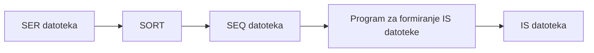

# Statička indeks-sekvencijalna organizacija datoteke

## Uvod - zašto nam treba indeks-sekvencijalna datoteka?

Do sada smo se upoznali sa nekoliko načina organizacije datoteka. Sekvencijalne datoteke su odlične kada želimo da efikasno pronađemo logički naredni slog, rasute datoteke su sjajne za brzo slučajno pronalaženje tačno određenog sloga. Ali šta ako nam trebaju obe stvari? Šta ako želimo i jednu i drugu vrstu traženja?

Tu na scenu stupa **indeks-sekvencijalna datoteka**. Ona kombinuje prednosti oba pristupa zahvaljujući jednoj ključnoj ideji - postojanju **indeksa**. Indeks je, u suštini, realizovan kao **stablo traženja** i sadrži parove oblika *(vrednost ključa, relativna adresa sloga)*. Ti parovi služe kao "putokazi" - za bilo koju vrednost ključa, indeks nam može reći gde se traženi slog fizički nalazi. Sami slogovi se nalaze u posebnoj datoteci (zoni podataka), koja je organizovana kao sekvencijalna.

Zamislimo to ovako: indeks je poput sadržaja u knjizi. Ako znamo šta tražimo, pogledamo sadržaj i odmah skočimo na pravu stranu. Ako želimo da čitamo redom, samo listamo stranicu po stranicu. Indeks-sekvencijalna datoteka nam daje obe mogućnosti.

## Statičke vs. dinamičke indeksne datoteke

Indeksne datoteke se dele na **statičke** i **dinamičke**.

**Statičke indeksne datoteke** su, istorijski gledano, nastale pre dinamičkih i danas imaju pretežno didaktički značaj. Nazivaju se statičkim iz dva razloga:

1. Veličina dodeljenog memorijskog prostora se određuje prilikom projektovanja i **ne menja se** tokom života datoteke.
2. Nakon formiranja datoteke, indeks se (praktično) **više ne ažurira**.

Kod **dinamičkih indeksnih datoteka**, tokom životnog veka datoteke, dodeljeni memorijski prostor se menja i indeks se ažurira.

Ovde ćemo se baviti statičkim indeks-sekvencijalnim datotekama.

---

## Tri zone memorijskog prostora

Deo memorijskog prostora koji je dodeljen statičkoj indeks-sekvencijalnoj datoteci sastoji se od **tri zone**:

- **Primarna zona** (ili zona podataka)
- **Zona indeksa**
- **Zona prekoračenja**

Ove tri zone možemo posmatrati kao tri odvojene datoteke čiji su slogovi međusobno povezani putem adresa, odnosno pokazivača. Hajde sada da uđemo u svaku od njih.

---

## Struktura primarne zone

U primarnoj zoni nalaze se slogovi uređeni saglasno **rastućim vrednostima ključa**. Struktura primarne zone odgovara strukturi sekvencijalne datoteke - slogovi su **blokirani**, i poželjno je da faktor blokiranja bude što veći.

> [!NOTE]
> Pri datoj dužini sloga (izraženoj putem broja slova prirodne azbuke), faktor blokiranja je ograničen kapacitetom staze na jedinici magnetnog diska. Blok, najčešće, ne može zauzimati više od jedne staze.

Primarna zona je, dakle, naša "osnovna biblioteka" u kojoj su svi slogovi lepo poređani po ključu.

---

## Struktura zone indeksa

Zona indeksa je "mozak" cele operacije. Njena struktura odgovara strukturi **punog stabla traženja (pristupa)** reda $n$ ($n \geq 2$) i visine $h$.

Svaki čvor stabla sadrži od $1$ do $n$ elemenata. Elementi čvorova predstavljaju parove $(k_e, A_e)$, gde je:

- $e \in \{1, ..., n\}$
- $k_e = k(S)$ - vrednost ključa sloga $S$
- $A_e$ - adresa bloka primarne zone u kojem se nalazi slog $S$, ili adresa nekog drugog čvora stabla traženja koji takođe sadrži $k_e$

Elementi su u čvorovima uređeni saglasno **rastućim vrednostima ključa** $k_e$, tako da struktura svakog čvora odgovara strukturi male sekvencijalne datoteke.

### Šta predstavlja vrednost ključa $k_e$?

Vrednost ključa $k_e$ predstavlja ili **najveće** ili **najmanje** vrednosti ključa iz svakog bloka primarne zone:

- Elementi čvorova stabla mogu sadržati ili samo najveće, ili samo najmanje vrednosti ključa iz svakog bloka.
- **Elementi listova** stabla sadrže po jednu vrednost ključa iz svakog bloka.
- **Elementi čvorova na višim nivoima** hijerarhije stabla sadrže po jednu vrednost ključa iz svakog direktno podređenog čvora.

Vrednosti ključa u elementima čvorova koji ne predstavljaju listove stabla ponavljaju se u čvorovima na svim nižim nivoima hijerarhije.

### Kapacitet i struktura čvorova

**Čvor koji ne predstavlja list**, a sadrži $m$ ($1 \leq m \leq n$) elemenata, poseduje $m$ direktno podređenih čvorova.

**Adresa $A_e$** u listu stabla predstavlja adresu bloka u zoni podataka koji sadrži slog sa vrednošću ključa $k(S) = k_e$.

**Adresa $A_e$** u čvoru na višem nivou hijerarhije stabla predstavlja adresu direktno podređenog čvora u kojem se nalazi elemenat sa vrednošću ključa $k_e$. Adrese $A_e$ se mogu nazivati i **pokazivačima**.

### Primer 12.1 - Stablo sa najvećim vrednostima ključa

Pogledajmo konkretan primer. Imamo indeks-sekvencijalnu datoteku od $N = 13$ slogova. Faktor blokiranja u primarnoj zoni je $f = 3$, a red stabla traženja u zoni indeksa je $n = 2$.

Elementi u čvorovima stabla traženja sadrže **najveće** vrednosti ključa u blokovima primarne zone. Stablo traženja sadrži kao najveću vrednost ključa vrednost $99$, a ne stvarno najveću vrednost ključa u datoteci. Ovu vrednost ključa u stablo upisuje metoda pristupa.

Evo kako izgleda zona indeksa i primarna zona:

**Zona indeksa** (stablo traženja sa najvećim vrednostima):

| Čvor | Elementi |
|------|----------|
| $A_6$ (koren) | $(49, A_4^i), (99, A_5^i)$ |
| $A_4^i$ | $(23, A_1^i), (49, A_2^i)$ |
| $A_5^i$ | $(99, A_3^i), *$ |
| $A_1^i$ (list) | $(13, A_1^p), (23, A_3^p)$ |
| $A_2^i$ (list) | $(29, A_3^p), (49, A_4^p)$ |
| $A_3^i$ (list) | $(99, A_5^p), *$ |

**Primarna zona** (blokovi sa slogovima):

| Blok | Sadržaj |
|------|---------|
| $A_1^p$ | $03, p(S_1), 07, p(S_2), 13, p(S_3)$ |
| $A_2^p$ | $15, p(S_4), 19, p(S_5), 23, p(S_6)$ |
| $A_3^p$ | $25, p(S_7), 27, p(S_8), 29, p(S_9)$ |
| $A_4^p$ | $34, p(S_{10}), 43, p(S_{11}), 49, p(S_{12})$ |
| $A_5^p$ | $64, p(S_{13}), *$ |

Oznake: adrese blokova u zoni indeksa nose oznaku $i$, a adrese blokova u primarnoj zoni oznaku $p$. Zvezdica ($*$) označava kraj datoteke.

### Primer 12.2 - Stablo sa najmanjim vrednostima ključa

Isto stablo traženja može biti organizovano i sa **najmanjim** vrednostima ključa u blokovima primarne zone. Tada stablo traženja sadrži kao najmanju vrednost ključa vrednost $00$, a ne stvarno najmanju vrednost ključa u datoteci. I ovu vrednost upisuje metoda pristupa pri formiranju datoteke.

**Zona indeksa** (stablo traženja sa najmanjim vrednostima):

| Čvor | Elementi |
|------|----------|
| $A_6^i$ (koren) | $(00, A_4^i), (64, A_5^i)$ |
| $A_4^i$ | $(00, A_1^i), (25, A_2^i)$ |
| $A_5^i$ | $(64, A_3^i), *$ |
| $A_1^i$ (list) | $(00, A_1^p), (15, A_2^p)$ |
| $A_2^i$ (list) | $(25, A_3^p), (34, A_4^p)$ |
| $A_3^i$ (list) | $(64, A_5^p), *$ |

---

## Performanse stabla traženja - formule

Hajde da izvedemo neke korisne formule vezane za stablo traženja.

### Broj čvorova na svakom nivou

Saglasno opisu strukture stabla traženja, broj čvorova $C_i$ na $i$-tom nivou hijerarhije stabla ($i = 1, ..., h$) iznosi:

$$C_i = \left\lceil \frac{B}{n^{h-i+1}} \right\rceil$$

gde je $B$ ($B \geq 1$) broj blokova u primarnoj zoni.

Za $i = 1$ (nivo listova), dobija se:

$$C_1 = \left\lceil \frac{B}{n^h} \right\rceil$$

### Visina stabla

Kako na prvom nivou hijerarhije stabla postoji samo koren, to je $C_1 = 1$, te se za **visinu stabla** dobija:

$$(12.1) \qquad h = \left\lceil \log_n B \right\rceil$$

### Ukupni broj čvorova

Ukupni broj čvorova $C$ stabla iznosi:

$$C = \sum_{i=1}^{h} \left\lceil \frac{B}{n^{h-i+1}} \right\rceil$$

### Kapacitet stabla

**Kapacitet stabla** je $K = nC$. To je veličina koja govori koliko parova $(k_e, A_e)$ se može upisati u čvorove stabla.

### Ukupni broj elemenata

Čvorovi na $i$-tom nivou hijerarhije stabla traženja sadrže ukupno $\left\lfloor B / n^{h-i} \right\rfloor$ elemenata, tako da ukupni broj elemenata $E$ u stablu pristupa iznosi:

$$E = \sum_{i=1}^{h} \left\lfloor \frac{B}{n^{h-i}} \right\rfloor$$

### Primer 12.2 - Izračunavanje performansi

Za $B = 5$ i $n = 2$, dobija se $h = 3$, $C = 6$, $K = 12$ i $E = 10$. Ove veličine predstavljaju performanse stabala traženja na slikama 12.1 i 12.2.

> [!TIP]
> U praksi se za red stabla traženja biraju brojevi reda $50$ do $100$. Vrednosti $n$ na slikama su male samo zbog didaktičkih razloga i lakšeg prikaza geometrijske strukture.

### Stablo traženja kao tabela

Stablo traženja služi za realizaciju relativno brzog pristupa blokovima zone podataka pri traženju slučajno odabranog sloga. Svaki čvor stabla traženja predstavlja jedan blok zone indeksa i često se naziva **tabelom indeksa**. Celo stablo se naziva i **retko popunjenim indeksom**, jer sadrži samo po jednu vrednost ključa iz svakog bloka. Stablo traženja predstavlja tabelarno zadatu funkciju koja preslikava ili skup najvećih ili skup najmanjih vrednosti ključa blokova primarne zone na skup adresa blokova. Ovo preslikavanje je **bijektivno**.

---

## Struktura zone prekoračenja

Zona prekoračenja je nešto poput "dodatnog skladišta" za slogove koji ne mogu da stanu u primarnu zonu.

**Zona prekoračenja**, kao i primarna zona, sadrži slogove datoteke. Slogovi se upisuju u zonu prekoračenja tokom ažuriranja, preciznije, prilikom upisa novih slogova u datoteku. Slogovi u zoni prekoračenja se nazivaju **prekoračiocima**. Svaki blok primarne zone može imati svoje prekoračioce.

### Kako se vrši upis novog sloga?

Kada je blok kompletan ($m = n$), pri ažuriranju, upis svakog novog sloga u datoteku dovodi do upisa jednog od slogova koji pripadaju bloku sa adresom $A_e$, $e \in \{1,..., m\}$, u zonu prekoračenja.

Neka su $(k_1, A_1), ..., (k_{e-1}, A_{e-1}), (k_e, A_e), (k_{e+1}, A_{e+1}), ..., (k_m, A_m)$ elementi jednog lista stabla traženja, gde je $1 \leq m \leq n$. Tada $A_e$, $e = 1,..., m$, predstavljaju adrese sukcesivnih blokova primarne zone.

**Ako stablo traženja sadrži najveće vrednosti ključa** iz svakog bloka primarne zone, tada slog sa vrednošću ključa $k(S)$ pripada:

- bloku sa adresom $A_1$, ako je $k(S) < k_1$, a
- bloku sa adresom $A_e$, ako je $k_{e-1} < k(S) \leq k_e$, $e \in \{2,..., m\}$.

**Ako stablo traženja sadrži najmanje vrednosti ključa** iz svakog bloka primarne zone, tada slog sa vrednošću ključa $k(S)$ pripada:

- bloku sa adresom $A_e$, ako je $k_e \leq k(S) < k_{e+1}$, $e \in \{1,..., m-1\}$, a
- bloku sa adresom $A_m$, ako je $k(S) > k_m$.

### Mehanizam upisa u zonu prekoračenja

Neka je $k(S) < k_{e(max)}$, gde je $k_{e(max)}$ trenutno maksimalna vrednost ključa u bloku sa adresom $A_e$. Tada:

- Novi slog se upisuje u blok
- Svi slogovi sa većom vrednošću ključa od $k(S)$ pomeraju se za jednu lokaciju ka kraju bloka
- Slog sa vrednošću ključa $k_{e(max)}$ se upisuje u zonu prekoračenja

Ako je $k(S) > k_{e(max)}$, novi slog se upisuje direktno u zonu prekoračenja.

U slučaju kada blok nije kompletan, upis novog sloga dovodi samo do pomeranja slogova unutar bloka. Oznaka kraja datoteke koristi se $*$, i ta oznaka bi se, pri ovom pomeranju, morala posebno tretirati.

### Primer 12.3 - Upis novog sloga

Neka je $k(S) = 31$ vrednost ključa novog sloga. List sa adresom $A_2^i$ na slici 12.1 sadrži elemente $(29, A_3^p), (49, A_4^p)$. Pošto je $29 < 31 < 49$, novi slog se upisuje u blok sa adresom $A_3^p$, a slog sa vrednošću ključa $49$ prelazi u zonu prekoračenja. Novi slog sa vrednošću ključa $k(S) = 47$ takođe pripada bloku sa adresom $A_4^p$. Međutim, pošto, nakon upisa sloga sa $k(S) = 31$, u bloku važi $k_{4(max)} = 43$, slog sa vrednošću ključa $k(S) = 47$ se upisuje u zonu prekoračenja. Upis novog sloga sa vrednošću ključa $k(S) = 71$ u blok sa adresom $A_5^p$ dovodi do pomeranja oznake kraja datoteke ($*$) u narednu lokaciju.

---

## Povezivanje prekoračilaca

Logički neposredno susedni prekoračioci iz jednog bloka spregnuti su pokazivačima, tako da zona prekoračenja sadrži skup jednostruko spregnutih lanaca. Pokazivači nose informaciju o vezama između sloga u logičkoj strukturi podataka datoteke.

Postoje dva osnovna postupka povezivanja prekoračilaca sa listom stabla traženja:

### Direktno povezivanje

Kod direktnog postupka povezivanja, lanac prekoračilaca je putem pokazivača neposredno povezan sa odgovarajućim elementom lista stabla traženja. Ovaj postupak se naziva **direktnim**.

**Elementi lista stabla traženja** sa direktnim pristupom prekoračiocima, najčešće su upisane najveće vrednosti ključa iz svakog bloka primarne zone. Informaciju o prekoračiocima sadrže elementi listova stabla traženja. Elemenat lista predstavlja **četvorku** $(k_e, A_e, k_z, A_z)$, gde je:

- $k_e$ - trenutno najveća vrednost ključa u bloku sa adresom $A_e$
- $k_z$ - najveća vrednost ključa prekoračioca iz bloka sa adresom $A_e$
- $A_z$ - adresa lokacije onog prekoračioca iz bloka sa adresom $A_e$ koji ima najmanju vrednost ključa

Inicijalno, nakon formiranja datoteke, važi $k_e = k_z$ (osim za krajnji desni elemenat krajnjeg desnog lista, gde je $k_e \leq k_z$) i $A_e = A_z$. Jednakost $A_e = A_z$ ukazuje da iz bloka sa adresom $A_e$ nema prekoračilaca.

### Primer 12.4 - Direktno povezivanje

Na slici 12.3 prikazani su listovi stabla traženja, primarna zona i zona prekoračenja, nakon upisa novih slogova $(31, p(S_{14}))$, $(14, p(S_{15}))$, $(47, p(S_{16}))$ i $(71, p(S_{17}))$ u indeks-sekvencijalnu datoteku sa slike 12.1. Povezivanje listova stabla sa lancima prekoračilaca je direktno. Faktor blokiranja u zoni prekoračenja je $f = 1$.

**Listovi stabla traženja:**

| Čvor | Elementi |
|------|----------|
| $A_1^i$ | $(13, A_1^p, 13, A_1^p, 19, A_2^p, 23, A_2^z)$ |
| $A_2^i$ | $(29, A_3^p, 29, A_3^p, 43, A_4^p, 49, A_3^z)$ |
| $A_3^i$ | $(71, A_5^p, 99, A_5^p, *, *, *, *)$ |

**Zona prekoračenja** ($f = 1$):

| Blok | Sadržaj |
|------|---------|
| $A_1^z$ | $49, p(S_{12}), *$ |
| $A_2^z$ | $23, p(S_6), *$ |
| $A_3^z$ | $47, p(S_{16}), A_1^z$ |
| $A_4^z$ | $*$ |
| $A_5^z$ | $*$ |

### Indirektno povezivanje

Kod indirektnog postupka, elemenat lista stabla traženja je povezan posredno, putem pokazivača u bloku primarne zone. Drugi postupak se naziva **indirektnim**.

U stablo traženja indeks-sekvencijalne datoteke sa indirektnim pristupom prekoračiocima, najčešće su upisane **najmanje** vrednosti ključa iz svakog bloka primarne zone.

Svaki blok primarne zone proširen je jednim poljem za smeštaj pokazivača. Pokazivač predstavlja adresu lokacije, u koju je smešten prekoračilac sa najmanjom vrednošću ključa iz posmatranog bloka.

### Primer 12.5 - Indirektno povezivanje

Na slici 12.4 prikazana je primarna zona i zona prekoračenja indeks-sekvencijalne datoteke sa indirektnim povezivanjem prekoračilaca, nakon upisa novih slogova $(31, p(S_{14}))$, $(14, p(S_{15}))$, $(47, p(S_{16}))$ i $(01, p(S_{17}))$. Stablo traženja ove datoteke prikazano je na slici 12.2. Inicijalno, pre ažuriranja, primarna zona datoteke je sadržala iste slogove kao i primarna zona na slici 12.1.

Pošto metoda pristupa upisuje vrednost ključa manju od najmanje moguće u stablo traženja, svi slogovi sa manjom vrednošću ključa od inicijalno najmanje pripadaju prvom bloku primarne zone.

**Primarna zona** (sa indirektnim povezivanjem):

| Blok | Sadržaj | Pokazivač |
|------|---------|-----------|
| $A_1^p$ | $01, p(S_{17}), 03, p(S_1), 07, p(S_2)$ | $A_4^z$ |
| $A_2^p$ | $15, p(S_4), 19, p(S_5), 23, p(S_6)$ | $*$ |
| $A_3^p$ | $25, p(S_7), 27, p(S_8), 29, p(S_9)$ | $*$ |
| $A_4^p$ | $31, p(S_{10}), 43, p(S_{11}), 47, p(S_{16})$ | $A_1^z$ |
| $A_5^p$ | $64, p(S_{13}), *$ | $*$ |

**Zona prekoračenja**:

| Blok | Sadržaj |
|------|---------|
| $A_1^z$ | $31, p(S_{14}), *$ |
| $A_2^z$ | $14, p(S_{15}), *$ |
| $A_3^z$ | $49, p(S_{12}), *$ |
| $A_4^z$ | $13, p(S_3), A_2^z$ |
| $A_5^z$ | $*$ |

Kod jedne varijante indeks-sekvencijalne datoteke sa indirektnim povezivanjem prekoračilaca, lokacija svakog sloga unutar bloka proširena je jednim poljem pokazivača. Svaki novi slog se, pri ažuriranju, upisuje u zonu prekoračenja. Svi novi slogovi čije se vrednosti ključa nalaze između vrednosti ključa dva fizički susedna sloga u bloku primarne zone sprežu se tako da čine linearnu logičku strukturu.

U pokazivač sloga u primarnoj zoni upisuje se adresa lokacije u zoni prekoračenja koja sadrži slog sa prvom većom vrednošću ključa. Pokazivač prekoračioca sa najvećom vrednošću ključa u lancu sadrži ili oznaku kraja lanca ili adresu lokacije logički neposredno narednog sloga u primarnoj zoni. Svakom bloku u primarnoj zoni može odgovarati od $0$ do $f$ takvih lanaca u zoni prekoračenja.

### Fiktivni slog pri indirektnom povezivanju

Pri formiranju indeks-sekvencijalne datoteke sa opisanom varijantom indirektnog povezivanja prekoračilaca, metoda pristupa upisuje kao **prvi slog prvog bloka** primarne zone fiktivni slog sa vrednošću ključa $0$. Na taj način se obezbeđuje mogućnost upisa u zonu prekoračenja i slogova sa vrednošću ključa manjom od inicijalno najmanje u datoteci.

U zonu prekoračenja su, slučajnim redom, jedan do drugog, upisani prekoračioci iz raznih blokova. Verovatnoća da se dva logički susedna sloga nađu u susednim lokacijama zone prekoračenja je mala. S druge strane, što je blok kraći to je kraće i vreme razmene podataka između operativne memorije i manji je prostor u operativnoj memoriji potreban za smeštaj takvog bloka. Zato blokovi u zoni prekoračenja često poseduju **faktor blokiranja jednak jedan**.

### Indeks slobodnih lokacija

**Indeks slobodnih lokacija** $E$ u zoni prekoračenja služi za vođenje evidencije o prvoj slobodnoj lokaciji. Slobodne lokacije nisu međusobno spregnute, ali ni za dinamičko upravljanje slobodnim prostorom. Jednostavno, nakon upisa sloga u zonu prekoračenja, relativna adresa, kao sadržaj polja $E$, samo se povećava za jedan.

---

## 12.1 Indeks-sekvencijalna metoda pristupa

Operativni sistemi mainframe računarskih sistema opšte namene podržavali su metodu pristupa sa nizom programa za standardizovano formiranje, korišćenje, ažuriranje, proširivanje i reorganizaciju indeks-sekvencijalnih datoteka. Metoda pristupa je, po pravilu, omogućavala **sekvencijalni, direktni i dinamički** način pristupa indeks-sekvencijalnoj datoteci.

Postojanje standardnih metoda pristupa i njihova povezanost sa višim programskim jezicima u mnogome je olakšavalo rad sa indeks-sekvencijalnim datotekama. Izgradnja stabla traženja i spregnutih datoteka u zoni prekoračenja, traženje slučajno odabranog sloga, upis novog i brisanje postojećeg sloga - sve su to bili zadaci metode pristupa. Korisnički programi su koristili usluge metode pristupa putem makro naredbi tipa **READ, WRITE, REWRITE, DELETE** i **START**.

### Primer 12.6 - COBOL definicija

U standardnom programskom jeziku Cobol, postoji niz rečenica putem kojih se definiše indeks-sekvencijalna organizacija datoteke. U SELECT rečenici sekcije FILE-CONTROL u delu ENVIRONMENT DIVISION postoje sledeće deklarativne rečenice:

```
SELECT ime-datoteke
    ASSIGN TO ime-uređaja
    [ACCESS MODE IS {SEQUENTIAL | RANDOM | DYNAMIC}]
    ORGANIZATION IS INDEXED
    ACTUAL KEY IS ime_ključa
```

Promenljiva `ime_ključa` predstavlja, po pravilu, primarni ključ tipa sloga datoteke i definisana je u frazi opisa strukture sloga datoteke u okviru deklarativne fraze FD (opis datoteke). Vrednost te promenljive se koristi kao argument pri traženju slučajno odabranog sloga.

> [!IMPORTANT]
> Ukoliko operativni sistem ne podržava indeks-sekvencijalnu metodu pristupa, implementacija ovih aktivnosti predstavlja zadatak korisnika.

---

## 12.2 Formiranje indeks-sekvencijalne datoteke

Program za formiranje indeks-sekvencijalne datoteke ili predstavlja gotov uslužni program čiji se parametri specijalizuju, ili se piše u nekom od viših programskih jezika. Oba programa koriste usluge metode pristupa.

Pre početka formiranja, slogovi se moraju urediti saglasno **rastućim vrednostima ključa** - ulazna datoteka u program za formiranje mora biti **sekvencijalna** datoteka. Na izlazu iz programa se dobija indeks-sekvencijalna datoteka.

Tok formiranja izgleda ovako:



Pri formiranju, program učitava sukcesivne slogove ulazne sekvencijalne datoteke i, putem metode pristupa, smešta blokove u primarnu zonu indeks-sekvencijalne datoteke. Kako se koji blok upiše u primarnu zonu, metoda pristupa upiše u tekući list zone indeksa par $(k_e, A_e)$, gde je $k_e$ najveća (ili najmanja) vrednost ključa sloga u posmatranom bloku, a $A_e$ adresa bloka.

Kada se svi slogovi prenesu iz ulazne sekvencijalne datoteke u primarnu zonu indeks-sekvencijalne datoteke, metoda pristupa formira čvorove na višim nivoima hijerarhije stabla traženja. Formiranje stabla traženja se vrši postupkom s dna na gore i s leva na desno po nivoima. U svakom čvoru na $i$-tom nivou hijerarhije ($i = h - 1, h - 2, ..., 1$), osim u krajnjem desnom, metoda pristupa upisuje najveće (ili najmanje) vrednosti ključa iz $n$ sukcesivnih čvorova na nivou hijerarhije $i + 1$, kao i adrese tih čvorova. U krajnjem desnom čvoru upisuje

$$\left\lfloor \frac{B}{n^{h-i}} \right\rfloor - n\left(\left\lfloor \frac{B}{n^{h-i+1}} \right\rfloor - 1\right)$$

parova $(k_e, A_e)$.

> [!NOTE]
> Prilikom formiranja datoteke, u zonu prekoračenja se slogovi **ne upisuju**.

---

## 12.3 Traženje u indeks-sekvencijalnoj datoteci

Traženje logički narednog sloga u indeks-sekvencijalnoj datoteci vrši se kombinovanom primenom metode **linearnog traženja** i metode traženja **praćenjem pokazivača**. Traženje počinje u prvom bloku primarne zone. Svako naredno traženje se nastavlja od tekućeg sloga datoteke. Linearna metoda se koristi za traženje u bloku primarne zone. Po dolasku do poslednjeg sloga bloka, traženje se nastavlja u lancu prekoračilaca (koji može biti i prazan) metodom praćenja pokazivača. Adresa lokacije prvog sloga lanca prekoračilaca nalazi se ili u listu stabla traženja, ili u polju pokazivača bloka.

### Traženje logički narednog sloga sa direktnim povezivanjem

Ako se traženje logički narednog sloga vrši u indeks-sekvencijalnoj datoteci sa direktnim povezivanjem prekoračilaca, tada broj pristupa $R$ i pri uspešnom i pri neuspešnom traženju jednog logički narednog sloga uzima celobrojne vrednosti iz intervala:

$$(12.2) \qquad 0 \leq R \leq B + \left\lfloor \frac{B}{n} \right\rfloor + Z - (i + j + k)$$

gde je:
- $Z$ - ukupni broj slogova u zoni prekoračenja
- $i$ - redni broj tekućeg bloka datoteke u odnosu na početak primarne zone
- $j = \lceil i / n \rceil$ - redni broj tekućeg lista stabla traženja
- $k$ - broj slogova zone prekoračenja kojima se već pristupilo

### Primer 12.7

Za datoteku sa slike 12.3, $B = 5$, $\lceil B/n \rceil = 3$ i $Z = 4$. Neka je slog sa vrednošću ključa $k(S_5) = 15$, tekući slog datoteke. Tada je $i = 2$, $j = 1$ i $k = 0$. Da bi se pronašao slog sa vrednošću ključa $k(S_5) = 19$, treba izvršiti $R = 0$ pristupa datoteci, a da bi se pronašao slog sa vrednošću ključa $k(S_{17}) = 71$, treba izvršiti $R = 9$ pristupa datoteci.

### Traženje logički narednog sloga sa indirektnim povezivanjem

Ako se traženje logički narednog sloga vrši u indeks-sekvencijalnoj datoteci sa indirektnim povezivanjem prekoračilaca, tada broj pristupa $R$ i pri uspešnom i pri neuspešnom traženju jednog logički narednog sloga uzima celobrojne vrednosti iz intervala $[0, B + Z - (i + k)]$, odnosno:

$$(12.3) \qquad 0 \leq R \leq B + Z - (i + k)$$

### Primer 12.8

Za datoteku sa slike 12.4, $B = 5$ i $Z = 4$. Neka je slog sa vrednošću ključa $k(S_{15}) = 14$, tekući slog datoteke. Tada je $i = 1$ i $k = 2$. Da bi se pronašao slog sa vrednošću ključa $k(S_5) = 19$, treba $R = 1$ pristup datoteci, a da bi se pronašao slog sa vrednošću ključa $k(S_{13}) = 64$, treba izvršiti $R = 6$ pristupa datoteci.

> [!IMPORTANT]
> Upoređujući izraze (12.2) i (12.3) dolazi se do zaključka da je traženje logički narednog sloga **efikasnije** u indeks-sekvencijalnoj datoteci sa **indirektnim** nego u indeks-sekvencijalnoj datoteci sa direktnim povezivanjem prekoračilaca.

---

## Traženje slučajno odabranog sloga

Traženje slučajno odabranog sloga u indeks-sekvencijalnoj datoteci, metoda pristupa realizuje ili u dva ili u tri koraka. Potrebna su tri koraka ako je povezivanje prekoračilaca indirektno. U oba slučaja, prvi korak predstavlja **traženje u stablu pristupa** (stablo traženja).

### Traženje u stablu

Metoda pristupa koristi stablo pristupa za traženje adrese bloka u kojem se verovatno nalazi slučajno odabrani slog, čija vrednost ključa odgovara zadatom argumentu traženja. Algoritam traženja u stablu se odvija putem sukcesivnog pristupanja čvorovima na jednom putu od korena do lista. U svakom čvoru se vrši traženje u maloj sekvencijalnoj datoteci, ili metodom linearnog ili metodom binarnog traženja.

**Ako stablo sadrži najveće vrednosti ključa** iz svakog bloka primarne zone, traženje u čvoru može imati jedan od sledeća dva ishoda: $a = k_e$ ili $k_{e-1} < a < k_e$, za $e \in \{2,..., m\}$, $m \leq n$. U oba slučaja traženje se nastavlja u podstablu sa korenom $C(A_e^i)$, gde $A_e^i$ ukazuje da se čvor $C$ nalazi u bloku (zone indeksa) sa adresom $A_e^i$.

**Ako stablo sadrži najmanje vrednosti ključa** iz svakog bloka primarne zone, traženje u čvoru može imati jedan od sledeća tri ishoda:
- $k_{e-1} < a < k_e$: traženje se nastavlja u podstablu sa korenom $C(A_{e-1}^i)$, (argument traženja $a$ ne može biti manji od $k_1$, gde je $k_1$ minimalna vrednost ključa u čvoru).
- $a = k_e$ ili $a > k_m$: traženje se, redom, nastavlja u podstablu sa korenom $C(A_e^i)$, odnosno $C(A_m^i)$.

Traženje u stablu se završava u listu, gde metoda pristupa dobija adresu bloka u kojem treba nastaviti traženje.

### Primer 12.9

Ako je argument traženja $a = 31$, tada algoritam traženja u stablu na slici 12.1 proiazi, redom, čvorove $C(A_6^i)$, $C(A_4^i)$ i dobija adresu $A_3^p$ bloka u primarnoj zoni. U slučaju stabla na slici 12.2, algoritam traženja prelazi put $C(A_6^i)$, $C(A_4^i)$, $C(A_2^i)$ i dobija adresu $A_3^p$ bloka u primarnoj zoni. Tek u primarnoj zoni se traženje pokazuje kao neuspešno.

### Broj pristupa za traženje u stablu

Sprovedena analiza ukazuje da je za traženje adrese bloka potrebno izvršiti:

$$(12.4) \qquad R = h$$

pristupa čvorovima stabla. Ovo traženje metoda pristupa realizuje tako što adresu bloka zone indeksa, u kojem se nalazi koren stabla, pronalazi u zaglavlju datoteke. Nakon toga, metoda pristupa sukcesivno prenosi čvorove stabla u operativnu memoriju. Broj pristupa čvorovima stabla, dat formulom (12.4), predstavlja najnepovoljniji slučaj. To je slučaj kada za smeštaj blokova zone indeksa postoji samo jedan bafer u operativnoj memoriji. Ako metodi pristupa stoje na raspolaganju dva bafera, tada se u jednom od njih stalno nalazi koren stabla, te je $R = h - 1$.

---

## Direktno povezivanje prekoračilaca - traženje slučajno odabranog sloga

U slučaju indeks-sekvencijalne datoteke sa direktnim povezivanjem prekoračilaca, metoda pristupa donosi odluku o nastavku traženja u elementu lista stabla pristupa. Ako je $a \leq k_e$, traženje se nastavlja u bloku primarne zone. To traženje se izvodi ili linearnom ili binarnom metodom traženja. Ako važi $k_e < a < k_z$, traženje se nastavlja u zoni prekoračenja praćenjem pokazivača. Adresa $A_z$ u elementu lista predstavlja pokazivač ka prvom slogu u lancu prekoračilaca.

Neka je $z$ broj prekoračilaca jednog bloka. Tada broj pristupa $R$ i pri uspešnom i pri neuspešnom traženju jednog slučajno odabranog sloga uzima celobrojne vrednosti iz intervala:

$$h + 1 \leq R \leq h + z$$

Potrebno je $h + 1$ pristupa za traženje u bloku primarne zone ili najviše $h + z$ pristupa pri traženju u zoni prekoračenja. Ako je $z = 0$, tada je $R = h + 1$.

### Verovatnoća nalaženja sloga

Ako je verovatnoća traženja svakog sloga datoteke ista, tada je:

$$(12.5) \qquad p_f = \frac{f}{f + z}$$

verovatnoća da se traženi slog nalazi u bloku primarne zone, a

$$(12.6) \qquad p_z = \frac{z}{f + z}$$

verovatnoća da se traženi slog nalazi u zoni prekoračenja.

### Očekivani broj pristupa pri uspešnom traženju

Očekivani broj pristupa $\overline{R_u}$ pri uspešnom traženju slučajno odabranog sloga dat je formulom:

$$(12.7) \qquad \overline{R_u} = h + p_f + p_z \sum_{i=1}^{z} ip_i$$

gde je $p_i = 1/z$ verovatnoća da se traži $i$-ti prekoračilac. Nakon sređivanja formule (12.7), dobija se:

$$(12.8) \qquad \overline{R_u} = h + \frac{2f + z(z + 1)}{2(f + z)}$$

### Očekivani broj pristupa pri neuspešnom traženju

Ako je i verovatnoća zaustavljanja neuspešnog traženja na svakom slogu bloka primarne zone i na svakom prekoračiocu ista, za očekivani broj pristupa pri neuspešnom traženju se dobija:

$$(12.9) \qquad \overline{R_n} = h + \frac{2f + z(z + 1)}{2(f + z)}$$

jer je reč o neuspešnom traženju u datoteci gde je uvek $a < k_z$.

### Primer 12.10

U datoteci na slici 12.3, blok primarne zone sa adresom $A_4^p$ ima dva prekoračioca. Pošto je $h = 3$, za pronalaženje sloga sa vrednošću ključa $k(S_{12}) = 49$, potrebno je $R = 5$ pristupa.

Neka je $29 < a \leq 49$, gde je $a$ argument traženja. Za očekivani broj pristupa datoteci pri uspešnom traženju (formula 12.8) se dobija $\overline{R_u} = 4{,}2$. Lako se proverava da je i u slučaju neuspešnog traženja $\overline{R_n} = 4{,}2$.

---

## Indirektno povezivanje prekoračilaca - traženje slučajno odabranog sloga

Kada je povezivanje prekoračilaca sa listovima stabla traženja realizovano posredno, metoda pristupa prvo traži slučajno odabrani slog u bloku primarne zone. Adresu bloka metoda pristupa nalazi u stablu traženja. Ako se traženi slog u bloku ne nalazi, a blok ima neprazan lanac prekoračilaca, traženje se nastavlja u zoni prekoračenja.

Broj pristupa $R$ i pri uspešnom i pri neuspešnom traženju jednog slučajno odabranog sloga uzima celobrojne vrednosti, odnosno:

$$h + 1 \leq R \leq h + 1 + z$$

### Očekivani broj pristupa pri uspešnom traženju

$$(12.10) \qquad \overline{R_u} = h + p_f + p_z\left(1 + \sum_{i=1}^{z} ip_i\right)$$

gde su verovatnoće $p_f$ i $p_z$ date, redom, formulama (12.5) i (12.6). Nakon sređivanja formule (12.10), dobija se:

$$(12.11) \qquad \overline{R_u} = h + 1 + \frac{z(z+1)}{2(f+z)}$$

### Očekivani broj pristupa pri neuspešnom traženju

Pošto argument traženja ne može imati manju vrednost od najmanje vrednosti ključa u bloku, neuspešno traženje se ne može zaustaviti na prvom slogu bloka primarne zone.

Verovatnoća da se neuspešno traženje zaustavi u bloku primarne zone iznosi:

$$(12.12) \qquad p_f = \frac{f - 1}{f + z}$$

Verovatnoća da se neuspešno traženje zaustavi na nekom od slogova u zoni prekoračenja iznosi:

$$(12.13) \qquad p_z = \frac{z + 1}{f + z}$$

Očekivani broj pristupa pri neuspešnom traženju jednog slučajno odabranog sloga u indeks-sekvencijalnoj datoteci sa indirektnim povezivanjem prekoračilaca iznosi:

$$(12.14) \qquad \overline{R_n} = h + p_f + p_z\left(1 + \sum_{i=1}^{z} ip_i\right)$$

gde je:

$$(12.15) \qquad p_i = \begin{cases} \frac{1}{z+1} & \text{za } 1 \leq i \leq z - 1 \\ \frac{2}{z+1} & \text{za } i = z \end{cases}$$

Nakon zamene (12.12), (12.13) i (12.15) u (12.14), dobija se:

$$(12.16) \qquad \overline{R_n} = h + 1 + \frac{z(z+3)}{2(f+z)}$$

### Primer 12.11

U datoteci na slici 12.4, blok primarne zone sa adresom $A_4^p$ ima dva prekoračioca. Pošto je $h = 3$, za pronalaženje sloga sa vrednošću ključa $k(S_{15}) = 14$, potrebno je $R = 6$ pristupa.

Ako je $0 \leq a < 15$, gde je $a$ argument traženja, za očekivani broj pristupa datoteci pri uspešnom traženju (formula (12.11)) se dobija $\overline{R_u} = 4{,}6$. Pri neuspešnom traženju (formula (12.16)) se dobija $\overline{R_n} = 5$.

> [!WARNING]
> Upoređujući formule (12.8) i (12.9), redom, sa formulama (12.11) i (12.16), dolazi se do zaključka da je traženje slučajno odabranog sloga u indeks-sekvencijalnoj datoteci sa **direktnim** povezivanjem prekoračilaca **efikasnije** nego u datoteci sa indirektnim povezivanjem. Razlog leži u činjenici da se, u datoteci sa direktnim povezivanjem, odluka o nastavku traženja ili u bloku primarne zone ili u lancu prekoračilaca donosi već u listu stabla traženja.

---

## 12.4 Obrada indeks-sekvencijalne datoteke

Datoteke sa indeks-sekvencijalnom organizacijom poseduju jedinstvenu karakteristiku da se efikasno mogu obrađivati i u **režimu redosledne** i u **režimu direktne** obrade. Pogodne su za korišćenje u ulozi vodeće datoteke kako u redoslednoj tako i u direktnoj obradi.

### Redosledna obrada

Redosledna obrada indeks-sekvencijalne datoteke putem vodeće datoteke od $N_v$ slogova odvija se naizmeničnim pristupanjem blokovima primarne zone i njihovim lancima prekoračilaca. Adresu prvog bloka primarne zone metoda pristupa pronalazi u zaglavlju datoteke.

Ukupni broj pristupa $R_{uk}$ pri redoslednoj obradi indeks-sekvencijalne datoteke zavisi od postupka povezivanja prekoračilaca sa stablom traženja. Ako vodeća datoteka sadrži najveću vrednost ključa obrađivane indeks-sekvencijalne datoteke, tada je, za slučaj **direktnog** povezivanja:

$$(12.17) \qquad R_{uk} = B + Z + \lceil B/n \rceil$$

a u slučaju **indirektnog** povezivanja:

$$(12.18) \qquad R_{uk} = B + Z$$

gde je $Z$ ukupni broj prekoračilaca datoteke.

### Očekivani broj pristupa po slogu

Očekivani broj pristupa $\overline{R}$ pri uspešnom ili neuspešnom traženju jednog logički narednog sloga dat je sa:

$$(12.19) \qquad \overline{R} = \frac{B + Z + \lceil B/n \rceil}{N_v}$$

za slučaj direktnog povezivanja prekoračilaca, i sa:

$$(12.20) \qquad \overline{R} = \frac{B + Z}{N_v}$$

za slučaj indirektnog povezivanja prekoračilaca.

### Očekivani broj prekoračilaca po bloku

Očekivani broj prekoračilaca $\overline{z}$ po jednom bloku primarne zone iznosi:

$$(12.21) \qquad \overline{z} = \frac{Z}{B}$$

### Formule sa zamenom

Zamenom (12.21) u (12.8) i (12.9), za datoteku sa direktnim povezivanjem prekoračilaca se dobija, redom:

$$(12.22) \qquad \overline{R_u} = h + \frac{2f + \overline{z}(\overline{z} + 1)}{2(f + \overline{z})}$$

$$(12.23) \qquad \overline{R_n} = h + \frac{2f + \overline{z}(\overline{z} + 1)}{2(f + \overline{z})}$$

Zamenom (12.21) u (12.11) i (12.16), za datoteku sa indirektnim povezivanjem prekoračilaca se dobija, redom:

$$(12.24) \qquad \overline{R_u} = h + 1 + \frac{\overline{z}(\overline{z} + 1)}{2(f + \overline{z})}$$

$$(12.25) \qquad \overline{R_n} = h + 1 + \frac{\overline{z}(\overline{z} + 3)}{2(f + \overline{z})}$$

### Primer 12.13 - Veliki numerički primer

Neka je datoteka od $N = 9000$ slogova organizovana kao indeks-sekvencijalna. Faktor blokiranja u primarnoj zoni je $f = 10$, u zoni prekoračenja $f = 1$, a u zoni indeksa $n = 50$. Tada je $B = 901$ i $\lceil B/n \rceil = 19$. Zona prekoračenja sadrži $Z = 1000$ slogova. Vodeća datoteka sadrži $N_v = 9300$ slogova. Srednje vreme pristupa i prenosa bloka u operativnu memoriju iznosi $\overline{t} = 20$ msek.

**Direktno povezivanje:**

$R_{uk} = 1920$, $\overline{T_{uk}} \approx 38{,}4$ sek, a $\overline{R} \approx 0{,}206$.

**Indirektno povezivanje:**

$R_{uk} = 1901$, $\overline{T_{uk}} \approx 38{,}02$ sek, a $\overline{R} \approx 0{,}204$.

Redosledna obrada indeks-sekvencijalne datoteke sa indirektnim povezivanjem prekoračilaca je efikasnija od redosledne obrade datoteke sa direktnim povezivanjem. Pri uobičajenim vrednostima reda stabla $n$, razlika je neznatna.

### Redosledna obrada - algoritam

Pri redoslednoj obradi indeks-sekvencijalne datoteke, metoda pristupa čita sukcesivne slogove datoteke i kontroliše nailazak na kraj datoteke. Upoređivanje argumenata traženja i ključa predstavlja zadatak programa.

### Primer 12.14 - COBOL redosledna obrada

Da bi se indeks-sekvencijalna datoteka obrađivala u režimu redosledne obrade putem programa pisanog u Cobolu, način pristupa datoteci, u okviru SELECT rečenice, mora biti definisan kao `SEQUENTIAL`. Svaki korak algoritma linearnog traženja logički narednog sloga sadrži naredbu:

```
READ ime-datoteke RECORD
    AT END imperativna-naredba.
```

Metoda pristupa predaje upravljanje imperativnoj naredbi iza AT END fraze kada naiđe na oznaku kraja datoteke.

### Direktna obrada

Za obradu indeks-sekvencijalne datoteke putem vodeće datoteke od $N_v = N_v^u + N_v^n$ slogova u režimu direktne obrade, očekivani ukupni broj pristupa $\overline{R_{uk}}$ indeks-sekvencijalnoj datoteci iznosi:

$$\overline{R_{uk}} = \overline{R_u}N_v^u + \overline{R_n}N_v^n$$

gde je $\overline{R_u}$ očekivani broj pristupa pri uspešnom, a $\overline{R_n}$ očekivani broj pristupa pri neuspešnom traženju.

### Primer 12.15

U indeks-sekvencijalnoj datoteci iz primera 12.13, očekivani broj prekoračilaca po jednom bloku primarne zone iznosi $\overline{z} = 1$. Visina stabla traženja iznosi $h = 3$. Neka je $\overline{t} = 30$ msek vreme pristupa i vreme prenosa slučajno odabranog bloka datoteke u operativnu memoriju.

Datoteka se obrađuje u direktnom režimu putem vodeće datoteke od $N_v^u = 2100$ i $N_v^n = 900$ slogova.

**Direktno povezivanje:**

$\overline{R_u} = 4{,}0$, $\overline{R_n} = 4{,}0$ i $R_{uk} = 12000$.
$\overline{t_u} = 120$ msek, $\overline{t_n} = 120$ msek i $\overline{T_{uk}} = 360$ sek (ukupno vreme razmene podataka).

**Indirektno povezivanje:**

$\overline{R_u} = 4{,}09$, $\overline{R_n} = 4{,}18$ i $R_{uk} = 12351$.
$\overline{t_u} = 122{,}7$ msek, $\overline{t_n} = 125{,}4$ msek i $\overline{T_{uk}} = 370{,}53$ sek.

> [!TIP]
> Direktna obrada datoteke sa direktnim povezivanjem prekoračilaca je efikasnija nego direktna obrada datoteke sa indirektnim povezivanjem prekoračilaca. Razlika nije velika, a posledica je činjenice da je u datoteci sa direktnim povezivanjem efikasniji postupak traženja slučajno odabranog sloga.

### Primer 12.12 - COBOL direktna obrada

Da bi se traženje slučajno odabranog sloga iniciralo iz programa pisanog u Cobolu, način pristupa u SELECT rečenici mora biti označen kao `RANDOM` ili `DYNAMIC`. U polje promenljive ime-ključa, definisane kao ACTUAL KEY, mora se postaviti argument traženja, a naredba:

```
READ ime-datoteke RECORD
    INVALID KEY imperativna-naredba
```

inicira traženje. Ako je traženje uspešno, metoda pristupa postavlja traženi slog u opis sloga radnog područja programa. Inače se izvršava klauzula INVALID KEY.

---

## 12.5 Ažuriranje indeks-sekvencijalne datoteke

Ažuriranje indeks-sekvencijalne datoteke se vrši u režimu direktne obrade. Pri tome, metoda pristupa koristi stablo traženja za utvrđivanje adrese bloka primarne zone kojem novi slog pripada, ili u kojem se nalazi slog za brisanje.

### Upis novog sloga

Upis novog sloga u datoteku se vrši nakon **neuspešnog traženja**. Ako se neuspešno traženje zaustavilo u bloku primarne zone, tada se vrši pomeranje slogova sa većom vrednošću ključa novog sloga za jednu lokaciju ka kraju bloka. Novi slog se upisuje u lokaciju koju je zauzimao slog sa prvom većom vrednošću ključa, a slog sa, do tada, najvećom vrednošću ključa u bloku upisuje se u zonu prekoračenja. Prekoračilac se upisuje u lokaciju čiju adresu sadrži indeks slobodnih lokacija iz bloka. Povezivanje sa stablom traženja zavisi od postupka povezivanja prekoračilaca.

Ako se neuspešno traženje zaustavilo na nekom od prekoračilaca, novi slog se upisuje u prvu slobodnu lokaciju i povezuje se sa ostalim prekoračiocima iz bloka, kao u slučaju jednostruko spregnute datoteke.

**Indeks slobodnih lokacija** služi za vođenje evidencije o slobodnim lokacijama, ali ne i za dinamičko upravljanje slobodnim prostorom. Slobodne lokacije nisu međusobno spregnute, tako da se, nakon upisa sloga u zonu prekoračenja, relativna adresa kao sadržaj polja $E$ samo povećava za jedan.

### Direktno povezivanje - upis

Ako je povezivanje prekoračilaca direktno, tada se pri upisu u zonu prekoračenja sloga sa najvećom vrednošću ključa u bloku ažurira list stabla traženja. U polje $A_z$ se upisuje adresa lokacije novog prekoračioca.

Očekivani broj pristupa $\overline{R_i}$, potreban za upis jednog novog sloga u indeks-sekvencijalnu datoteku sa direktnim pristupom prekoračiocima, iznosi:

$$(12.26) \qquad \overline{R_i} = \overline{R_n} + 3p_f + 2p_z$$

gde je $\overline{R_n}$ dato sa (12.9), $p_f$ sa (12.5), a $p_z$ sa (12.6). Pri tome je, sa verovatnočom $p_f$, potrebno izvršiti:

- 1 pristup za upis bloka u primarnu zonu
- 1 pristup za upis prekoračioca i
- 1 pristup za ažuriranje lista stabla traženja

Takođe, sa verovatnoćom $p_z$, potrebno je izvršiti:

- 1 pristup za upis novog prekoračioca i
- 1 pristup za upis ili logički prethodnog prekoračioca sa izmenjenim pokazivačem, ili za upis ažuriranog lista stabla traženja (ako novi slog ima vrednost ključa manju od do tada najmanje vrednosti ključa u lancu prekoračilaca)

Zamenom (12.9), (12.5) i (12.6) u (12.26), dobija se:

$$(12.27) \qquad \overline{R_i} = h + \frac{8f + z(z + 5)}{2(f + z)}$$

### Primer 12.16

Za upis sloga sa vrednošću ključa $k(S_{15}) = 14$ u indeks-sekvencijalnu datoteku sa slike 12.1, bilo je potrebno $R_i = 7$ pristupa. Za neuspešno traženje 4 pristupa, za upis modifikovanog bloka sa adresom $A_2^p$ 1 pristup, za upis sloga $S_6$ u zonu prekoračenja 1 pristup i za upis modifikovanog lista sa adresom $A_1^i$ još jedan pristup. Rezultat ažuriranja prikazan je na slici 12.3.

### Indirektno povezivanje - upis

Ako je povezivanje prekoračilaca indirektno, tada se pri upisu u zonu prekoračenja sloga sa najvećom vrednošću ključa ažurira pokazivač bloka. Stari sadržaj polja pokazivača bloka se upisuje u polje pokazivača lokacije novog sloga, a adresa te lokacije se upisuje u polje pokazivača bloka.

Očekivani broj pristupa $\overline{R_i}$, potreban za upis jednog novog sloga u indeks-sekvencijalnu datoteku sa indirektnim pristupom prekoračiocima, iznosi:

$$(12.28) \qquad \overline{R_i} = \overline{R_n} + 2$$

gde je $\overline{R_n}$ dato formulom (12.16). Pri tome je potrebno izvršiti:

- 1 pristup za upis novog prekoračioca i
- 1 pristup za upis ili modifikovanog bloka ili logički neposredno prethodnog prekoračioca sa izmenjenim pokazivačem

### Primer 12.17

Za upis sloga sa vrednošću ključa $k(S_{14}) = 31$ u indeks-sekvencijalnu datoteku, sa indirektnim pristupom prekoračiocima čija primarna zona odgovara primarnoj zoni datoteke sa slike 12.1, a stablo traženja je prikazano na slici 12.2, bilo je potrebno $R = 6$ pristupa. Za neuspešno traženje 4 pristupa, za upis sloga $S_{14}$ u zonu prekoračenja 1 pristup i za upis u primarnu zonu bloka sa adresom $A_3^p$ sa modifikovanim pokazivačem 1 pristup. Rezultat ažuriranja je prikazan na slici 12.4.

### Brisanje sloga

Brisanje slogova u indeks-sekvencijalnoj datoteci se, najčešće, izvodi **logički**. Svaki slog u datoteci ima jedno malo statusno polje čija vrednost određuje da li je slog aktuelan ili nije. Fizičko brisanje slogova bi zahtevalo pomeranje slogova sa ažuriranjem lanca prekoračilaca. Ažuriranje lanca prekoračilaca zahteva veći broj pristupa datoteci.

Ovako, nakon uspešnog traženja, potreban je još samo **jedan pristup** datoteci da bi se logički izbrisani slog upisao sa izmenjenim statusom u datoteku. Znači, broj pristupa $R_d$, potreban za brisanje jednog sloga, iznosi:

$$R_d = R_u + 1$$

### Korišćenje lokacije izbrisanog sloga

Lokacija logički izbrisanog sloga se može upotrebiti za upis novog sloga samo ako vrednost ključa novog sloga leži u strogo određenim granicama:

- Ako se lokacija logički izbrisanog sloga nalazi u bloku zone podataka, vrednost ključa novog sloga mora biti manja od najveće vrednosti ključa u bloku i takva da slog logički pripada posmatranom bloku.
- Ako se lokacija nalazi u zoni prekoračenja, novi slog mora imati manju vrednost ključa od direktnog sledbenika logički izbrisanog sloga i veću vrednost ključa od direktnog prethodnika logički izbrisanog sloga.

### Izmena sadržaja postojećeg sloga

Izmena sadržaja postojećeg sloga u datoteci je jednostavna. Nakon uspešnog traženja potreban je još samo **jedan pristup** da bi se modifikovani slog upisao u datoteku.

Praktično sve aktivnosti ažuriranja indeks-sekvencijalne datoteke izvršava metoda pristupa. Aplikativni program za ažuriranje poziva metodu pristupa putem određenih makro naredbi.

### Primer 12.18 - COBOL upis novog sloga

Upis novog sloga u indeks-sekvencijalnu datoteku putem aplikativnog programa pisanog u Cobolu izvodi se na sledeći način. Vrednost ključa novog sloga se postavlja u polje definisano kao ACTUAL KEY, zatim sledi niz naredbi:

```
READ ime-datoteke RECORD
    INVALID KEY MOVE novi-slog TO ime-sloga
    WRITE ime-sloga
```

Metoda pristupa prvo traži slog sa vrednošću ključa postavljenom u polje definisano kao ACTUAL KEY. Ako ga ne nađe, predaje upravljanje frazi INVALID KEY, tako da se novi slog upisuje u datoteku.

### Brisanje postojećeg sloga

Brisanje postojećeg sloga vrši se postavljanjem njegove vrednosti ključa u polje definisano kao ACTUAL KEY i izdavanjem naredbe:

```
DELETE ime-sloga
    INVALID KEY imperativna-naredba.
```

Ako metoda pristupa nađe slog, izbrisaće ga. Inače predaje upravljanje izvršavanjem programa frazi INVALID KEY.

---

## 12.6 Reorganizacija indeks-sekvencijalne datoteke

Aktivnosti upisa slogova u zonu prekoračenja i aktivnosti logičkog brisanja slogova dovode do **degradacije performansi** traženja slogova, a time i degradacije performansi obrade datoteke. Stepen degradacije performansi zavisi od intenziteta ažuriranja datoteke.

Da bi se ove negativne posledice ažuriranja datoteke otklonile, periodično se pristupa **reorganizaciji datoteke**. Reorganizacija se sastoji od:

- **sortiranja** aktuelnih slogova primarne zone i zone prekoračenja i
- **smeštanja** tako uređenog skupa slogova u novu primarnu zonu uz generisanje novog stabla traženja.

### Kada se reorganizuje?

Interval vremena između dve reorganizacije datoteke određuje se ili kao **fiksan vremenski period** ili se dinamički određuje na osnovu stepena popunjenosti zone prekoračenja:

- **Fiksni interval**: datoteka se reorganizuje, na primer, jednom nedeljno ili mesečno.
- **Dinamički**: reorganizaciji se pristupa kada se zona prekoračenja popuni, na primer, do $80\%$ svog obima, pri čemu je zona prekoračenja dimenzionisana da primi, recimo, $10\%$ broja slogova primarne zone.

### Distribuirani slobodni prostor

Postupak koji ublažava problem degradacije performansi obrade zbor upisa novih slogova naziva se **distribuiranim slobodnim prostorom**. Prema ovom postupku, blokovi podataka se, pri formiranju datoteke, popunjavaju samo delimično, na primer, $60\%$ ili $80\%$. Na taj način se obezbedi prostor za upis novih slogova. Međutim, kada se slobodni prostor unutar nekog bloka popuni, novi slogovi ponovo dovode do popunjavanja zone prekoračenja. **Distribuirani slobodni prostor** samo produžava interval vremena između dve reorganizacije datoteke.

Korišćenje distribuiranog slobodnog prostora dovodi do neekonomičnog korišćenja memorijskog prostora na eksternom memorijskom uređaju, jer je najveći deo distribuiranog slobodnog prostora, tokom dobrog dela vremena između dve reorganizacije datoteke, prazan.

### Primer 12.19 - COBOL BLOCK CONTAINS

Jedna od deklarativnih fraza naredbe FD (opisa datoteke) u Cobolu je fraza:

```
BLOCK CONTAINS [ceo-broj-1 TO] ceo-broj-2 RECORDS.
```

Tom frazom se određuje faktor blokiranja u datoteci putem konstante `ceo-broj-2`. Ako se navede i `ceo-broj-1` i `ceo-broj-2`, tada će indeks-sekvencijalna datoteka, nakon formiranja, sadržati blokove sa `ceo-broj-1` slogova i sa `((ceo-broj-2) - (ceo-broj-1))` slobodnih lokacija. Te slobodne lokacije služe za upis novih slogova pri ažuriranju.

### Ažuriranje kao reorganizacija

Indeks-sekvencijalna datoteka se, u principu, može ažurirati i kao sekvencijalna u režimu redosledne obrade. Tada se, po završetku ažuriranja, mora generisati novo stablo traženja, jer granične vrednosti ključa u blokovima primarne zone nisu više usaglašene sa vrednostima ključa u elementima čvorova. Ovakav postupak predstavlja reorganizaciju, a ne ažuriranje datoteke.

---

## 12.7 Oblasti primene i ocena karakteristika indeks-sekvencijalne datoteke

### Kada koristiti indeks-sekvencijalnu datoteku?

Indeks-sekvencijalno organizovane datoteke predstavljaju veoma pogodno rešenje kada iste podatke treba obrađivati jedanput u režimu **redosledne**, a drugi put u režimu **direktne** obrade. Zbog toga ova vrsta organizacije datoteke uživa izuzetnu popularnost u praksi. Intenzivno se koristi u **paketnoj obradi**, a često i u **interaktivnoj daljinskoj obradi**.

### Performanse nakon formiranja

Odmah nakon formiranja indeks-sekvencijalne datoteke, performanse njene redosledne obrade praktično ne zaostaju za performansama redosledne obrade sekvencijalne datoteke. Performanse njene direktne obrade ne zaostaju značajnije za performansama direktne obrade rasute datoteke.

### Degradacija performansi

Međutim, upis slogova u zonu prekoračenja dovodi do degradacije performansi obrade. Pri tome se performanse redosledne obrade mogu držati pod kontrolom pogodnim dimenzionisanjem zone prekoračenja. To ne važi i za performanse traženja slučajno odabranog sloga. Broj prekoračilaca iz jednog bloka može biti veoma veliki. Gornju granicu broja prekoračilaca iz jednog bloka predstavlja ukupni broj prekoračilaca datoteke. To svakako predstavlja praktično nemoguć događaj, ali ukazuje da broj pristupa pri traženju nekih slogova u datoteci može biti nepredvidivo velik.

Ceo problem nameće potrebu da se, pri ažuriranju, u fizičkoj strukturi datoteke ne naruši informacija o vezama između slogova u logičkoj strukturi datoteke. Jedino rešenje predstavlja periodično reorganizovanje datoteke, a to je, u slučaju velikih datoteka, dosta skup posao.

### Nasleđe i moderna primena

Fizičke strukture podataka zasnovane na principima izgradnje indeks-sekvencijalnih datoteka su se intenzivno koristile u mrežnim bazama podataka. Relacioni i objektno-relacioni sistemi za upravljanje bazama podataka ih podržavaju retko, tako da indeks-sekvencijalne datoteke, kako su opisane u ovom poglavlju, imaju više istorijski značaj, tako da se nazivaju i **klasičnim indeks-sekvencijalnim datotekama**.

Na osnovnoj ideji indeks-sekvencijalnih datoteka, a to je da se brz pristup slučajno odabranom slogu u sekvencijalnoj strukturi vrši korišćenjem stabla traženja kao funkcije koja preslikava vrednost ključa u adresu, zasnovane su moderne indeksne datoteke sa **B-stablima**.

---

## 🎴 Brza pitanja (definicije i pojmovi)

**P:** Od kojih tri zona se sastoji memorijski prostor dodeljen statičkoj indeks-sekvencijalnoj datoteci?

**P:** Šta predstavlja par $(k_e, A_e)$ u elementu čvora stabla traženja?

**P:** Koja je razlika između direktnog i indirektnog povezivanja prekoračilaca?

**P:** Šta je "retko popunjeni indeks" i zašto se tako naziva?

**P:** Kako se izračunava visina stabla traženja?

**P:** Šta je distribuirani slobodni prostor i čemu služi?

**P:** Zašto se brisanje slogova u indeks-sekvencijalnoj datoteci najčešće izvodi logički, a ne fizički?

**P:** Koji su elementi četvorke $(k_e, A_e, k_z, A_z)$ u listu stabla traženja sa direktnim pristupom prekoračiocima?

---

## 📝 Šira pitanja za proveru razumevanja

**P:** Objasni kompletnu proceduru upisa novog sloga u indeks-sekvencijalnu datoteku sa direktnim povezivanjem prekoračilaca. Kako se menjaju primarna zona, zona prekoračenja i listovi stabla traženja?

**O:** Kada se upisuje novi slog, prvo se neuspešnim traženjem utvrdi blok kojem slog pripada. Ako je blok kompletan, novi slog se upisuje u blok na odgovarajuću poziciju (prema vrednosti ključa), slogovi sa većim ključem se pomeraju za jednu poziciju, a slog sa do tada najvećim ključem se prebacuje u zonu prekoračenja kao prekoračilac. List stabla traženja se ažurira tako da polje $A_z$ pokazuje na novi prekoračilac, a polje $k_z$ se ažurira ako je potrebno. Ako je vrednost ključa novog sloga veća od maksimalne u bloku, slog ide direktno u zonu prekoračenja.

**P:** Za indeks-sekvencijalnu datoteku sa $B = 10$ blokova u primarnoj zoni, redom stabla $n = 3$ i faktorom blokiranja $f = 5$, izračunaj visinu stabla $h$, ukupni broj čvorova $C$ i kapacitet stabla $K$.

**O:** Visina stabla je $h = \lceil \log_3 10 \rceil = \lceil 2{,}096 \rceil = 3$. Ukupni broj čvorova je $C = \lceil 10/27 \rceil + \lceil 10/9 \rceil + \lceil 10/3 \rceil = 1 + 2 + 4 = 7$. Kapacitet stabla je $K = nC = 3 \times 7 = 21$.

**P:** Uporedi efikasnost traženja slučajno odabranog sloga pri direktnom i indirektnom povezivanju prekoračilaca. Koja varijanta je efikasnija i zašto?

**O:** Direktno povezivanje je efikasnije za traženje slučajno odabranog sloga. Razlog je što se kod direktnog povezivanja odluka o tome da li će se traženje nastaviti u bloku primarne zone ili u lancu prekoračilaca donosi već u listu stabla traženja (na osnovu poređenja argumenta sa $k_e$ i $k_z$). Kod indirektnog povezivanja, metoda pristupa prvo mora pristupiti bloku primarne zone, pa tek ako slog nije tu, nastavlja u zonu prekoračenja, što zahteva barem jedan dodatni pristup.

**P:** Objasni šta je reorganizacija indeks-sekvencijalne datoteke, kada se sprovodi i od čega se sastoji.

**O:** Reorganizacija je proces obnavljanja datoteke koji se sprovodi periodično da bi se otklonile negativne posledice ažuriranja (degradacija performansi usled nakupljenih prekoračilaca i logički izbrisanih slogova). Sastoji se od sortiranja svih aktuelnih slogova iz primarne zone i zone prekoračenja, zatim smeštanja tog uređenog skupa u novu primarnu zonu uz generisanje novog stabla traženja. Interval između dve reorganizacije može biti fiksan (npr. nedeljni) ili dinamički (npr. kada se zona prekoračenja popuni do 80%).

**P:** Neka je indeks-sekvencijalna datoteka sa direktnim povezivanjem prekoračilaca, gde je $h = 3$, $f = 5$ i blok ima $z = 2$ prekoračioca. Izračunaj očekivani broj pristupa pri uspešnom traženju $\overline{R_u}$ koristeći formulu (12.8).

**O:** Primenom formule $\overline{R_u} = h + \frac{2f + z(z+1)}{2(f+z)} = 3 + \frac{2 \cdot 5 + 2(2+1)}{2(5+2)} = 3 + \frac{10 + 6}{14} = 3 + \frac{16}{14} = 3 + 1{,}143 \approx 4{,}14$. Dakle, očekivani broj pristupa pri uspešnom traženju iznosi približno $4{,}14$.
