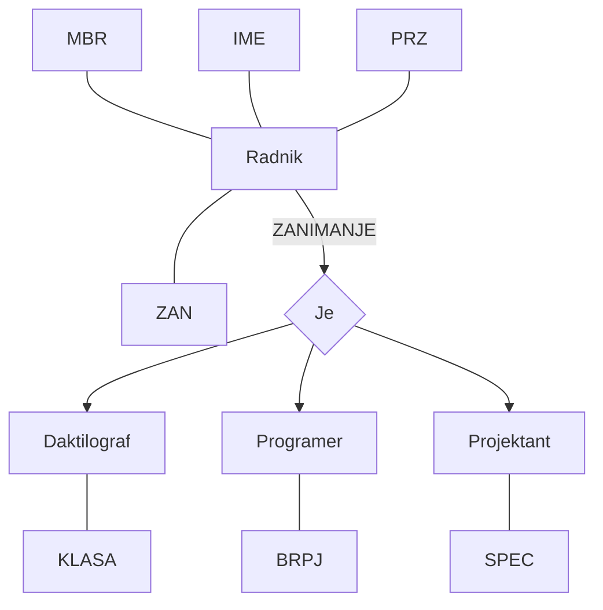
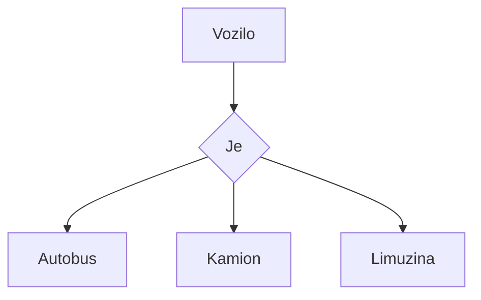
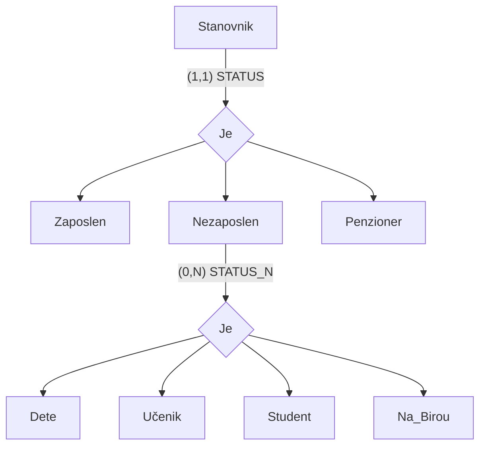
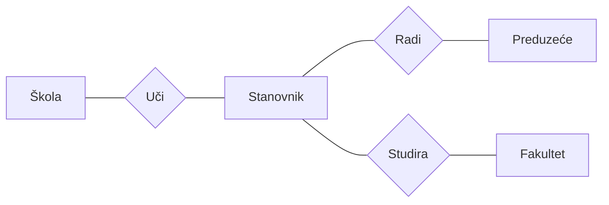
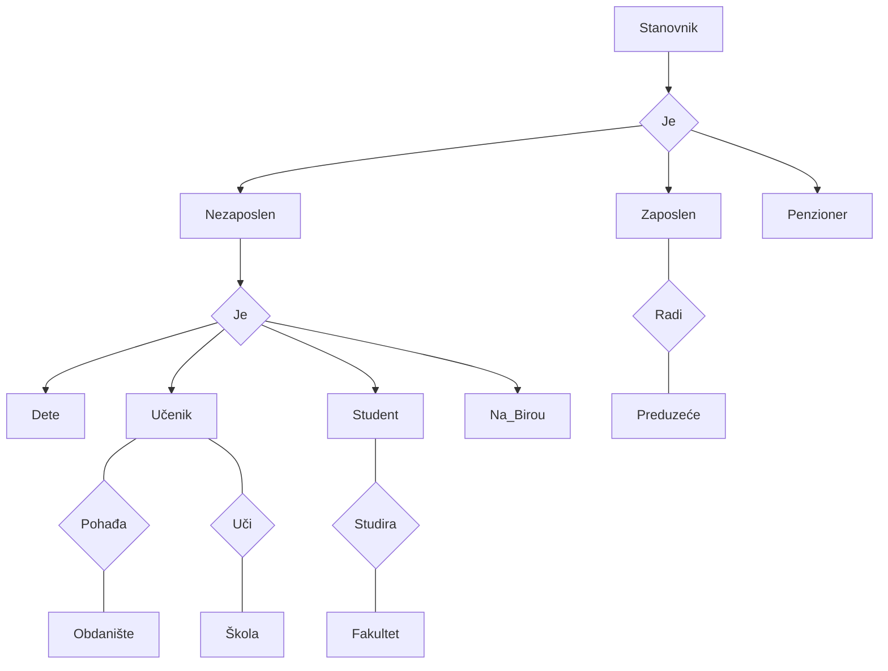
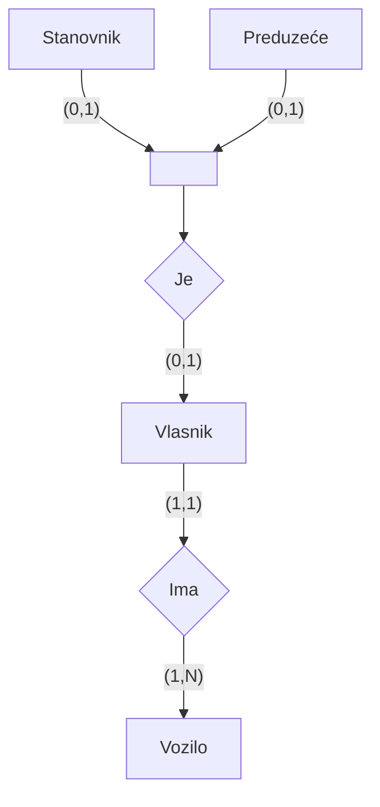
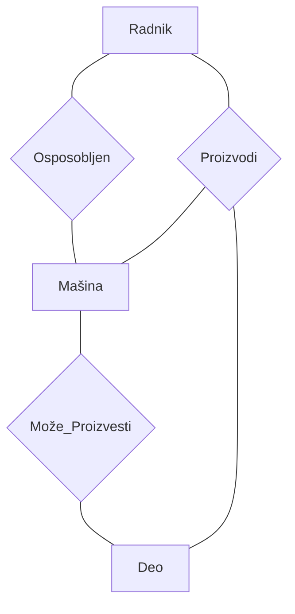

# Proširenja modela entiteta i poveznika: IS-A hijerarhija, kategorizacija i gerund

## Uvod - Zašto su nam potrebna proširenja?

Zamislimo sledeću situaciju. Imamo fakultetsku bazu podataka u kojoj postoji tip entiteta *Radnik*. Među radnicima postoje programeri, projektanti, daktilografi - svako od njih ima neka zajednička obeležja (matični broj, ime, prezime), ali i neka koja su specifična samo za tu grupu. Programer ima broj programskih jezika koje poznaje, projektant ima specijalnost, a daktilograf klasu daktilografije. Kako ovo elegantno predstaviti?

Upravo tu na scenu stupaju **proširenja modela entiteta i poveznika**. Tokom kraja sedamdesetih godina, razni autori, među kojima se ističu Smith i Smith, Hammer i Mc Load, uveli su niz novih koncepata i postupaka za definisanje složenijih struktura u ER modelu podataka. Osnovni cilj tih inovacija bio je da se obezbedi veća moć izražavanja semantike pri izgradnji modela realnog sistema.

Ovi novi koncepti obuhvataju: **potklasu**, **superklasu**, **gerund** i **kategoriju**, dok postupci uključuju: **specijalizaciju**, **generalizaciju**, **kategorizaciju**, **agregaciju** i **asocijaciju**. Svi ovi postupci se zajedničkim imenom nazivaju **apstrakcijama**. Ono što ih sve povezuje jeste važan mehanizam koji ćemo detaljno objasniti - **nasleđivanje obeležja (osobina)**.

Hajde da krenemo redom i sve ovo razmotamo.

---

## 1. Potklasa i superklasa

### Motivacija - Kada nam trebaju potklase?

Tip entiteta u ER modelu služi za predstavljanje skupa sličnih realnih entiteta. Međutim, u praksi se često dešava da unutar tog skupa možemo prepoznati **prave podskupove** entiteta sa specifičnim osobinama ili ulogama. Tada se nameće potreba da te podskupove eksplicitno predstavimo.

Evo primera iz svakodnevnog života. Svi zaposleni na fakultetu su radnici, ali neki su profesori, neki su asistenti, a neki administrativno osoblje. Svaka od ovih grupa ima nešto specifično - profesor ima zvanje, asistent ima mentora, administrativac ima radno mesto. Ali svi oni dele zajedničke podatke: matični broj, ime, prezime, platu.

Upravo za ovakve situacije koristimo koncepte **potklase** i **superklase**.

### Definicije

> [!IMPORTANT]
> **Superklasa** predstavlja intenzionalni model svih entiteta jedne klase. Zajednička obeležja svih entiteta se grupišu u superklasu.

> [!IMPORTANT]
> **Potklasa** ukazuje na posebnu ulogu entiteta određenog podskupa posmatrane klase. Specifična obeležja, koja odgovaraju različitim ulogama entiteta, grupišu se u odgovarajuće potklase.

**Specifično obeležje** je ono koje samo za pravi potskup posmatranog skupa entiteta predstavlja karakterističnu osobinu, a za ostale entitete je neprimereno svojstvo.

Superklasu i njene potklase povezuje relacija koja se često naziva **IS_A hijerarhija**. Naziv potiče od engleskih reči "is a", u smislu: entitet potklase **je** (is a) i entitet superklase.

**Kriterijum za definisanje potklasa** predstavlja **klasifikaciono obeležje**, koje pripada superklasi. Svaka potklasa odgovara jednom elementu domena klasifikacionog obeležja, ali ne mora svakom elementu domena klasifikacionog obeležja odgovarati jedna potklasa.

### Pojava potklase u ekstenziji

Pojava potklase sadrži samo vrednosti **primarnog ključa superklase** i vrednosti **specifičnih obeležja**. Na nivou ekstenzije, svakoj pojavi tipa entiteta potklase odgovara tačno jedna pojava tipa entiteta superklase.

---

## 2. Nasleđivanje osobina

### Kako nasleđivanje funkcioniše?

Ovo je jedan od najbitnijih mehanizama u celoj priči o IS_A hijerarhijama, pa hajde da ga dobro razumemo.

Mehanizam nasleđivanja radi ovako: **potklasa nasleđuje sva obeležja svoje superklase i ne može se posmatrati izdvojeno, bez svoje superklase**. Mehanizam tog nasleđivanja je **posredan** - realizuje se putem iste vrednosti ključa pojave superklase i pojave potklase. Tek nakon povezivanja neke pojave potklase sa odgovarajućom pojavom superklase, dobija se ekstenzionalni model konkretnog entiteta iz posmatranog podskupa realnih entiteta sa nekom specifičnom ulogom.

Da to bude jasnije, razmislimo o tome ovako: programer u bazi nije samo red u tabeli *Programer* - on je kompletan tek kada spojimo njegov red iz tabele *Programer* (sa specifičnim obeležjima) sa odgovarajućim redom iz tabele *Radnik* (sa zajedničkim obeležjima). Spajanje se vrši preko istog primarnog ključa.

> [!TIP]
> Na ispitu se često pita mehanizam nasleđivanja. Zapamti: nasleđivanje je **posredno**, realizuje se preko **iste vrednosti ključa** u superklasi i potklasi.

### Primer: IS_A hijerarhija Radnik - Daktilograf, Projektant, Programer

Na sledećem dijagramu prikazana je IS_A hijerarhija sa superklasom **Radnik** i potklasom **Daktilograf**, **Projektant** i **Programer**.

Potklasamа odgovaraju sledeća **specifična obeležja**:

| Potklasa | Specifično obeležje | Značenje |
|----------|---------------------|----------|
| Daktilograf | KLASA | Daktilografska klasa |
| Programer | BRPJ | Broj programskih jezika |
| Projektant | SPEC | Projektantska specijalnost |

Obeležje **ZAN** (zanimanje), sa domenom $dom(ZAN) = \{daktilograf, pravnik, programer, projektant, ...\}$, je upotrebljeno za klasifikaciju, što je i navedeno uz poteg od superklase ka potklasamа.

Obratimo pažnju na jednu stvar: činjenica da **nije definisana potklasa Pravnik** ne ukazuje na to da ne postoje radnici tog zanimanja, već da ta potklasa nije bitna sa tačke gledišta zadataka automatizovanog informacionog sistema.

Na nivou ekstenzije, svakom daktilografu, projektantu ili programeru odgovaraju **dva modela** - jedan, kao pojava potklase i jedan kao pojava superklase.

### Ekstenzija - konkretan primer sa podacima

Pogledajmo kako to izgleda sa konkretnim podacima. Najpre tabela superklase **Radnik**:

| MBR | IME | PRZ | ZAN |
|-----|-----|-----|-----|
| 154 | Ivo | Ban | Programer |
| 113 | Ana | Tot | Programer |
| 168 | Eva | Ras | Projektant |
| 103 | Ana | Kon | Daktilograf |
| 100 | Aca | Car | Pravnik |

A sada tabele potklasa, koje sadrže samo ključ superklase i specifična obeležja:

**Radnik** (pun prikaz sa specifičnim obeležjima, gde $\omega$ označava nula vrednosti):

| MBR | IME | PRZ | ZAN | KLASA | BRPJ | SPEC |
|-----|-----|-----|-----|-------|------|------|
| 154 | Ivo | Ban | Programer | $\omega$ | 3 | $\omega$ |
| 113 | Ana | Tot | Programer | $\omega$ | 2 | $\omega$ |
| 168 | Eva | Ras | Projektant | $\omega$ | $\omega$ | BP |
| 103 | Ana | Kon | Daktilograf | A | $\omega$ | $\omega$ |
| 100 | Aca | Car | Pravnik | $\omega$ | $\omega$ | $\omega$ |

Vidimo da Aca Car (pravnik) ima $\omega$ (nula vrednosti) za sva specifična obeležja jer za njega nije definisana potklasa.

U IS_A hijerarhiji, podaci se razdvajaju na tabele potklasa:

**Programer:**

| MBR | BRPJ |
|-----|------|
| 159 | 3 |
| 113 | 2 |

**Projektant:**

| MBR | SPEC |
|-----|------|
| 168 | BP |

**Daktilograf:**

| MBR | KLASA |
|-----|-------|
| 103 | A |

> [!NOTE]
> IS_A hijerarhije se koriste samo za predstavljanje situacija kada pravi podskupovi skupa entiteta igraju posebne uloge u realnom sistemu. Ako svi entiteti posmatranog skupa imaju više uloga, takva situacija se može rešiti uvođenjem ekvivalentnih ključeva u odgovarajući tip entiteta.

### Primer sa dva ključa: Zaposleni u preduzeću

Zamislimo da svi zaposleni u preduzeću imaju bar dve uloge - to su: uloga radnika i uloga socijalnog osiguranika. Da bi se ukazalo na te dve uloge, u tip entiteta **Radnik** se uvode dva ključa: **MBR** (matični broj radnika) i **IDSO** (identifikacioni broj socijalnog osiguranika).

---

## 3. Specijalizacija

**Specijalizacija** je postupak kojim se IS_A hijerarhije definišu, polazeći **od tipa entiteta buduće superklase**.

Kako to radi? Kreće se od tipa entiteta iz kojeg se, saglasno klasifikacionom obeležju, izdvajaju potklase sa specifičnim obeležjima. Isti polazni tip entiteta se može podvrgnuti specijalizacijama na osnovu vrednosti **više klasifikacionih obeležja**. Takođe, svaka potklasa može predstavljati superklasu za neke nove potklase.

Pojednostavljeno rečeno - specijalizacija ide **odozgo nadole**: od opšteg ka posebnom.

> [!IMPORTANT]
> **Specijalizacija** = polazimo od superklase i idemo ka potklasamа (top-down pristup). Kreće se od tipa entiteta, iz kojeg se na osnovu klasifikacionog obeležja izdvajaju potklase sa specifičnim obeležjima.

---

## 4. Generalizacija

**Generalizacija** predstavlja proces suprotan specijalizaciji.

Ovde se kreće **od različitih tipova entiteta**, zanemarivanjem razlika i identifikacijom zajedničkih osobina, gradi zajednička superklasa. Polazni tipovi entiteta postaju potklase dobijene superklase. Potklase zadržavaju samo specifična obeležja.

Specijalizacija i generalizacija, očigledno, predstavljaju **međusobno inverzne procese** koji daju isti rezultat.

> [!IMPORTANT]
> **Generalizacija** = polazimo od potklasa i idemo ka superklasi (bottom-up pristup). Od različitih tipova entiteta se zajedničke osobine izvlače u jednu novu superklasu.

### Primer generalizacije: Autobus, Kamion, Limuzina → Vozilo

Posmatraju se tipovi entiteta *Autobus*, *Kamion* i *Limuzina*. Njihovom generalizacijom se dobija superklasa **Vozilo**.

Sva tri tipa entiteta dele zajedničke osobine (registarski broj, godina proizvodnje, marka...), ali svaki ima i nešto specifično. Generalizacijom smo te zajedničke osobine "izvukli" u superklasu Vozilo.

---

## 5. Karakteristike ekstenzije IS_A hijerarhija

Ovo je deo koji studenti često zapostave, ali se redovno pita na ispitu. Razumevanje ovih karakteristika je ključno za pravilno tumačenje ER dijagrama.

U ekstenziji, svaka pojava potklase nasleđuje vrednost ključa od odgovarajuće pojave u superklasi, jer svakoj pojavi potklase odgovara **tačno jedna** pojava u superklasi.

Kardinalnost odnosa između skupa potklasa i superklase i disjunktnost ekstenzije predstavljaju bitne karakteristike IS_A hijerarhije. Hajde da ih detaljno objasnimo.

### 5.1 Totalnost preslikavanja (kardinalnost $a$)

**Kardinalnost preslikavanja sa skupa pojava potklasa na skup pojava superklase** je uvek $(1, 1)$ - jer svakoj pojavi bilo koje potklase odgovara jedna i samo jedna pojava superklase. Zbog toga se taj kardinalitet na ER dijagramima i ne navodi.

Ono što nas zanima je **preslikavanje sa skupa pojava superklase na skup pojava potklasa**. Tu razlikujemo dva slučaja:

> [!IMPORTANT]
> **Totalna IS_A hijerarhija** - ako svakoj pojavi superklase odgovara bar jedna pojava neke od potklasa. Minimalni kardinalitet tog preslikavanja je $a = 1$.
>
> **Parcijalna IS_A hijerarhija** - ako bar jednoj pojavi superklase ne odgovara nijedna pojava bilo koje potklase. Minimalni kardinalitet tog preslikavanja je $a = 0$.

Drugim rečima:
- **Totalna**: svaki entitet superklase MORA pripadati bar jednoj potklasi
- **Parcijalna**: neki entiteti superklase NE moraju pripadati nijednoj potklasi

### 5.2 Disjunktnost ekstenzije (kardinalnost $b$)

**Disjunktnost ekstenzije** govori o broju pojava različitih potklasa koje odgovaraju jednoj pojavi superklase.

> [!IMPORTANT]
> **Disjunktna IS_A hijerarhija** - ako je svakoj pojavi superklase pridružena pojava iz **najviše jedne** potklase. Maksimalni kardinalitet preslikavanja sa superklase u potklase je $b = 1$.
>
> **Presečna IS_A hijerarhija** - ako bar jednoj pojavi superklase odgovaraju pojave iz **više od jedne** potklase. Maksimalni kardinalitet preslikavanja sa skupa pojava superklase na skup pojava potklasa je $b = N$.

Pojednostavljeno:
- **Disjunktna**: svaki entitet superklase pripada NAJVIŠE jednoj potklasi (nema preklapanja)
- **Presečna**: entitet superklase može pripadati VIŠE potklasa istovremeno (ima preklapanja)

### Primer: Tronivovska IS_A hijerarhija - Stanovnik

Pogledajmo jedan bogat primer koji ilustruje oba koncepta. Prikazana je tronivovska IS_A hijerarhija sa superklasom **Stanovnik**.

Potklase superklase **Stanovnik** su: *Zaposlen*, *Nezaposlen* i *Penzioner*.

Ove potklase su **totalne** i **disjunktne** - oznaka $(1,1)$ uz obeležje STATUS znači:
- Totalne ($a = 1$): svaki stanovnik MORA biti ili zaposlen, ili nezaposlen, ili penzioner
- Disjunktne ($b = 1$): nijedan stanovnik ne može biti istovremeno, recimo, i zaposlen i penzioner

Potklasa **Nezaposlen** predstavlja superklasu za potklase: *Dete*, *Učenik*, *Student* i *Na_Birou* (oni koji su prijavljeni na biro za zapošljavanje).

Ove potklase su **parcijalne** i **presečne** - oznaka $(0,N)$ uz STATUS_N znači:
- Parcijalne ($a = 0$): među nezaposlenima postoje i drugi podskupovi stanovnika, kao što su, na primer, domaćice
- Presečne ($b = N$): studenti mogu biti prijavljeni na biro za zapošljavanje, pa isti nezaposleni može biti i Student i Na_Birou istovremeno

> [!WARNING]
> Česta greška na ispitu: studenti mešaju totalnost i disjunktnost. Totalnost govori o tome da li SVAKI entitet superklase mora imati potklasu. Disjunktnost govori o tome da li entitet može pripadati VIŠE potklasa istovremeno. To su dva potpuno nezavisna koncepta.

---

## 6. Cilj i efekti uvođenja IS_A hijerarhija

Hajde sada da sagledamo širu sliku - zašto se uopšte trudimo sa svim ovim? Koji su konkretni benefiti?

Osnovni cilj uvođenja IS_A hijerarhija u skup koncepata ER modela podataka je **izgradnja semantički bogatije i vernije slike statičke strukture realnog sistema**.

### Efekti na nivou intenzije

Na nivou intenzije (strukture), postižu se sledeći efekti:

1. **Eksplicitno ukazivanje** na činjenicu da je postojanje različitih uloga pojedinih entiteta u realnom sistemu bitno za zadovoljavanje zahteva korisnika informacionog sistema
2. **Prirodnije predstavljanje veza** između entiteta sa određenim ulogama i entiteta nekog drugog skupa

### Primer: Stanovnik sa vezama pre i posle IS_A

Pogledajmo kako IS_A hijerarhija omogućava prirodnije predstavljanje veza. Bez IS_A hijerarhije, dijagram bi izgledao ovako - sve veze idu direktno od entiteta Stanovnik:

Problem je očigledan: veza *Uči* se odnosi samo na učenike, *Radi* samo na zaposlene, *Studira* samo na studente, ali sve to ide preko jednog tipa entiteta Stanovnik.

Sa IS_A hijerarhijom, model postaje mnogo jasniji i prirodniji:

Sada su veze povezane sa pravim potklasamа: *Zaposlen* radi u *Preduzeću*, *Učenik* uči u *Školi*, *Student* studira na *Fakultetu*. Mnogo prirodnije i jasnije.

### Efekti na nivou ekstenzije

Na ekstenzionalnom nivou se, takođe, postižu određeni efekti:

1. **Izbegavanje nula vrednosti za specifična obeležja** - u slučaju primene specijalizacije (umesto da pravnik ima $\omega$ za KLASA, BRPJ i SPEC, te kolone uopšte ne postoje u njegovom redu)
2. **Izbegavanje ponavljanja istih podataka** - u slučaju primene generalizacije na polazne tipove entiteta sa presečnim ekstenzijama

---

## 7. Kategorija i kategorizacija

### Motivacija - Kada nam kategorija treba?

U svim primerima koje smo do sada videli, sve potklase jedne superklase su pripadale **jednoj kategoriji** - to jest, sve su bile potklase istog tipa entiteta. Međutim, šta ako imamo situaciju gde potklasa objedinjuje pojave **potpuno različitih tipova entiteta**?

### Definicija

> [!IMPORTANT]
> **Kategorija** je potklasa u modelu u kojem potklasa objedinjuje pojave potpuno različitih tipova entiteta. Kategorija nastaje kategorizacijom.

### Primer: Vlasnik vozila - Stanovnik ili Preduzeće

Posmatraju se tipovi entiteta **Stanovnik** i **Preduzeće**. Vlasnik vozila može biti bilo stanovnik bilo preduzeće. Potrebno je kreirati klasu koja će uključiti entitete oba tipa (stanovnik i preduzeće), pod uslovom da poseduju vozilo. U tu svrhu se definiše **kategorija** pod nazivom **Vlasnik**. Skup pojava tipa entiteta *Vlasnik* je podskup **unije** skupova entiteta *Stanovnik* i *Preduzeće*, saglasno tome - predstavlja potklasu.

Rezultat opisane kategorizacije prikazan je na dijagramu gde:
- *Stanovnik* i *Preduzeće* su superklase kategorije
- *Vlasnik* je kategorija (potklasa)
- Svaka pojava tipa entiteta *Vlasnik* nasleđuje obeležja ili od *Stanovnika* ili od *Preduzeća*, ali svakako ne od oba

### Mehanizam nasleđivanja kod kategorije

U slučaju kategorizacije, mehanizam nasleđivanja obeležja je **selektivan**. Svaka pojava tipa entiteta *Vlasnik* nasleđuje obeležja ili od *Stanovnika* ili od *Preduzeća*, ali svakako **ne od oba**.

### Ključ kategorije - surogat

Pošto superklase jedne kategorije poseduju različite ključeve, za jednoznačnu identifikaciju članova kategorije uvodi se novo obeležje - **ključ kategorije**. Ovaj ključ se naziva i **surogat**. Pored ključa-surogata, kategorija može posedovati i druga specifična obeležja.

> [!TIP]
> Razlika između obične IS_A hijerarhije i kategorije:
> - **IS_A hijerarhija**: jedna superklasa, više potklasa (Radnik → Programer, Projektant, Daktilograf)
> - **Kategorija**: više superklasa, jedna potklasa (Stanovnik + Preduzeće → Vlasnik)

---

## 8. Gerund

### Motivacija - Problem direktnog povezivanja dva tipa poveznika

Gerundij, ili kratko **gerund**, je glagolska imenica. U ER modelu podataka se **gerundom** naziva tip entiteta dobijen **transformacijom tipa poveznika**. Osnovni razlog za uvođenje gerunda u model podataka je da bi se povećalo bogatstvo semantike za izgradnju modela realnog sistema.

Konkretnije, uvođenjem gerunda se prevazilazi problem **direktnog povezivanja dva tipa poveznika**. U ER dijagramima se gerund predstavlja rombom upisanim u pravougaonik.

### Kada se gerund koristi?

Gerund se koristi za modeliranje situacija kod kojih su (ne nužno sve) pojave jednog tipa poveznika povezane sa pojavama nekog drugog tipa poveznika. Tada se povezani tipovi poveznika transformišu u gerunde. Do sličnih situacija dolazi i kada je potrebno povezati neki tip poveznika $R$ sa nekim tipom entiteta. Tada se ponovo tip poveznika $R$ pretvara u gerund.

### Primer: Radnik, Mašina, Deo

Posmatraju se klase entiteta: **Radnik**, **Mašina** i **Deo**. Između entiteta ovih klasa važe sledeći odnosi:
- radnik $r$ je osposobljen za rad na mašini $m$
- na mašini $m$ se može proizvesti deo $d$
- radnik $r$, na nekim od mašina $m$ za koje je osposobljen, izrađuje delove $d$ koji se na tim mašinama mogu proizvesti

Prvo, hajde da vidimo osnovne tipove poveznika:

- **Osposobljen** (Radnik, Mašina) - koji radnik je osposobljen za koju mašinu
- **Može_Proizvesti** (Mašina, Deo) - koja mašina može proizvesti koji deo
- **Proizvodi** (Radnik, Mašina, Deo) - koji radnik na kojoj mašini proizvodi koji deo

### Semantika dijagrama sa gerundima

Semantika ovog ER dijagrama je sledeća:
- entiteti klase $X$ (Radnik) su u vezi sa entitetima klase $Y$ (Mašina) - to su $(x, y)$ parovi
- entiteti klase $V$ (Mašina) su u vezi sa entitetima klase $W$ (Deo) - to su $(v, w)$ parovi
- neki (eventualno svi) $(x, y)$ parovi su povezani sa nekim $(v, w)$ parovima i ta veza može egzistirati samo između postojećih $(x, y)$ i $(v, w)$ parova

Saglasno ovome, četvorka $(x_1, y_2, v_1, w_2)$ ne može pripadati ekstenziji tipa poveznika $XYVW$ (tipa Proizvodi).

### Konkretna ekstenzija - primer sa podacima

Pogledajmo konkretne podatke za ovaj primer:

**Radnik:**

| Radnik |
|--------|
| Ana |
| Aco |
| Ivo |
| Eva |

**Mašina:**

| Mašina |
|--------|
| $m_1$ |
| $m_2$ |
| $m_3$ |
| $m_4$ |

**Deo:**

| Deo |
|-----|
| $d_1$ |
| $d_2$ |
| $d_3$ |

**Osposobljen** (Radnik, Mašina):

| Radnik | Mašina |
|--------|--------|
| Ana | $m_1$ |
| Ana | $m_2$ |
| Aco | $m_1$ |
| Ivo | $m_3$ |

**Može Proizvesti** (Mašina, Deo):

| Mašina | Deo |
|--------|-----|
| $m_1$ | $d_1$ |
| $m_1$ | $d_2$ |
| $m_2$ | $d_2$ |
| $m_3$ | $d_3$ |
| $m_4$ | $d_3$ |

**Proizvodi** (Radnik, Mašina, Deo):

| Radnik | Mašina | Deo |
|--------|--------|-----|
| Ana | $m_1$ | $d_1$ |
| Ana | $m_1$ | $d_2$ |
| Aco | $m_1$ | $d_2$ |

### Alternativni dijagram - bez gerunda

Alternativni ER dijagram sa odgovarajućom ekstenzijom ne poseduje istu semantiku kao dijagram sa gerundima. Sa dijagrama bez gerunda se **ne može zaključiti** da je preduslov za postojanje svake $(x, y, v, w)$ četvorke postojanje po jedne $(x, y)$ i $(v, w)$ dvojke sa istim $x$, $y$, $v$ i $w$ vrednostima.

Još preciznije: dijagram sa gerundima sugeriše da su tipovi poveznika $XY$, $VW$ i $XYVW$ **međusobno potpuno nezavisni** - te da može postojati četvorka $(x, y, v, w)$, a da ne postoji odgovarajuća $(x, y)$ ili $(v, w)$ dvojka.

### Ograničenje u ekstenziji gerunda

Treba zapaziti da, saglasno strukturi ER dijagrama sa gerundima, ekstenzija može sadržati podatke da na mašini $m$ radi radnik $r$ koji nije osposobljen za rad na toj mašini, i da čak proizvodi deo koji se na toj mašini ne može proizvesti.

Odgovarajući ER dijagram sa gerundima, gde se ovo ograničenje jasno vidi, prikazan je na sledećem primeru sa mogućom ekstenzijom gde:
- radnik $r$ je osposobljen za rad na mašini $m$
- na mašini $m$ se može proizvesti deo $d$
- radnik $r$ proizvodi deo $d$ na mašini $m$

Sa tom strukturom, čak i sa gerundima, moguća ekstenzija tipa **Proizvodi** može da sadrži takav podatak da Eva proizvodi deo $d_1$ na mašini $m_4$, iako nije osposobljena za tu mašinu.

> [!CAUTION]
> Gerund ne garantuje automatski referencijalnu konzistentnost između povezanih tipova poveznika. Na ispitu se može tražiti da objasnite šta se dešava kada se gerund koristi nasuprot direktnom ternarnom tipu poveznika.

---

## 9. Heuristička uputstva za projektovanje modela realnog sistema putem ER modela podataka

Na kraju ove priče, korisno je znati neka praktična pravila za prevođenje tekstualnog opisa realnog sistema u ER dijagram. Model entiteta i poveznika je prevashodno namenjen za izgradnju približne slike entiteta i poveznika koji egzistiraju u ljudskom intelektu, putem koncepata na nivou apstrakcije naziva skupova sličnih entiteta ili poveznika, uz eventualno navođenje njihovih zajedničkih osobina.

Osnovni preduslov za projektovanje modela statičke strukture realnog sistema predstavlja precizno poznavanje tog realnog sistema. Do tih saznanja se dolazi snimanjem realnog sistema i rezultati tog snimanja se izražavaju putem neformalnog, tekstualnog opisa parametara realnog sistema. Zadatak projektovanja modela statičke strukture realnog sistema se tada svodi na izradu ER dijagrama, prevođenjem navoda iz tog tekstualnog opisa u koncepte ER modela podataka.

Evo tih heurističkih uputstava:

1. **Imenice** ukazuju na potrebu uvođenja **tipova entiteta**
2. **Glagolski oblici** ukazuju na potrebu uvođenja **tipova poveznika ili gerunda**
3. Fraze oblika "bar jedan", "najmanje jedan", "više" i slične ukazuju na **kardinalitete tipova poveznika ili gerunda**
4. Postojanje različitih **uloga** entiteta jednog skupa u vezama sa entitetima drugih skupova ukazuje na potrebu uvođenja više tipova poveznika između odgovarajućih tipova entiteta
5. **Veze između entiteta jednog skupa** ukazuju na potrebu uvođenja **rekurzivnog tipa poveznika**. Kod rekurzivnih veza je preporučljivo da se uloge entiteta eksplicitno navedu
6. Vremensko **prethođenje** entiteta jednog skupa u odnosu na entitete nekog drugog skupa ukazuje na **egzistencijalnu zavisnost** entiteta drugog skupa od entiteta prvog skupa i potrebu uvođenja minimalnog kardinaliteta $a_1 = 1$
7. Potreba takvog **selektivnog** povezivanja entiteta tri ili više skupova, kod kojeg u vezi mogu učestvovati samo entiteti koji su već u nekakvoj drugoj vezi sa entitetima jednog od tih skupova, ukazuje na potrebu uvođenja **gerunda**

> [!TIP]
> Ova heuristička uputstva su odličan alat za ispit. Kada dobijete tekstualni opis sistema i treba da nacrtate ER dijagram, krenite od ovih pravila: imenice → tipovi entiteta, glagoli → tipovi poveznika, pridevi i fraze o broju → kardinaliteti.

---

## 🎴 Brza pitanja (definicije i pojmovi)

**P:** Šta je superklasa, a šta potklasa u kontekstu ER modela?

**P:** Šta je klasifikaciono obeležje i koja je njegova uloga u definisanju potklasa?

**P:** Objasni mehanizam nasleđivanja osobina u IS_A hijerarhiji - kako se realizuje i zašto se kaže da je posredan?

**P:** Koja je razlika između specijalizacije i generalizacije?

**P:** Šta znači da je IS_A hijerarhija totalna, a šta da je parcijalna?

**P:** Šta znači da je IS_A hijerarhija disjunktna, a šta da je presečna?

**P:** Šta je kategorija i po čemu se razlikuje od obične IS_A hijerarhije?

**P:** Šta je gerund u ER modelu podataka i koji problem rešava?

---

## 📝 Šira pitanja za proveru razumevanja

**P:** Na primeru IS_A hijerarhije Stanovnik → (Zaposlen, Nezaposlen, Penzioner), objasni zašto su potklase totalne i disjunktne, a potklase potklase Nezaposlen (Dete, Učenik, Student, Na_Birou) parcijalne i presečne. Navedi konkretne primere pojava koje to ilustruju.

**O:** Potklase prvog nivoa (Zaposlen, Nezaposlen, Penzioner) su totalne jer svaki stanovnik MORA pripadati jednoj od njih - ne postoji stanovnik koji nije ni zaposlen, ni nezaposlen, ni penzioner ($a = 1$). Disjunktne su jer nijedan stanovnik ne može istovremeno biti, recimo, i zaposlen i penzioner ($b = 1$). Potklase drugog nivoa (Dete, Učenik, Student, Na_Birou) su parcijalne jer postoje nezaposleni koji ne pripadaju nijednoj od tih potklasa, npr. domaćice ($a = 0$). Presečne su jer ista osoba može biti, npr. i student i prijavljena na biro za zapošljavanje ($b = N$).

---

**P:** Objasni razliku između IS_A hijerarhije i kategorije na konkretnom primeru. Kako se razlikuje mehanizam nasleđivanja u ova dva slučaja?

**O:** U IS_A hijerarhiji imamo jednu superklasu i više potklasa (npr. Radnik → Programer, Projektant, Daktilograf), gde sve potklase nasleđuju obeležja od iste superklase. U kategoriji imamo više superklasa i jednu potklasu (npr. Stanovnik + Preduzeće → Vlasnik). Kod kategorije, mehanizam nasleđivanja je selektivan - pojava kategorije nasleđuje obeležja od tačno jedne superklase (Vlasnik je ili Stanovnik ili Preduzeće, nikad oba). Takođe, kategorija zahteva poseban ključ-surogat jer superklase imaju različite ključeve.

---

**P:** Zašto se u ER modelu uvode gerundi? Objasni na primeru odnosa između Radnika, Mašine i Dela šta gerund omogućava, a šta ne bi bilo moguće bez njega.

**O:** Gerundi se uvode da bi se omogućilo povezivanje dva tipa poveznika, što ER model inače ne dozvoljava direktno. U primeru Radnik-Mašina-Deo, tip poveznika Proizvodi (koji radnik na kojoj mašini pravi koji deo) treba da bude ograničen tako da radnik može proizvoditi deo na mašini samo ako je osposobljen za tu mašinu (veza Osposobljen) i ako se na toj mašini taj deo može napraviti (veza Može_Proizvesti). Bez gerunda, imali bismo samo ternarni tip poveznika bez mogućnosti da izrazimo ovu zavisnost od postojećih binarnih veza.

---

**P:** Data je IS_A hijerarhija sa superklasom Radnik i potklasamа Programer i Projektant. Radnik ima obeležja MBR, IME, PRZ i ZAN. Programer ima specifično obeležje BRPJ, a Projektant SPEC. Ako je MBR = 159 programer sa BRPJ = 3, navedi koje redove bi imale tabele Radnik i Programer u ekstenziji.

**O:** U tabeli Radnik bi postojao red: MBR = 159, IME = (neka vrednost), PRZ = (neka vrednost), ZAN = Programer. U tabeli Programer bi postojao red sa samo dva polja: MBR = 159, BRPJ = 3. Ključ potklase (MBR = 159) je isti kao ključ odgovarajuće pojave u superklasi - to je mehanizam posrednog nasleđivanja. Kompletna slika o programeru se dobija tek spajanjem ova dva reda po vrednosti ključa MBR.

---

**P:** Na osnovu heurističkih uputstava, kako bi iz sledećeg tekstualnog opisa identifikovao koncepte ER modela: "Svaki student pohađa bar jedan kurs. Kurs drži tačno jedan profesor. Profesor može držati više kurseva."

**O:** Imenice (student, kurs, profesor) ukazuju na tipove entiteta: Student, Kurs, Profesor. Glagolski oblici (pohađa, drži) ukazuju na tipove poveznika: Pohađa (Student-Kurs) i Drži (Profesor-Kurs). Fraza "bar jedan" uz kurs znači minimalni kardinalitet 1 za studenta ka kursu. "Tačno jedan" profesor znači kardinalitet (1,1) za kurs ka profesoru. "Može držati više" znači kardinalitet (0,N) ili (1,N) za profesora ka kursu.
