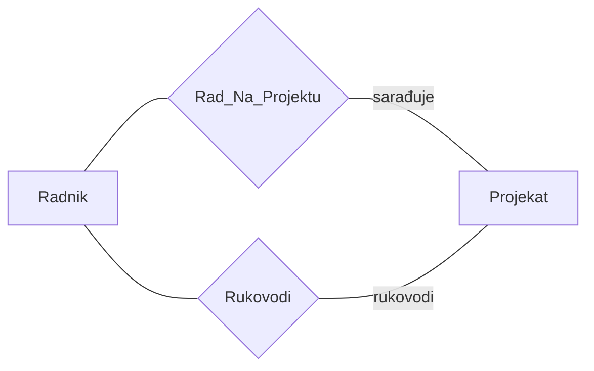
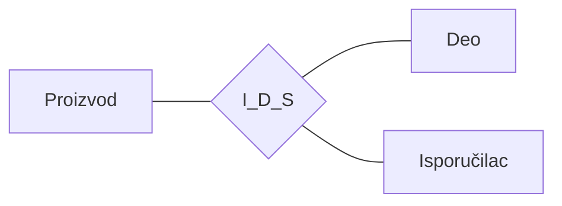
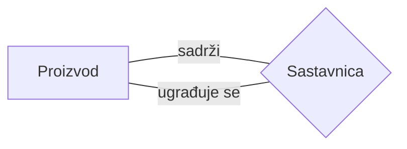
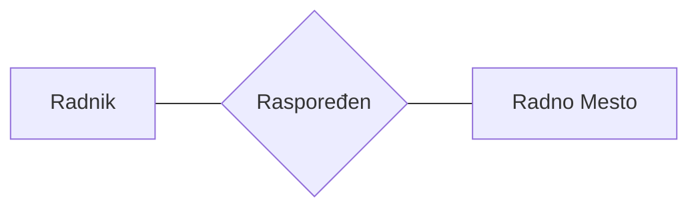

# Strukturalna komponenta ER modela podataka

## Uvod - o čemu pričamo?

Hajde da krenemo od samog početka. Kada želimo da opišemo neki deo realnog sveta - recimo, kako funkcioniše fakultet, bolnica ili firma - potreban nam je neki alat za modelovanje. Model entiteta i poveznika (ER model) je upravo taj alat. On nam daje dva osnovna koncepta pomoću kojih opisujemo realni svet: **entitet** i **poveznik**.

Razmislimo o tome ovako: ako posmatramo fakultet, tu postoje studenti, predmeti, profesori - to su sve "stvari" koje možemo da identifikujemo. A između njih postoje odnosi - student *sluša* predmet, profesor *predaje* predmet. ER model nam omogućava da sve to lepo i precizno zapišemo.

Strukturalna komponenta ER modela se bavi pitanjem: *od čega se ovaj model sastoji?* Koje su mu građevne jedinice? Kako ih definišemo? Kako ih povezujemo? Na ta pitanja ćemo odgovoriti u nastavku.

---

## Entitet i poveznik - dva osnovna koncepta

### Šta je entitet?

**Entitet** je "nešto" što se može jednoznačno identifikovati. On se opisuje kao "jedinica posmatranja" i može se odnositi na svaki realni subjekt, objekat, događaj, pojavu ili neki apstraktni pojam.

Zamislimo entitet kao bilo šta na šta možemo da pokažemo prstom (ili makar da zamislimo) i kažemo: "To je *ta konkretna stvar*, i nijedna druga."

> **Primer 2.1.** Student *Milan Brkić* sa brojem indeksa *89034* je jedan entitet. Predmet *Baze podataka* je drugi entitet. *Polaganje ispita* iz predmeta Baze podataka na dan *09.10.1994.* godine je takođe jedan entitet.
>
> A šta je sa jednim mravom? Mrav se može proglasiti entitetom, ali samo pod uslovom da smo u stanju da ga jednoznačno identifikujemo među drugim mravima, što je malo verovatno. Entitet bi mogla biti neka kolonija mrava.

Ovo je bitna pouka - da bi nešto bilo entitet, moramo moći da ga **razlikujemo** od svega ostalog.

### Šta je poveznik?

**Poveznik** predstavlja vezu između dva ili više entiteta. Poveznik konstituišu povezani entiteti i opis njihove veze.

Vraćajući se na naš primer:

- Jedan poveznik je *"student Milan Brkić sluša predmet Baze podataka"*
- Drugi poveznik je *"student Milan Brkić je položio predmet Baze podataka"*

To su dva različita poveznika između dva ista entiteta (Milan Brkić i Baze podataka). Opisi njihove veze su različiti: "sluša" i "položio".

A može i ovako: poveznik između **tri** entiteta - *"student Milan Brkić je položio predmet Baze podataka na ispitu od 09.10.1994. godine"* (treći entitet je ispit).

---

## Entitet i skup (klasa) entiteta

Entiteti u ljudskom intelektu mogu se klasifikovati u skupove sličnih entiteta. Zamislimo da imamo gomilu studenata - svi oni zajedno čine **skup entiteta**.

Formalno, neka je $e$ entitet, tada je skup entiteta:

$$E = \{e \mid \mathcal{P}(e)\}$$

gde je $\mathcal{P}(e)$ predikat čija istinitosna vrednost ukazuje da li $e$ pripada skupu $E$. Ako $e$ poseduje osobinu $\mathcal{P}(e)$, tada $e$ pripada skupu $E$.

Isti entitet $e$ može pripadati različitim skupovima entiteta.

> **Primer 2.2.** Ako je $\mathcal{P}(e)$ = "e je student", onda skupu $E$ pripadaju samo studenti, a ne i ostali ljudi. Međutim, ako je $E' = \{e \mid e \text{ je ljudsko biće}\}$, tom skupu pripadaju svi ljudi, ali ne i ostali sisari. Pri tome, studenti pripadaju i skupu $E$ i skupu $E'$.

Dakle, jedan te isti entitet može "nositi više šešira" - student je istovremeno i student i ljudsko biće.

---

## Intenzija ER modela podataka

Na nivou intenzije, koncepte ER modela podataka čine: **tip entiteta** i **tip poveznika**. Obeležje predstavlja osnovni gradivni element za konstituisanje ovih složenijih koncepata.

Hajde da krenemo redom i raščlanimo svaki od ovih gradivnih elemenata.

---

### Obeležje (atribut)

Skupovi sličnih entiteta se nazivaju **klasama** entiteta. Svi entiteti jedne klase poseduju bar jednu zajedničku osobinu, na osnovu koje su i svrstani u istu klasu. U opštem slučaju, broj zajedničkih osobina entiteta jedne klase je veći od jedan. Ove osobine nazivaju se **obeležjima** (atributima).

Obeležja se označavaju velikim slovima latinice, skraćenim nazivom (**mnemonikom**) ili punim nazivom. Velika slova latinice se koriste kada semantika obeležja nije važna.

> **Primer 2.3.** Ako je `MATIČNI_BROJ_RADNIKA` pun naziv obeležja, odgovarajući mnemonik bi mogao biti `MBR`.

Sada dolazimo do jedne bitne podele obeležja.

#### Elementarna i složena obeležja

Obeležje koje se dalje ne može dekomponovati, ili koje se u posmatranom slučaju dalje ne dekomponuje na komponente, naziva se **elementarnim obeležjem**. Skup, niz, ili logički proizvod elementarnih obeležja predstavlja **složeno obeležje**. Tom nizu obeležja se može pridružiti neko ime.

> **Primer 2.4.** Obeležja `NAZIV_PROIZVODA`, `BOJA_AUTOMOBILA`, `IME_STANOVNIKA` predstavljaju elementarna obeležja različitih klasa entiteta. Složena obeležja predstavljaju, na primer:
> - $ADRESA = \{MESTO, ULICA, BROJ\}$
> - $\{IME, PRZ, MESTO\}$
> - $DATUM\_UPLATE = \{DAN, MESEC, GODINA\}$

Složena obeležja se, često, označavaju slovima sa kraja abecede, na primer $X$ ili $Y$, a elementarna slovima sa početka abecede, na primer $A$, $B$ ili $C$.

Saglasno rečenom, složeno obeležje je:

$$X = (A_1, A_2, \ldots, A_k)$$

odnosno:

$$X = \{A_1, A_2, \ldots, A_k\}$$

gde su $A_i$, $1 \leq i \leq k$, elementarna obeležja.

Pri tome, složeno obeležje $X$ je jedanput predstavljeno kao niz, a drugi put kao skup.

> [!IMPORTANT]
> Razlika između elementarnog i složenog obeležja je česta tema na ispitu. Zapamtite: elementarno obeležje se NE može dalje rastavljati, dok se složeno MOŽE rastaviti na komponente. Primer: IME je elementarno, ADRESA = {MESTO, ULICA, BROJ} je složeno.

---

### Domen

Svakom obeležju odgovara jedan skup svih mogućih vrednosti koje to obeležje, u konkretnim slučajevima, može imati. Taj skup vrednosti se naziva **domenom obeležja**. Domen obeležja $A$ se obeležava sa $dom(A)$. Takođe, domen može posedovati i svoje posebno ime. Isti domen se može pridružiti većem broju različitih obeležja.

> **Primer 2.5.** Za obeležje `BOJA_AUTOMOBILA` skup vrednosti je:
>
> $$dom(BOJA\_AUTOMOBILA) = \{bela, žuta, crna, plava, \ldots\}$$

Obeležjima `IME_STUDENTA` i `IME_NASTAVNIKA` se može pridružiti isti domen sa nazivom `IME`. Taj domen sadrži, kao svoje elemente, sva moguća lična imena.

> [!NOTE]
> U strukturama podataka, pojam domena se ne koristi u uobičajenom matematičkom smislu, kao skup originala funkcije. Domen može predstavljati skup originala funkcije, ali i skup slika. Pojam domena se koristi u smislu skupa iz kojeg semantički definisani objekti, kao što su tip entiteta i obeležje, uzimaju vrednosti.

Zamislimo domen kao "opseg dozvoljenih vrednosti". Ako obeležje OCENA ima domen {5, 6, 7, 8, 9, 10}, onda student nikako ne može imati ocenu 3 ili 15 - to jednostavno nije u domenu.

#### Veza obeležja i domena - formalno

Formalno, neka je $E = \{e_i \mid i = 1, \ldots, m\}$ klasa entiteta, a $A$ jedno od obeležja te klase. Obeležje $A$ predstavlja funkciju:

$$A : E \rightarrow dom(A)$$

Drugim rečima, obeležje $A$ pridružuje svakom entitetu $e_i \in E$ jednu vrednost iz $dom(A)$, tako da $A(e_i)$ predstavlja podatak o $e_i$ s obzirom na $A$.

Vrednost elementarnog obeležja predstavlja elementarni podatak, a vrednost složenog obeležja predstavlja složeni podatak. Ako je $X = \{A_1, \ldots, A_k\}$, tada je $dom(X) \subseteq dom(A_1) \times \ldots \times dom(A_k)$, tako da je $(a_1, \ldots, a_k)$ jedna vrednost složenog obeležja $X$, gde je, za svako $i$, $a_i \in dom(A_i)$.

#### Izvedeno obeležje

Obeležje čije se vrednosti dobijaju primenom nekog algoritma na vrednosti drugih obeležja naziva se **izvedenim obeležjem**, a njegove vrednosti **izvedenim podacima**.

> **Primer 2.12.** Obeležje `SREDNJA_OCENA` je izvedeno. Njegove vrednosti se dobijaju sabiranjem vrednosti obeležja `OCENA` za sve položene predmete i delenjem tog zbira vrednošću obeležja `BROJ_POLOŽENIH_ISPITA`.

---

### Tip entiteta

Sa tačke gledišta zadataka informacionog sistema, nisu sva obeležja klase entiteta jednako važna. Od obeležja, bitnih za realizaciju zadataka informacionog sistema, gradi se **model** realne klase entiteta. Model klase entiteta naziva se **tipom entiteta**.

> [!IMPORTANT]
> **Definicija 2.1.** Izraz oblika $N(A_1, \ldots, A_n)$ predstavlja model skupa entiteta $E = \{e \mid P(e)\}$ i naziva se **tipom entiteta**, ako i samo ako $N$ predstavlja ime skupa $\{e \mid P(e)\}$, a $A_1, \ldots, A_n$ obeležja entiteta skupa $\{e \mid P(e)\}$.

Hajde da ovo prevedemo na ljudski jezik: tip entiteta je u suštini "šablon" koji opisuje jednu klasu entiteta. Ima ime ($N$) i listu obeležja ($A_1, \ldots, A_n$).

> **Primer 2.6.** Tip entiteta `Student(BROJ_INDEKSA, IME, PREZIME, NAZIV_FAKULTETA)` reprezentuje sve studente jednog univerziteta.

Kao i svaki model, tip entiteta predstavlja samo približnu sliku klase entiteta realnog sistema. Neka je za reprezentaciju klase entiteta, umesto oznake za tip entiteta $N(A_1, \ldots, A_n)$, koristi samo naziv $N$. Pošto niz $(A_1, \ldots, A_n)$ predstavlja složeno obeležje, tip entiteta $N(A_1, \ldots, A_n)$ predstavlja imenovano složeno obeležje. Naziv tipa entiteta predstavlja semantičku komponentu tog apstraktnog opisa klase realnih entiteta. On daje smisao nizu obeležja, koji iza njega sledi.

Klasa entiteta poseduje konačno mnogo osobina zajedničkih svim realnim entitetima. Neka je $\{A_1, \ldots, A_m\}$ skup osobina klase entiteta $E$. Tada je skup obeležja $\{A_1, \ldots, A_n\}$ odabranih za izgradnju tipa entiteta kao modela klase entiteta $E$, pravi ili nepravi podskup skupa obeležja $\{A_1, \ldots, A_m\}$.

---

### Skup poveznika, uloga entiteta i tip poveznika

Sada prelazimo na drugi ključni koncept - poveznike i njihove tipove. Poveznici su ono što daje život modelu, jer bez veza između entiteta imali bismo samo izolovane podatke.

**Skup poveznika** $R$ predstavlja relaciju, u matematičkom smislu, između $n$ ($\geq 2$) skupova entiteta:

$$R = \{(e_1, \ldots, e_n) \mid e_i \in E_i, \; i = 1, \ldots, n\}$$

Pri tome, skupovi $E_i$ ne moraju biti različiti. Svaka $n$-torka $(e_1, \ldots, e_n)$ u $R$ predstavlja jedan poveznik. Svaki entitet $e_i$ u $n$-torki ima svoju **ulogu**. Ako se uloge $u_i$ entiteta $e_i$ u torki eksplicitno navedu, redosled navođenja entiteta u torki postaje nevažan. Eksplicitno navođenje uloga posebno dobija na važnosti kada su u pitanju skupovi poveznika između entiteta, koji pripadaju istim skupovima entiteta.

Treba, takođe, naglasiti i da između dva ista skupa entiteta može egzistirati više različitih skupova poveznika. U takvim slučajevima, entiteti bar jednog od povezanih skupova imaju različite uloge u svakom od posmatranih skupova poveznika. Ako poveznik povezuje entitete jednog skupa, naziva se **rekurzivnim**.

> **Primer 2.7.** Posmatraju se skup entiteta *Radnik* i skup entiteta *Radno_Mesto*. Neka je Aca element u skupu *Radnik*, a *programer* u skupu *Radno_Mesto*. Poveznik *(Aca, programer)* ima semantiku "radnik je raspoređen na radno mesto".
>
> Ako se u skup *Radnik* uvede relacija poretka sa semantikom "je rukovodilac", tada uređeni par *(Iva, Aca)* nosi informaciju da je *Iva* Acin rukovodilac. U paru *(Iva, Aca)*, oba entiteta pripadaju istom skupu, ali u povezniku imaju potpuno različite uloge. Te uloge u posmatranom povezniku nisu eksplicitno navedene. Isti poveznik, sa eksplicitno navedenim ulogama entiteta, bi bio *(Iva (rukovodilac), Aca (podčinjeni))*.
>
> Posmatra se skup entiteta *Radnik* i skup entiteta *Projekat*, pri čemu *Lido* i *Faktura* pripadaju skupu *Projekat*. Parovi *(Aca (nosilac), Lido)* i *(Aca (programer), Faktura)* predstavljaju različite poveznike između ta dva skupa. U tim poveznicima se uloge entiteta *Aca* eksplicitno navedene.

> [!IMPORTANT]
> **Definicija 2.2.** Izraz oblika $N(E_1, \ldots, E_n; B_1, \ldots, B_k)$ predstavlja model skupa poveznika $R$ i naziva se **tipom poveznika**, ako i samo ako $N$ predstavlja naziv skupa poveznika $R$, $E_1, \ldots, E_n$ su povezani skupovi entiteta, a $B_1, \ldots, B_k$ obeležja poveznika skupa $R = \{(e_1, \ldots, e_n) \mid e_i \in E_i, \; i = 1, \ldots, n\}$.

> **Primer 2.8.** Tip poveznika `Raspoređen(Radnik, Radno_Mesto, DATUM_RASP)` predstavlja model skupa poveznika oblika *(radnik, radno_mesto)* proširenih navođenjem njihove zajedničke osobine - datuma raspoređivanja (radnika na radno mesto).
>
> Tip poveznika `Rukovodi(Radnik, Radnik)` je model rukovodne hijerarhije, čiji je jedan reprezent par *(Iva, Aca)* iz primera 2.7.
>
> Tipovi poveznika `Rukovodi(Radnik, Projekat)` i `Radi(Radnik, Projekat)` predstavljaju modele odnosa između radnika i projekata. Informacija o različitim ulogama entiteta iz skupa *Radnik*, ugrađena je u naziv tipa poveznika.

---

## Dijagrami tipova entiteta i tipova poveznika

Model statičke strukture realnog sistema, realizovan putem ER modela podataka, po pravilu se predstavlja uz pomoć takozvanih **ER dijagrama**.

Evo pravila za crtanje ER dijagrama:

- **Tip entiteta** se crta kao **pravougaonik** sa upisanim nazivom (tipa entiteta)
- **Tip poveznika** se crta kao **romb** sa upisanim nazivom (tipa poveznika)
- Ako tip poveznika $R$ povezuje tipove entiteta $E_1, \ldots, E_k$, tada se crta po jedan neusmereni poteg od romba $R$ do geometrijske slike svakog od $E_i$
- **Skupovi vrednosti (domeni)** se prikazuju kao **ovali** sa upisanim nazivom domena i povezuju orijentisanim potegom sa odgovarajućim tipom entiteta ili tipom poveznika
- Orijentacija potega je ka ovalu skupa vrednosti
- Naziv obeležja se upisuje na poteg domena, ako se nazivi obeležja i domena razlikuju

ER dijagrami se mogu crtati na **dva nivoa detaljnosti**: nivo detaljnosti naziva i nivo detaljnosti obeležja. Nivo detaljnosti naziva daje preglednije dijagrame, a nivo detaljnosti obeležja daje dijagrame sa većom količinom informacije. Da bi se dobili dijagrami i sa dobrom preglednošću i sa većom količinom informacija, dva nivoa detaljnosti crtanja dijagrama se kombinuju.

### Primeri ER dijagrama

#### Slika 2.1 - Radnik, Projekat i poveznici

Na ovom dijagramu prikazana su dva tipa entiteta *Radnik* i *Projekat*. Između ta dva tipa entiteta postoje dva tipa poveznika: `Rad_Na_Projektu` i `Rukovodi`. Entiteti tipa *Radnik* igraju dve uloge u poveznicima dva tipa. To su uloge saradnika na projektu i rukovodioca projekta. Te uloge su ispisane uz potege između odgovarajućeg tipa poveznika i tipa entiteta *Projekat*.

#### Slika 2.2 - Isporučilac, Deo, Proizvod

Tri tipa entiteta *Isporučilac*, *Deo* i *Proizvod* između kojih je definisan jedan tip poveznika `I_D_S`, sa semantikom: isporučilac (*I*) isporučuje deo (*D*) za ugradnju u proizvod (*P*).

#### Slika 2.3 - Proizvod i Sastavnica (rekurzivni poveznik)

Tip entiteta *Proizvod* i tip poveznika *Sastavnica*. Svaka pojava tipa poveznika Sastavnica sadrži dva entiteta iz skupa *Proizvod*. Jedan ima ulogu "sadrži", a drugi "ugrađuje se". Ovim konceptima modela entiteta i poveznika, predstavljen je model sastavnice proizvoda.

#### Slika 2.4 - Dijagram sa domenima (nivo detaljnosti obeležja)

> **Primer 2.10.** Na slici 2.4 su prikazani tipovi entiteta *Radnik*, *Projekat* i tip poveznika `Rad_Na_Projektu` sa odgovarajućim domenima (skupovima vrednosti). Obeležja `DAZ` (datum zaposlenja radnika) i `DAP` (datum početka rada na projektu) dele isti skup vrednosti - domen sa imenom `DATUM`.

Struktura ovog dijagrama izgleda ovako:

- **Radnik** ima obeležja povezana sa domenima: MBR, IME, PRZ, DATUM
- **Projekat** ima obeležja povezana sa domenima: SPR, NAP, NAR, IZN
- **Rad_Na_Projektu** ima obeležja: DAZ i DAP (oba koriste domen DATUM)

---

## Ekstenzija ER modela podataka

Dok se intenzija bavi "šablonima" (tipovima), ekstenzija se bavi konkretnim pojavama. Ekstenzionalne koncepte ER modela podataka čine: **pojava tipa entiteta**, **skup pojava tipa entiteta**, **pojava tipa poveznika** i **skup pojava tipa poveznika**. Podatak predstavlja primitivni koncept, putem kojeg se komponuju nabrojani složeniji koncepti.

### Podatak

Entiteti i poveznici se opisuju putem skupova parova (obeležje, vrednost). Obeležje predstavlja semantičku (smisaonu) komponentu te dvojke.

> [!IMPORTANT]
> **Definicija 2.3.** Par (obeležje, vrednost) predstavlja **podatak** o nekom entitetu ili povezniku, ako obeležje predstavlja osobinu posmatranog entiteta ili poveznika, a vrednost pripada domenu tog obeležja.

> **Primer 2.11.** Ako se posmatra obeležje `MATIČNI_BROJ_RADNIKA` i jedna njegova vrednost *110451*, tada *110451* predstavlja podatak o nekom radniku jedino ako se unapred zna da *110451* predstavlja vrednost obeležja `MATIČNI_BROJ_RADNIKA`. U suprotnom, *110451* ne predstavlja podatak, jer mu je smisao neodređen.

Hajde da ovo ilustrujemo još jednim primerom: broj *7* sam po sebi ne predstavlja podatak, jer mu je smisao neodređen. Može se interpretirati na više načina: kao ocena studenta, kao starost deteta i slično.

---

### Pojava i skup pojava tipa entiteta

Svaka klasa entiteta predstavlja skup sličnih entiteta. Svakom entitetu posmatrane klase odgovaraju konkretne vrednosti obeležja klase entiteta. U okviru informacionog sistema, svaki entitet se predstavlja modelom koji sadrži konkretne vrednosti onih obeležja, uz pomoć kojih je opisana klasa entiteta. **Uređenje podataka** u modelu entiteta diktira se **uređenjem skupa obeležja** u tipu entiteta. Obeležjima u tipu entiteta odgovaraju vrednosti tih obeležja (podaci) u modelu entiteta istim redom.

Model jednog entiteta naziva se **pojavom odgovarajućeg tipa entiteta**. Tip entiteta i pojava entiteta predstavljaju apstraktne opise konkretnih realnih entiteta. Tip entiteta predstavlja model entiteta na višem nivou apstrakcije nego pojava tipa entiteta.

Formalno, za dati tip entiteta $N(A_1, \ldots, A_n)$ skup funkcija:

$$\{A_i : E \rightarrow dom(A_i) \mid i = 1, \ldots, n\}$$

jednoznačno određuje funkciju:

$$(A_1, \ldots, A_n) : E \rightarrow dom(A_1) \times \ldots \times dom(A_n)$$

gde je $E$ klasa entiteta, a:

$$dom(A_1) \times \ldots \times dom(A_n) = \{(a_1, \ldots, a_n) \mid a_i \in dom(A_i), \; i = 1, \ldots, n\}$$

Funkcija $(A_1, \ldots, A_n)$ je definisana sa $(A_1, \ldots, A_n)(e) = (A_1(e), \ldots, A_n(e))$, gde je $e \in E$ entitet. Drugim rečima, $(a_1, \ldots, a_n)$ predstavlja pojavu tipa entiteta $N(A_1, \ldots, A_n)$, ako je zadovoljena kvantifikatorska formula:

$$\mathcal{F}((a_1, \ldots, a_n)) = (\exists e \in E)(\forall i \in \{1, \ldots, n\})(a_i = A_i(e))$$

a skup $P$ pojava tipa entiteta je:

$$P = \{(a_1, \ldots, a_n) \mid \mathcal{F}((a_1, \ldots, a_n))\}$$

**Uređenje podataka** u $n$-torki $(a_1, \ldots, a_n)$ je bitno, jer nosi informaciju o tome da je $a_i \in dom(A_i)$.

> **Primer 2.13.** Za tip entiteta `Student` iz primera 2.6, moguće pojave predstavljaju sledeće četvorke:
> - *(159, Ivo, Ban, Fakultet tehničkih nauka)*
> - *(313, Eva, Tot, Ekonomski fakultet)*

---

### Ključ tipa entiteta

Definicija pojma entiteta kao "jedinice posmatranja" ukazuje na potrebu da se entiteti posmatrane klase mogu razlikovati. To zahteva da i u modelu dva entiteta budu različiti.

Neka su $e_1$ i $e_2$ entiteti klase $E$, a $N(A_1, \ldots, A_n)$ tip entiteta, tada mora važiti:

$$(A_1, \ldots, A_n)(e_1) \neq (A_1, \ldots, A_n)(e_2)$$

Znači, mora postojati neprazan skup obeležja $X \subseteq \{A_1, \ldots, A_n\}$ takav da je $X(e_1) \neq X(e_2)$.

> [!IMPORTANT]
> **Definicija 2.4.** Neka je $P = \{p_i \mid i = 1, \ldots, k\}$ skup pojava tipa entiteta $N(A_1, \ldots, A_n)$, a $p[X]$ restrikcija pojave $p$ na obeležje $X$. Obeležje $X$ predstavlja **ključ** tipa entiteta $N(A_1, \ldots, A_n)$ ako, za svaki skup $P$ pojava tipa entiteta $N$, važe sledeća dva uslova:
>
> 1° $\quad (\forall p_i, p_j \in P)(p_i \neq p_j \Rightarrow p_i[X] \neq p_j[X])$ i
>
> 2° $\quad (\forall X' \subset X)(\neg 1°)$

Hajde da raščlanimo ova dva uslova:

- **Uslov 1°** (jedinstvenost): Ako $X$ zadovoljava samo uslov 1°, naziva se **superključem** tipa entiteta $N$. Uslov 1° ukazuje na takozvanu jedinstvenost vrednosti ključa. U skupu pojava tipa entiteta ne postoje dve pojave sa istom vrednošću ključa.
- **Uslov 2°** (minimalnost): Uslov 2° je uslov takozvane minimalnosti ključa. Ključ ne poseduje suvišna obeležja.

Svaki tip entiteta poseduje bar jedan ključ. Neka je $X = \{A_1, \ldots, A_n\}$. Tada uslov 1° trivijalno važi. Ako važi i uslov 2°, $X$ predstavlja ključ tipa entiteta $N(A_1, \ldots, A_n)$. Inače, mora postojati neprazan podskup skupa $\{A_1, \ldots, A_n\}$, za koji važi 1° i 2°.

Jedan tip entiteta može posedovati više ključeva. Nazivaju se **ekvivalentnim**. Jedan od ekvivalentnih ključeva se bira za **primarni**. U okviru notacije za tip entiteta sva obeležja jednog ključa podvlače se jednom, kontinualnom linijom.

> **Primer 2.14.** Tip entiteta `Student(BROJ_INDEKSA, IME, PREZIME, ADRESA, MATIČNI_BROJ_STANOVNIKA)` poseduje dva ključa. To su `BROJ_INDEKSA` i `MATIČNI_BROJ_STANOVNIKA`. Ako je reč o tipu entiteta, definisanom u projektu fakultetskog informacionog sistema, obeležje `BROJ_INDEKSA` bi, najverovatnije, bilo izabrano za primarni ključ.

> [!TIP]
> Na ispitu često pitaju razliku između ključa i superključa. Superključ mora biti jedinstven (uslov 1°), ali može imati "viška" obeležja. Ključ je minimalan superključ - ne možete izbaciti nijedno obeležje a da i dalje bude jedinstven.

---

### Pojava tipa poveznika

Jedan tip poveznika predstavlja apstraktni model većeg broja različitih skupova torki sličnih osobina definisanih nad istim domenima. Jedna torka predstavlja jednu **pojavu tipa poveznika**. Ako je tip poveznika binaran, tada njegove pojave predstavljaju uređene trojke. Prvu komponentu trojke predstavlja jedna pojava prvog tipa entiteta, drugu komponentu predstavlja jedna pojava drugog tipa entiteta. Treću komponentu predstavlja torka $(b_1, \ldots, b_k) \in dom(B_1) \times \ldots \times dom(B_k)$.

Pošto svaku pojavu tipa entiteta reprezentuje odgovarajuća vrednost ključa, dovoljno je da pojava tipa poveznika sadrži vrednosti primarnih ključeva povezanih tipova entiteta umesto kompletnih pojava tih tipova entiteta.

Saglasno rečenom, tip poveznika između tipova entiteta $E_1, \ldots, E_n$ se može predstaviti i kao imenovani niz obeležja, u oznaci $R(A_1, \ldots, A_m)$, pri čemu važi $K_1, \ldots, K_n \subseteq \{A_1, \ldots, A_m\}$, gde $K_i$, $i = 1, \ldots, n$, predstavljaju primarne ključeve povezanih tipova entiteta. Pri tome važi:

$$\{B_1, \ldots, B_k\} = \{A_1, \ldots, A_m\} \setminus \bigcup_{i=1}^{n} K_i$$

gde je $\{B_i \mid i = 1, \ldots, k\}$ skup obeležja skupa poveznika $R$. Ovaj skup obeležja može biti prazan.

Opisani način predstavljanja tipa poveznika zahteva da se definiše i pojam **ključa tipa poveznika**. Ključ $K$ tipa poveznika $R$ predstavlja pravi ili nepravi podskup unije primarnih ključeva povezanih tipova entiteta, u oznaci:

$$K \subseteq \bigcup_{i=1}^{n} K_i$$

> **Primer 2.15.** Ključ tipa poveznika `Rad_Na_Projektu` sa slike 2.4 je $K = \{MBR, SPR\}$, a ključ tipa poveznika `Raspoređen` sa slike 2.5 je $K = \{MBR\}$. Ključ tipa poveznika `Raspoređen` je pravi podskup unije ključeva povezanih tipova entiteta.

> **Primer 2.16.** Za tip poveznika `Ispit(BROJ_INDEKSA, IDBROJ_PREDMETA, OCENA)`, ključ predstavlja složeno obeležje $\{BROJ\_INDEKSA, IDBROJ\_PREDMETA\}$.
>
> Tip poveznika `Poveravanje(IDBROJ_NASTAVNIKA, IDBROJ_PREDMETA)` opisuje odnos između nastavnika i predmeta u realnom sistemu, gde se nastavniku poverava izvođenje predavanja iz predmeta. Ako se za ključ tipa entiteta Poveravanje odredi obeležje `IDBROJ_NASTAVNIKA`, tada tip entiteta opisuje odnos, prema kojem se svakom nastavniku poverava samo jedan predmet. Ako se za ključ odredi `IDBROJ_PREDMETA`, tip entiteta opisuje realnu situaciju u kojoj nastavu iz svakog predmeta izvodi samo jedan nastavnik.
>
> Ako se pretpostavi da se istom nastavniku može poveriti izvođenje nastave iz više predmeta, a isti predmet može poveriti većem broju nastavnika, tada sva obeležja tipa entiteta `Poveravanje(IDBROJ_NASTAVNIKA, IDBROJ_PREDMETA)` predstavljaju ključ. Semantika modela skupa pojava tipa poveznika značajno zavisi od odabranog ključa.

> [!WARNING]
> Česta greška na ispitu: studenti zaboravljaju da semantika tipa poveznika ZAVISI od izbora ključa. Različit ključ - različito značenje modela! Uvek razmislite šta ključ "govori" o realnom sistemu.

---

## Predstavljanje ekstenzije ER modela

Ekstenzija modela entiteta i poveznika se predstavlja putem **tabela**, slično kao u relacionom modelu. Svakom tipu entiteta ili tipu poveznika odgovara jedna tabela sa svim njegovim obeležjima u zaglavlju tabele i podacima o entitetima u vrstama tabele. Vrste predstavljaju modele entiteta ili poveznika posmatranog skupa. Ove tabele se, redom, nazivaju **relacijama entiteta** i **relacijama poveznika**.

> **Primer 2.17.** Na slici 2.5 je prikazan dijagram entiteta i poveznika sa tipovima entiteta *Radnik* i *Radno_Mesto* i tipom poveznika *Raspoređen*. Obeležje `MBR` predstavlja ključ tipa poveznika `Raspoređen`. Na slici 2.6 su prikazane odgovarajuće relacije entiteta i relacija poveznika. Ključevi tipova entiteta i poveznika su podvučeni.

#### Dijagram (Slika 2.5)

Obeležja tipa *Radnik*: MBR, IME, PRZ, GOD

Obeležja tipa *Radno_Mesto*: NAZ, BRJ, BRB, SPR

#### Relacije entiteta i poveznika (Slika 2.6)

**Relacija entiteta Radnik:**

| **MBR** | IME | PRZ | GOD |
|---------|-----|-----|------|
| 88 | Eva | Pap | 1950 |
| 50 | Ivo | Ban | 1950 |
| 01 | Ana | Ras | 1961 |
| 81 | Ana | Tot | 1963 |

**Relacija entiteta Radno_Mesto:**

| **NAZ** | BRJ | BRB | SPR |
|---------|-----|-----|-----|
| Programer | 5 | 530 | VSS |
| Daktilograf | 3 | 700 | SSS |
| Projektant | 3 | 700 | VSS |
| Kurir | 1 | 300 | NSS |

**Relacija poveznika Raspoređen:**

| **MBR** | NAZ |
|---------|-----|
| 88 | Daktilograf |
| 01 | Programer |
| 81 | Programer |

> [!NOTE]
> Treba zapaziti da, saglasno tabelama na slici 2.6, postoje neraspoređeni radnici i radna mesta na koja nije raspoređen nijedan radnik. Na primer, radnici sa MBR 50 (Ivo Ban) nemaju odgovarajuću torku u relaciji Raspoređen, a radno mesto Projektant nema raspoređenog radnika.

---

### Granica između obeležja, tipa entiteta i tipa poveznika

Između obeležja i tipa entiteta nema jasne razlike, jer se imenovano složeno obeležje koristi za predstavljanje tipa entiteta. Na prvi pogled teško je povući jasnu granicu i između tipa entiteta i tipa poveznika. Međutim, za povlačenje ove granice postoji pouzdan kriterijum: pitanje da li postojanje pojave jednog tipa entiteta zavisi od postojanja pojave drugog. Ako torke relacije mogu samostalno da egzistiraju, relacija predstavlja ekstenziju tipa entiteta, inače je reč o tipu poveznika.

> **Primer 2.18.** Tvrdenje da je granica između pojma obeležja, tipa entiteta i tipa poveznika često nejasna, može se ilustrovati na sledeći način. Sa jedne tačke gledišta, *Projekat* i *Projektant* predstavljaju tipove entiteta, a `Rad_Na_Projektu` tip poveznika. Pri tome, tip entiteta *Projekat* može sadržati obeležje `NARUČILAC`. Sa druge tačke gledišta, *Naručilac* može predstavljati tip entiteta, a *Projekat* tip poveznika (u smislu da projekat povezuje naručioca i projektanta). Sa treće tačke gledišta, `Rad_Na_Projektu` može predstavljati tip entiteta sa ključem `IDBAK` (čije vrednosti jednoznačno identifikuju aktivnosti na bilo kom projektu), obeležjem `PROJEKTANT` i obeležjem `DATUM_POČETKA`.

Ovaj primer nam pokazuje da modelovanje nije egzaktna nauka - isti segment realnosti može se modelovati na više načina, u zavisnosti od perspektive i potreba informacionog sistema.

Postoji i posledica zavisnosti entiteta: ako se iz relacije entiteta *Radnik* na slici 2.6 ukloni torka *(88, Eva, Pap, 1950)*, torka *(88, Daktilograf)* u relaciji poveznika *Raspoređen* gubi svaki smisao, jer u relaciji *Radnik* ne postoji pojava sa vrednošću ključa MBR = 88. Međutim, ako se iz relacije *Raspoređen* ukloni torka *(01, Programer)*, to ne znači da treba bilo šta menjati u relacijama *Radnik* i *Radno_Mesto*. Jednostavno, radnik sa MBR = 01 nije više raspoređen na radno mesto programera.

> [!CAUTION]
> Na ispitu se može pojaviti pitanje o zavisnosti pojava tipova poveznika od pojava tipova entiteta. Zapamtite: ako obrišete entitet, svi njegovi poveznici postaju besmisleni. Ali ako obrišete poveznik, entiteti i dalje mogu da postoje samostalno!

---

## Rezime ključnih koncepata

Hajde da sve povežemo u jednu celinu. Strukturalna komponenta ER modela ima dva nivoa:

**Intenzija** (šabloni, opisi strukture):
- Obeležje (elementarno i složeno)
- Domen
- Tip entiteta
- Tip poveznika

**Ekstenzija** (konkretni podaci):
- Podatak
- Pojava tipa entiteta
- Skup pojava tipa entiteta
- Pojava tipa poveznika
- Skup pojava tipa poveznika

Sve ovo zajedno čini kompletnu sliku jednog ER modela - od apstraktnog opisa strukture, preko pravila (ključevi, domeni), do konkretnih podataka koji "žive" u tom modelu.

---

## 🎴 Brza pitanja (definicije i pojmovi)

**P:** Šta je entitet i koji je uslov da nešto bude proglašeno entitetom?

**P:** Šta je poveznik i od čega se sastoji?

**P:** Koja je razlika između elementarnog i složenog obeležja?

**P:** Šta je domen obeležja i kako se obeležava?

**P:** Šta je tip entiteta prema Definiciji 2.1?

**P:** Šta je tip poveznika prema Definiciji 2.2?

**P:** Koja dva uslova mora zadovoljiti ključ tipa entiteta?

**P:** Šta je rekurzivni poveznik?

---

## 📝 Šira pitanja za proveru razumevanja

**P:** Objasnite razliku između intenzije i ekstenzije ER modela podataka. Navedite koncepte koji pripadaju svakom nivou.

**O:** Intenzija ER modela obuhvata koncepte koji opisuju strukturu, tj. "šablone": obeležje (elementarno i složeno), domen, tip entiteta i tip poveznika. Ekstenzija obuhvata konkretne podatke koji popunjavaju te šablone: podatak (par obeležje-vrednost), pojava tipa entiteta, skup pojava tipa entiteta, pojava tipa poveznika i skup pojava tipa poveznika. Intenzija je apstraktniji nivo opisa, dok je ekstenzija konkretniji.

**P:** Za tip entiteta `Student(BROJ_INDEKSA, IME, PREZIME, ADRESA, MATIČNI_BROJ_STANOVNIKA)` objasnite zašto ovaj tip entiteta ima dva ključa, šta je superključ, i zašto se `{BROJ_INDEKSA, IME}` ne smatra ključem.

**O:** Dva ključa su `BROJ_INDEKSA` i `MATIČNI_BROJ_STANOVNIKA`, jer svaki od njih sam za sebe jednoznačno identifikuje studenta (uslov 1° - jedinstvenost) i ne sadrži suvišna obeležja (uslov 2° - minimalnost). Skup `{BROJ_INDEKSA, IME}` jeste superključ (jedinstven je), ali nije ključ jer krši uslov minimalnosti - izbacivanjem obeležja IME i dalje imamo jedinstvenost, što znači da je IME suvišno.

**P:** Koristeći primer sa slike 2.6, objasnite šta se dešava ako se iz relacije Radnik ukloni torka (88, Eva, Pap, 1950). Zašto je to drugačije od uklanjanja torke (01, Programer) iz relacije Raspoređen?

**O:** Ako se ukloni torka (88, Eva, Pap, 1950) iz relacije Radnik, torka (88, Daktilograf) u relaciji Raspoređen gubi smisao jer više ne postoji radnik sa MBR = 88 na koga bi se odnosila. Pojave tipa poveznika zavise od pojava tipova entiteta. Međutim, uklanjanje torke (01, Programer) iz Raspoređen ne utiče na relacije Radnik i Radno_Mesto - radnik sa MBR = 01 i dalje postoji, samo više nije raspoređen na radno mesto programera. Entiteti mogu postojati nezavisno od poveznika.

**P:** Za tip poveznika `Poveravanje(IDBROJ_NASTAVNIKA, IDBROJ_PREDMETA)`, objasnite kako izbor ključa menja semantiku modela. Razmotriti tri slučaja: ključ je IDBROJ_NASTAVNIKA, ključ je IDBROJ_PREDMETA, i ključ je {IDBROJ_NASTAVNIKA, IDBROJ_PREDMETA}.

**O:** Ako je ključ `IDBROJ_NASTAVNIKA`, jednom nastavniku se može poveriti samo jedan predmet (jer ključ mora biti jedinstven). Ako je ključ `IDBROJ_PREDMETA`, jedan predmet može imati samo jednog nastavnika. Ako su oba obeležja zajedno ključ `{IDBROJ_NASTAVNIKA, IDBROJ_PREDMETA}`, isti nastavnik može predavati više predmeta i isti predmet može imati više nastavnika. Izbor ključa direktno određuje koja poslovna pravila model opisuje.

**P:** Dato je složeno obeležje $ADRESA = \{MESTO, ULICA, BROJ\}$. Ako je $dom(MESTO) = \{Novi Sad, Beograd\}$, $dom(ULICA) = \{Bulevar, Glavna\}$, $dom(BROJ) = \{1, 5, 10\}$, zapišite formalno $dom(ADRESA)$ i navedite dva primera konkretnih vrednosti ovog složenog obeležja.

**O:** Domen složenog obeležja je Dekartov proizvod domena elementarnih obeležja: $dom(ADRESA) \subseteq dom(MESTO) \times dom(ULICA) \times dom(BROJ) = \{Novi Sad, Beograd\} \times \{Bulevar, Glavna\} \times \{1, 5, 10\}$. Dva primera konkretnih vrednosti: *(Novi Sad, Bulevar, 5)* i *(Beograd, Glavna, 10)*. Svaka takva trojka predstavlja jednu moguću vrednost složenog obeležja ADRESA.
