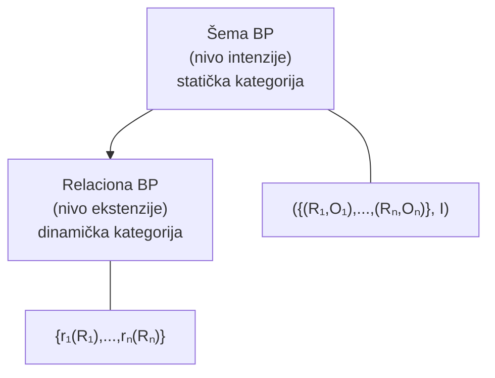
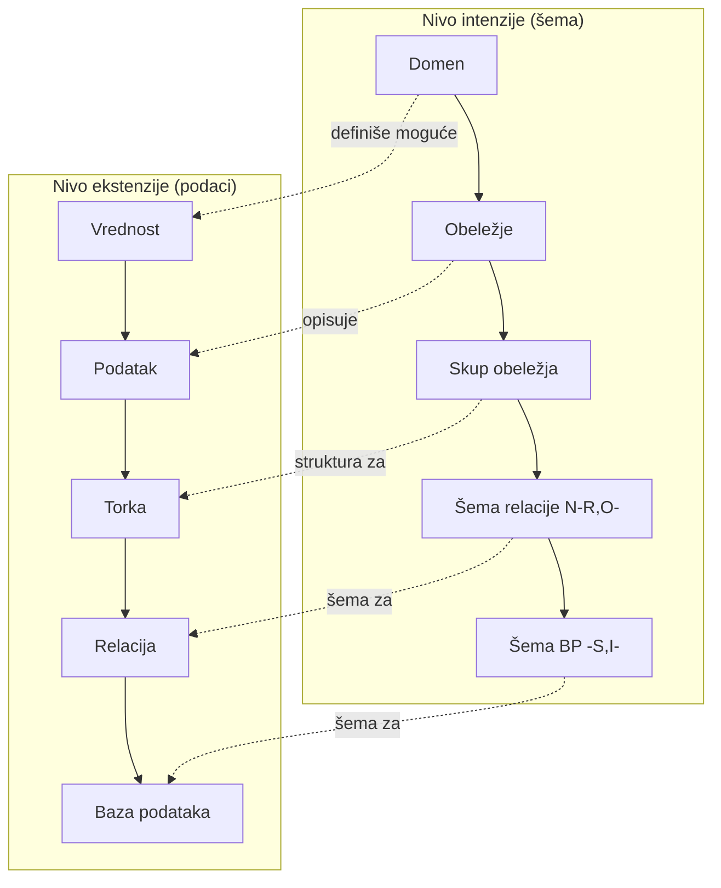

# Strukturalna komponenta relacionog modela

## Uvod - o čemu se radi i zašto nas to zanima

Pre nego što zaronimo u koncepte, hajde da se podsetimo zašto je relacioni model podataka (RMP) uopšte nastao. Sedamdesetih godina prošlog veka, vladali su mrežni i hijerarhijski modeli podataka. Zvuče egzotično, ali imali su ozbiljne probleme - programi su bili čvrsto vezani za fizičku strukturu podataka, struktura je bila složena, a jezici za rad sa podacima bili su proceduralni i razvijani "ad hoc", bez ozbiljnih matematičkih osnova.

Tada se pojavio Edgar F. Codd sa čuvenim radom iz 1970. godine (*"A Relational Model of Data for Large Shared Data Banks"*), i sve se promenilo. Njegov cilj bio je jasan - otkloniti nedostatke starih modela i postaviti čvrste matematičke temelje za rad sa podacima. Matematička osnova relacionog modela oslanja se na **teoriju skupova i relacija**, kao i na **predikatski račun prvog reda**.

Ključni zahtev koji je Codd postavio bio je: **nezavisnost programa od podataka**, tj. od fizičke strukture podataka. U starijim modelima, fizički aspekti baze podataka bili su direktno ugrađeni u programe - raspodela slogova po zonama, fizički redosled, transformacija ključa u adresu, lanci pokazivača... Sve to je značilo da ako promeniš nešto u fizičkoj organizaciji, moraš menjati i programe. Relacioni model rešava to **potpunim odvajanjem prezentacionog od formata memorisanja**.

---

## Šta je model podataka i od čega se sastoji

Svaki model podataka, pa tako i relacioni, ima tri komponente:

**Strukturalna komponenta** definiše primitivne i složene koncepte koji predstavljaju "gradivne elemente" modela. Ona služi za modeliranje logičke strukture obeležja (LSO), kao statičke strukture sistema, tj. šeme baze podataka. Ova komponenta nam govori *čime* raspolažemo.

**Operacijska komponenta** obuhvata upitni jezik (QL), jezik za manipulaciju podacima (DML) i jezik za definiciju podataka (DDL). Ona služi za modeliranje dinamike izmene stanja. Ova komponenta nam govori *šta možemo da radimo* sa podacima.

**Integritetna komponenta** definiše skup tipova ograničenja (uslova integriteta) i služi za modeliranje ograničenja nad podacima u bazi podataka. Ova komponenta nam govori *šta je dozvoljeno*, a šta nije.

> [!IMPORTANT]
> Svaki model podataka ima ove tri komponente. Kad na ispitu kažu "komponente modela podataka", ovo troje je odgovor: strukturalna, operacijska i integritetna.

U ovoj skripti fokusiramo se na **strukturalnu komponentu** - dakle na same građevne blokove relacionog modela.

---

## Nivoi apstrakcije

Pre nego što krenemo na konkretne koncepte, treba da razumemo jednu temeljnu podelu. Model podataka prepoznaje dva nivoa apstrakcije:

**Nivo intenzije (konteksta)** - ovo je nivo tipa. On opisuje logičku strukturu obeležja, tj. šemu. Zamislite ga kao "nacrt kuće" - on definiše kako nešto izgleda, ali ne sadrži konkretne podatke.

**Nivo ekstenzije (konkretizacije)** - ovo je nivo pojave tipa. On opisuje logičku strukturu podataka - konkretne vrednosti. Ovo je "izgrađena kuća" - popunjena stvarnim podacima.

Ova podela će nam biti veoma korisna kroz celu skriptu, jer svaki koncept ima svoj intenzionalni i ekstenzionalni aspekt.

---

## Primitivni koncepti strukturalne komponente

Hajde da počnemo od samog početka - od najosnovnijih, nedeljivih elemenata od kojih se gradi sve ostalo.

### Obeležje (Atribut)

**Obeležje (atribut)** reprezentuje osobinu (svojstvo) klase entiteta ili poveznika u realnom sistemu. Ovo je koncept nivoa intenzije.

Ako zamislimo da opisujemo studente na fakultetu, obeležja bi bila: matični broj studenta, ime, prezime, godina upisa... Svako od ovih opisuje jedno svojstvo entiteta "Student".

### Domen

**Domen** predstavlja specifikaciju skupa mogućih vrednosti koje neka obeležja mogu da dobiju. I ovo je koncept nivoa intenzije.

Na primer, domen za obeležje "Ocena" mogao bi biti skup celih brojeva od 5 do 10. Domen za "Pol" mogao bi biti skup {m, ž}. Domen za "Ime" bi mogao biti skup stringova do neke maksimalne dužine.

### Pravilo pridruživanja domena obeležjima

Postoji jedno temeljno pravilo: **svakom obeležju obavezno se pridružuje tačno jedan domen**. To znači da nijedno obeležje ne može da "lebdi" bez definisanog skupa mogućih vrednosti - svako mora imati precizno određen domen.

### Vrednost

Na nivou ekstenzije, primitivni koncept je **vrednost** - konkretna pojedinačna vrednost iz nekog domena. Na primer, ako je domen za ime skup stringova, onda je "Ana" jedna konkretna vrednost.

> [!TIP]
> Da sumiramo primitivne koncepte: na nivou intenzije imamo **domen** i **obeležje**, a na nivou ekstenzije imamo **vrednost**. Svi složeni koncepti nastaju kombinovanjem ovih primitivnih.

---

## Od primitivnih ka složenim konceptima

Kreiranje svih ostalih (složenih) koncepata strukturalne komponente RMP vrši se **kombinovanjem (strukturiranjem) primitivnih koncepata** i **korišćenjem definisanih pravila u RMP**.

Evo kompletne slike svih koncepata, grupisanih po nivou:

| Nivo intenzije | Nivo ekstenzije |
|:---:|:---:|
| Domen | Vrednost |
| Obeležje | Podatak |
| Skup obeležja | Torka (N-torka) |
| Šema relacije | Relacija |
| Šema BP | Baza podataka |

Svaki red u ovoj tabeli predstavlja par: levo je "nacrt" (intenzija), desno je "pojava" (ekstenzija). Domen je nacrt mogućih vrednosti, a vrednost je konkretna pojava. Šema relacije je nacrt tabele, a relacija je popunjena tabela. I tako dalje.

> [!IMPORTANT]
> Ovu tabelu treba znati napamet. Na ispitu se često pita "nabrojte koncepte strukturalne komponente RMP na nivou intenzije/ekstenzije".

Hajde sada da prođemo kroz svaki složeni koncept detaljno.

---

## Torka (n-torka)

### Šta je torka

**Torka** reprezentuje jednu pojavu entiteta ili poveznika. Pomoću torke se svakom obeležju, iz nekog skupa obeležja, dodeljuje konkretna vrednost iz skupa mogućih vrednosti definisanog domenom.

Zamislite torku kao "jednu kompletnu karticu" o nečemu. Ako govorimo o zaposlenima, jedna torka bi bila svi podaci o jednom zaposlenom: matični broj 101, ime Ana, pol ž, šifra projekta 1100, naziv projekta Univerzitetski IS.

### Formalna definicija torke

Formalno, neka je dat:

- $U = \{A_1, \ldots, A_n\}$ - skup obeležja
- $DOM = \bigcup_{i=1}^{n} dom(A_i)$ - unija svih domena, tj. skup svih mogućih vrednosti

Tada je **torka** preslikavanje:

$$t: U \rightarrow DOM$$

pri čemu važi:

$$(\forall A_i \in U)(t(A_i) \in dom(A_i))$$

Dakle, torka je funkcija koja svakom obeležju iz skupa $U$ dodeljuje vrednost iz odgovarajućeg domena tog obeležja. Obeležje "Pol" ne može dobiti vrednost 42, jer 42 nije u domenu za pol.

### Primer torke

Neka je $U = \{MBR, IME, POL, SPR, NAP\}$.

Torka $t_1$ definisana je na sledeći način:

- $t_1(MBR) = 101$
- $t_1(IME) = Ana$
- $t_1(POL) = ž$
- $t_1(SPR) = 1100$
- $t_1(NAP) = Univerzitetski\ IS$

Ista torka $t_1$ može se prikazati i kao **skup podataka** (parova obeležje-vrednost):

$$t_1 = \{(MBR, 101),\ (IME, Ana),\ (POL, ž),\ (SPR, 1100),\ (NAP, Univerzitetski\ IS)\}$$

Hajde da definišemo i drugu torku:

$$t_2 = \{(MBR, 210),\ (IME, Aca),\ (POL, m),\ (SPR, 0105),\ (NAP, Polaris)\}$$

Svaka torka je, dakle, kompletna "kartica" - svako obeležje ima svoju vrednost.

---

## Restrikcija torke

### Šta je restrikcija

Ponekad nas ne zanimaju sva obeležja iz torke, već samo neka. Tu u igru ulazi **restrikcija ("skraćenje") torke**.

**Restrikcija torke $t$ na skup obeležja $X \subseteq U$** (oznaka: $t[X]$) svakom obeležju iz skupa $X$ pridružuje onu vrednost koju je imala polazna torka $t$.

### Formalna definicija restrikcije

Formalno, za $X \subseteq U$, $t: U \rightarrow DOM$:

$$t[X]: X \rightarrow DOM$$

$$(\forall A \in X)(t[X](A) = t(A))$$

Drugim rečima, restrikcija je "isecanje" torke na manji broj kolona, pri čemu se vrednosti čuvaju onakve kakve su bile.

### Primer restrikcije

Imamo torku:

$$t_2 = \{(MBR, 210),\ (IME, Aca),\ (POL, m),\ (SPR, 0105),\ (NAP, Polaris)\}$$

Neka je $X = MBR + IME$ (zapis $MBR + IME$ je skraćena notacija za skup $\{MBR, IME\}$).

Tada je:

$$t_2[X] = \{(MBR, 210),\ (IME, Aca)\}$$

Jednostavno smo "isekli" torku i zadržali samo MBR i IME sa njihovim originalnim vrednostima.

> [!TIP]
> Notacija $t[X]$ je veoma česta u daljem radu, posebno kod operacija kao što su projekcija i spoj. Navikavajte se na nju.

---

## Relacija

### Šta je relacija

Dok torka predstavlja jednu pojavu (jednog studenta, jednog zaposlenog...), **relacija** predstavlja čitav skup takvih pojava.

**Relacija nad skupom obeležja $U$** predstavlja konačan skup torki i **reprezentuje skup realnih entiteta ili poveznika**.

### Formalna definicija relacije

$$r(U) \subseteq \{t\ |\ t: U \rightarrow DOM\},\quad |r| \in \mathbb{N}_0$$

Skup svih mogućih torki nad skupom obeležja $U$ označava se sa $Tuple(U)$. Relacija je, dakle, konačan podskup tog skupa svih mogućih torki, i njena kardinalnost (broj torki) je nenegativan ceo broj.

### Primer relacije

Neka je $U = \{MBR, IME, POL, SPR, NAP\}$. Relacija $r_1(U) = \{t_1, t_2\}$ gde su:

- $t_1 = \{(MBR, 101),\ (IME, Ana),\ (POL, ž),\ (SPR, 1100),\ (NAP, Univerzitetski\ IS)\}$
- $t_2 = \{(MBR, 210),\ (IME, Aca),\ (POL, m),\ (SPR, 0105),\ (NAP, Polaris)\}$

### Još jedan primer

Neka je $R = \{A, B, C\}$, sa domenima $dom(A) = \{a_1, a_2\}$, $dom(B) = \{b_1, b_2\}$, $dom(C) = \{c_1, c_2\}$.

Definišemo tri torke:

- $t_1 = \{(A, a_1),\ (B, b_1),\ (C, c_1)\}$
- $t_2 = \{(A, a_2),\ (B, b_2),\ (C, c_2)\}$
- $t_3 = \{(A, a_1),\ (B, b_1),\ (C, c_2)\}$

Relacija je: $r(R) = \{t_1, t_2, t_3\}$

---

## Svojstva relacije

Relacija ima dva bitna svojstva koja proističu iz činjenice da je ona skup:

1. **U relaciji se ne mogu pojaviti dve identične torke.** Ako vidimo dve iste torke, to je ista torka samo dva puta prikazana. Pošto je relacija skup, duplikati po definiciji ne postoje.

2. **Poredak torki u relaciji ne utiče na informacije** koje relacija nosi - on je nebitan. Isto važi i za **poredak obeležja (kolona)** - ni on ne utiče na sadržaj informacija.

> [!WARNING]
> Studenti često mešaju redosled redova u tabeli sa nečim bitnim. U relacionom modelu, redosled redova je nebitan, kao i redosled kolona. Relacija $\{t_1, t_2\}$ i relacija $\{t_2, t_1\}$ su ista relacija.

---

## Tabelarna reprezentacija relacije

Uobičajen način prikazivanja relacije je pomoću **tabele**:

- **Relacija** predstavlja kompletan sadržaj tabele (kratko: tabela)
- **Šema relacije** predstavlja opis tabele (definiciju tabele) - o njoj ćemo pričati u sledećoj sekciji

Evo kako prethodni primeri izgledaju u tabelarnom obliku:

**Tabela Radnik:**

| MBR | IME | POL | SPR | NAP |
|:---:|:---:|:---:|:---:|:---:|
| 101 | Ana | ž | 1100 | Univerzitetski IS |
| 210 | Aca | m | 0105 | Polaris |

**Tabela r(R):**

| A | B | C |
|:---:|:---:|:---:|
| $a_1$ | $b_1$ | $c_1$ |
| $a_2$ | $b_2$ | $c_2$ |
| $a_1$ | $b_1$ | $c_2$ |

Ovo je "prirodna" i lako razumljiva reprezentacija - svaki red tabele je jedna torka, svaka kolona je jedno obeležje.

---

## Strukturalna jednostavnost relacionog modela

Sada kad znamo šta je relacija, hajde da razumemo zašto je ona toliko dobro rešenje. Koncept relacije je osnova reprezentacije logičkih struktura podataka u RMP. Relacija:

- **Ne sadrži nikakve informacije o fizičkoj organizaciji podataka** - to je čisto logički koncept
- Predstavlja "prirodnu" upotrebu jednog fundamentalnog matematičkog koncepta
- Predstavlja "homogenu" i "uniformnu" strukturu
- Lako je razumljiva korisnicima podataka

### Selekcija podataka

Kako se pronalaze podaci? Tu se vidi ogromna razlika između starog i novog pristupa.

**Kod ranijih modela podataka**, selekcija se vršila upotrebom fizičkih (relativnih ili apsolutnih) adresa, pozicioniranjem putem indikatora aktuelnosti ili pozicioniranjem putem odnosa između podataka.

**Kod relacionog modela** koristi se **asocijativno adresiranje** - isključiva upotreba simboličkih adresa, vrlo često vrednosti ključa. Svaki podatak u bazi pronalazi se na osnovu **naziva relacije**, **zadatih obeležja** i **vrednosti ključa**. Skup torki sa zajedničkom osobinom selektira se na uniforman način - zadavanjem istog logičkog uslova. SUBP (sistem za upravljanje bazama podataka) vodi računa o transformaciji simboličke u relativnu adresu.

### Povezivanje podataka

Ista priča važi i za povezivanje podataka iz različitih relacija.

**Kod ranijih modela** koristile su se fizičke adrese u funkciji pokazivača i fizičko pozicioniranje logički susednih podataka, o čemu je svaki transakcioni program morao voditi računa.

**Kod relacionog modela** koriste se **simboličke adrese - prenete vrednosti ključa**. Postoje dva rešenja: prostiranje ključa (uvođenje stranog ključa i ograničenja referencijalnog integriteta) i kreiranje posebne tabele sa prostiranjem ključeva. U oba slučaja, transakcioni program ne vodi računa o pretvaranju simboličke u relativnu adresu.

### Primer - dve povezane tabele

Pogledajmo kako izgleda povezivanje u praksi:

**Tabela Fakultet:**

| SFK | NAZ | BIP |
|:---:|:---:|:---:|
| FIL | Filozofski | 1 |
| PMF | Matematički | 7 |
| ETF | Elektrotehnički | 9 |
| EKF | Ekonomski | 4 |
| MAF | Mašinski | 7 |

**Tabela Projektant:**

| MBR | IME | PRZ | SFK |
|:---:|:---:|:---:|:---:|
| M3 | Iva | Ban | PMF |
| M1 | Ana | Tot | MAF |
| M4 | Ana | Ras | FIL |
| M8 | Aca | Pap | ETF |
| M6 | Iva | Ban | EKF |
| M5 | Eva | Tot | ETF |

Obratite pažnju na kolonu **SFK** u tabeli Projektant. To je **preneta vrednost ključa** iz tabele Fakultet. Upravo putem tih zajedničkih vrednosti relacioni model povezuje podatke iz različitih tabela, bez ijednog fizičkog pokazivača.

---

## Šema relacije

### Definicija

Prešli smo sa primitivnih koncepata, preko torke i relacije, do koncepta koji opisuje strukturu same relacije.

**Šema relacije** je imenovani par:

$$N(R, O)$$

gde je:

- $N$ - **naziv šeme relacije** (može biti izostavljen)
- $R$ - **skup obeležja** šeme relacije
- $O$ - **skup ograničenja** šeme relacije

Šema relacije pripada nivou intenzije - ona opisuje *strukturu*, ne konkretne podatke.

### Apstraktni opis relacije

Iz prezentacije, apstraktni opis relacije je:

$$N(R, C)$$

gde je $R$ skup obeležja, $C$ skup ograničenja, pri čemu je $K \subseteq C$ - obavezno zadat skup ključeva, koji je **neprazan**.

U početnim fazama projektovanja, šema relacije se često posmatra u uprošćenom obliku:

$$N(R, K)$$

gde $K$ predstavlja samo skup ključeva.

### Primer šeme relacije

$$Fakultet(\{SFK, NAZ, BIP\}, \{SFK\})$$

Ovde je:
- Naziv: Fakultet
- Skup obeležja: $\{SFK, NAZ, BIP\}$
- Skup ključeva: $\{SFK\}$ - šifra fakulteta jednoznačno identifikuje svaki fakultet

### Pojava nad šemom relacije

**Pojava nad šemom relacije $(R, O)$** je bilo koja relacija $r(R)$ takva da zadovoljava sva ograničenja iz skupa $O$.

Primer pojave nad šemom Fakultet:

$$r(Fakultet) = \{(PMF, Matematički, 7),\ (EKF, Ekonomski, 4),\ (ETF, Elektrotehnički, 9),\ (MAF, Mašinski, 7)\}$$

Ako bismo pokušali da unesemo torku $(EKF, Elektronski, 8)$, to bi **narušilo ograničenje ključa** (uslov integriteta), jer u relaciji već postoji torka sa vrednošću $SFK = EKF$.

### Primer sa ograničenjem

Neka je data šema relacije:

$$Letovi(\{P, A, L\}, O)$$

gde je $O$ = {"Pilot može da leti samo na jednom tipu aviona"}.

Pogledajmo dve relacije i proverimo da li predstavljaju validne pojave nad ovom šemom:

**Let1:**

| P | A | L |
|:---:|:---:|:---:|
| Pop | 747 | 101 |
| Pop | 747 | 102 |
| Ana | 737 | 103 |

**Let2:**

| P | A | L |
|:---:|:---:|:---:|
| Pop | 747 | 101 |
| Pop | 737 | 102 |
| Ana | 737 | 103 |

Relacija **Let1 jeste** validna pojava - pilot Pop leti samo na tipu 747, pilot Ana samo na 737.

Relacija **Let2 nije** validna pojava - pilot Pop leti i na 747 i na 737, čime se narušava ograničenje iz $O$.

> [!CAUTION]
> Na ispitu se može pojaviti zadatak gde vam daju šemu relacije sa ograničenjem i pitaju da li neka konkretna relacija predstavlja validnu pojavu. Pažljivo proverite da li svaka torka zadovoljava sva navedena ograničenja.

---

## Relaciona šema baze podataka

### Definicija

Jedna šema relacije opisuje jednu tabelu. Ali baza podataka tipično ima više tabela. Za to nam treba koncept višeg nivoa.

**Relaciona šema baze podataka** je (imenovani) par:

$$(S, I)$$

gde je:

- $S$ - **skup šema relacija**: $S = \{(R_i, O_i)\ |\ i \in \{1, \ldots, n\}\}$
- $I$ - **skup međurelacionih ograničenja** (ograničenja koja se prostiru preko više relacija)

### Primer relacione šeme BP

Neka su zadate šeme relacija:

**Radnik**$(\{MBR, IME, PRZ, DATR\},$ {"Ne postoje dva radnika sa istom vrednošću za MBR. Svaki radnik poseduje vrednost za MBR."})

**Projekat**$(\{SPR, NAP\},$ {"Ne postoje dva projekta sa istom vrednošću za SPR. Svaki projekat poseduje vrednost za SPR."})

**Angažovanje**$(\{SPR, MBR, BRC\},$ {"Ne može se isti radnik na istom projektu angažovati više od jedanput. Pri angažovanju, vrednosti za MBR i SPR su uvek poznate."})

Skup šema relacija: $S = \{Radnik, Projekat, Angažovanje\}$

Skup međurelacionih ograničenja:

$I = \{$"radnik ne može biti angažovan na projektu, ako nije zaposlen"; "na projektu ne može biti angažovan ni jedan radnik, dok projekat ne bude registrovan"$\}$

Par $(S, I)$ predstavlja jednu relacionu šemu baze podataka.

> [!NOTE]
> Obratite pažnju da ograničenja unutar jedne šeme relacije (npr. jedinstvenost MBR) pripadaju skupu $O$ te šeme, dok ograničenja koja se tiču veza između relacija (npr. "ne može se angažovati nepostojeći radnik") pripadaju skupu $I$ - skupu međurelacionih ograničenja.

---

## Relaciona baza podataka

### Definicija

**Relaciona baza podataka** je jedna pojava nad zadatom relacionom šemom baze podataka $(S, I)$:

$$s: S \rightarrow \{r_i\ |\ i \in \{1, \ldots, n\}\},\quad (\forall i)\ s(R_i, O_i) = r_i$$

To znači da svakoj šemi relacije iz skupa $S$ odgovara jedna njena pojava (konkretna relacija sa podacima). Pri tome, skup relacija $s$ mora da zadovoljava sva međurelaciona ograničenja iz skupa $I$.

### Primer relacione baze podataka

Za $S = \{Radnik, Projekat, Angažovanje\}$, jedna moguća baza podataka $RBP = \{radnik, projekat, angažovanje\}$ izgleda ovako:

**Tabela radnik:**

| MBR | IME | PRZ | DATR |
|:---:|:---:|:---:|:---:|
| 101 | Ana | Pap | 12.12.65. |
| 102 | Aca | Tot | 13.11.48. |
| 110 | Ivo | Ban | 01.01.49. |
| 111 | Olja | Kun | 06.05.71. |

**Tabela projekat:**

| SPR | NAP |
|:---:|:---:|
| 11 | X25 |
| 13 | Polaris |
| 14 | Univ. IS |

**Tabela angažovanje:**

| MBR | SPR |
|:---:|:---:|
| 101 | 11 |
| 101 | 14 |
| 102 | 14 |

Ovo je jedno konkretno stanje baze - u nekom drugom trenutku, podaci mogu biti drugačiji (npr. dodat novi radnik, novi projekat...), ali šema ostaje ista.

---

## Odnos šeme BP i baze podataka

Ovo je jako bitan koncept za razumevanje cele priče.

**Šema baze podataka** $(\{(R_1, O_1), \ldots, (R_n, O_n)\}, I)$ pripada **nivou intenzije**. Ona je **statička (sporo promenljiva) kategorija** sistema baze podataka. Šema se menja retko - obično samo kad se menja sam dizajn sistema.

**Relaciona baza podataka** $\{r_1(R_1), \ldots, r_n(R_n)\}$ pripada **nivou ekstenzije**. Ona je **dinamička (stalno promenljiva) kategorija** sistema baze podataka. Podaci se menjaju stalno - svaki unos, brisanje ili izmena podataka menja stanje baze.



> [!IMPORTANT]
> Šema BP opisuje strukturu, i ona se menja retko. Baza podataka sadrži konkretne podatke i menja se stalno. Ovo je suština razlike intenzija - ekstenzija.

---

## Baza podataka i realni sistem

**Baza podataka reprezentuje jedno stanje realnog sistema.** Kada se u realnom sistemu nešto promeni (npr. zaposli se novi radnik, završi se projekat), baza podataka se ažurira kako bi te promene pratila.

To nas dovodi do pitanja - kako znamo da je baza podataka "ispravna"?

---

## Konzistentno stanje baze podataka

### Formalna konzistentnost

Baza podataka $RBP = \{r_i\ |\ i \in \{1, \ldots, n\}\}$ nad šemom $(S, I)$ nalazi se u **formalno konzistentnom stanju** ako su zadovoljena oba uslova:

1. **Svaka relacija u bazi zadovoljava sva ograničenja svoje šeme:**
$$(\forall r_i \in RBP)(r_i\ \text{zadovoljava sva ograničenja odgovarajuće šeme}\ (R_i, O_i))$$

2. **Baza kao celina zadovoljava sva međurelaciona ograničenja:**
$RBP$ zadovoljava sva međurelaciona ograničenja iskazana putem $I$.

### Suštinska konzistentnost

Baza podataka se nalazi u **suštinski konzistentnom stanju** ako:

- Se nalazi u **formalno konzistentnom stanju**, i
- Predstavlja **vernu sliku stanja realnog sistema**

U praksi, nivo pojave grešaka u bazi podataka sveden je na ispod **2-3%**.

> [!WARNING]
> Formalna i suštinska konzistentnost nisu isto. SUBP može da kontroliše samo **formalnu konzistentnost** (da li su ograničenja zadovoljena). Suštinsku konzistentnost (da li podaci odgovaraju realnosti) ne može nijedan softver da garantuje - to zavisi od korisnika koji unose podatke.

### Primer

Ako u tabeli Radnik pokušamo uneti dva zaposlena sa istim MBR, SUBP će to sprečiti - narušena je formalna konzistentnost. Ali ako unesemo da se radnik zove "Aco" umesto "Aca", SUBP to ne može detektovati, jer je podatak formalno validan, ali suštinski pogrešan.

---

## Kompletna hijerarhija koncepata

Hajde da sve koncepte sagledamo u celini, od najmanjih do najvećih, prateći oba nivoa:



Svaki koncept na nivou intenzije ima svoj parnjak na nivou ekstenzije. Intenzija definiše strukturu, ekstenzija je popunjava konkretnim podacima.

---

## 12 principa relacionog modela podataka

Za potpuno razumevanje, treba poznavati i 12 Codd-ovih principa (pravila) iz 1990. godine, koji definišu šta jedan sistem mora da ispunjava da bi se smatrao relacionim SUBP-om.

**Pravilo 0 (Osnovno pravilo):** Sistem mora da se kvalifikuje kao relacioni, kao baza podataka i kao sistem za upravljanje. Za to, mora koristiti isključivo relacione mogućnosti za upravljanje bazom.

**Pravilo 1 (Pravilo informisanosti):** Sve informacije u bazi moraju biti predstavljene na jedan i jedini način - vrednostima u kolonama redova tabela.

**Pravilo 2 (Garantovani pristup):** Svi podaci moraju biti dostupni bez dvosmislenosti. Svaka pojedinačna skalarna vrednost mora biti logički adresabilna navođenjem imena tabele, imena kolone i vrednosti primarnog ključa.

**Pravilo 3 (Sistematski tretman nula vrednosti):** SUBP mora podržati nula vrednost (null) kao posebnu vrednost koja predstavlja "nedostajuću informaciju", nezavisno od tipa podatka.

**Pravilo 4 (Aktivni onlajn katalog):** Sistem mora podržati onlajn, relacioni katalog dostupan ovlašćenim korisnicima putem istog upitnog jezika kojim pristupaju podacima.

**Pravilo 5 (Sveobuhvatni podjezik podataka):** Sistem mora podržati bar jedan relacioni jezik sa linearnom sintaksom, koji se može koristiti i interaktivno i u programima, i koji podržava DDL, DML, sigurnost, ograničenja integriteta i upravljanje transakcijama.

**Pravilo 6 (Ažuriranje pogleda):** Svi pogledi koji su teoretski ažurabilni moraju biti ažurabilni i u sistemu.

**Pravilo 7 (Skupovne operacije):** Sistem mora podržati skupovne operacije umetanja, ažuriranja i brisanja - ne samo nad jednim redom, već nad celim skupom redova.

**Pravilo 8 (Fizička nezavisnost podataka):** Promene na fizičkom nivou (kako se podaci skladište) ne smeju zahtevati promenu aplikacija.

**Pravilo 9 (Logička nezavisnost podataka):** Promene na logičkom nivou (tabele, kolone, redovi) ne smeju zahtevati promenu aplikacija. Ovo je teže postići od fizičke nezavisnosti.

**Pravilo 10 (Nezavisnost integriteta):** Ograničenja integriteta moraju biti definisana odvojeno od aplikativnih programa i čuvana u katalogu.

**Pravilo 11 (Nezavisnost distribucije):** Distribucija delova baze na razne lokacije treba da bude nevidljiva korisnicima.

**Pravilo 12 (Pravilo nesubverzije):** Ako sistem ima jezik niskog nivoa (za rad sa pojedinačnim slogom), taj jezik ne sme moći da zaobiđe pravila integriteta definisana na višem, relacionom nivou.

> [!TIP]
> Za ispit, najbitnije je razumeti Pravilo 1 (sve su tabele), Pravilo 2 (pristup putem imena tabele + kolone + ključa), Pravilo 8 i 9 (fizička i logička nezavisnost) i Pravilo 12 (nemogućnost zaobilaženja ograničenja).

---

## SQL - ukratko o deklarativnom jeziku

Relacioni model je omogućio razvoj **deklarativnog jezika** za rad sa podacima. SQL (Structured Query Language) je zasnovan na relacionom računu nad torkama. Njegov osnovni oblik za upite je:

```sql
SELECT <lista obeležja>
FROM <lista relacija>
WHERE <logički izraz>
```

### Primer

Ako želimo da pronađemo imena, prezimena i broj ispitnih predmeta za projektante koji rade na fakultetima sa više od 5 ispitnih predmeta, pišemo:

```sql
SELECT IME, PRZ, BIP
FROM Fakultet, Projektant
WHERE BIP > 5 AND
      Fakultet.SFK = Projektant.SFK
```

Ili ekvivalentno, sa prirodnim spojem:

```sql
SELECT IME, PRZ, BIP
FROM Fakultet NATURAL JOIN Projektant
WHERE BIP > 5
```

Rezultat:

| IME | PRZ | BIP |
|:---:|:---:|:---:|
| Iva | Ban | 7 |
| Ana | Tot | 7 |
| Aca | Pap | 9 |
| Eva | Tot | 9 |

Rad sa skupovima podataka, bez brige o tome kako su oni fizički organizovani - to je suština relacionog pristupa.

---

## Rezime

Hajde da sumiramo celu priču. Strukturalna komponenta relacionog modela definiše sve koncepte od kojih se gradi baza podataka:

- **Primitivni koncepti** su domen, obeležje i vrednost
- Od njih se grade **složeni koncepti**: podatak, torka (preslikavanje obeležja u vrednosti), relacija (konačan skup torki), šema relacije $N(R, O)$, šema baze podataka $(S, I)$, i sama baza podataka kao pojava nad šemom
- Relacija ima tabelarnu reprezentaciju, gde su redovi torke, a kolone obeležja
- Redosled redova i kolona je nebitan
- Šema pripada nivou intenzije (statička), podaci nivou ekstenzije (dinamička)
- Baza podataka može biti u formalno i suštinski konzistentnom stanju
- Strukturalna jednostavnost se ogleda u asocijativnom adresiranju i korišćenju simboličkih adresa umesto fizičkih

---

## 🎴 Brza pitanja (definicije i pojmovi)

**P:** Šta je obeležje (atribut) u relacionom modelu podataka?

**P:** Šta je domen i kakvo je pravilo pridruživanja domena obeležjima?

**P:** Nabrojte koncepte strukturalne komponente RMP na nivou intenzije i na nivou ekstenzije.

**P:** Šta je torka i šta ona reprezentuje?

**P:** Šta je restrikcija torke?

**P:** Šta je relacija u formalnom smislu?

**P:** Šta je šema relacije i od čega se sastoji?

**P:** Šta je relaciona šema baze podataka?

---

## 📝 Šira pitanja za proveru razumevanja

**P:** Objasnite razliku između nivoa intenzije i nivoa ekstenzije u strukturalnoj komponenti RMP, i dajte primer za svaki nivo.

**O:** Nivo intenzije (konteksta) opisuje logičku strukturu obeležja, tj. šemu - to je "nacrt" koji definiše kako podaci izgledaju. Na primer, šema relacije Radnik({MBR, IME, PRZ}, {MBR}) pripada nivou intenzije. Nivo ekstenzije (konkretizacije) opisuje konkretne podatke - pojave tipova. Na primer, konkretna relacija r(Radnik) = {(101, Ana, Pap), (102, Aca, Tot)} pripada nivou ekstenzije. Šema je statička kategorija (menja se retko), dok su podaci dinamička kategorija (menjaju se stalno).

**P:** Data je torka $t = \{(A, 5), (B, 10), (C, 15), (D, 20)\}$. Izračunajte restrikciju $t[X]$ za $X = \{A, C\}$ i objasnite postupak.

**O:** Restrikcija $t[X]$ na skup obeležja $X = \{A, C\}$ zadržava samo one parove iz torke čija obeležja pripadaju skupu $X$, sa istim vrednostima kao u originalnoj torki. Dakle, $t[\{A, C\}] = \{(A, 5), (C, 15)\}$. Obeležja $B$ i $D$ su jednostavno "isečena" jer ne pripadaju skupu $X$.

**P:** Objasnite razliku između formalne i suštinske konzistentnosti baze podataka. Koji vid konzistentnosti može kontrolisati SUBP?

**O:** Baza je u formalno konzistentnom stanju ako svaka relacija zadovoljava ograničenja svoje šeme i ako su zadovoljena sva međurelaciona ograničenja iz skupa I. Baza je u suštinski konzistentnom stanju ako je, pored formalne konzistentnosti, i verna slika stanja realnog sistema. SUBP može da kontroliše samo formalnu konzistentnost (npr. jedinstvenost ključa, tipove podataka), dok suštinsku ne može - ako korisnik unese pogrešno ime, SUBP to ne može detektovati.

**P:** Zašto je u relacionom modelu uvedeno asocijativno adresiranje umesto fizičkog, i kako to funkcioniše?

**O:** Asocijativno adresiranje uvedeno je radi postizanja nezavisnosti programa od fizičke strukture podataka. Umesto da se podaci pronalaze putem fizičkih (apsolutnih ili relativnih) adresa, svaki podatak se pronalazi na osnovu naziva relacije, zadatih obeležja i vrednosti ključa. SUBP preuzima odgovornost za transformaciju simboličke u relativnu adresu, čime se programi potpuno oslobađaju potrebe da znaju kako su podaci fizički organizovani.

**P:** Data je šema relacije $Fakultet(\{SFK, NAZ, BIP\}, \{SFK\})$ i pojava $r = \{(PMF, Matematički, 7), (EKF, Ekonomski, 4)\}$. Zašto unos torke $(EKF, Elektronski, 8)$ nije dozvoljen?

**O:** Unos torke $(EKF, Elektronski, 8)$ narušio bi ograničenje ključa. Ključ šeme relacije je $\{SFK\}$, što znači da svaka torka mora imati jedinstvenu vrednost za obeležje SFK. Pošto u relaciji već postoji torka sa $SFK = EKF$, nova torka sa istom vrednošću ključa bi stvorila duplikat, što je u suprotnosti sa definicijom relacije kao skupa (u skupu nema duplikata za ključ).
