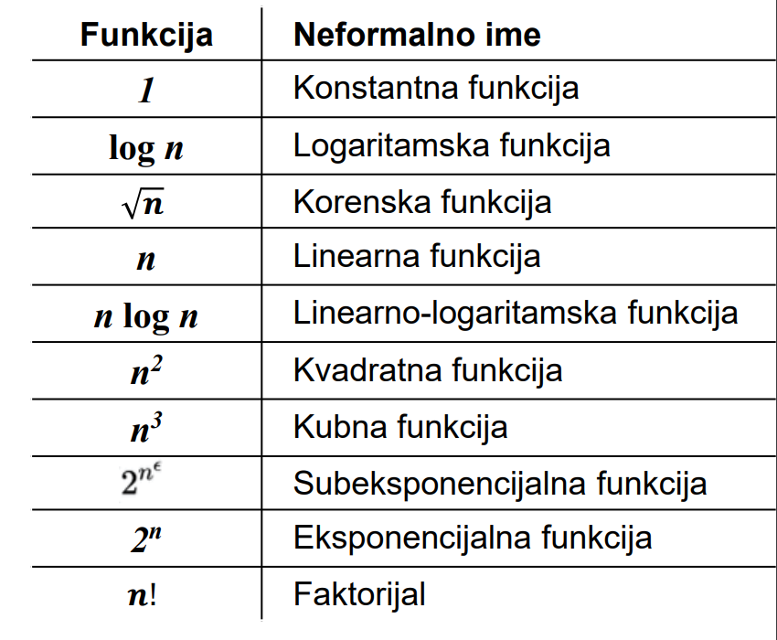
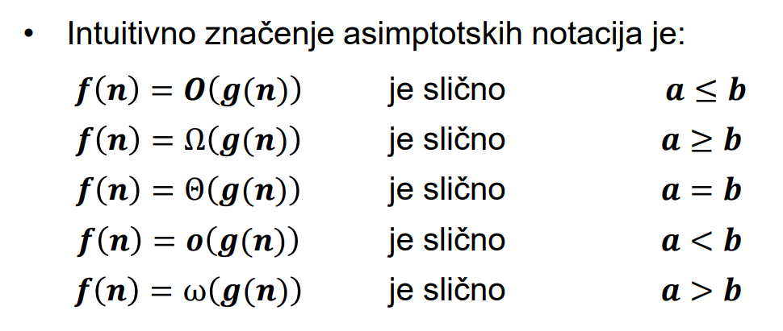

# Parcijalni 1

## 1. Objasniti postupak dobijanja algoritama
- Sastoji se od sledećih koraka:
    - Analiza problema, šta i sa čim, šta treba da se reši
    - Dekompozicija problema, eliminisanje svih nevažnih podataka i detalja
    - Piše se algoritam koji rešava jasno definisan matematički problem
    - Dokazujemo ispravnost algoritma
    - Sprovođenje analize algoritma kako bi se odredila njegova efikasnost

## 2. Navesti opšte metode za generisanje algoritama
- inkrementalni pristup
- rekurzivni metod
- pohlepni metod
- linearno programiranje
- randomizacija
- dinamičko programiranje

## 3. Objasniti sortiranje umetanjem preko Insertion Sorta

**Insertion sort je efikasan za male skupove podataka, radi po principu sortiranja karata u ruci. Koristi se za jednostavnije probleme tj. manje skupove podataka.**

**Insertion sort je efikasniji od selection sorta za vec sortirane podatke.**

To achieve insertion sort, follow these steps:
- We have to start with second element of the array as first element in the array is assumed to be sorted.
- Compare second element with the first element and check if the second element is smaller then swap them.
- Move to the third element and compare it with the second element, then the first element and swap as necessary to put it in the correct position among the first three elements.
- Continue this process, comparing each element with the ones before it and swapping as needed to place it in the correct position among the sorted elements.
- Repeat until the entire array is sorted.

## 4. Objasniti LOOP INVARIANT osobinu preko Insertion Sort-a

- Osobina koju ima algoritam za insertion sortiranje sa naziva loop
invariant
    - Algoritam ima neku osobinu uvek istu, nezavisno od trenutka u kojem se nalazi
    - U ovom konkretnom slučaju, to znači da algoritam ne zavisi od pozicije elementa u nizu koji se trenutno obrađuje

### Koju osobinu ima insertion sortiranje nezavisno od koraka u petlji?

- Kod insertion sort-a, **ako je `j` pozicija elementa niza koji se trenutno sortira, onda se sortirani podniz `A[ 1 .. j-1 ]` uvek sastoji od originalnih elemenata podniza `A[ 1 .. j-1 ]` , samo što su oni sada sortirani, bez obzira koja je vrednost indeksa `j`**

## 5. Koje osobine ima invarijantnost petlje?

-  **Inicijalizacija (Initialization)** – da je invarijantnost tačna pre prvog izvršavanja petlje  
-  **Održivost (Maintenance)** – da, ako je invarijantnost tačna tokom izvršavanja trenutnog ciklusa petlje, ostaje tačna i pre početka izvršavanja sledećeg ciklusa petlje  
- **Završavanje (Termination)** – da invarijantnost važi i po okončanju izvršavanja petlje, što je važno, jer pomaže u dokazivanju korektnosti algoritma

## 6. Objasniti implementaciju Selection Sort-a

- For the first position in the sorted array, the whole array is traversed from index 0 to 4 sequentially. The first position where 64 is stored presently, after traversing whole array it is clear that 11 is the lowest value.
- Thus, replace 64 with 11. After one iteration 11, which happens to be the least value in the array, tends to appear in the first position of the sorted list.

## 7. Šta podrazumeva analiziranje algoritama

Analiziranje algoritma podrazumeva procenu koje resurse algoritam
zahteva
- Često to znači procenu potrebne memorije, procesorske moći, širine
komunikacionog kanala ili potrebnog kapaciteta hardvera, ali u većini slučajeva, to je vreme

## 8. Koje vrste analize vremena postoje?

1. worst-case (najčešće):  
T( n ) = najduže vreme potrebno za izvršavanja algoritma nad
ulazom veličine n  
- Gore od ovoga ne može
- Za neke algoritme ovo se dešava često
- avarage-case je često isti worst-case vremenu izvršavanja

2.  avarage-case (ponekad):  
T( n ) = očekivano (prosečno) vreme potrebno za izvršavanja
algoritma nad ulazom prosečne veličine n
- Zahteva nekakvu procenu statističke raspodela ulaza

3. best-case (retko):  
T( n ) = najbrže moguće vreme izvršavanja algoritma koje radi
samo na određenim ulazima

## 9. Asimptotsko vreme izvršavanja

- Analiza se pojednostavljuje tako što se za vreme izvršavanja nekog
algoritma uzima funkcija koja za velike vrednosti njenog argumenta
najbolje aproksimira tačnu funkciju vremena izvršavanja tog algoritma
- To približno vreme izvršavanja se naziva asimptotsko vreme
izvršavanja
- To je mera brzine rasta tačnog vremena izvršavanja algoritma sa
povećanjem broja njegovih ulaznih podataka

## 10. Šta su asimptotske notacije?

- Asimptotska notacija omogućava da se na precizan način uvede
relativni poredak za funkcije
- Asimptotske notacije se koriste da upravo označe na koje se vreme
odnose (npr. worste-case) ali i na izvršavanje u bilo kom vremenu

### Postoji nekoliko asimptotskih notacija:
- O-notacija (veliko o)
- Θ-notacija (veliko teta)
- Ω-notacija (veliko omega)
- o-notacija (malo o)
- ω-notacija (malo omega)

---

---

- Za sve funkcije u asimptotskim notacijama važi da su pozitivne,
nenegativne funkcije, što važi i za njihove argumente
- Ako za 2 funkcije f i g kažemo da je f manje od g, onda se intuitivno misli da je f(n) ≤ g(n), za sve vrednosti argumenta n
- Zahtev nije toliko strog, tj. ne mora biti za sve vrednosti od n, za asimptotsko ponašanje funkcije, dovoljno je da reći da je f(n) ≤ g(n), za sve osim za konačno mnogo vrednosti argumenta n

## 11. Veliko O - Notacija

- Veliko O notacija se koristi za prikazivanje "realnog" vremena algoritma

- Ono u sustini govori koja je to funkcija koja ograničava našu vremensku funkciju sa **GORNJE STRANE**, tj. worse-case

- O-notacija, f(n) = O(g(n)) upravo predstavlja zapis kojim se predstavlja svojstvo da je funkcija f manja od funkcije g, tj. da funkcija g dominira nad funkcijom f

- Za dve nenegativne funkcije f, g: N→R+ kažemo da je f(n) = O(g(n))
ako postoje pozitivne konstante c i n0 takve da je f(n) ≤ c ∙ g(n), za svako n ≥ n0

- O notacija zapravo označava celu klasu funkcija, i o tome treba voditi računa, jer npr. za O(f(x)), gde je f(x) = n^2 + n, važi da je O(f(x)) = O(n^2) ali i = O(n^3) i O(n^10) itd...

- Zato kada tražim veliko O notaciju, tražimo najpribližniju, tj. najmanju funkiju iz klase funkcija koju ona označava, a to nekad nije lako

## 12. Veliko omega - Notacija

- Veliko Ω notacija koristi se da označi da se neki algoritam mora izvršiti bar za neko određeno vreme, best-case scenario, vreme izvršavanja algoritma nikada neće imati bolji rast od Ω-zapisane funkcije

- Za dve nenegativne funkcije f, g: N→R+ kažemo da je f(n) = Ω(g(n)) ako postoje pozitivne konstante c i n0 takve da je f(n) ≥ c ∙ g(n), za svako n ≥ n0

- Kao i kod O notacije, veliko Ω označava klasu funkcija, samo obrnuto od velikog O

- Zato kada tražim veliko Ω notaciju, tražimo najpribližniju, tj. najveću funkiju iz klase funkcija koju ona označava

## 13. Veliko teta - Notacija

- Veliko Θ notacija se koristi da se pokaže da je funkcija ograničena i sa gornje i sa donje strane, i mnogo je teže odrediti nju od prethodne dve notacije

- Za dve nenegativne funkcije f, g: N→R+ kažemo da je f(n) = Θ(g(n)) ako postoje pozitivne konstante c1 , c2 i n0 takve da je za svako n ≥ n0 c1 ∙ g(n) ≤ f(n) ≤ c2 ∙ g(n)

- Ako se dokaže da je T(n) = Θ(n 2 ), onda je sigurno pokazano (zanemarujući konstante) da je vreme izvršavanja algoritma strogo ograničeno kvadratnom funkcijom i sa gornje i sa donje strane

- Kao i kod prethodne dve notacije, veliko Ω označava klasu funkcija, ali ovde one ispunjavaju oba uslova, i gornju i donju granicu

## 14. Malo o - Notacija

- Za asimptotske gornje granice funkcija koje su po prirodi čvrste koristi se o-notacija

- Za dve nenegativne funkcije f, g: N→R+ kažemo da je f(n) = o(g(n)) ako za svaku pozitivnu konstantu c postoji konstanta n0 takva da je f(n) ≤ c ∙ g(n) za svako n ≥ n

## 15. Malo ω - Notacija

- ω-notacija je za Ω-notaciju isto što i o-notacija za O-notaciju

- Za dve nenegativne funkcije f, g: N→R+ kažemo da je f(n) = ω(g(n)) ako za svaku pozitivnu konstantu c postoji konstanta n0 takva da je f(n) ≥ c ∙ g(n) za svako n ≥ n0s

## OSTALA PITANJA

1. Invarijantnost petlje, kako se primenljuje, koraci, cemu sluzi
2. Kako radi Insertion sortiranje, objasniti recima sustinu, uprediti sa nekim drugim
3. Kako se radi analiza kompleknosti, zašto?
4. Kako se radi simplifikacija, zašto je radimo?